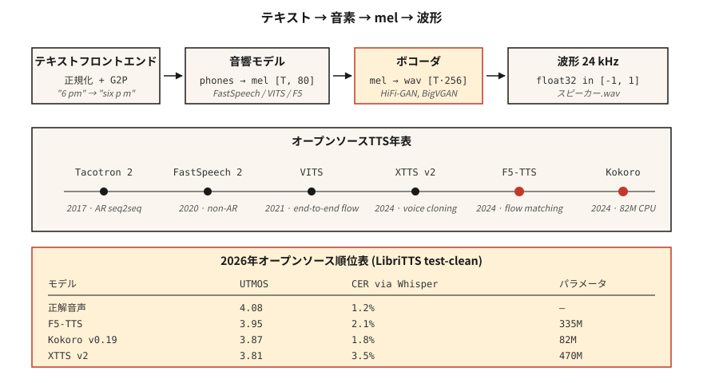

# Metinden Konuşmaya (TTS) — Tacotron'dan F5 ve Kokoro'ya

> ASR konuşmayı metne dönüştürür; TTS metni konuşmaya çevirir. 2026 yığını üç bölümden oluşur: metin → token'ler, token'ler → mel, mel → dalga biçimi. Her parçanın bir dizüstü bilgisayara sığacak varsayılan bir modeli vardır.

**Tür:** Yapım
**Diller:** Python
**Önkoşullar:** Aşama 6 · 02 (Spektrogramlar ve Mel), Aşama 5 · 09 (Sıra2Seq), Aşama 7 · 05 (Tam Transformer)
**Süre:** ~75 dakika

## Sorun

Bir dizeniz var: "Lütfen bana akşam 6'da bitkileri sulamamı hatırlatın." Canlı bir ses asistanı için doğal görünen, doğru prozodiye sahip (duraklar, vurgulu), "bitkiler" kelimesini doğru sesli harfle telaffuz eden ve CPU üzerinde 300 ms'nin altında çalışan 3 saniyelik bir ses klibine ihtiyacınız var. Ayrıca sesleri değiştirmeniz, kod anahtarlamalı girişi yönetmeniz ("akşam 6'da bana hatırlat, daijoubu?") ve isimler konusunda kendinizi utandırmamanız gerekir.

Modern TTS boru hatları şöyle görünür:

1. **Metin ön ucu.** Metni normalleştirin (tarihler, sayılar, e-postalar), fonemlere veya alt kelime token'lere dönüştürün, prozodi özelliklerini tahmin edin.
2. **Akustik model.** Metin → mel spektrogramı. Tacotron 2 (2017), FastSpeech 2 (2020), VITS (2021), F5-TTS (2024), Kokoro (2024).
3. **Ses kodlayıcı.** Mel → dalga biçimi. WaveNet (2016), WaveRNN, HiFi-GAN (2020), BigVGAN (2022), 2024+ yılında nöral codec ses kodlayıcıları.

2026'da akustik + ses kodlayıcı, uçtan uca yayılma ve akış eşleştirme modelleriyle bulanıklaşıyor. Ancak üç parçadan oluşan zihinsel model hata ayıklama için hala geçerlidir.

## Konsept



**Tacotron 2 (2017).** Sıra 2: char-embedding → BiLSTM kodlayıcı → konuma duyarlı dikkat → otoregresif LSTM kod çözücü, mel çerçeveler yayar. Yavaş (AR), uzun metinlerde titriyor. Hala referans olarak gösteriliyor.

**FastSpeech 2 (2020).** Otoregresif değildir. Süre tahmincisi, her fonemin kaç tane mel karesi aldığını gösterir. 1 geçişli, Tacotron'dan 10 kat daha hızlı. Doğallığını biraz kaybeder (monoton hizalama) ancak her yere gönderilir.

**VITS (2021).** Değişken inference ile kodlayıcı + akış tabanlı süre + HiFi-GAN ses kodlayıcıyı uçtan uca ortaklaşa eğitir. Yüksek kalite, tek model. Baskın açık kaynak TTS 2022–2024. Çeşitler: YourTTS (çok hoparlörlü sıfır çekim), XTTS v2 (2024, Coqui).

**F5-TTS (2024).** Difüzyon transformer aşırı akış eşleşmesi. Doğal prozodi, 5 saniyelik referans ses ile sıfır vuruşlu ses klonlama. 2026 açık kaynaklı TTS skor tablolarının zirvesi. 335M parametreleri.

**Kokoro (2024).** Küçük (82M), CPU tarafından çalıştırılabilen, gerçek zamanlı kullanım için sınıfının en iyisi İngilizce TTS. Kapalı kelime dağarcığı yalnızca İngilizce, apache-2.0.

**OpenAI TTS-1-HD, ElevenLabs v2.5, Google Chirp-3.** Ticari açıdan son teknoloji ürünü. ElevenLabs v2.5 duygu etiketleri ("[fısıldadı]", "[gülüyor]") ve karakter sesleri 2026'da sesli kitap üretimine hakim olacak.

### Ses kodlayıcı gelişimi

| Çağ | Ses Kodlayıcı | Gecikme | Kalite |
|-----|---------|---------|---------|
| 2016 | WaveNet | yalnızca çevrimdışı | SOTA piyasaya sürüldüğünde |
| 2018 | WaveRNN | ~gerçek zamanlı | iyi |
| 2020 | HiFi-GAN | 100× gerçek zamanlı | insana yakın |
| 2022 | BüyükVGAN | 50× gerçek zamanlı | konuşmacılar/diller arasında genellemeler |
| 2024 | SNAC, DAC (sinir kodlayıcıları) | AR modelleriyle entegre | ayrık token'ler, bit açısından verimli |

2026 yılına gelindiğinde çoğu "TTS" modeli, metinden dalga biçimine kadar uçtan uca; mel spektrogramı dahili bir temsildir.

### Değerlendirme

- **MOS (Ortalama Görüş Puanı).** 1-5 ölçekli, kitle kaynaklı. Hala altın standart; acı verecek kadar yavaş.
- **CMOS (Karşılaştırmalı MOS).** A-vs-B tercihi. Ek açıklama başına daha sıkı güven aralıkları.
- **UTMOS, DNSMOS.** Referanssız nöral MOS tahminleri. Skor tabloları için kullanılır.
- **ASR aracılığıyla CER (Karakter Hata Oranı).** TTS çıkışını Whisper aracılığıyla çalıştırın, giriş metnine göre CER'yi hesaplayın. Anlaşılırlık için proxy.
- **SECS (Hoparlör Embedding Kosinüs Benzerliği).** Ses klonlama kalitesi.

LibriTTS test temizliğinde 2026 sayı:

| Modeli | UTMOS | CER (Whisper aracılığıyla) | Boyut |
|-------|-------|-------------------|------|
| Temel gerçek | 4.08 | %1,2 | — |
| F5-TTS | 3,95 | %2,1 | 335M |
| XTTS v2 | 3.81 | %3,5 | 470M |
| VİTELER | 3.62 | %3,1 | 25M |
| Kokoro v0.19 | 3.87 | %1,8 | 82M |
| Parler-TTS Büyük | 3.76 | %2,8 | 2.3B |

## İnşa Et

### Adım 1: girişi fonize edin

```python
from phonemizer import phonemize
ph = phonemize("Hello world", language="en-us", backend="espeak")
# 'həloʊ wɜːld'
```

Fonemler evrensel köprüdür. VITS düzeyindeki kalitenin altındaki herhangi bir şeye ham metin beslemekten kaçının.

### Adım 2: Kokoro'yu çalıştırın (varsayılan 2026 CPU)

```python
from kokoro import KPipeline
tts = KPipeline(lang_code="a")  # "a" = American English
audio, sr = tts("Please remind me to water the plants at 6 pm.", voice="af_bella")
# audio: float32 tensor, sr=24000
```

Çevrimdışı çalışır, tek dosya, 82M parametre.

### Adım 3: F5-TTS'yi ses klonlamayla çalıştırın

```python
from f5_tts.api import F5TTS
tts = F5TTS()
wav = tts.infer(
    ref_file="my_voice_5s.wav",
    ref_text="The quick brown fox jumps over the lazy dog.",
    gen_text="Please remind me to water the plants.",
)
```

5 saniyelik bir referans klibini + transkriptini iletin; F5, aruz ve tınıyı klonlar.

### Adım 4: Sıfırdan HiFi-GAN ses kodlayıcı

Öğretici bir komut dosyasına sığmayacak kadar büyük, ancak şekli şöyle:

```python
class HiFiGAN(nn.Module):
    def __init__(self, mel_channels=80, upsample_rates=[8, 8, 2, 2]):
        super().__init__()
        # 4 upsample blocks, total 256x to go from mel-rate to audio-rate
        ...
    def forward(self, mel):
        return self.blocks(mel)  # -> waveform
```

Eğitim: çekişmeli (kısa pencerelerde ayırıcı) + mel-spektrogram yeniden yapılandırma kaybı + özellik eşleştirme kaybı. Ticarileştirilmiş — `hifi-gan` deposundan veya nvidia-NeMo'dan önceden eğitilmiş kontrol noktalarını kullanın.

### Adım 5: tüm işlem hattı (sözde kod)

```python
text = "Please remind me at 6 pm."
phones = phonemize(text)
mel = acoustic_model(phones, speaker=alice)      # [T, 80]
wav = vocoder(mel)                                # [T * 256]
soundfile.write("out.wav", wav, 24000)
```

## Kullan onu

2026 yığını:

| Durum | Seç |
|-----------|------|
| Gerçek zamanlı İngilizce sesli asistan | Kokoro (CPU) veya XTTS v2 (GPU) |
| 5 saniyelik referanstan ses klonlama | F5-TTS |
| Ticari karakter sesleri | ElevenLabs v2.5 |
| Sesli kitap anlatımı | ElevenLabs v2.5 veya XTTS v2 + ince ayar |
| Düşük kaynaklı dil | VITS'yi 5-20 saatlik hedef dil verileriyle eğitin |
| Etkileyici / duygu etiketleri | ElevenLabs v2.5 veya StyleTTS 2 ince ayarı |

2026 itibarıyla açık kaynak lideri: **Kalite için F5-TTS, verimlilik için Kokoro**. Tarihçi değilseniz Tacotron'a ulaşmayın.

## Tuzaklar

- **Metin normalleştirici yok.** "Dr. Smith", "Doktor" olarak mı yoksa "Drive" olarak mı okunuyor? "2026" "yirmi yirmi altı" mı yoksa "iki sıfır iki altı" mı? Fonemizerdan ÖNCE normalleştirin.
- **OOV özel isimler.** "Ghumare" → "ghyu-mair"? Bilinmeyen token'ler için bir geri dönüş grafikten foneme modeli gönderin.
- **Kırpılıyor.** Ses kodlayıcı çıkışı nadiren kırpılır, ancak inference'deki mel ölçekleme uyumsuzluğu ±1,0'ı aşabilir. Her zaman `np.clip(wav, -1, 1)`.
- **Örnekleme hızı uyumsuzluğu.** Kokoro 24 kHz çıkış yapar; aşağı akış boru hattınız 16 kHz bekliyor → yeniden örnekleme veya takma ad alma.

## Gönderin

`outputs/skill-tts-designer.md` olarak kaydedin. Belirli bir ses, gecikme ve dil hedefi için bir TTS işlem hattı tasarlayın.

## Egzersizler

1. **Kolay.** `code/main.py`'yi çalıştırın. Oyuncak kelime dağarcığından bir fonem sözlüğü oluşturur, fonem başına süreyi tahmin eder ve sahte bir "mel" programı yazdırır.
2. **Medium.** Kokoro'yu yükleyin, aynı cümleyi `af_bella` ve `am_adam` sesinde sentezleyin. Ses sürelerini ve öznel kaliteyi karşılaştırın.
3. **Zor.** Kendinizin 5 saniyelik bir referans klibini kaydedin. Klonlamak için F5-TTS'yi kullanın. Referans ve klonlanmış çıktı arasındaki SECS'yi rapor edin.

## Anahtar Terimler

| Dönem | İnsanlar ne diyor | Aslında ne anlama geliyor |
|------|-----------------|-----------------------|
| Fonem | Ses ünitesi | Soyut ses sınıfı; İngilizce'de 39 (ARPABet). |
| Süre tahmincisi | Her fonem ne kadar sürer | AR olmayan model çıktısı; fonem başına tam sayı çerçeveleri. |
| Ses Kodlayıcı | Mel → dalga formu | Sinir ağının mel-spec'i ham örneklerle eşlemesi. |
| HiFi-GAN | Standart ses kodlayıcı | GAN tabanlı; baskın 2020–2024. |
| MOS | Öznel kalite | 1-5 insan değerlendiricilerden alınan ortalama görüş puanı. |
| SEC | Ses klonlama metriği | Hedef ve çıkış hoparlörü embedding arasındaki kosinüs benzerliği. |
| F5-TTS | 2024 açık kaynak SOTA | Akış uyumlu difüzyon; sıfır atışlı klonlama |
| kokoro | CPU İngilizce lideri | 82M-param modeli, Apache 2.0. |

## Daha Fazla Okuma

- [Shen ve ark. (2017). Tacotron 2](https://arxiv.org/abs/1712.05884) — seq2seq taban çizgisi.
- [Kim, Kong, Oğlum (2021). VITS](https://arxiv.org/abs/2106.06103) — uçtan uca akış tabanlı.
- [Chen ve ark. (2024). F5-TTS](https://arxiv.org/abs/2410.06885) — mevcut açık kaynaklı SOTA.
- [Kong, Kim, Bae (2020). HiFi-GAN](https://arxiv.org/abs/2010.05646) — 2026'da hâlâ satışa sunulan ses kodlayıcı.
- [HuggingFace'te Kokoro-82M](https://huggingface.co/hexgrad/Kokoro-82M) — 2024 CPU dostu İngilizce TTS.
