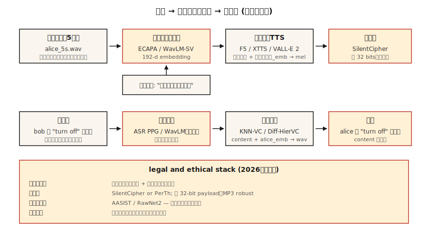

# 语音克隆和语音转换

> 语音克隆会用其他人的声音读取您的文本。语音转换将您的声音重写为其他人的声音，同时保留您所说的内容。两者都依赖于同一个基元：将发言者身份与内容分开。

** 类型：** 构建
** 语言：** Python
** 先决条件：** 阶段6 · 06（说话者识别）、阶段6 · 07（TTC）
** 时间：** ~75分钟

## 问题

2026年，5秒的音频片段足以使用消费级图形处理器生成任何人语音的高质量克隆。ElevenLabs、F5-TTC、OpenVoice v2、Poker均提供零镜头或少镜头克隆。该技术是一种祝福（可访问性TTC、配音、辅助语音）和一种武器（诈骗电话、政治深度造假、IP盗窃）。

两项密切相关的任务：

- ** 语音克隆（TTS端）：** 文本+ 5秒参考语音-该语音中的音频。
- ** 语音转换（语音端）：** 源音频（A说X）+B的参考语音-B说X的音频。

两者都将一个波形因素纳入（内容、扬声器、韵律）并将来自一个来源的内容与来自另一个来源的扬声器重新组合。

您现在在2026年发货的关键限制：** 欧盟（AI法案，2026年8月执行）和加利福尼亚州（AB 2905，2025年生效）法律要求水印和同意门 **。您的管道必须发出听不见的水印并拒绝未经同意的克隆。

## 概念



** 零克隆。**将5秒的片段传递给已经在数千个扬声器上训练过的模型。扬声器编码器将剪辑映射到扬声器嵌入; TTC解码器以该嵌入加上文本为条件。

使用者：F5-TTC（2024）、YourTTC（2022）、XTTC v2（2024）、OpenVoice v2（2024）。

** 少量微调。**记录5-30分钟的目标声音。LoRA-对基本模型进行一个小时的微调。质量从“可以”跃升到“难以区分”。Coqui和ElevenLabs都支持这种模式;社区将其与F5-TTS一起使用。

** 语音转换（VC）。**两个家庭：

- ** 识别-合成。**运行类似ASB的模型来提取内容表示（例如，软音素后验，PPV），然后与目标说话人嵌入重新合成。对语言和口音很强。由KNN-VC（2023）、迪夫-HierVC（2023）使用。
- ** 解开。**训练自动编码器，在瓶颈处的潜在空间中分离内容、说话者和韵律。在推理时交换扬声器嵌入。质量较低，但速度更快。由AutoVC（2019）、VIRTS-VC变体使用。

** 基于神经编解码器的克隆（2024年+）。** WAL-E、WAL-E 2、NaturalSpeech 3、EqualBox-将音频视为来自SoundStream / EnCodec的离散令牌，在编解码器令牌上训练大型自回归或流匹配模型。短提示的质量与ElevenLabs相当。

### 道德部分，而不是螺栓

** 水印。** PerTh（Perth）和SilentCipher（2024）在音频中不知不觉地嵌入了~16-32位ID。可以在重新编码、流媒体和常见编辑中幸存下来。生产就绪的开源。

** 同意门。**必须将每个克隆输出与可验证的同意记录配对。“我，罗希特，于2026年4月22日授权该声音用于X目的。“存储在防篡改日志中。

** 检测。** AASIST、RawNet 2和Wave 2 Vec 2-AASIST作为探测器运送。ASVspoof 2025挑战发布的最先进检测器针对ElevenLabs、WL-E 2和Bark输出的EER为0.8-2.3%。

### 数字（2026）

| 模型 | 零镜头？ | SCES（目标模拟） | WER（英特尔。） | Params |
|-------|-----------|--------------------|--------------|--------|
| F5-TTC | 是的 | 0.72 | 2.1% | 335M |
| XTTC v2 | 是的 | 0.65 | 3.5% | 470M |
| OpenVoice v2 | 是的 | 0.70 | 2.8% | 220M |
| 山谷-E 2 | 是的 | 0.77 | 2.4% | 370M |
| VoiceBox | 是的 | 0.78 | 2.1% | 330M |

对于大多数听众来说，SCES> 0.70通常与目标没有区别。

## 建设党

### 第1步：使用识别合成分解（main.py中的仅代码演示）

```python
def clone_pipeline(ref_audio, text, target_embedder, tts_model):
    speaker_emb = target_embedder.encode(ref_audio)
    mel = tts_model(text, speaker=speaker_emb)
    return vocoder(mel)
```

概念上简单;实现质量在“tts_模型”和扬声器编码器中。

### 第2步：使用F5-TTS进行零击克隆

```python
from f5_tts.api import F5TTS
tts = F5TTS()
wav = tts.infer(
    ref_file="rohit_5s.wav",
    ref_text="The quick brown fox jumps over the lazy dog.",
    gen_text="Please add milk and bread to my list.",
)
```

参考文字记录必须与音频完全匹配;不匹配会破坏对齐。

### 第3步：使用KNN-VC进行语音转换

```python
import torch
from knnvc import KNNVC  # 2023 model, https://github.com/bshall/knn-vc
vc = KNNVC.load("wavlm-base-plus")
out_wav = vc.convert(source="my_voice.wav", target_pool=["alice_1.wav", "alice_2.wav"])
```

KNN-VC运行WavLM来提取源池和目标池的每帧嵌入，然后用池中最近的邻居替换每个源帧。非参数，适用于一分钟的目标语音。

### 第4步：嵌入水印

```python
from silentcipher import SilentCipher
sc = SilentCipher(model="2024-06-01")
payload = b"consent_id:abc123;ts:1745353200"
watermarked = sc.embed(wav, sr=24000, message=payload)
detected = sc.detect(watermarked, sr=24000)   # returns payload bytes
```

~32位有效载荷，在MP3重新编码和轻微噪声后可检测。

### 第5步：同意门

```python
def cloned_inference(text, ref_audio, consent_record):
    assert verify_signature(consent_record), "Signed consent required"
    assert consent_record["speaker_id"] == hash_speaker(ref_audio)
    wav = tts.infer(ref_file=ref_audio, gen_text=text)
    wav = watermark(wav, payload=consent_record["id"])
    return wav
```

## 使用它

2026年堆栈：

| 情况 | 接 |
|-----------|------|
| 5-秒零镜头克隆，开源 | F5-TTC或OpenVoice v2 |
| 商业生产克隆 | ElevenLabs即时语音克隆v2.5 |
| 语音转换（重写） | KNN-VC或迪夫-HierVC |
| 多扬声器微调 | StyleTTC 2 +扬声器适配器 |
| 跨语言克隆 | XTTC v2或VIL-E X |
| Deepfake检测 | Wav2Vec 2-AASIST |

## 陷阱

- ** 参考文字记录不对齐。** F5-TTC等要求参考文本与参考音频完全匹配，包括标点符号。
- ** 回响参考。**回声杀死了克隆人。录制干燥、近距离麦克风。
- ** 情感不匹配。**训练参考“快乐”会产生一切的快乐克隆。将参考情感与目标使用进行匹配。
- ** 语言泄露。**克隆一个英语使用者，然后要求该模型说法语通常带有口音;使用跨语言模型（XTTC、VALL-E X）。
- ** 没有水印。**从2026年8月起，在欧盟法律上无法运输。

## 把它运

另存为“输出/skill-voice-cloner.md”。设计具有同意门+水印+质量目标的克隆或转换管道。

## 演习

1. ** 简单。**运行'代码/main.py '。通过计算交换前后两个“扬声器”之间的cos来演示扬声器嵌入交换。
2. ** 中等。**使用OpenVoice v2克隆您自己的声音。测量参考和克隆之间的SICS。通过Whisper测量BER。
3. ** 很难。**将SilentCipher水印应用于20个克隆，对它们进行128 kbit MP3编码+解码，检测有效负载。报告位准确性。

## 关键术语

| Term | 别人怎么说 | 它实际上意味着什么 |
|------|-----------------|-----------------------|
| 零发射克隆 | 5秒就够了 | 预训练模型+说话者嵌入;无需训练。 |
| PPG | 语音后图 | 每帧ASB后置词用作语言不可知的内容代表。 |
| KNN-VC | 最近邻转换 | 用最近的目标池帧替换每个源帧。 |
| 神经编解码器TTC | 瓦莱-E风格 | EnCodec/SoundStream代币上的AR模型。 |
| 水印 | 听不见的信号 | 嵌入音频中的位可以重新编码。 |
| SECS | 克隆保真度 | 目标扬声器嵌入和克隆扬声器嵌入之间的cos。 |
| AASIST | Deepfake检测器 | 反欺骗模型;检测合成语音。 |

## 进一步阅读

- [Chen等人（2024）。F5-TTC]（https：//arxiv.org/ab/2410.06885）-开源SOTA零镜头克隆。
- [Baevski等人/ Microsoft（2023）。valL-E]（https：//arxiv.org/ab/2301.02111）和[valL-E 2（2024）]（https：//arxiv.org/ab/2406.05370）- neural-codec RTS。
- [Qian等人（2019）。AutoVC]（https：//arxiv.org/abs/1905.05879）-基于解纠缠的语音转换。
- [Baas，Waubert de Puiseau，Kamper（2023）。KNN-VC]（https：//arxiv.org/abs/2305.18975）-基于检索的VC。
- [SilentCipher（2024）-音频水印]（https：//github.com/sony/silentcipher）-可生产的32位音频水印。
- [ASVspoof 2025年结果]（https：//www.asvspoof.org/）-检测器与合成器军备竞赛，2026年更新。
