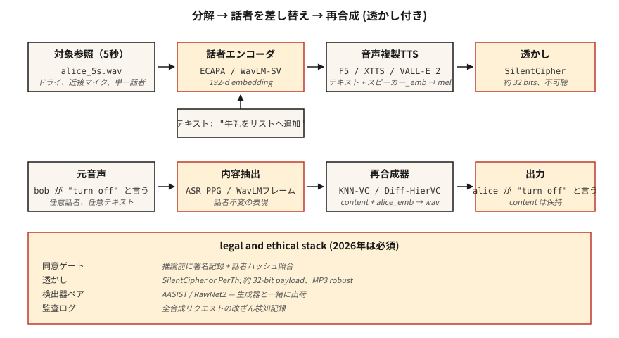

# 语音克隆与语音转换

> 语音克隆用别人的声音读出你的文本。语音转换将你的声音改写成别人的声音，同时保留你所说的内容。两者都基于相同的分解：将说话者身份与内容分离。

**类型：** 动手构建
**语言：** Python
**前置知识：** 阶段 6 · 06（说话人识别），阶段 6 · 07（TTS）
**时间：** ~75 分钟

## 问题

到 2026 年，一段 5 秒的音频片段足以在消费级 GPU 上生成任何人的高质量语音克隆。ElevenLabs、F5-TTS、OpenVoice v2、VoiceBox 都实现了零样本或少样本克隆。这项技术既是福音（无障碍 TTS、配音、辅助语音），也是武器（诈骗电话、政治深度伪造、知识产权盗窃）。

两个密切相关的任务：

- **语音克隆（TTS 侧）：** 文本 + 5 秒参考语音 → 以该声音输出的音频。
- **语音转换（语音侧）：** 源音频（A 说 X）+ B 的参考语音 → B 说 X 的音频。

两者都将波形分解为（内容、说话者、韵律），然后将来自一个源的内容与来自另一个源的说话者重新组合。

2026 年你必须遵守的关键约束：**水印和同意门控在欧盟（AI Act，2026 年 8 月强制执行）和加利福尼亚州（AB 2905，2025 年生效）是法律要求**。你的流水线必须发出不可听的水印，并拒绝未经同意的克隆。

## 概念



**零样本克隆。** 将 5 秒片段输入到已在数千个说话者上训练过的模型。说话者编码器将片段映射为说话者嵌入；TTS 解码器在该嵌入和文本的基础上进行条件生成。

使用方：F5-TTS (2024)、YourTTS (2022)、XTTS v2 (2024)、OpenVoice v2 (2024)。

**少样本微调。** 录制 5-30 分钟的目标语音。对基础模型进行一小时的 LoRA 微调。质量从"还行"跃升到"难以区分"。Coqui 和 ElevenLabs 都支持这种模式；社区将其与 F5-TTS 一起使用。

**语音转换（VC）。** 两个家族：

- **识别-合成。** 运行类似 ASR 的模型提取内容表示（如软音素后验概率 PPG），然后用目标说话者嵌入重新合成。对语言和口音鲁棒。KNN-VC (2023)、Diff-HierVC (2023) 使用此方法。
- **解缠。** 训练一个自编码器，在瓶颈处的潜在空间中分离内容、说话者和韵律。推理时交换说话者嵌入。质量较低但速度更快。AutoVC (2019)、VITS-VC 变体使用此方法。

**基于神经编解码器的克隆（2024+）。** VALL-E、VALL-E 2、NaturalSpeech 3、VoiceBox——将音频视为来自 SoundStream / EnCodec 的离散 token，在编解码器 token 上训练大型自回归或流匹配模型。短提示下的质量可与 ElevenLabs 媲美。

### 伦理考量，不可或缺

**水印。** PerTh 和 SilentCipher (2024) 将约 16-32 位 ID 不可感知地嵌入音频中。能经受重新编码、流式传输和常见编辑。生产就绪的开源方案。

**同意门控。** 必须为每个克隆输出配对可验证的同意记录。"我，Rohit，于 2026-04-22，授权将此语音用于 X 目的。"存储在防篡改日志中。

**检测。** AASIST、RawNet2 和 Wav2Vec2-AASIST 作为检测器使用。ASVspoof 2025 挑战赛报告了最先进检测器针对 ElevenLabs、VALL-E 2 和 Bark 输出的 EER 为 0.8–1.3%。

### 2026 年数据

| 模型 | 零样本？ | SECS（目标相似度） | WER（可懂度） | 参数量 |
|-------|-----------|--------------------|--------------|--------|
| F5-TTS | 是 | 0.72 | 2.1% | 335M |
| XTTS v2 | 是 | 0.65 | 3.5% | 470M |
| OpenVoice v2 | 是 | 0.70 | 2.8% | 220M |
| VALL-E 2 | 是 | 0.77 | 2.4% | 370M |
| VoiceBox | 是 | 0.78 | 2.1% | 330M |

SECS > 0.70 对于大多数听众来说通常与目标无法区分。

## 动手实现

### 第 1 步：用识别-合成分解（main.py 中的纯代码演示）

```python
def clone_pipeline(ref_audio, text, target_embedder, tts_model):
    speaker_emb = target_embedder.encode(ref_audio)
    mel = tts_model(text, speaker=speaker_emb)
    return vocoder(mel)
```

概念简单；实现量在 `tts_model` 和说话者编码器中。

### 第 2 步：使用 F5-TTS 零样本克隆

```python
from f5_tts.api import F5TTS
tts = F5TTS()
wav = tts.infer(
    ref_file="rohit_5s.wav",
    ref_text="The quick brown fox jumps over the lazy dog.",
    gen_text="Please add milk and bread to my list.",
)
```

参考转录必须与音频完全匹配；不匹配会破坏对齐。

### 第 3 步：使用 KNN-VC 进行语音转换

```python
import torch
from knnvc import KNNVC  # 2023 model, https://github.com/bshall/knn-vc
vc = KNNVC.load("wavlm-base-plus")
out_wav = vc.convert(source="my_voice.wav", target_pool=["alice_1.wav", "alice_2.wav"])
```

KNN-VC 使用 WavLM 提取源和目标池的每帧嵌入，然后将每个源帧替换为池中最近的邻居。非参数化，只需一分钟的目标语音即可工作。

### 第 4 步：嵌入水印

```python
from silentcipher import SilentCipher
sc = SilentCipher(model="2024-06-01")
payload = b"consent_id:abc123;ts:1745353200"
watermarked = sc.embed(wav, sr=24000, message=payload)
detected = sc.detect(watermarked, sr=24000)   # returns payload bytes
```

约 32 位有效载荷，在 MP3 重新编码和轻度噪声后仍可检测。

### 第 5 步：同意门控

```python
def cloned_inference(text, ref_audio, consent_record):
    assert verify_signature(consent_record), "需要签名同意"
    assert consent_record["speaker_id"] == hash_speaker(ref_audio)
    wav = tts.infer(ref_file=ref_audio, gen_text=text)
    wav = watermark(wav, payload=consent_record["id"])
    return wav
```

## 使用建议

2026 年技术栈：

| 场景 | 选择 |
|-----------|------|
| 5 秒零样本克隆，开源 | F5-TTS 或 OpenVoice v2 |
| 商业级生产克隆 | ElevenLabs Instant Voice Clone v2.5 |
| 语音转换（改写） | KNN-VC 或 Diff-HierVC |
| 多说话者微调 | StyleTTS 2 + 说话者适配器 |
| 跨语言克隆 | XTTS v2 或 VALL-E X |
| 深度伪造检测 | Wav2Vec2-AASIST |

## 常见陷阱

- **参考转录不匹配。** F5-TTS 和类似模型要求参考文本与参考音频完全匹配，包括标点。
- **混响参考。** 回声会毁掉克隆。录制时应干燥、近麦克风。
- **情绪不匹配。** 训练参考"欢快"会产生所有内容的欢快克隆。匹配参考情绪与目标用途。
- **语言泄漏。** 克隆英语说话者后让模型说法语通常会带有口音；使用跨语言模型（XTTS、VALL-E X）。
- **无水印。** 自 2026 年 8 月起在欧盟无法合法发布。

## 交付物

保存为 `outputs/skill-voice-cloner.md`。设计带同意门控 + 水印 + 质量目标的克隆或转换流水线。

## 练习

1. **简单。** 运行 `code/main.py`。通过计算两个"说话者"在交换前后的余弦来演示说话者嵌入交换。
2. **中等。** 使用 OpenVoice v2 克隆你自己的声音。测量参考与克隆之间的 SECS。通过 Whisper 测量 CER。
3. **困难。** 对 20 个克隆应用 SilentCipher 水印，通过 128 kbps MP3 编码+解码，检测有效载荷。报告位准确率。

## 关键词汇

| 术语 | 通常说法 | 实际含义 |
|------|-----------------|-----------------------|
| Zero-shot clone（零样本克隆） | 5 秒就够了 | 预训练模型 + 说话者嵌入；无需训练。 |
| PPG | 音素后验图 | 每帧 ASR 后验概率，用作语言无关的内容表示。 |
| KNN-VC | 最近邻转换 | 将每个源帧替换为目标池中最近的帧。 |
| Neural codec TTS | VALL-E 风格 | 基于 EnCodec/SoundStream token 的自回归模型。 |
| Watermark（水印） | 不可听签名 | 嵌入音频中的比特，能经受重新编码。 |
| SECS | 克隆保真度 | 目标与克隆说话者嵌入之间的余弦。 |
| AASIST | 深度伪造检测器 | 反欺骗模型；检测合成语音。 |

## 延伸阅读

- [Chen et al. (2024). F5-TTS](https://arxiv.org/abs/2410.06885)——开源 SOTA 零样本克隆。
- [Baevski et al. / Microsoft (2023). VALL-E](https://arxiv.org/abs/2301.02111) 和 [VALL-E 2 (2024)](https://arxiv.org/abs/2406.05370)——神经编解码器 TTS。
- [Qian et al. (2019). AutoVC](https://arxiv.org/abs/1905.05879)——基于解缠的语音转换。
- [Baas, Waubert de Puiseau, Kamper (2023). KNN-VC](https://arxiv.org/abs/2305.18975)——基于检索的 VC。
- [SilentCipher (2024)——Audio Watermarking](https://github.com/sony/silentcipher)——生产就绪的 32 位音频水印。
- [ASVspoof 2025 results](https://www.asvspoof.org/)——检测器与合成器的军备竞赛，2026 年更新。
