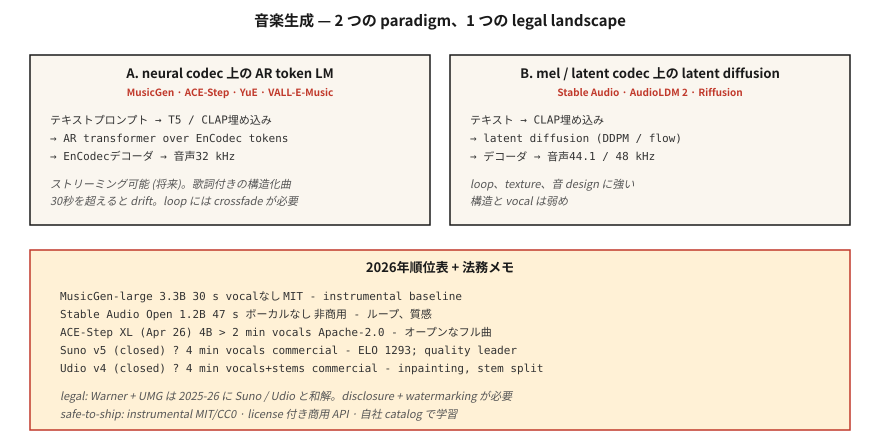

# Müzik Üretimi — MusicGen, Stable Audio, Suno ve Lisanslama Depremi

> 2026 müzik nesli: Suno v5 ve Udio v4 reklamlara hakim; MusicGen, Stable Audio Open ve ACE-Step açık kaynak konusunda liderdir. Teknik sorun çoğunlukla çözüldü. Yasal sorun (Warner Music'e 500 milyon dolarlık anlaşma, UMG anlaşması) 2025-2026'da alanı yeniden şekillendirdi.

**Tür:** Yapım
**Diller:** Python
**Önkoşullar:** Aşama 6 · 02 (Spektrogramlar), Aşama 4 · 10 (Difüzyon Modelleri)
**Süre:** ~75 dakika

## Sorun

Metin → sözleri, vokalleri ve yapısını içeren 30 saniye ila 4 dakikalık bir müzik klibi. Üç alt problem:

1. **Enstrümantal nesil.** "Ilık tuşlarla lo-fi hip-hop davulları" gibi metinler → ses. MusicGen, Sabit Ses, AudioLDM.
2. **Şarkı üretimi (vokal + şarkı sözleri ile).** "Yağmurlu Teksas geceleri hakkında Country şarkısı" → tam ​​şarkı. Suno, Udio, YuE, ACE-Step.
3. **Koşullu / kontrol edilebilir.** Mevcut bir klibi genişletin, bir köprüyü yeniden oluşturun, türü değiştirin, gövdeyi ayırın veya iç boyama yapın. Udio'nun iç boyama + gövde ayrımı, 2026'nın buna uygun özelliğidir.

## Konsept



### Token LM, sinir kodlayıcısı tokens üzerinden

Meta'nın **MusicGen** (2023, MIT) ve birçok türevi: metin/melodi embedding'ler üzerindeki koşul, EnCodec token'leri (32 kHz, 4 kod kitabı) otomatik regresif olarak tahmin eder, EnCodec ile kod çözer. 300M - 3.3B parametreleri. Güçlü temel; 30 saniye boyunca mücadele ediyor.

**ACE-Step** (açık kaynak, Nisan 2026'da piyasaya sürülen 4B XL), bunu tam şarkılı şarkı sözü koşullandırmalı nesil için genişletiyor. Açık topluluğun Suno'ya en yakın olanı.

### Meller veya latentler üzerinden difüzyon

**Stable Audio (2023)** ve **Stable Audio Open (2024)**: sıkıştırılmış seste gizli yayılma. Döngülerde, ses tasarımında ve ortam dokularında mükemmeldir. Yapılandırılmış tam şarkılarda pek iyi değil.

**AudioLDM / AudioLDM2**: T2I tarzı gizli yayılma yoluyla metinden sese, müzik, ses efektleri ve konuşmaya genelleştirilmiş.

### Hibrit (üretim) — Suno, Udio, Lyria

Kapalı ağırlıklar. Muhtemelen AR codec bileşeni LM + özel ses / davul / melodi kafalarına sahip difüzyon tabanlı ses kodlayıcı. Suno v5 (2026), ELO 1293 kalite lideridir. Udio v4, iç boyama + gövde ayrımı ekler (bas, davul, vokal ayrı indirmeler).

### Değerlendirme

- **FAD (Fréchet Audio Distance).** VGGish veya PANN özelliklerini kullanarak oluşturulan ve gerçek ses dağıtımı arasındaki Embedding düzeyindeki mesafe. Daha düşük olması daha iyidir. MusicGen küçük: MusicCaps'te 4,5 FAD; SOTA ~3.0.
- **Müzikalite (öznel).** İnsan tercihi. Suno v5 ELO 1293 önde.
- **Metin-ses hizalaması.** prompt ile çıktı arasındaki CLAP puanı.
- **Müzikalite artifacts.** Vuruş dışı geçişler, vokal ifadelerde kayma, 30 saniyeden sonra yapı kaybı.

## 2026 model haritası

| Modeli | Parametreler | Uzunluk | Vokal | Lisans |
|-------|--------|--------|--------|---------|
| MüzikGen-büyük | 3.3B | 30 sn | hayır | MİT |
| Sabit Ses Açık | 1.2B | 47 sn | hayır | Ticari olmayan istikrar |
| ACE-Step XL (Nisan 2026) | 4B | > 2 dakika | evet | Apache-2.0 |
| YuE | 7B | > 2 dakika | evet, çok dilli | Apache-2.0 |
| Suno v5 (kapalı) | ? | 4 dakika | evet, ELO 1293 | ticari |
| Udio v4 (kapalı) | ? | 4 dakika | evet + gövdeler | ticari |
| Google Lyria 3 (kapalı) | ? | gerçek zamanlı | evet | ticari |
| MiniMax Müzik 2.5 | ? | 4 dakika | evet | ticari API |

## Yasal durum (2025-2026)

- **Warner Music ile Suno arasında anlaşma.** 500 milyon dolar. WMG artık yapay zekaya benzerliği, müzik haklarını ve Suno'da kullanıcı tarafından oluşturulan parçaları denetlemektedir. Udio'da da benzer UMG yerleşimi.
- **AB Yapay Zeka Yasası** + **Kaliforniya SB 942**: Yapay zeka tarafından oluşturulan müzik açıklanmalıdır.
- MIT kapsamındaki **Riffusion / MusicGen**'in uyumluluk bagajı yoktur, aynı zamanda ticari vokal de yoktur.

Güvenli nakliye modelleri:

1. Yalnızca enstrümantal oluşturun (MusicGen, Stable Audio Open, MIT/CC0 çıkışları).
2. Nesil başına lisansla ticari API'leri (Suno, Udio, ElevenLabs Music) kullanın.
3. Sahip olunan veya lisanslanan katalog üzerinde eğitim alın (çoğu işletme buraya gelir).
4. Nesilleri filigranlar ve meta verilerle etiketleyin.

## İnşa Et

### Adım 1: MusicGen ile oluşturun

```python
from audiocraft.models import MusicGen
import torchaudio

model = MusicGen.get_pretrained("facebook/musicgen-small")
model.set_generation_params(duration=10)
wav = model.generate(["upbeat synthwave with driving drums, 128 BPM"])
torchaudio.save("out.wav", wav[0].cpu(), 32000)
```

Üç boyut: `small` (300M, hızlı), `medium` (1,5B), `large` (3,3B). "Fikir gerçekleşir mi?" için küçük yeterlidir.

### Adım 2: melodi koşullandırma

```python
melody, sr = torchaudio.load("humming.wav")
wav = model.generate_with_chroma(
    ["jazz piano cover"],
    melody.squeeze(),
    sr,
)
```

MusicGen-melody bir kromagram alır ve tınıyı değiştirirken melodiyi korur. "Bu melodiyi bana yaylı çalgılar dörtlüsü olarak ver" için kullanışlıdır.

### Adım 3: FAD değerlendirmesi

```python
from frechet_audio_distance import FrechetAudioDistance
fad = FrechetAudioDistance()

fad.get_fad_score("generated_folder/", "reference_folder/")
```

VGGish-embedding mesafesini hesaplar. Tür düzeyinde regresyon testleri için kullanışlıdır; insan dinleyicilerin yerini tutmaz.

### Adım 4: Yüksek Lisans-müzik iş akışına ekleme

Ders 7-8'deki fikirlerle birleştirin:

```python
prompt = "Write a 30-second jazz loop. Describe the drums, bass, and piano voicing."
description = llm.complete(prompt)
music = musicgen.generate([description], duration=30)
```

## Kullan onu

| Gol | Yığın |
|------|-------|
| Enstrümantal ses tasarımı | Sabit Ses Açık |
| Oyun / uyarlanabilir müzik | Google Lyria RealTime (kapalı) |
| Vokalli tam şarkılar (ticari) | Açık lisanslı Suno v5 veya Udio v4 |
| Şarkıların tamamı vokalli (açık) | ACE-Step XL veya YuE |
| Kısa reklam müziği | MusicGen uğultulu bir referansa göre melodiyle koşullandırılmış |
| Müzik-video arka planı | MusicGen + Kararlı Video Dağıtımı |

## 2026'da hâlâ gönderilecek tuzaklar

- **Telif hakkı aklama prompt'lar.** "Taylor Swift tarzında şarkı" — ticari Suno/Udio artık bunları filtreliyor, açık modeller bu filtreyi kullanmıyor. Kendi filtre listenizi ekleyin.
- **30 saniyeyi aşan tekrarlama/sapma** AR modelleri döngüsü. Çoklu nesilleri çaprazlayın veya yapısal tutarlılık için ACE-Step'i kullanın.
- **Tempo sapması.** Modeller BPM'den sapıyor. prompt içindeki BPM etiketlerini ve librosa'nın `beat_track` ile son filtresini kullanın.
- **Vokal anlaşılırlığı.** Suno mükemmel; açık modeller genellikle kelimeler konusunda duygusaldır. Şarkı sözleri önemliyse ticari bir API kullanın veya ince ayar yapın.
- **Mono çıkış.** Açık modeller mono veya sahte stereo oluşturur. Uygun bir stereo yeniden yapılandırmayla yükseltme (ezst, Cartesia'nın stereo difüzyonu).

## Gönderin

`outputs/skill-music-designer.md` olarak kaydet. Bir müzik türü deployment için modeli, lisans stratejisini, uzunluk/yapı planını ve açıklama meta verilerini seçin.

## Egzersizler

1. **Kolay.** `code/main.py` komutunu çalıştırın. Bir müzik gen karikatürü olan ASCII sembolleri olarak "üretken" bir akor ilerlemesi + davul ritmi üretir. İsterseniz herhangi bir MIDI oluşturucu aracılığıyla oynatın.
2. **Medium.** `audiocraft` yükleyin, MusicGen-small ile 4 tür prompt'de 10 saniyelik klipler oluşturun, FAD'yi bir referans tür setine göre ölçün.
3. **Zor.** ACE-Step'i (veya MusicGen-melody) kullanarak, aynı melodinin farklı tını prompt'larla üç varyasyonunu oluşturun. Hizalamayı doğrulamak için CLAP'ın prompt ile benzerliğini hesaplayın.

## Anahtar Terimler

| Dönem | İnsanlar ne diyor | Aslında ne anlama geliyor |
|------|-----------------|-----------------------|
| FAD | Ses FID'si | Gerçek ve oluşturulan embedding dağılımları arasındaki Fréchet mesafesi. |
| Kromagram | Perde olarak melodi | Çerçeve başına 12-dim vektör; melodi koşullandırmaya giriş. |
| Kaynaklanıyor | Enstrüman parçaları | Bas/davul/vokal/melodiyi WAV olarak ayırdık. |
| İç boyama | Bir bölümü yeniden oluştur | Bir zaman penceresini maskeleyin; model tam da bunu yeniden üretiyor. |
| CLAP | Metin-ses KLİBİ | Karşılaştırmalı ses metni embedding; metin-ses hizalamasını değerlendirin. |
| Kodlama | Müzik codec'i | Meta'nın MusicGen tarafından kullanılan sinir kodeği; 32 kHz, 4 kod kitabı. |

## Daha Fazla Okuma

- [Copet ve ark. (2023). MusicGen](https://arxiv.org/abs/2306.05284) — açık otoregresif benchmark.
- [Evans ve ark. (2024). Sabit Ses Açık](https://arxiv.org/abs/2407.14358) — ses tasarımı varsayılanı.
- [ACE-Step](https://github.com/ace-step/ACE-Step) — 4B tam şarkı oluşturucuyu aç, Nisan 2026.
- [Suno v5 platform docs](https://suno.com) — ticari kalite lideri.
- [AudioLDM2](https://arxiv.org/abs/2308.05734) — müzik + ses efektleri için gizli yayılma.
- [WMG-Suno uzlaşma kapsamı](https://www.musicbusinessworldwide.com/suno-warner-music-settlement/) — Kasım 2025 emsali.
