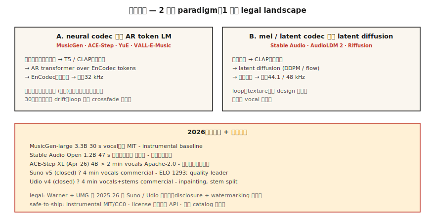

# 音乐生成 —— MusicGen、Stable Audio、Suno 与版权地震

> 译注：本文译自同目录 [`en.md`](./en.md)。术语遵循仓根 [TRANSLATION_GUIDE.md](../../../../TRANSLATION_GUIDE.md)。

> 2026 年的音乐生成：商用领域 Suno v5 与 Udio v4 双雄并立；开源领域则由 MusicGen、Stable Audio Open 和 ACE-Step 领衔。技术问题基本已经解决，真正改写格局的是法律问题——华纳音乐 5 亿美元和解、UMG 和解，重塑了 2025-2026 的整个赛道。

**Type:** Build
**Languages:** Python
**Prerequisites:** Phase 6 · 02 (Spectrograms), Phase 4 · 10 (Diffusion Models)
**Time:** ~75 minutes

## 问题（The Problem）

文本 → 一段 30 秒到 4 分钟的音乐，带歌词、人声和结构。可拆成三个子问题：

1. **器乐生成（Instrumental generation）**。像 "lo-fi hip-hop drums with warm keys" 这样的提示 → 音频。代表作：MusicGen、Stable Audio、AudioLDM。
2. **整曲生成（Song generation，含人声 + 歌词）**。"Country song about rainy Texas nights" → 一首完整歌曲。代表作：Suno、Udio、YuE、ACE-Step。
3. **条件 / 可控生成（Conditional / controllable）**。续写已有片段、重新生成 bridge、换风格、做 stem 分离、或者 inpaint 某一小节。Udio 的 inpainting + stem 分离是 2026 年的对标功能。

## 概念（The Concept）



### 在神经 codec token 上跑 token LM

Meta 的 **MusicGen**（2023，MIT 许可）以及众多衍生工作：以文本 / 旋律 embedding 为条件，autoregressive 地预测 EnCodec token（32 kHz，4 个 codebook），最后用 EnCodec 解码出音频。参数规模 300M - 3.3B。基线很强，但超过 30 秒就难以为继。

**ACE-Step**（开源，4B XL 版本于 2026 年 4 月发布）把这套思路扩展到了带歌词条件的整曲生成，是开源社区目前最接近 Suno 的方案。

### 在 mel 频谱或 latent 上跑 diffusion

**Stable Audio（2023）** 和 **Stable Audio Open（2024）**：在压缩音频上做 latent diffusion。擅长 loop、音效设计、氛围音色，但不擅长结构化的整首歌。

**AudioLDM / AudioLDM2**：用 T2I 风格的 latent diffusion 做文本到音频，泛化覆盖音乐、音效、语音。

### 混合路线（生产级）—— Suno、Udio、Lyria

闭源权重。大概率是 AR codec LM + 基于 diffusion 的 vocoder，再加上专门的人声 / 鼓 / 旋律 head。Suno v5（2026）以 ELO 1293 拿下质量榜首；Udio v4 加上了 inpainting + stem 分离（bass、drums、vocals 可以分别下载）。

### 评估（Evaluation）

- **FAD（Fréchet Audio Distance）**。用 VGGish 或 PANNs 特征，衡量生成音频分布与真实音频分布在 embedding 层面的距离。越低越好。MusicGen small 在 MusicCaps 上是 4.5 FAD；SOTA ~3.0。
- **Musicality（主观听感）**。人类偏好。Suno v5 ELO 1293 领跑。
- **文本-音频对齐（Text-audio alignment）**。用 CLAP 算 prompt 与输出之间的相似度。
- **音乐性瑕疵（Musicality artifacts）**。节奏切换不准、人声乐句漂移、超过 30 秒结构崩塌。

## 2026 模型地图

| 模型 | 参数 | 时长 | 人声 | 许可 |
|-------|--------|--------|--------|---------|
| MusicGen-large | 3.3B | 30 s | 否 | MIT |
| Stable Audio Open | 1.2B | 47 s | 否 | Stability 非商用 |
| ACE-Step XL（2026 年 4 月） | 4B | &gt; 2 min | 是 | Apache-2.0 |
| YuE | 7B | &gt; 2 min | 是，多语种 | Apache-2.0 |
| Suno v5（闭源） | ? | 4 min | 是，ELO 1293 | 商用 |
| Udio v4（闭源） | ? | 4 min | 是 + stems | 商用 |
| Google Lyria 3（闭源） | ? | 实时 | 是 | 商用 |
| MiniMax Music 2.5 | ? | 4 min | 是 | 商用 API |

## 法律图景（2025-2026）

- **华纳音乐 vs Suno 和解案**。5 亿美元。WMG 现在对 Suno 上的 AI 形象、音乐版权和用户生成曲目都拥有监督权。Udio 与 UMG 也达成了类似和解。
- **欧盟 AI 法案** + **加州 SB 942**：AI 生成的音乐必须明确披露。
- **Riffusion / MusicGen** 在 MIT 协议下没有合规包袱，但也没有商用级人声。

可以安心上线的模式：

1. 只生成器乐（MusicGen、Stable Audio Open，输出 MIT/CC0）。
2. 用商用 API（Suno、Udio、ElevenLabs Music），按生成次数计费的许可。
3. 在自有或已授权的曲库上训练（多数企业最后都走这条）。
4. 用 watermark + 元数据给生成作品打标签。

## 动手实现（Build It）

### Step 1: 用 MusicGen 生成

```python
from audiocraft.models import MusicGen
import torchaudio

model = MusicGen.get_pretrained("facebook/musicgen-small")
model.set_generation_params(duration=10)
wav = model.generate(["upbeat synthwave with driving drums, 128 BPM"])
torchaudio.save("out.wav", wav[0].cpu(), 32000)
```

三个尺寸：`small`（300M，快）、`medium`（1.5B）、`large`（3.3B）。验证想法是否成立，small 就够了。

### Step 2: 旋律条件

```python
melody, sr = torchaudio.load("humming.wav")
wav = model.generate_with_chroma(
    ["jazz piano cover"],
    melody.squeeze(),
    sr,
)
```

MusicGen-melody 接受一个 chromagram，保留旋律的同时替换音色。适合做 "把这段旋律改写成弦乐四重奏" 这样的场景。

### Step 3: FAD 评估

```python
from frechet_audio_distance import FrechetAudioDistance
fad = FrechetAudioDistance()

fad.get_fad_score("generated_folder/", "reference_folder/")
```

算的是 VGGish embedding 距离。适合做风格层面的回归测试，但不能替代真人听众。

### Step 4: 接入 LLM-音乐工作流

把第 7-8 节的思路结合进来：

```python
prompt = "Write a 30-second jazz loop. Describe the drums, bass, and piano voicing."
description = llm.complete(prompt)
music = musicgen.generate([description], duration=30)
```

## 用起来（Use It）

| 目标 | 技术栈 |
|------|-------|
| 器乐 / 音效设计 | Stable Audio Open |
| 游戏 / 自适应配乐 | Google Lyria RealTime（闭源） |
| 带人声的整曲（商用） | Suno v5 或 Udio v4，配明确许可 |
| 带人声的整曲（开源） | ACE-Step XL 或 YuE |
| 短广告 jingle | MusicGen，用一段哼唱做旋律条件 |
| 音乐视频背景音 | MusicGen + Stable Video Diffusion |

## 2026 年依然会踩的坑

- **打版权擦边球的 prompt**。"Song in the style of Taylor Swift" —— 商用 Suno/Udio 现在会过滤这类提示，开源模型不会。自己加一份过滤词表。
- **超过 30 秒就重复 / 漂移**。AR 模型会陷入循环。可以多段生成做 crossfade，或者用 ACE-Step 拿到结构连贯性。
- **节奏漂移**。模型会偏离 BPM。在 prompt 里写明 BPM 标签，然后用 librosa 的 `beat_track` 做后过滤。
- **人声清晰度**。Suno 非常出色；开源模型的咬字往往糊成一团。如果歌词重要，用商用 API 或者自己微调。
- **单声道输出**。开源模型只生成单声道或假立体声。用一套真正的立体声重建（ezst、Cartesia 的 stereo diffusion）升级一下。

## 上线部署（Ship It）

存为 `outputs/skill-music-designer.md`。为一次音乐生成上线选定模型、许可策略、时长 / 结构方案，以及披露元数据。

## 练习（Exercises）

1. **简单**。跑 `code/main.py`。它会用 ASCII 符号产出一段 "生成式" 和弦进行 + 鼓点 —— 一个音乐生成的卡通版。想听的话，用任意 MIDI 渲染器播放回去。
2. **中等**。装上 `audiocraft`，用 MusicGen-small 在 4 个不同风格的 prompt 上各生成 10 秒，再以一个参考风格集为基准计算 FAD。
3. **困难**。用 ACE-Step（或 MusicGen-melody），同一段旋律配三种不同的音色 prompt 生成三个版本。算 prompt 与输出的 CLAP 相似度，验证对齐效果。

## 关键术语（Key Terms）

| 术语 | 大家怎么说 | 实际是什么 |
|------|-----------------|-----------------------|
| FAD | Audio 版的 FID | 真实音频与生成音频在 embedding 分布之间的 Fréchet 距离。 |
| Chromagram | 把旋律表达成音高 | 每帧 12 维向量；旋律条件输入。 |
| Stems | 各乐器的分轨 | 分离出来的 bass / drums / vocals / melody 的 WAV 文件。 |
| Inpainting | 重做某一段 | 给一段时间窗口加 mask，模型只重新生成被 mask 的部分。 |
| CLAP | 文本-音频版 CLIP | 对比学习的音频-文本 embedding；用于评估文本与音频的对齐。 |
| EnCodec | 音乐 codec | Meta 的神经 codec，被 MusicGen 使用；32 kHz，4 个 codebook。 |

## 延伸阅读（Further Reading）

- [Copet 等（2023）。MusicGen](https://arxiv.org/abs/2306.05284) —— 开源 autoregressive 基线。
- [Evans 等（2024）。Stable Audio Open](https://arxiv.org/abs/2407.14358) —— 音效设计的默认选择。
- [ACE-Step](https://github.com/ace-step/ACE-Step) —— 2026 年 4 月开源的 4B 整曲生成器。
- [Suno v5 平台文档](https://suno.com) —— 商用质量榜首。
- [AudioLDM2](https://arxiv.org/abs/2308.05734) —— 面向音乐 + 音效的 latent diffusion。
- [WMG-Suno 和解案报道](https://www.musicbusinessworldwide.com/suno-warner-music-settlement/) —— 2025 年 11 月的判例。
