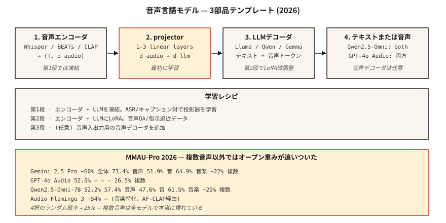

# Ses-Dil Modelleri — Qwen2.5-Omni, Audio Flamingo, GPT-4o Audio

> 2026 ses-dil modeli, konuşma + çevresel ses + müzik üzerinden mantık yürütür. Qwen2.5-Omni-7B, MMAU-Pro'daki GPT-4o Ses ile eşleşir. Audio Flamingo Next, LongAudioBench'te Gemini 2.5 Pro'yu geride bırakıyor. Herkesin neredeyse rastgele olduğu çoklu ses görevleri dışında, açık ve kapalı arasındaki boşluk aslında kapalıdır.

**Tür:** Öğren
**Diller:** Python
**Önkoşullar:** Aşama 6 · 04 (ASR), Aşama 12 · 03 (Görme-Dil Modelleri), Aşama 7 · 10 (Ses Transformers)
**Süre:** ~45 dakika

## Sorun

5 saniyelik bir sesiniz var: köpek havlıyor, birisi "dur!" diye bağırıyor ve ardından sessizlik. Yararlı sorular birden fazla eksene yayılır:

- **Transkripsiyon.** "Ne söylendi?" — ASR bölgesi.
- **Anlamsal akıl yürütme.** "Kişi tehlikede mi?" — havlama + bağırma + sessizliğin ortak olarak anlaşılmasını gerektirir.
- **Müzik muhakemesi.** "Melodiyi hangi enstrümanlar çalıyor?"
- **Uzun ses alımı.** "Eğitmen bu 90 dakikalık dersin neresinde gradient inişini açıkladı?"

Bunların hepsine bir prompt ile cevap veren tek model, **ses dili modelidir** (LALM / ALM). Saf ASR'den ayrı olarak: LALM'ler yalnızca transkriptleri değil, serbest biçimli doğal dil yanıtlarını da üretir.

## Konsept



### Üç bileşenli şablon

Her 2026 LALM aynı iskelete sahiptir:

1. **Ses kodlayıcı.** Fısıltı kodlayıcı · BEAT'ler · CLAP · WavLM · veya model başına özel bir kodlayıcı.
2. **Projektör.** ​​Ses kodlayıcı özelliklerini LLM'nin token embedding alanına bağlayan doğrusal veya MLP.
3. **LLM.** Llama / Qwen / Gemma tabanlı kod çözücü. Aralıklı metin + ses token'leri alır; metin oluşturur.

Eğitim:

- **Aşama 1.** Kodlayıcıyı dondur + LLM; projektörü yalnızca ASR / altyazı verileriyle eğitin.
- **2. Aşama.** Talimatları takip eden ses görevlerinde (QA, akıl yürütme, müziği anlama) Tam / LoRA ince ayarı.
- **Aşama 3 (isteğe bağlı).** Ses girişi/ses çıkışı bir konuşma kod çözücü ekler. Qwen2.5-Omni ve AF3-Chat bunu yapar.

### 2026 model haritası

| Modeli | Omurga | Ses kodlayıcı | Çıkış yöntemi | Erişim |
|-------|----------|---------------|-----------------|--------|
| Qwen2.5-Omni-7B | Qwen2.5-7B | Özel + Fısıltı | metin + konuşma | Apache-2.0 |
| Qwen3-Omni | Qwen3 | Özel | metin + konuşma | Apache-2.0 |
| Ses Flamingo 3 | Qwen2 | AF-CLAP | metin | NVIDIA ticari olmayan |
| Ses Flamingo Sonraki | Qwen2 | AF-CLAP v2 | metin | NVIDIA ticari olmayan |
| SOMON | Vicuna | Fısıltı + BEAT'ler | metin | Apache-2.0 |
| LTU / LTU-AS | Lama | CAV-MAE | metin | Apache-2.0 |
| GAMA | Lama | AST + Q-Eski | metin | Apache-2.0 |
| Gemini 2.5 Flash/Pro (kapalı) | İkizler | tescilli | metin + konuşma | API'si |
| GPT-4o Ses (kapalı) | GPT-4o | tescilli | metin + konuşma | API'si |

### Benchmark gerçeklik kontrolü (2026)

**MMAU-Pro.** Konuşma/ses/müzik/karışıklığı kapsayan 1800 QA çifti. Çoklu ses alt kümesi dahildir.

| Modeli | Genel | Konuşma | Ses | Müzik | Çoklu ses |
|-------|---------|--------|-------|-------|-------------|
| İkizler 2.5 Pro | ~%60 | %73,4 | %51,9 | %64,9 | ~%22 |
| İkizler 2.5 Flaş | ~%57 | %73,4 | %50,5 | %64,9 | %21,2 |
| GPT-4o Ses | %52,5 | — | — | — | %26,5 |
| Qwen2.5-Omni-7B | %52,2 | %57,4 | %47,6 | %61,5 | ~%20 |
| Ses Flamingo 3 | ~%54 | — | — | — | — |
| Ses Flamingo Sonraki | LongAudioBench'te SOTA | — | — | — | — |

**Çoklu ses sütunu herkes için lanettir.** 4 seçenekli çoktan seçmelide rastgele şans = %25; çoğu model buralarda puan alıyor. LALM'ler hâlâ iki klibi karşılaştırmakta zorlanıyor.

### LALM'lerin 2026'da yararlı olduğu yerler

- **Çağrı merkezi kayıtlarının uyumluluk denetimi.** "agent gerekli açıklamadan bahsetti mi?"
- **Erişilebilirlik.** İşitme engelli kullanıcılara ses olaylarını açıklayın (yalnızca transkripsiyon değil).
- **İçerik denetimi.** Şiddet içeren dili + tehdit edici tonu + arka plan içeriğini tespit edin.
- **Podcast / toplantı bölümleri.** Anlamsal özet, yalnızca konuşmacı dönüşleri değil.
- **Müzik kataloğu analizi.** "B bölümü tuş değişikliği olan tüm parçaları bulun."

### (Henüz) yararlı OLMADIĞI durumlarda

- İnce taneli müzik teorisi (akor seviyesinin altında).
- Uzun konuşmalarda konuşmacıya atfedilen muhakeme (10 dakikadan sonra bozulur).
- Çoklu ses karşılaştırması (%22-26 rastgelenin biraz üzerindedir).
- Gerçek zamanlı akış muhakemesi (çoğu çevrimdışı toplu inference).

## İnşa Et

### Adım 1: sorgu Qwen2.5-Omni

```python
from transformers import AutoModelForCausalLM, AutoProcessor

processor = AutoProcessor.from_pretrained("Qwen/Qwen2.5-Omni-7B")
model = AutoModelForCausalLM.from_pretrained("Qwen/Qwen2.5-Omni-7B", torch_dtype="auto")

audio, sr = load_wav("clip.wav", sr=16000)
messages = [{
    "role": "user",
    "content": [
        {"type": "audio", "audio": audio},
        {"type": "text", "text": "What sounds do you hear, and what's happening?"},
    ],
}]
inputs = processor.apply_chat_template(messages, tokenize=True, return_tensors="pt")
output = model.generate(**inputs, max_new_tokens=200)
print(processor.decode(output[0], skip_special_tokens=True))
```

### Adım 2: projektör deseni

```python
import torch.nn as nn

class AudioProjector(nn.Module):
    def __init__(self, audio_dim=1280, llm_dim=4096):
        super().__init__()
        self.down = nn.Linear(audio_dim, llm_dim)
        self.act = nn.GELU()
        self.up = nn.Linear(llm_dim, llm_dim)

    def forward(self, audio_features):
        return self.up(self.act(self.down(audio_features)))
```

İşte bu. Projektör genellikle 1-3 doğrusal katmandan oluşur. Bunu ASR çiftleri (ses → transkript) üzerinde eğitmek Aşama 1'in bahane görevidir.

### 3. Adım: MMAU / LongAudioBench'i benchmarking

```python
from datasets import load_dataset
mmau = load_dataset("MMAU/MMAU-Pro")

correct = 0
for item in mmau["test"]:
    answer = call_model(item["audio"], item["question"], item["choices"])
    if answer == item["correct_choice"]:
        correct += 1
print(f"Accuracy: {correct / len(mmau['test']):.3f}")
```

Kategoriye göre (konuşma / ses / müzik / çoklu ses) ayrı ayrı raporlayın. Toplam rakamlar modelin başarısız olduğu yerleri gizler.

## Kullan onu

| Görev | 2026 seçimi |
|------|-----------|
| Serbest biçimli ses QA (açık) | Qwen2.5-Omni-7B |
| Uzun seste en iyi açılış | Ses Flamingo Sonraki |
| En iyi kapalı | İkizler 2.5 Pro |
| Ses girişi / ses çıkışı agent | Qwen2.5-Omni veya GPT-4o Ses |
| Müzik muhakemesi | Ses Flamingo 3 veya 2 (müziğe özel AF-CLAP) |
| Çağrı merkezi denetimi | Gemini 2.5 Pro, API aracılığıyla, politika belgeleriniz üzerinde RAG ile |

## Tuzaklar

- **Çoklu sese aşırı güvenin.** Göreviniz "hangi klipte X var" gerektiriyorsa, rastgele şans düzeyindeki performans gerçektir.
- **Uzun ses bozulması.** Son 10 dakikada çoğu modelin hoparlör özelliği bozuldu. Önce günlüğünü tutun (Ders 6), sonra özetleyin.
- **Sessizlikte halüsinasyonlar.** Whisper kodlayıcısını kullanan LALM'ler tarafından devralınan aynı Whisper tarzı sorun. VAD kapısı.
- **Benchmark isteğe göre seçim.** Satıcı blog gönderileri en iyi durum kategorilerini vurgular. MMAU-Pro çoklu ses alt kümesini kendiniz çalıştırın.

## Gönderin

`outputs/skill-alm-picker.md` olarak kaydet. Belirli bir ses anlama görevi için LALM + benchmark alt kümesi + çıkış yöntemini (metin ve konuşma) seçin.

## Egzersizler

1. **Kolay.** Oyuncak projektör desenini + (audio-embedding, text-token'lerin) → çıktı token'ların sahte LALM yönlendirmesini görmek için `code/main.py`'yi çalıştırın.
2. **Orta.** 100 MMAU-Pro konuşma öğesi üzerinden Qwen2.5-Omni-7B puanını alın. Gazetenin bildirdiği sayıyla karşılaştırın.
3. **Zor.** Minimal bir ses altyazısı temeli oluşturun: BEAT kodlayıcı + 2 katmanlı projektör + donmuş Llama-3.2-1B. AudioCaps'te yalnızca projektöre ince ayar yapın. Clotho-AQA'daki SALMONN ile karşılaştırın.

## Anahtar Terimler

| Dönem | İnsanlar ne diyor | Aslında ne anlama geliyor |
|------|-----------------|-----------------------|
| LALM | Sesli SohbetGPT | Ses kodlayıcı + projektör + LLM kod çözücü. |
| Projektör | Adaptör | Küçük MLP, ses özelliklerini LLM embedding alanına eşler. |
| MMAU | benchmark | Konuşma, ses ve müzikte 10 bin ses-QA çifti. |
| MMAU-Pro | Daha Zor MMAU | 1800 çoklu ses / muhakeme ağırlıklı soru. |
| LongAudioBench | Uzun biçimli değerlendirme | Anlamsal sorgular içeren çok dakikalık klipler. |
| Ses girişi / ses çıkışı | Konuşma-yerel | Model konuşmayı alır ve metinden sapmadan konuşmayı yayar. |

## Daha Fazla Okuma

- [Chu ve ark. (2024). Qwen2-Audio](https://arxiv.org/abs/2407.10759) — referans mimarisi.
- [Alibaba (2025). Qwen2.5-Omni](https://huggingface.co/Qwen/Qwen2.5-Omni-7B) — konuşma içinde konuşma.
- [NVIDIA (2025). Audio Flamingo 3](https://arxiv.org/abs/2507.08128) — açık uzun ses lideri.
- [NVIDIA (2026). Audio Flamingo Sonraki](https://arxiv.org/abs/2604.10905) — LongAudioBench SOTA.
- [Tang ve ark. (2023). SALMONN](https://arxiv.org/abs/2310.13289) — çift kodlayıcı öncüsü.
- [MMAU-Pro lider tablosu](https://mmaubenchmark.github.io/) — canlı 2026 sıralaması.
