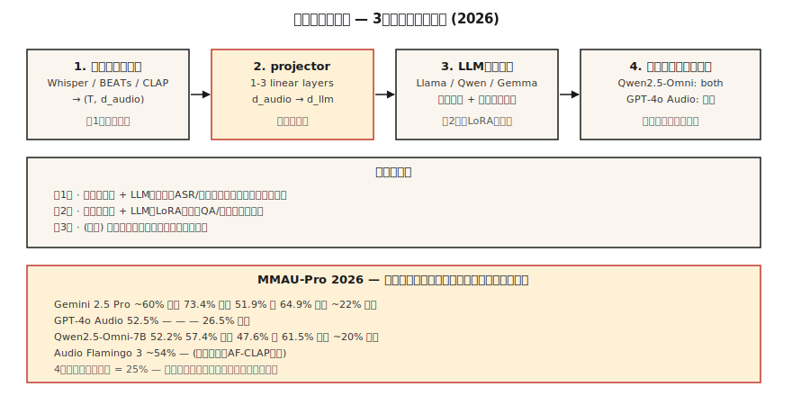

# 音频-语言模型（Audio-Language Models）——Qwen2.5-Omni、Audio Flamingo、GPT-4o Audio

> 译注：本文译自同目录 [`en.md`](./en.md)。术语遵循仓根 [TRANSLATION_GUIDE.md](../../../../TRANSLATION_GUIDE.md)。

> 2026 年的音频-语言模型已经能在语音 + 环境声 + 音乐之上做推理。Qwen2.5-Omni-7B 在 MMAU-Pro 上追平 GPT-4o Audio。Audio Flamingo Next 在 LongAudioBench 上压过 Gemini 2.5 Pro。开源与闭源之间的差距基本被抹平——除了多音频任务，那一栏所有人都接近随机。

**Type:** Learn
**Languages:** Python
**Prerequisites:** Phase 6 · 04 (ASR), Phase 12 · 03 (Vision-Language Models), Phase 7 · 10 (Audio Transformers)
**Time:** ~45 minutes

## 问题（The Problem）

你拿到 5 秒音频：狗在叫、有人喊「stop!」，然后是寂静。围绕这段音频可以问的问题横跨多个维度：

- **转写（Transcription）。**「说了什么？」——这是 ASR 的地盘。
- **语义推理。**「这个人是不是有危险？」——需要把狗叫 + 喊声 + 寂静合在一起理解。
- **音乐推理。**「主旋律由哪些乐器演奏？」
- **长音频检索。**「这段 90 分钟的讲座里，老师是在哪一段讲梯度下降的？」

一个模型用一条 prompt 把上面这些问题全部答出来，那它就是 **音频-语言模型**（audio-language model，LALM / ALM）。它跟纯 ASR 不同：LALM 输出的是自由格式的自然语言回答，而不仅仅是转写文本。

## 概念（The Concept）



### 三件套模板（The three-component template）

每个 2026 年的 LALM 都长着同一副骨架：

1. **音频 encoder。** Whisper encoder · BEATs · CLAP · WavLM，或者每个模型自己的定制 encoder。
2. **Projector。** 线性层或 MLP，把音频 encoder 的特征桥接到 LLM 的 token embedding 空间。
3. **LLM。** 基于 Llama / Qwen / Gemma 的 decoder。它吃交错的 text + audio token，吐 text。

训练流程：

- **Stage 1。** 冻结 encoder + LLM；只在 ASR / 字幕数据上训 projector。
- **Stage 2。** 在指令跟随式音频任务（QA、推理、音乐理解）上做完整微调或 LoRA 微调。
- **Stage 3（可选）。** 语音输入 / 语音输出再加一个 speech decoder。Qwen2.5-Omni 和 AF3-Chat 走的就是这一步。

### 2026 年模型地图（The 2026 model map）

| 模型 | Backbone | 音频 encoder | 输出模态 | 获取方式 |
|-------|----------|---------------|-----------------|--------|
| Qwen2.5-Omni-7B | Qwen2.5-7B | 自研 + Whisper | text + speech | Apache-2.0 |
| Qwen3-Omni | Qwen3 | 自研 | text + speech | Apache-2.0 |
| Audio Flamingo 3 | Qwen2 | AF-CLAP | text | NVIDIA 非商用 |
| Audio Flamingo Next | Qwen2 | AF-CLAP v2 | text | NVIDIA 非商用 |
| SALMONN | Vicuna | Whisper + BEATs | text | Apache-2.0 |
| LTU / LTU-AS | Llama | CAV-MAE | text | Apache-2.0 |
| GAMA | Llama | AST + Q-Former | text | Apache-2.0 |
| Gemini 2.5 Flash/Pro（闭源） | Gemini | 私有 | text + speech | API |
| GPT-4o Audio（闭源） | GPT-4o | 私有 | text + speech | API |

### 基准现实检查（Benchmark reality check, 2026）

**MMAU-Pro。** 1800 个 QA 对，覆盖语音 / 声音 / 音乐 / 混合，包含一个多音频子集。

| 模型 | 总分 | 语音 | 声音 | 音乐 | 多音频 |
|-------|---------|--------|-------|-------|-------------|
| Gemini 2.5 Pro | ~60% | 73.4% | 51.9% | 64.9% | ~22% |
| Gemini 2.5 Flash | ~57% | 73.4% | 50.5% | 64.9% | 21.2% |
| GPT-4o Audio | 52.5% | — | — | — | 26.5% |
| Qwen2.5-Omni-7B | 52.2% | 57.4% | 47.6% | 61.5% | ~20% |
| Audio Flamingo 3 | ~54% | — | — | — | — |
| Audio Flamingo Next | LongAudioBench SOTA | — | — | — | — |

**多音频那一列对所有人都是判决书。** 4 选 1 的随机概率是 25%，而大多数模型就在那个数附近徘徊。LALM 现在还不太会比较两段音频。

### 2026 年 LALM 真正有用的场景（Where LALMs are useful in 2026）

- **呼叫中心录音的合规审计。**「客服有没有念出必须念的免责声明？」
- **无障碍。** 给聋人用户描述声音事件（不只是转写文本）。
- **内容审核。** 同时识别暴力言论 + 威胁性语调 + 背景上下文。
- **播客 / 会议自动分章。** 语义层面的总结，而不只是说话人切换。
- **音乐曲库分析。**「找出所有在 B 段有转调的曲子。」

### LALM 还（暂时）不好用的场景（Where they are NOT (yet) useful）

- 细粒度乐理（比和弦更细的层面）。
- 长对话里带说话人归属的推理（超过 10 分钟性能就掉）。
- 多音频比较（22-26% 比随机略高一点）。
- 实时流式推理（绝大多数还是离线批处理 inference）。

## 动手实现（Build It）

### Step 1：调用 Qwen2.5-Omni（query Qwen2.5-Omni）

```python
from transformers import AutoModelForCausalLM, AutoProcessor

processor = AutoProcessor.from_pretrained("Qwen/Qwen2.5-Omni-7B")
model = AutoModelForCausalLM.from_pretrained("Qwen/Qwen2.5-Omni-7B", torch_dtype="auto")

audio, sr = load_wav("clip.wav", sr=16000)
messages = [{
    "role": "user",
    "content": [
        {"type": "audio", "audio": audio},
        {"type": "text", "text": "What sounds do you hear, and what's happening?"},
    ],
}]
inputs = processor.apply_chat_template(messages, tokenize=True, return_tensors="pt")
output = model.generate(**inputs, max_new_tokens=200)
print(processor.decode(output[0], skip_special_tokens=True))
```

### Step 2：projector 模式（the projector pattern）

```python
import torch.nn as nn

class AudioProjector(nn.Module):
    def __init__(self, audio_dim=1280, llm_dim=4096):
        super().__init__()
        self.down = nn.Linear(audio_dim, llm_dim)
        self.act = nn.GELU()
        self.up = nn.Linear(llm_dim, llm_dim)

    def forward(self, audio_features):
        return self.up(self.act(self.down(audio_features)))
```

就这么点代码。projector 一般也就 1-3 层线性层。在 ASR pair（音频 → 转写）上预训它，正是 Stage-1 的 pretext 任务。

### Step 3：跑 MMAU / LongAudioBench（benchmarking MMAU / LongAudioBench）

```python
from datasets import load_dataset
mmau = load_dataset("MMAU/MMAU-Pro")

correct = 0
for item in mmau["test"]:
    answer = call_model(item["audio"], item["question"], item["choices"])
    if answer == item["correct_choice"]:
        correct += 1
print(f"Accuracy: {correct / len(mmau['test']):.3f}")
```

各类别（speech / sound / music / multi-audio）要分开报。一个聚合数字会把模型真正翻车的地方藏起来。

## 用起来（Use It）

| 任务 | 2026 年的选择 |
|------|-----------|
| 自由格式音频 QA（开源） | Qwen2.5-Omni-7B |
| 长音频上的最佳开源 | Audio Flamingo Next |
| 最佳闭源 | Gemini 2.5 Pro |
| 语音输入 / 语音输出 agent | Qwen2.5-Omni 或 GPT-4o Audio |
| 音乐推理 | Audio Flamingo 3 或 2（音乐特化的 AF-CLAP） |
| 呼叫中心审计 | Gemini 2.5 Pro 走 API，对你的政策文档套一层 RAG |

## 坑（Pitfalls）

- **多音频上别太信它。** 如果任务是「哪段录音里有 X」，那「随机水平」就是它真实的水平。
- **长音频会掉链子。** 超过 10 分钟，大多数模型的说话人归属就崩了。先做 diarization（见 Lesson 6），再让它总结。
- **静音段会幻觉。** 这是 Whisper 自带的毛病，凡是用 Whisper encoder 的 LALM 都继承下来了。前面挂 VAD 拦一下。
- **基准成绩挑樱桃。** 厂商博客只挑自己赢的类别报。你自己跑一遍 MMAU-Pro 的多音频子集。

## 上线部署（Ship It）

把成品存为 `outputs/skill-alm-picker.md`。给一个音频理解任务，挑出 LALM + 基准子集 + 输出模态（text 还是 speech）的组合。

## 练习（Exercises）

1. **Easy。** 跑 `code/main.py`，看一个玩具版的 projector 模式 + 假 LALM 把 (audio-embedding, text-tokens) 路由到输出 token。
2. **Medium。** 在 100 条 MMAU-Pro 语音题上给 Qwen2.5-Omni-7B 打分。和论文报的数字对比。
3. **Hard。** 搭一个最小化的音频字幕 baseline：BEATs encoder + 2 层 projector + 冻结的 Llama-3.2-1B。只在 AudioCaps 上微调 projector。再到 Clotho-AQA 上对比 SALMONN。

## 关键术语（Key Terms）

| 术语 | 大家怎么说 | 它真正的意思 |
|------|-----------------|-----------------------|
| LALM | 音频版 ChatGPT | 音频 encoder + projector + LLM decoder。 |
| Projector | 适配器 | 小 MLP，把音频特征映射到 LLM 的 embedding 空间。 |
| MMAU | 那个基准 | 1 万条音频 QA，覆盖语音、声音、音乐。 |
| MMAU-Pro | 更难的 MMAU | 1800 题多音频 / 重推理的题目。 |
| LongAudioBench | 长音频评测 | 几分钟级别的片段配语义类查询。 |
| Voice-in / voice-out | 语音原生 | 模型直接吃语音、吐语音，不绕道文字。 |

## 延伸阅读（Further Reading）

- [Chu et al. (2024). Qwen2-Audio](https://arxiv.org/abs/2407.10759) — 参考架构。
- [Alibaba (2025). Qwen2.5-Omni](https://huggingface.co/Qwen/Qwen2.5-Omni-7B) — 语音进语音出。
- [NVIDIA (2025). Audio Flamingo 3](https://arxiv.org/abs/2507.08128) — 开源长音频领跑者。
- [NVIDIA (2026). Audio Flamingo Next](https://arxiv.org/abs/2604.10905) — LongAudioBench SOTA。
- [Tang et al. (2023). SALMONN](https://arxiv.org/abs/2310.13289) — 双 encoder 流派的开山。
- [MMAU-Pro leaderboard](https://mmaubenchmark.github.io/) — 2026 年实时榜单。
