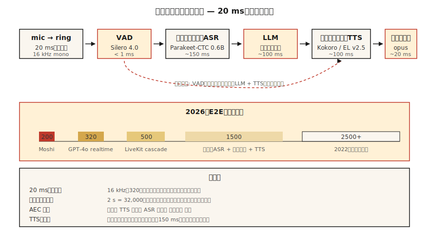

# 实时音频处理

> 批量管线处理一个文件。实时管线则在下一个20毫秒数据到达之前处理当前20毫秒。每个对话式AI、广播演播室和电话机器人，都取决于这个延迟预算。

**类型：** 构建  
**语言：** Python, Rust  
**前置条件：** 阶段6 · 02（语谱图），阶段6 · 04（自动语音识别），阶段6 · 07（文本转语音）  
**时间：** 约75分钟

## 问题

你希望得到一个感觉有生命力的语音助手。人类对话轮转延迟约为230毫秒（从静默到回应）。超过500毫秒就会感觉机械；超过1500毫秒则感觉故障。2026年，完整的“听→理解→回应→说话”循环的预算如下：

| 阶段 | 预算 |
|------|------|
| 麦克风 → 缓冲区 | 20 毫秒 |
| 语音活动检测 | 10 毫秒 |
| 流式自动语音识别 | 150 毫秒 |
| 大语言模型（首个Token） | 100 毫秒 |
| 文本转语音（首个数据块） | 100 毫秒 |
| 渲染 → 扬声器 | 20 毫秒 |
| **总计** | **~400 毫秒** |

Moshi（Kyutai，2024）实现了200毫秒的全双工。GPT-4o-realtime（2024）约为320毫秒。2022年的级联管线则需要2500毫秒。这10倍的改进来自三种技术：（1）处处流式化，（2）使用部分结果的异步流水线，（3）可中断生成。

## 概念



**帧（Frame）/ 块（Chunk）/ 窗口（Window）**：实时音频以固定大小的块流动。常见选择：20毫秒（16 kHz下320个采样）。下游所有环节必须跟上这个节奏。

**环形缓冲区（Ring Buffer）**：固定大小的循环缓冲区。生产者线程写入新帧，消费者线程读取。避免热路径上的内存分配。大小 ≈ 最大延迟 × 采样率；2秒16 kHz的环形缓冲区 = 32,000个采样。

**语音活动检测（VAD, Voice Activity Detection）**：当无人说话时，门控下游工作。Silero VAD 4.0（2024）在CPU上每个30毫秒帧运行<1毫秒。`webrtcvad`是较旧的替代方案。

**流式自动语音识别（Streaming ASR）**：音频到达时即可输出部分转录文本的模型。Parakeet-CTC-0.6B的流式模式（NeMo，2024）在320毫秒延迟下实现了2-5%的词错误率。Whisper-Streaming（Macháček et al.，2023）对Whisper进行分块以实现近流式，延迟约2秒。

**中断（Interruption）**：当用户在助手说话时说话，你必须（a）检测到插话（barge-in），（b）停止文本转语音，（c）丢弃剩余的大语言模型输出。所有操作需在100毫秒内完成，否则用户会感觉助手“耳聋”。

**WebRTC Opus传输**：20毫秒帧，48 kHz，自适应比特率8–128 kbps。浏览器和移动端的标准。LiveKit、Daily.co、Pion是2026年构建语音应用的技术栈。

**抖动缓冲区（Jitter Buffer）**：网络数据包可能乱序/延迟到达。抖动缓冲区重新排序并平滑；太小→可听到的间隙，太大→延迟。典型值为60–80毫秒。

### 常见陷阱

- **线程争用（Thread contention）**：Python的全局解释器锁（GIL）加上重型模型可能导致音频线程资源匮乏。使用C回调的音频库（sounddevice, PortAudio）并将Python代码排除在热路径之外。
- **采样率转换延迟（Sample-rate conversion latency）**：管线内部的重采样会增加5–20毫秒延迟。要么预先重采样，要么使用零延迟重采样器（PolyPhase, `soxr_hq`）。
- **文本转语音预加热（TTS priming）**：即使是像Kokoro这样快速的文本转语音模型，首次请求也有100–200毫秒的预热时间。在第一次真实对话前缓存模型并使用虚拟运行预热。
- **回声消除（Echo cancellation）**：没有回声消除（AEC），文本转语音输出会再次进入麦克风，触发对机器人自身语音的自动语音识别。WebRTC AEC3是开源的默认方案。

## 构建

### 第一步：环形缓冲区

```python
import collections

class RingBuffer:
    def __init__(self, capacity):
        self.buf = collections.deque(maxlen=capacity)
    def write(self, frame):
        self.buf.extend(frame)
    def read(self, n):
        return [self.buf.popleft() for _ in range(min(n, len(self.buf)))]
    def level(self):
        return len(self.buf)
```

容量决定了最大缓冲延迟。32,000个采样（16 kHz）等于2秒。

### 第二步：语音活动检测门

```python
def simple_energy_vad(frame, threshold=0.01):
    return sum(x * x for x in frame) / len(frame) > threshold ** 2
```

生产环境中替换为Silero VAD：

```python
import torch
vad, _ = torch.hub.load("snakers4/silero-vad", "silero_vad")
is_speech = vad(torch.tensor(frame), 16000).item() > 0.5
```

### 第三步：流式自动语音识别

```python
# Parakeet-CTC-0.6B 通过 NeMo 流式处理
from nemo.collections.asr.models import EncDecCTCModelBPE
asr = EncDecCTCModelBPE.from_pretrained("nvidia/parakeet-ctc-0.6b")
# chunk_ms=320 ms, look_ahead_ms=80 ms
for chunk in audio_stream():
    partial_text = asr.transcribe_streaming(chunk)
    print(partial_text, end="\r")
```

### 第四步：中断处理器

```python
class Dialog:
    def __init__(self):
        self.tts_task = None

    def on_user_speech(self, frame):
        if self.tts_task and not self.tts_task.done():
            self.tts_task.cancel()   # 插话（barge-in）
        # 然后送入流式自动语音识别

    def on_final_user_utterance(self, text):
        self.tts_task = asyncio.create_task(self.reply(text))

    async def reply(self, text):
        async for tts_chunk in llm_then_tts(text):
            speaker.write(tts_chunk)
```

依赖于异步I/O和可取消的文本转语音流。WebRTC中停止音频轨道的规范方法是调用`peerconnection.stop()`。

## 使用

2026年技术栈：

| 层级 | 选择 |
|------|------|
| 传输 | LiveKit（WebRTC）或 Pion（Go） |
| 语音活动检测 | Silero VAD 4.0 |
| 流式自动语音识别 | Parakeet-CTC-0.6B 或 Whisper-Streaming |
| 大语言模型（首个Token） | Groq, Cerebras, vLLM-streaming |
| 流式文本转语音 | Kokoro 或 ElevenLabs Turbo v2.5 |
| 回声消除 | WebRTC AEC3 |
| 端到端原生 | OpenAI Realtime API 或 Moshi |

## 陷阱

- **为了安全缓冲500毫秒**：缓冲区本身就是你的延迟下限。缩小它。
- **未绑定线程**：音频回调运行在优先级低于UI的线程上，负载下会出现卡顿。
- **文本转语音块太小**：低于200毫秒的块会使声码器伪影可听。320毫秒块是最佳点。
- **没有抖动缓冲区**：真实网络具有抖动，没有平滑就会出现爆音。
- **单次错误处理**：音频管线必须防崩溃。一个异常就会导致会话结束。

## 发布

保存为 `outputs/skill-realtime-designer.md`。设计一个实时音频管线，包含每个阶段的具体延迟预算。

## 练习

1. **简单**：运行 `code/main.py`。模拟环形缓冲区 + 能量语音活动检测；为一个模拟的10秒流打印各阶段延迟。
2. **中等**：使用 `sounddevice`，构建一个直通循环，以20毫秒帧处理麦克风输入，并在每帧打印语音活动检测状态。
3. **困难**：使用 `aiortc` 构建一个全双工回声测试：浏览器 → WebRTC → Python → WebRTC → 浏览器。用1 kHz脉冲测量端到端（玻璃到玻璃）延迟。

## 关键术语

| 术语 | 人们说的 | 实际含义 |
|------|---------|----------|
| 环形缓冲区 | 循环队列 | 固定大小、无锁（或单生产者单消费者加锁）的先进先出（FIFO）音频帧缓冲区。 |
| 语音活动检测 | 静默门 | 标记语音与非语音的模型或启发式规则。 |
| 流式自动语音识别 | 实时语音转文字 | 音频到达时即输出部分文本；有限前瞻。 |
| 抖动缓冲区 | 网络平滑器 | 对乱序数据包重新排序的队列；典型值60–80毫秒。 |
| 回声消除 | 回声消除 | 减去扬声器到麦克风的反馈路径。 |
| 插话 | 用户中断 | 系统在文本转语音播放中间检测到用户语音；必须取消播放。 |
| 全双工 | 同时双向 | 用户和机器人可以同时说话；Moshi是全双工的。 |

## 延伸阅读

- [Macháček et al. (2023). Whisper-Streaming](https://arxiv.org/abs/2307.14743) — 分块的近流式Whisper。
- [Kyutai (2024). Moshi](https://kyutai.org/Moshi.pdf) — 全双工200毫秒延迟。
- [LiveKit Agents 框架 (2024)](https://docs.livekit.io/agents/) — 生产级音频智能体编排。
- [Silero VAD 仓库](https://github.com/snakers4/silero-vad) — 亚1毫秒VAD，Apache 2.0协议。
- [WebRTC AEC3 论文](https://webrtc.googlesource.com/src/+/main/modules/audio_processing/aec3/) — 开源回声消除。