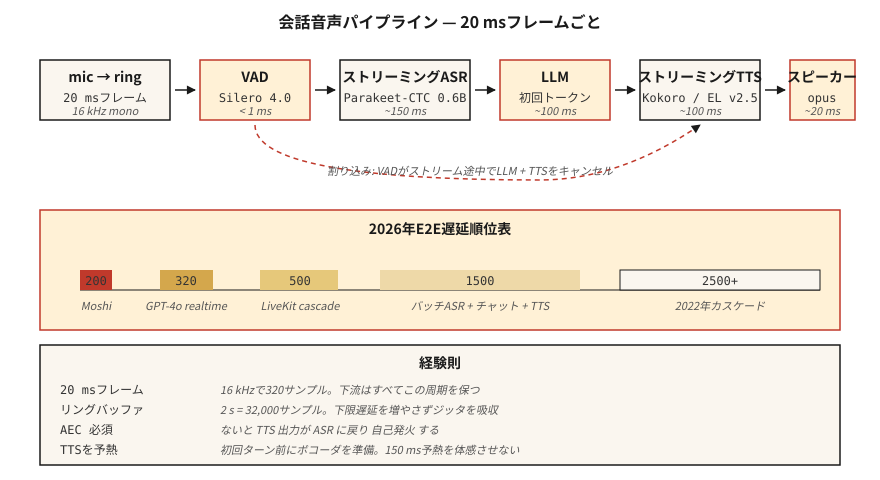

# 实时音频处理

> 批量流水线处理文件。实时流水线处理接下来的 20 毫秒——在接下来的 20 毫秒到达之前完成。每个对话式 AI、广播站和电话机器人的成败都取决于这个延迟预算。

**类型：** 动手构建
**语言：** Python
**前置知识：** 阶段 6 · 02（频谱图），阶段 6 · 04（ASR），阶段 6 · 07（TTS）
**时间：** ~75 分钟

## 问题

你想要一个感觉真实的语音助手。人类对话的轮转延迟约为 230 ms（静默到响应）。超过 500 ms 感觉像机器人；超过 1500 ms 感觉像坏了。2026 年完整的**听到 → 理解 → 响应 → 说话**循环的预算如下：

| 阶段 | 预算 |
|-------|--------|
| 麦克风 → 缓冲区 | 20 ms |
| VAD | 10 ms |
| ASR（流式） | 150 ms |
| LLM（首个 token） | 100 ms |
| TTS（首个块） | 100 ms |
| 渲染 → 扬声器 | 20 ms |
| **总计** | **~400 ms** |

Moshi（Kyutai，2024）实现了 200 ms 全双工。GPT-4o-realtime（2024）约为 320 ms。2022 年的级联流水线延迟为 2500 ms。10 倍改进来自三种技术：(1) 处处流式处理，(2) 带部分结果的异步流水线，(3) 可中断生成。

## 概念



**帧 / 块 / 窗口。** 实时音频以固定大小的块流动。常见选择：20 ms（16 kHz 下 320 个样本）。下游所有部分必须跟上这个节奏。

**环形缓冲区（Ring buffer）。** 固定大小的循环缓冲区。生产者线程写入新帧，消费者线程读取。防止热路径上的内存分配。大小 ≥ 最大延迟 × 采样率；2 秒 16 kHz 环形缓冲区 = 32,000 个样本。

**VAD（语音活动检测）。** 在无人说话时门控下游工作。Silero VAD 4.0（2024）在 CPU 上每 30 ms 帧运行 <1 ms。`webrtcvad` 是较旧的选择。

**流式 ASR。** 在音频到达时发出部分转录的模型。Parakeet-CTC-0.6B 在流式模式（NeMo，2024）下以 320 ms 延迟实现 2–3% WER。Whisper-Streaming（Macháček 等，2023）对 Whisper 进行分块，实现约 2 秒延迟的近流式处理。

**中断（Interruption）。** 当助手说话时用户同时说话，你必须 (a) 检测闯入（barge-in），(b) 停止 TTS，(c) 丢弃剩余的 LLM 输出。全部在 100 ms 内完成，否则用户会感觉助手失聪。

**WebRTC Opus 传输。** 20 ms 帧，48 kHz，自适应比特率 8–128 kbps。浏览器和移动端标准。LiveKit、Daily.co、Pion 是 2026 年构建语音应用的技术栈。

**抖动缓冲区（Jitter buffer）。** 网络数据包可能乱序/延迟到达。抖动缓冲区重新排序和平滑；太小 → 可听间隙，太大 → 延迟。通常 60–100 ms。

### 常见陷阱

- **线程竞争。** Python 的 GIL + 重型模型可能使音频线程饥饿。使用 C 回调音频库（sounddevice、PortAudio）并让 Python 远离热路径。
- **采样率转换延迟。** 流水线内部重采样增加 5–10 ms。要么提前重采样，要么使用零延迟重采样器（PolyPhase、`soxr_hq`）。
- **TTS 预热。** 即使是像 Kokoro 这样的快速 TTS，首次请求也有 100–200 ms 的预热时间。缓存模型并在第一次真实轮次前用虚拟运行预热。
- **回声消除。** 没有 AEC，TTS 输出会重新进入麦克风，触发 ASR 识别到机器人自己的声音。WebRTC AEC3 是开源的默认方案。

```figure
nyquist-aliasing
```

## 动手实现

### 第 1 步：环形缓冲区

```python
import collections

class RingBuffer:
    def __init__(self, capacity):
        self.buf = collections.deque(maxlen=capacity)
    def write(self, frame):
        self.buf.extend(frame)
    def read(self, n):
        return [self.buf.popleft() for _ in range(min(n, len(self.buf)))]
    def level(self):
        return len(self.buf)
```

容量决定最大缓冲延迟。16 kHz 下 32,000 个样本 = 2 秒。

### 第 2 步：VAD 门控

```python
def simple_energy_vad(frame, threshold=0.01):
    return sum(x * x for x in frame) / len(frame) > threshold ** 2
```

生产环境中替换为 Silero VAD：

```python
import torch
vad, _ = torch.hub.load("snakers4/silero-vad", "silero_vad")
is_speech = vad(torch.tensor(frame), 16000).item() > 0.5
```

### 第 3 步：流式 ASR

```python
# Parakeet-CTC-0.6B 通过 NeMo 流式处理
from nemo.collections.asr.models import EncDecCTCModelBPE
asr = EncDecCTCModelBPE.from_pretrained("nvidia/parakeet-ctc-0.6b")
# chunk_ms=320 ms, look_ahead_ms=80 ms
for chunk in audio_stream():
    partial_text = asr.transcribe_streaming(chunk)
    print(partial_text, end="\r")
```

### 第 4 步：中断处理器

```python
class Dialog:
    def __init__(self):
        self.tts_task = None

    def on_user_speech(self, frame):
        if self.tts_task and not self.tts_task.done():
            self.tts_task.cancel()   # barge-in
        # then feed to streaming ASR

    def on_final_user_utterance(self, text):
        self.tts_task = asyncio.create_task(self.reply(text))

    async def reply(self, text):
        async for tts_chunk in llm_then_tts(text):
            speaker.write(tts_chunk)
```

依赖于异步 I/O 和可取消的 TTS 流。在音频轨道上调用 WebRTC peerconnection.stop() 是标准方法。

## 使用建议

2026 年技术栈：

| 层 | 选择 |
|-------|------|
| 传输 | LiveKit（WebRTC）或 Pion（Go） |
| VAD | Silero VAD 4.0 |
| 流式 ASR | Parakeet-CTC-0.6B 或 Whisper-Streaming |
| LLM 首个 token | Groq、Cerebras、vLLM-streaming |
| 流式 TTS | Kokoro 或 ElevenLabs Turbo v2.5 |
| 回声消除 | WebRTC AEC3 |
| 端到端原生 | OpenAI Realtime API 或 Moshi |

## 常见陷阱

- **为保险缓冲 500 ms。** 缓冲区*就是*你的延迟下限。缩小它。
- **未固定线程。** 音频回调在优先级低于 UI 的线程上 = 负载下出现卡顿。
- **TTS 块太小。** 低于 200 ms 的块使声码器伪影可听。320 ms 块是最佳点。
- **无抖动缓冲区。** 真实网络有抖动；没有平滑会出现爆音。
- **单次错误处理。** 音频流水线必须防崩溃。一个异常就能杀死整个会话。

## 交付物

保存为 `outputs/skill-realtime-designer.md`。设计一个实时音频流水线，为每个阶段制定具体的延迟预算。

## 练习

1. **简单。** 运行 `code/main.py`。模拟环形缓冲区 + 能量 VAD；为模拟的 10 秒流打印各阶段延迟。
2. **中等。** 使用 `sounddevice`，构建一个直通循环，以 20 ms 帧处理你的麦克风输入，并在每帧打印 VAD 状态。
3. **困难。** 使用 `aiortc` 构建全双工回声测试：浏览器 → WebRTC → Python → WebRTC → 浏览器。用 1 kHz 脉冲测量端到端延迟。

## 关键词汇

| 术语 | 通常说法 | 实际含义 |
|------|-----------------|-----------------------|
| Ring buffer（环形缓冲区） | 循环队列 | 固定大小、无锁（或 SPSC 锁）的音频帧 FIFO。 |
| VAD | 静默门控 | 标记语音 vs 非语音的模型或启发式方法。 |
| Streaming ASR（流式 ASR） | 实时语音转文字 | 在音频到达时发出部分文本；有限预读。 |
| Jitter buffer（抖动缓冲区） | 网络平滑器 | 对乱序数据包重新排序的队列；通常 60–100 ms。 |
| AEC | 回声消除 | 减去扬声器到麦克风的反馈路径。 |
| Barge-in（闯入） | 用户打断 | 系统在 TTS 播放中检测到用户语音；必须取消播放。 |
| Full duplex（全双工） | 同时双向 | 用户和机器人可以同时说话；Moshi 是全双工。 |

## 延伸阅读

- [Macháček et al. (2023). Whisper-Streaming](https://arxiv.org/abs/2307.14743)——分块近流式 Whisper。
- [Kyutai (2024). Moshi](https://kyutai.org/Moshi.pdf)——全双工 200 ms 延迟。
- [LiveKit Agents framework (2024)](https://docs.livekit.io/agents/)——生产级音频代理编排。
- [Silero VAD repo](https://github.com/snakers4/silero-vad)——亚 1 ms VAD，Apache 2.0。
- [WebRTC AEC3 paper](https://webrtc.googlesource.com/src/+/main/modules/audio_processing/aec3/)——开源回声消除。
