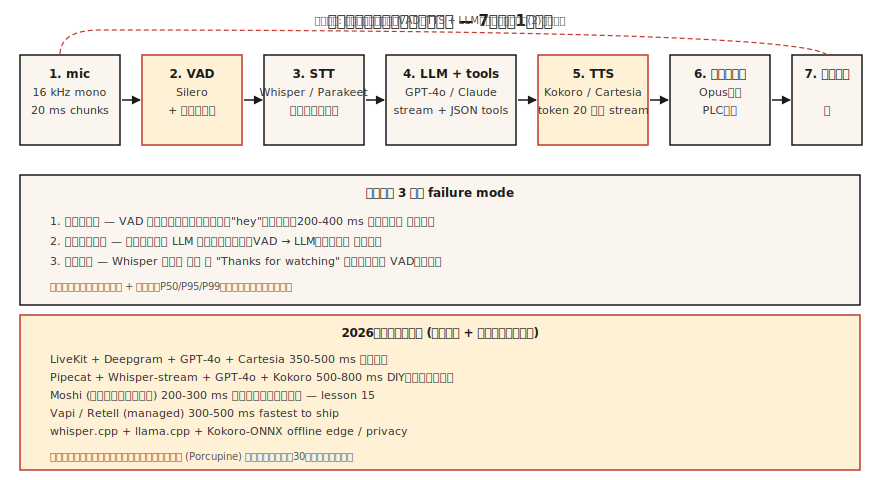

# 搭建语音助手 pipeline —— Phase 6 期末项目

> 译注：本文译自同目录 [`en.md`](./en.md)。术语遵循仓根 [TRANSLATION_GUIDE.md](../../../../TRANSLATION_GUIDE.md)。

> 把第 01-11 课的所有内容缝合在一起。做一个能听、能想、能开口回话的语音助手。在 2026 年，这已经是一个工程问题，而不是研究问题——但能不能上线，取决于集成层面的细节。

**Type:** Build
**Languages:** Python
**Prerequisites:** Phase 6 · 04, 05, 06, 07, 11; Phase 11 · 09 (Function Calling); Phase 14 · 01 (Agent Loop)
**Time:** ~120 minutes

## 问题（The Problem）

搭一个端到端的助手：

1. 采集麦克风输入（16 kHz 单声道）。
2. 检测用户语音的起止。
3. 流式转写。
4. 把 transcript 交给一个能调用工具（计时器、天气、日历）的 LLM。
5. 把 LLM 的文本流给 TTS。
6. 把音频回放给用户。
7. 如果用户在助手说话过程中打断，立即停止。

延迟目标：在笔记本 CPU 上，用户说完话后 800 ms 内吐出第一个 TTS 音频字节。质量目标：不漏字，不在静音上出现 hallucination（幻觉）字幕，不泄露 voice cloning 声纹，不被 prompt 注入攻破。

## 概念（The Concept）



### 七个组件（The seven components）

1. **音频采集（Audio capture）。** Mic → 16 kHz 单声道 → 20 ms 切片。Python 里通常用 `sounddevice`，生产环境则用原生的 AudioUnit/ALSA/WASAPI。
2. **VAD（Lesson 11）。** Silero VAD，阈值 0.5，最小语音 250 ms，静音挂尾 500 ms。给出"开始"和"结束"信号。
3. **流式 STT（Lesson 4-5）。** Whisper-streaming、Parakeet-TDT，或 Deepgram Nova-3（API）。返回 partial + final transcript。
4. **能调用工具的 LLM。** GPT-4o / Claude 3.5 / Gemini 2.5 Flash。工具用 JSON schema 描述。流式吐 token。
5. **流式 TTS（Lesson 7）。** Kokoro-82M（开源里最快）或 Cartesia Sonic（商用）。等 LLM 吐出 20 个 token 后再启动 TTS。
6. **回放（Playback）。** 扬声器输出；低带宽网络下用 opus 编码。
7. **打断处理（Interruption handler）。** 如果 TTS 播放过程中 VAD 触发，立刻停止播放、取消 LLM、重启 STT。

### 你一定会撞上的三种失败模式（The three failure modes you will hit）

1. **首字截断（First-word clip）。** VAD 启动慢了一拍，用户的"hey"被吞掉。把启动阈值调到 0.3，不是 0.5。
2. **打断时的混乱（Mid-response interrupt confusion）。** 用户已经打断了，LLM 还在生成；助手在用户头上叽里呱啦。把 VAD → cancel-LLM 接好。
3. **静音 hallucination。** Whisper 在静音热身帧上吐出"Thanks for watching"。永远先经 VAD 闸门。

### 2026 年生产参考栈（2026 production reference stacks）

| Stack | Latency | License | Notes |
|-------|---------|---------|-------|
| LiveKit + Deepgram + GPT-4o + Cartesia | 350-500 ms | commercial API | 2026 行业默认 |
| Pipecat + Whisper-streaming + GPT-4o + Kokoro | 500-800 ms | mostly open | 适合 DIY |
| Moshi (full-duplex) | 200-300 ms | CC-BY 4.0 | 单模型；架构不同，见 lesson 15 |
| Vapi / Retell (managed) | 300-500 ms | commercial | 上线最快；定制空间小 |
| Whisper.cpp + llama.cpp + Kokoro-ONNX | offline | open | 隐私 / 边缘 |

## 动手实现（Build It）

### Step 1：带切片的麦克风采集（伪代码）

```python
import sounddevice as sd

def mic_stream(chunk_ms=20, sr=16000):
    q = queue.Queue()
    def cb(indata, frames, time, status):
        q.put(indata.copy().flatten())
    with sd.InputStream(channels=1, samplerate=sr, blocksize=int(sr * chunk_ms/1000), callback=cb):
        while True:
            yield q.get()
```

### Step 2：VAD 闸门下的 turn 采集

```python
def capture_turn(stream, vad, pre_roll_ms=300, silence_ms=500):
    buf, pre, triggered = [], collections.deque(maxlen=pre_roll_ms // 20), False
    silent = 0
    for chunk in stream:
        pre.append(chunk)
        if vad(chunk):
            if not triggered:
                buf = list(pre)
                triggered = True
            buf.append(chunk)
            silent = 0
        elif triggered:
            silent += 20
            buf.append(chunk)
            if silent >= silence_ms:
                return b"".join(buf)
```

### Step 3：流式 STT → LLM → TTS

```python
async def turn(audio_bytes):
    transcript = await stt.transcribe(audio_bytes)
    async for token in llm.stream(transcript):
        async for audio in tts.stream(token):
            await speaker.play(audio)
```

### Step 4：在 LLM 循环里做 tool call

```python
tools = [
    {"name": "get_weather", "parameters": {"location": "string"}},
    {"name": "set_timer", "parameters": {"seconds": "int"}},
]

async for chunk in llm.stream(user_text, tools=tools):
    if chunk.type == "tool_call":
        result = dispatch(chunk.name, chunk.args)
        continue_streaming(result)
    if chunk.type == "text":
        await tts.stream(chunk.text)
```

### Step 5：打断处理

```python
tts_task = asyncio.create_task(tts_loop())
while True:
    chunk = await mic.get()
    if vad(chunk):
        tts_task.cancel()
        await speaker.stop()
        await new_turn()
        break
```

## 用起来（Use It）

`code/main.py` 里有一个可运行的仿真版本，用 stub 模型把七个组件串起来，没有硬件也能看到 pipeline 形状。要换成真实实现，把 stub 替换为：

- `silero-vad`（`pip install silero-vad`）
- `deepgram-sdk` 或 `openai-whisper`
- `openai`（`gpt-4o`）或 `anthropic`
- `kokoro` 或 `cartesia`
- `sounddevice` 做 I/O

## 坑（Pitfalls）

- **PII 永久日志化。** 整轮的对话音频在大多数司法辖区里都属于 PII。保留 30 天，落盘加密。
- **不支持 barge-in。** 用户一定会打断。你的助手必须能停下来。
- **TTS 阻塞。** 同步 TTS 会卡住事件循环。用 async 或单开线程。
- **没有 tool-call 错误处理。** 工具会挂。LLM 必须能拿回 error 信息 + 重试一次，再优雅降级。
- **过激的 hallucination 过滤器。** 过滤太狠，助手反复说"I can't help with that"；过滤太松，它什么都敢说。在 held-out 集上校准。
- **没有 wake-word（唤醒词）选项。** 永远在听是隐私负担。加一道 wake-word 闸门（Porcupine 或 openWakeWord）。

## 上线部署（Ship It）

存为 `outputs/skill-voice-assistant-architect.md`。给定预算 + 规模 + 语言 + 合规约束，产出一份完整的栈规格说明。

## 练习（Exercises）

1. **Easy。** 跑一遍 `code/main.py`。它用 stub 模块端到端模拟一轮 turn，并打印每一段的延迟。
2. **Medium。** 把 STT stub 换成真正的 Whisper 模型，跑一段事先录好的 `.wav`。测 WER 和端到端延迟。
3. **Hard。** 加上 tool calling：实现 `get_weather`（任何 API）和 `set_timer`。把 LLM 接到工具上，验证当用户说 "set a 5 minute timer" 时，正确的函数被触发，并且语音回复确认了这件事。

## 关键术语（Key Terms）

| Term | 大家怎么叫 | 实际是什么 |
|------|-----------------|-----------------------|
| Turn | 一个用户 + 助手的来回 | 一次 VAD 框定的用户语音 + 一次 LLM-TTS 回应。 |
| Barge-in | 打断 | 用户在助手说话时开口；助手停下。 |
| Wake word | "Hey assistant" | 短关键词检测器；Porcupine、Snowboy、openWakeWord。 |
| End-pointing | 一轮的结束 | VAD + 最小静音的判定，认为用户已经说完了。 |
| Pre-roll | 语音前缓冲 | 在 VAD 触发前留 200-400 ms 音频，避免首字截断。 |
| Tool call | 函数调用 | LLM 吐出 JSON；runtime 派发；结果回灌进循环。 |

## 延伸阅读（Further Reading）

- [LiveKit — voice agent quickstart](https://docs.livekit.io/agents/) — 生产级参考。
- [Pipecat — voice agent examples](https://github.com/pipecat-ai/pipecat) — 适合 DIY 的框架。
- [OpenAI Realtime API](https://platform.openai.com/docs/guides/realtime) — 托管的 voice-native 路线。
- [Kyutai Moshi](https://github.com/kyutai-labs/moshi) — full-duplex 参考实现（Lesson 15）。
- [Porcupine wake-word](https://picovoice.ai/products/porcupine/) — wake-word 闸门。
- [Anthropic — tool use guide](https://docs.anthropic.com/en/docs/build-with-claude/tool-use) — LLM function calling。
