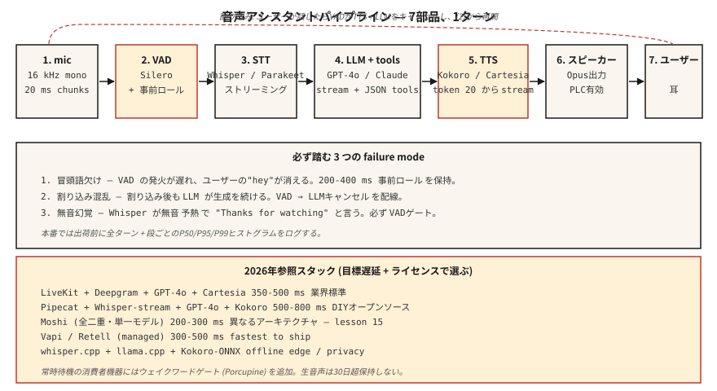

# 构建语音助手流水线——阶段 6 的顶点项目

> 来自第 01-11 课的所有内容，拼合在一起。构建一个能听、能推理、能回话的语音助手。在 2026 年，这是一个已解决的工程问题，而非研究问题——但集成细节决定了它能否真正发布。

**类型：** 动手构建
**语言：** Python
**前置知识：** 阶段 6 · 04、05、06、07、11；阶段 11 · 09（函数调用）；阶段 14 · 01（智能体循环）
**时间：** ~120 分钟

## 问题

构建一个端到端助手：

1. 捕获麦克风输入（16 kHz 单声道）。
2. 检测用户语音的开始/结束。
3. 流式转录。
4. 将转录文本传递给可以调用工具的 LLM（计时器、天气、日历）。
5. 将 LLM 文本流式输入到 TTS。
6. 将音频播放给用户。
7. 如果用户在响应中途打断，则停止。

延迟目标：在笔记本 CPU 上，用户说完话后 800 ms 内输出第一个 TTS 音频字节。质量目标：不错词、静默时不产生幻觉字幕、无语音克隆泄漏、无提示注入成功。

## 概念



### 七个组件

1. **音频捕获。** 麦克风 → 16 kHz 单声道 → 20 ms 块。Python 中通常使用 `sounddevice`，生产环境中使用原生 AudioUnit/ALSA/WASAPI。
2. **VAD（第 11 课）。** Silero VAD @ 阈值 0.5，最小语音 250 ms，静默挂起 500 ms。信号标记"开始"和"结束"。
3. **流式 STT（第 4-5 课）。** Whisper-streaming、Parakeet-TDT 或 Deepgram Nova-3（API）。部分 + 最终转录。
4. **带工具调用的 LLM。** GPT-4o / Claude 3.5 / Gemini 2.5 Flash。工具的 JSON schema。流式 token。
5. **流式 TTS（第 7 课）。** Kokoro-82M（最快开源）或 Cartesia Sonic（商业）。在 20 个 LLM token 后开始 TTS。
6. **播放。** 扬声器输出；低带宽网络时使用 opus 编码。
7. **中断处理器。** 如果在 TTS 播放期间 VAD 触发，停止播放、取消 LLM、重启 STT。

### 你会遇到的三种失败模式

1. **首词被切。** VAD 开始得晚了一拍。用户的"嘿"丢失了。将起始阈值设为 0.3 而非 0.5。
2. **响应中途中断混乱。** 用户打断后 LLM 继续生成；助手与用户同时说话。将 VAD 连接到 cancel-LLM。
3. **静默幻觉。** Whisper 在静默预热帧上输出"Thanks for watching"。始终使用 VAD 门控。

### 2026 年生产参考技术栈

| 技术栈 | 延迟 | 许可 | 说明 |
|-------|---------|---------|-------|
| LiveKit + Deepgram + GPT-4o + Cartesia | 350-500 ms | 商业 API | 2026 年行业默认 |
| Pipecat + Whisper-streaming + GPT-4o + Kokoro | 500-800 ms | 大部分开源 | 适合 DIY |
| Moshi（全双工） | 200-300 ms | CC-BY 4.0 | 单模型；不同架构，见第 15 课 |
| Vapi / Retell（托管） | 300-500 ms | 商业 | 最快上线；定制有限 |
| Whisper.cpp + llama.cpp + Kokoro-ONNX | 离线 | 开源 | 隐私 / 边缘设备 |

## 动手实现

### 第 1 步：带分块的麦克风捕获（伪代码）

```python
import sounddevice as sd

def mic_stream(chunk_ms=20, sr=16000):
    q = queue.Queue()
    def cb(indata, frames, time, status):
        q.put(indata.copy().flatten())
    with sd.InputStream(channels=1, samplerate=sr, blocksize=int(sr * chunk_ms/1000), callback=cb):
        while True:
            yield q.get()
```

### 第 2 步：VAD 门控的轮次捕获

```python
def capture_turn(stream, vad, pre_roll_ms=300, silence_ms=500):
    buf, pre, triggered = [], collections.deque(maxlen=pre_roll_ms // 20), False
    silent = 0
    for chunk in stream:
        pre.append(chunk)
        if vad(chunk):
            if not triggered:
                buf = list(pre)
                triggered = True
            buf.append(chunk)
            silent = 0
        elif triggered:
            silent += 20
            buf.append(chunk)
            if silent >= silence_ms:
                return b"".join(buf)
```

### 第 3 步：流式 STT → LLM → TTS

```python
async def turn(audio_bytes):
    transcript = await stt.transcribe(audio_bytes)
    async for token in llm.stream(transcript):
        async for audio in tts.stream(token):
            await speaker.play(audio)
```

### 第 4 步：LLM 循环中的工具调用

```python
tools = [
    {"name": "get_weather", "parameters": {"location": "string"}},
    {"name": "set_timer", "parameters": {"seconds": "int"}},
]

async for chunk in llm.stream(user_text, tools=tools):
    if chunk.type == "tool_call":
        result = dispatch(chunk.name, chunk.args)
        continue_streaming(result)
    if chunk.type == "text":
        await tts.stream(chunk.text)
```

### 第 5 步：中断处理

```python
tts_task = asyncio.create_task(tts_loop())
while True:
    chunk = await mic.get()
    if vad(chunk):
        tts_task.cancel()
        await speaker.stop()
        await new_turn()
        break
```

## 使用建议

参见 `code/main.py`，其中包含一个可运行的模拟，用桩模型连接所有七个组件，让你即使没有硬件也能看到流水线的形状。对于真实实现，将桩替换为：

- `silero-vad`（`pip install silero-vad`）
- `deepgram-sdk` 或 `openai-whisper`
- `openai`（`gpt-4o`）或 `anthropic`
- `kokoro` 或 `cartesia`
- `sounddevice` 用于 I/O

## 常见陷阱

- **永久记录 PII。** 完整轮次音频在大多数司法管辖区属于 PII。30 天保留期，静态加密。
- **没有闯入功能。** 用户会打断。你的助手必须能停止说话。
- **阻塞的 TTS。** 同步 TTS 会阻塞事件循环。使用异步或单独的线程。
- **没有工具调用错误处理。** 工具会失败。LLM 必须获取错误并重试一次，然后优雅降级。
- **过度激进的幻觉过滤器。** 过度过滤会让助手不断重复"我无法帮助你"。过滤不足则什么都敢说。在留出集上校准。
- **没有唤醒词选项。** 始终监听是隐私负担。添加唤醒词门控（Porcupine 或 openWakeWord）。

## 交付物

保存为 `outputs/skill-voice-assistant-architect.md`。在预算 + 规模 + 语言 + 合规约束下，提供完整的技术栈规格说明。

## 练习

1. **简单。** 运行 `code/main.py`。它用桩模块模拟一个完整的端到端轮次，并打印每个阶段的延迟。
2. **中等。** 将 STT 桩替换为预录制 `.wav` 上的真实 Whisper 模型。测量 WER 和端到端延迟。
3. **困难。** 添加工具调用：实现 `get_weather`（任意 API）和 `set_timer`。让 LLM 通过工具路由，并验证当用户说"设置一个 5 分钟计时器"时，正确的函数被触发，语音回复确认了操作。

## 关键词汇

| 术语 | 通常说法 | 实际含义 |
|------|-----------------|-----------------------|
| Turn（轮次） | 用户 + 助手的往返 | 一次 VAD 界定的用户语音 + 一次 LLM-TTS 响应。 |
| Barge-in（闯入） | 打断 | 用户与助手同时说话；助手停止说话。 |
| Wake word（唤醒词） | "嘿助手" | 短关键词检测器；Porcupine、Snowboy、openWakeWord。 |
| End-pointing（端点检测） | 轮次结束 | VAD + 最小静默决策，判断用户是否已说完。 |
| Pre-roll（预卷） | 语音前缓冲 | 在 VAD 触发前保留 200-400 ms 音频，避免首词被切。 |
| Tool call（工具调用） | 函数调用 | LLM 发出 JSON；运行时调度；结果反馈到循环中。 |

## 延伸阅读

- [LiveKit——voice agent quickstart](https://docs.livekit.io/agents/)——生产级参考。
- [Pipecat——voice agent examples](https://github.com/pipecat-ai/pipecat)——适合 DIY 的框架。
- [OpenAI Realtime API](https://platform.openai.com/docs/guides/realtime)——托管的语音原生路径。
- [Kyutai Moshi](https://github.com/kyutai-labs/moshi)——全双工参考（第 15 课）。
- [Porcupine wake-word](https://picovoice.ai/products/porcupine/)——唤醒词门控。
- [Anthropic——tool use guide](https://docs.anthropic.com/en/docs/build-with-claude/tool-use)——LLM 函数调用。
