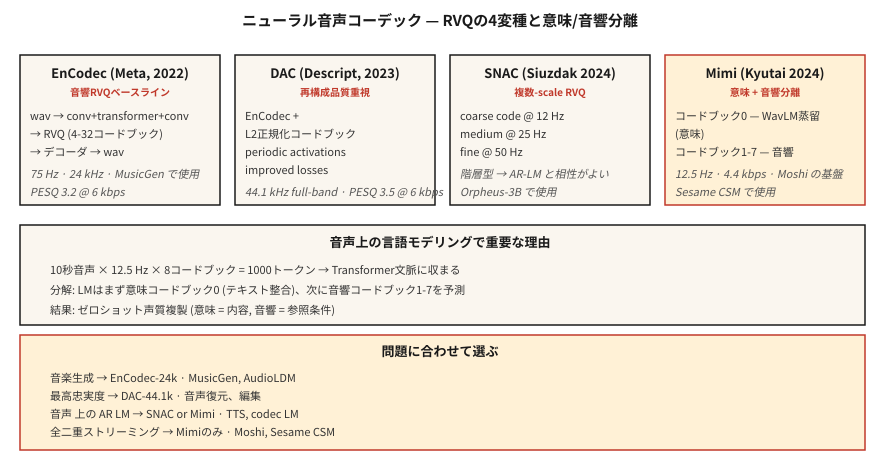

# Nöral Ses Codec Bileşenleri — EnCodec, SNAC, Mimi, DAC ve Anlamsal-Akustik Ayrım

> 2026 ses üretiminin neredeyse tamamı token'lerden oluşuyor. EnCodec, SNAC, Mimi ve DAC, sürekli dalga formlarını transformer'nin tahmin edebileceği ayrı dizilere dönüştürür. Semantik ve akustik token ayrımı (anlamsal olarak ilk kod kitabı, akustik olarak geri kalanı) ses için Transformer'den bu yana en önemli mimari değişimdir.

**Tür:** Öğren
**Diller:** Python
**Önkoşullar:** Aşama 6 · 02 (Spektrogramlar), Aşama 10 · 11 (Kuantizasyon), Aşama 5 · 19 (Alt Kelime Tokenizasyon)
**Süre:** ~60 dakika

## Sorun

Dil modelleri ayrık token'ler üzerinde çalışır. Ses süreklidir. Konuşma / müzik için Yüksek Lisans tarzı bir model istiyorsanız (MusicGen, Moshi, Susam CSM, VibeVoice, Orpheus) öncelikle bir **nöral ses codec bileşenine** ihtiyacınız vardır: Sesi token'lerden oluşan küçük bir kelime dağarcığına ayıran öğrenilmiş bir kodlayıcı ve dalga formunu yeniden oluşturan eşleşen bir kod çözücü.

İki aile ortaya çıktı:

1. **Yeniden yapılanma öncelikli codec bileşenleri** — EnCodec, DAC. Algısal ses kalitesini optimize edin. Token'ler "akustiktir"; konuşmacının kimliği, tınısı, arka plan gürültüsü dahil her şeyi yakalarlar.
2. **Semantik öncelikli codec bileşenleri** — Mimi (Kyutai), SpeechTokenizer. İlk kod kitabını dilsel/fonetik içeriği kodlamaya zorlayın (genellikle WavLM'den ayrıştırarak). Sonraki kod kitapları akustik ayrıntılardır.

2024-2026 öngörüsü: **saf bir yeniden yapılandırma codec'i, metinden oluşturmaya çalıştığınızda size bulanık konuşma sağlar.** tokens codec'i üzerinden LLM'nin, ölçeklenmeyen aynı kod kitabında hem dil yapısını hem de akustik yapıyı öğrenmesi gerekir. Bunları ayırmak (anlamsal kod kitabı 0, akustik kod kitapları 1-N) Moshi ve Susam CSM'nin çalışmasını sağlayan şeydir.

## Konsept



### Temel püf noktası: Artık Vektör Nicelemesi (RVQ)

Tüm modern ses codec'leri, tek bir büyük kod kitabı yerine (iyi kalite için milyonlarca kod gerektirir) **RVQ** kullanır: küçük kod kitaplarından oluşan bir dizi. İlk kod kitabı kodlayıcı çıktısını niceler; ikincisi artığı nicemler; vb. Her kod kitabı 1024 koddan oluşur. 8 kod kitabı = 1024^8 = 10^24 etkili kelime dağarcığı.

inference zamanında kod çözücü, yeniden oluşturulacak çerçeve başına seçilen tüm kodları toplar.

### 2026'da önemli olan dört codec

**EnCodec (Meta, 2022).** Temel. Dalga biçimi üzerinde kodlayıcı-kod çözücü, RVQ darboğazı. 24 kHz, 32 kod kitabı mümkün, varsayılan 4 kod kitabı @ 1,5 kbps. `1D conv + transformer + 1D conv` mimarisini kullanır. MusicGen tarafından kullanılır.

**DAC (Açıklama, 2023).** L2-normalize edilmiş kod kitaplarına sahip RVQ, periyodik aktivasyon fonksiyonları, iyileştirilmiş kayıplar. Tüm açık kodlayıcılar arasında en yüksek yeniden yapılandırma doğruluğu; bazen 12 kod kitabıyla orijinal konuşmadan ayırt edilemez. 44,1 kHz tam bant.

**SNAC (Hubert Siuzdak, 2024).** Çok ölçekli RVQ — kaba kod kitapları, ince kod kitaplarına göre daha düşük kare hızında çalışır. Sesi hiyerarşik olarak etkili bir şekilde modeller: ~12 Hz'de kaba bir "çizim" artı 50 Hz'de ayrıntı. Orpheus-3B tarafından kullanılır çünkü hiyerarşik yapı LM tabanlı nesile iyi uyum sağlar.

**Mimi (Kyutai, 2024).** 2026'nın kurallarını değiştiren. 12,5 Hz kare hızı (son derece düşük), 4,4 kbps'de 8 kod kitabı. Codebook 0 **WavLM'den damıtılmıştır** — WavLM'nin konuşma içeriği özelliklerini tahmin etmek üzere eğitilmiştir. Kod kitapları 1-7 akustik kalıntılardır. Bu bölünme Moshi'ye (Ders 15) ve Susam CSM'ye güç verir.

### Dil modelleme için kare hızları önemlidir

Daha düşük kare hızı = daha kısa dizi = daha hızlı LM.

| Kodlayıcı | Kare hızı | 1 s = N kare | Şunun için iyi: |
|-------|-----------|----------------|---------|
| EnCodec-24k | 75Hz | 75 | müzik, genel ses |
| DAC-44.1k | 86Hz | 86 | yüksek kalitede müzik |
| SNAC-24k (kaba) | ~12 Hz | 12 | AR-LM verimli |
| Mimi | 12,5Hz | 12.5 | konuşma akışı |

12,5 Hz'de, 10 saniyelik bir ifade yalnızca 125 codec karesidir; bir transformer bunları kolayca tahmin edebilir.

### Anlamsal ve akustik token'ler

```
frame_t → [semantic_token_t, acoustic_token_0_t, acoustic_token_1_t, ..., acoustic_token_6_t]
```

- **Semantik token (Mimi'de kod kitabı 0).** Söylenenleri kodlar - fonemler, kelimeler, içerik. Yardımcı tahmin kaybı yoluyla WavLM'den damıtılmıştır.
- **Akustik token'ler (kod kitapları 1-7).** Tınıyı, konuşmacı kimliğini, prozodiyi, arka plan gürültüsünü, ince ayrıntıları kodlayın.

Bir AR LM, önce anlamsal token'yi tahmin eder (metne göre koşullandırılmış), ardından akustik token'leri (anlamsal + konuşmacı referansına göre koşullandırılmış) tahmin eder. Bu faktörleştirme, modern TTS'nin sesleri sıfır atışla klonlayabilmesinin nedenidir: anlamsal model içeriği yönetir; akustik model tınıyı yönetir.

### 2026 yeniden yapılandırma kalitesi (saniyedeki bit sayısı, daha düşük bit hızı daha iyidir)

| Kodlayıcı | Bit Hızı | PESQ | ViSQOL |
|-------|---------|------|--------|
| Opus-20kbps | 20kbps | 4.0 | 4.3 |
| EnCodec-6kbps | 6 kbps | 3.2 | 3.8 |
| DAC-6kbps | 6 kbps | 3.5 | 4.0 |
| SNAC-3kbps | 3 kbps | 3.3 | 3.8 |
| Mimi-4.4kbps | 4,4 kbps | 3.1 | 3.7 |

Opus gibi geleneksel codec'ler algısal kalite açısından hâlâ bit başına kazanıyor. Sinir kodlayıcıları **ayrı token'ler** (Opus'un üretmediği) ve **üretken model kalitesi** (LM'nin bu token'lerle yapabilecekleri) sayesinde kazanır.

## İnşa Et

### Adım 1: EnCodec ile kodlama

```python
from encodec import EncodecModel
import torch

model = EncodecModel.encodec_model_24khz()
model.set_target_bandwidth(6.0)  # kbps

wav = torch.randn(1, 1, 24000)
with torch.no_grad():
    encoded = model.encode(wav)
codes, scale = encoded[0]
# codes: (1, n_codebooks, n_frames), dtype=int64
```

6 kbps'de `n_codebooks=8`. Her kod 0-1023'tür (10 bit).

### Adım 2: yeniden yapılandırmanın kodunu çözün ve ölçün

```python
with torch.no_grad():
    wav_recon = model.decode([(codes, scale)])

from torchaudio.functional import compute_deltas
import torch.nn.functional as F

mse = F.mse_loss(wav_recon[:, :, :wav.shape[-1]], wav).item()
```

### Adım 3: anlamsal-akustik ayrım (Mimi tarzı)

```python
from moshi.models import loaders
mimi = loaders.get_mimi()

with torch.no_grad():
    codes = mimi.encode(wav)  # shape (1, 8, frames@12.5Hz)

semantic = codes[:, 0]
acoustic = codes[:, 1:]
```

Anlamsal kod kitabı 0, WavLM ile hizalanmıştır. Metinden anlambilime transformer eğitimi verebilirsiniz; bu, doğrudan sese geçmekten çok daha küçük bir sözcük dağarcığıdır. Daha sonra hoparlör referansında ayrı bir akustikten dalga biçimine kod çözücü koşulları sağlanır.

### Adım 4: token kodlayıcısı üzerinden AR LM neden çalışıyor?

Mimi'nin 12,5 Hz × 8 kod kitaplarındaki 10 saniyelik konuşma klibi için:

```
N_tokens = 10 * 12.5 * 8 = 1000 tokens
```

1000 token, transformer için önemsiz bir bağlamdır. 256M parametreli transformer, modern bir GPU'da milisaniyeler içinde 10 saniyelik konuşma üretebilir.

## Kullan onu

Harita sorunu → codec bileşeni:

| Görev | Kodlayıcı |
|------|-------|
| Genel müzik üretimi | EnCodec-24k |
| En yüksek kalitede yeniden yapılanma | DAC-44.1k |
| AR LM konuşma üzerinden (TTS) | SNAC veya Mimi |
| Tam çift yönlü konuşma akışı | Mimi (12,5 Hz) |
| Metinli ses efekti kitaplığı | EnCodec + T5 durumu |
| İnce taneli ses düzenleme | DAC + iç boyama |

Temel kural: **üretken bir model oluşturuyorsanız Mimi veya SNAC ile başlayın. Bir sıkıştırma hattı oluşturuyorsanız Opus'u kullanın.**

## Tuzaklar

- **Çok fazla kod kitabı.** Kod kitaplarının eklenmesi aslına uygunluğu doğrusal olarak artırır ancak LM dizisi uzunluğu da doğrusal olarak artar. 8-12'de dur.
- **Kare hızı uyumsuzluğu.** LM'yi 12,5 Hz Mimi'de, ardından fine-tuning'yi 50 Hz EnCodec'te eğitmek sessizce başarısız oluyor.
- **Tüm kod kitaplarının eşit olduğu varsayılarak.** Mimi'de kod kitabı 0 içeriği taşır; onu kaybetmek anlaşılırlığı yok eder. Kod kitabı 7'yi kaybetmek neredeyse hiç fark edilmez.
- **Tek ölçü olarak yeniden yapılandırma kalitesinin kullanılması.** Bir codec bileşeni harika bir yeniden yapılandırmaya sahip olabilir ancak semantik yapı kötüyse LM tabanlı oluşturma için işe yaramaz.

## Gönderin

`outputs/skill-codec-picker.md` olarak kaydedin. Belirli bir üretken veya sıkıştırma görevi için bir codec bileşeni seçin.

## Egzersizler

1. **Kolay.** `code/main.py`'yi çalıştırın. Bir oyuncak skaler + artık niceleyici uygular ve siz kod kitapları ekledikçe yeniden yapılandırma hatasını ölçer.
2. **Orta.** `encodec`'yi yükleyin ve uzatılmış bir konuşma klibinde 1, 4, 8, 32 kod kitabını karşılaştırın. PESQ veya MSE ile bit hızının grafiğini çizin.
3. **Zor.** Mimi Yükle. Bir klibi kodlayın. Kod kitabı 0'ı rastgele tamsayılarla değiştirin; şifresini çöz. Daha sonra benzer şekilde kod kitabı 7'yi değiştirin. İki bozulmayı karşılaştırın - kod kitabı 0 bozulması anlaşılırlığı bozmalıdır; kod kitabı 7'nin yolsuzluğu neredeyse hiçbir şeyi değiştirmemelidir.

## Anahtar Terimler

| Dönem | İnsanlar ne diyor | Aslında ne anlama geliyor |
|------|-----------------|-----------------------|
| RVQ | Artık nicemleme | Küçük kod kitapları dizisi; her biri önceki artığı nicemler. |
| Kare hızı | Codec hızı | Saniyede kaç token karesi. Daha düşük = daha hızlı LM. |
| Anlamsal kod kitabı | Kod Kitabı 0 (Mimi) | SSL özelliklerinden damıtılmış kod kitabı; içeriği kodlar. |
| Akustik kod kitapları | Diğer her şey | Tını, prozodi, gürültü, ince detay. |
| PESQ / ViSQOL | Algısal kalite | MOS ile ilişkili objektif ölçümler. |
| Kodlama | Meta kodlayıcı | RVQ temel çizgisi; MusicGen tarafından kullanılır. |
| Mimi | Kyutai codec'i | 12,5 Hz kare hızı; anlamsal-akustik bölünme; Moshi'ye güç veriyor. |

## Daha Fazla Okuma

- [Défossez ve ark. (2023). EnCodec](https://arxiv.org/abs/2210.13438) — RVQ temel çizgisi.
- [Kumar ve ark. (2023). Açıklama Ses Codec Bileşeni (DAC)](https://arxiv.org/abs/2306.06546) — en yüksek doğrulukta açık.
- [Siuzdak (2024). SNAC](https://arxiv.org/abs/2410.14411) — çok ölçekli RVQ.
-[Kyutai (2024). Mimi codec bileşeni](https://kyutai.org/codec-explainer) — semantik-akustik bölünme, WavLM damıtma.
- [Borsos ve ark. (2023). AudioLM](https://arxiv.org/abs/2209.03143) — iki aşamalı anlamsal/akustik paradigma.
- [Zeghidour ve ark. (2021). SoundStream](https://arxiv.org/abs/2107.03312) — orijinal yayınlanabilir RVQ codec bileşeni.
