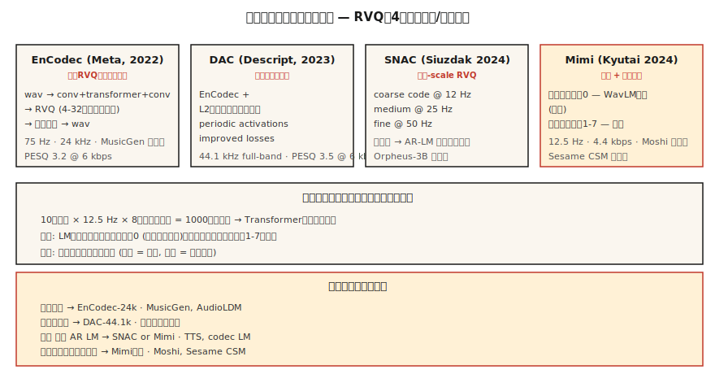

# 神经音频编解码器 —— EnCodec、SNAC、Mimi、DAC 与语义-声学分离

> 译注：本文译自同目录 [`en.md`](./en.md)。术语遵循仓根 [TRANSLATION_GUIDE.md](../../../../TRANSLATION_GUIDE.md)。

> 2026 年的音频生成几乎全是 token。EnCodec、SNAC、Mimi、DAC 把连续波形变成 transformer 可以预测的离散序列。**语义 token 与声学 token 的分离**——第一个 codebook 当语义、其余当声学——是音频领域自 Transformer 之后最重要的架构转变。

**Type:** Learn
**Languages:** Python
**Prerequisites:** Phase 6 · 02 (Spectrograms), Phase 10 · 11 (Quantization), Phase 5 · 19 (Subword Tokenization)
**Time:** ~60 minutes

## 问题（The Problem）

语言模型工作在离散 token 上。音频是连续的。如果你想要一个 LLM 风格的语音 / 音乐模型——MusicGen、Moshi、Sesame CSM、VibeVoice、Orpheus——你首先需要一个**神经音频编解码器（neural audio codec）**：一个学到的 encoder 把音频离散化成小词表的 token，再加一个配套的 decoder 把波形重建回来。

目前出现了两大流派：

1. **重建优先（Reconstruction-first）的 codec** —— EnCodec、DAC。优化感知音质。token 是「声学（acoustic）」的——它们捕获包括说话人身份、音色、背景噪声在内的一切信息。
2. **语义优先（Semantic-first）的 codec** —— Mimi（Kyutai）、SpeechTokenizer。强制让第一个 codebook 编码语言学 / 音素层面的内容（通常通过从 WavLM 蒸馏得到）。后续的 codebook 才是声学细节。

2024-2026 年的核心洞见是：**纯重建型 codec 在你试图从文本生成时会给出含糊的语音。** 在 codec token 上跑的 LLM 不得不在同一套 codebook 里同时学语言结构**和**声学结构，这是无法 scale 的。把它们分开——codebook 0 负责语义、codebook 1-N 负责声学——才是 Moshi 与 Sesame CSM 能跑通的关键。

## 概念（The Concept）



### 核心技巧：残差向量量化（Residual Vector Quantization, RVQ）

与其用一个巨大的 codebook（要达到好质量得有几百万个码），所有现代音频 codec 都用 **RVQ**：一串小 codebook 级联起来。第一个 codebook 量化 encoder 的输出；第二个量化残差；依此类推。每个 codebook 1024 个码。8 个 codebook = 等效词表 1024^8 = 10^24。

inference 时，decoder 把每帧选中的所有码相加来重建波形。

### 2026 年最重要的四个 codec

**EnCodec（Meta，2022）。** 基线。在波形上做 encoder-decoder，瓶颈处用 RVQ。24 kHz，最多 32 个 codebook，默认 4 个 codebook @ 1.5 kbps。架构是 `1D conv + transformer + 1D conv`。MusicGen 用的就是它。

**DAC（Descript，2023）。** RVQ 配合 L2 归一化的 codebook、周期性激活函数（activation）和改进的 loss。是所有开源 codec 里重建保真度最高的——12 个 codebook 时有时跟原始语音难以区分。44.1 kHz 全频带。

**SNAC（Hubert Siuzdak，2024）。** 多尺度 RVQ —— 粗糙的 codebook 工作在比精细 codebook 更低的帧率上。本质上把音频按层级建模：~12 Hz 的粗略「草图」加 50 Hz 的细节。Orpheus-3B 用它，因为这种层级结构很好地对应到了基于 LM 的生成。

**Mimi（Kyutai，2024）。** 2026 年的颠覆者。12.5 Hz 帧率（极低），8 个 codebook @ 4.4 kbps。codebook 0 是**从 WavLM 蒸馏出来的**——训练目标是预测 WavLM 的语音内容特征（feature）。codebook 1-7 是声学残差。这种分离支撑了 Moshi（第 15 课）和 Sesame CSM。

### 帧率对语言模型很重要

帧率越低 = 序列越短 = LM 越快。

| Codec | 帧率 | 1 秒 = N 帧 | 适合 |
|-------|-----------|----------------|---------|
| EnCodec-24k | 75 Hz | 75 | 音乐、通用音频 |
| DAC-44.1k | 86 Hz | 86 | 高保真音乐 |
| SNAC-24k（粗略） | ~12 Hz | 12 | AR-LM 高效 |
| Mimi | 12.5 Hz | 12.5 | 流式语音 |

在 12.5 Hz 下，10 秒话音只有 125 个 codec 帧 —— transformer 轻松就能预测。

### 语义 token 与声学 token

```
frame_t → [semantic_token_t, acoustic_token_0_t, acoustic_token_1_t, ..., acoustic_token_6_t]
```

- **语义 token（Mimi 中的 codebook 0）。** 编码「说了什么」——音素、词、内容。通过一个辅助预测 loss 从 WavLM 蒸馏而来。
- **声学 token（codebook 1-7）。** 编码音色、说话人身份、韵律、背景噪声、精细细节。

一个 AR LM 先预测语义 token（以文本为条件），然后预测声学 token（以语义 + 说话人参考为条件）。这种因式分解就是为什么现代 TTS 能 zero-shot 克隆声音：语义模型管内容，声学模型管音色。

### 2026 年的重建质量（每秒比特数，码率越低越好）

| Codec | 码率 | PESQ | ViSQOL |
|-------|---------|------|--------|
| Opus-20kbps | 20 kbps | 4.0 | 4.3 |
| EnCodec-6kbps | 6 kbps | 3.2 | 3.8 |
| DAC-6kbps | 6 kbps | 3.5 | 4.0 |
| SNAC-3kbps | 3 kbps | 3.3 | 3.8 |
| Mimi-4.4kbps | 4.4 kbps | 3.1 | 3.7 |

像 Opus 这样的传统 codec 在每比特感知质量上仍然占优。神经 codec 赢在**离散 token**（Opus 不产出这个）和**生成模型质量**（LM 拿这些 token 能干啥）。

## 动手实现（Build It）

### Step 1：用 EnCodec 编码

```python
from encodec import EncodecModel
import torch

model = EncodecModel.encodec_model_24khz()
model.set_target_bandwidth(6.0)  # kbps

wav = torch.randn(1, 1, 24000)
with torch.no_grad():
    encoded = model.encode(wav)
codes, scale = encoded[0]
# codes: (1, n_codebooks, n_frames), dtype=int64
```

6 kbps 时 `n_codebooks=8`。每个 code 取值 0-1023（10 位）。

### Step 2：解码并测量重建

```python
with torch.no_grad():
    wav_recon = model.decode([(codes, scale)])

from torchaudio.functional import compute_deltas
import torch.nn.functional as F

mse = F.mse_loss(wav_recon[:, :, :wav.shape[-1]], wav).item()
```

### Step 3：语义-声学分离（Mimi 风格）

```python
from moshi.models import loaders
mimi = loaders.get_mimi()

with torch.no_grad():
    codes = mimi.encode(wav)  # shape (1, 8, frames@12.5Hz)

semantic = codes[:, 0]
acoustic = codes[:, 1:]
```

语义 codebook 0 与 WavLM 对齐。你可以训练一个 text-to-semantic 的 transformer —— 词表比直接 text-to-audio 小得多。然后再用一个独立的 acoustic-to-waveform decoder 以说话人参考为条件解码。

### Step 4：为什么在 codec token 上跑 AR LM 行得通

对于 Mimi 12.5 Hz × 8 codebook 下的 10 秒语音片段：

```
N_tokens = 10 * 12.5 * 8 = 1000 tokens
```

1000 个 token 对 transformer 而言只是小 case。一个 256M 参数的 transformer 在现代 GPU 上能在毫秒级生成 10 秒语音。

## 用起来（Use It）

按问题选 codec：

| 任务 | Codec |
|------|-------|
| 通用音乐生成 | EnCodec-24k |
| 最高保真重建 | DAC-44.1k |
| 在语音上跑 AR LM（TTS） | SNAC 或 Mimi |
| 流式全双工语音 | Mimi（12.5 Hz） |
| 带文本条件的音效库 | EnCodec + T5 条件 |
| 细粒度音频编辑 | DAC + inpainting |

经验法则：**做生成模型就从 Mimi 或 SNAC 开始；做压缩流水线就用 Opus。**

## 易错点（Pitfalls）

- **codebook 太多。** 加 codebook 会线性提升保真度，但 LM 序列长度也线性变长。停在 8-12 个就行。
- **帧率不匹配。** 在 12.5 Hz 的 Mimi 上训 LM，再在 50 Hz 的 EnCodec 上微调（fine-tune），会无声崩坏。
- **以为所有 codebook 等价。** 在 Mimi 里，codebook 0 承载内容；丢了它语音就听不懂了。丢 codebook 7 几乎没感觉。
- **只拿重建质量当指标。** 一个 codec 可以有出色的重建，但如果语义结构差，对基于 LM 的生成毫无用处。

## 上线部署（Ship It）

存为 `outputs/skill-codec-picker.md`。给定一个生成或压缩任务，挑一个 codec。

## 练习（Exercises）

1. **简单。** 跑 `code/main.py`。它实现了一个玩具版的标量 + 残差量化器（quantizer），并随着 codebook 数增加测量重建误差。
2. **中等。** 装上 `encodec`，在一段留出的语音片段上比较 1、4、8、32 个 codebook。画 PESQ 或 MSE 与码率的关系图。
3. **困难。** 加载 Mimi，编码一段片段。把 codebook 0 替换成随机整数后解码。再同样替换 codebook 7。对比两次破坏 —— 破坏 codebook 0 应该会让语音完全无法听懂；破坏 codebook 7 几乎不会改变什么。

## 关键术语（Key Terms）

| 术语 | 大家怎么说 | 实际含义 |
|------|-----------------|-----------------------|
| RVQ | 残差量化 | 小 codebook 的级联；每一级量化前一级的残差。 |
| 帧率（Frame rate） | codec 的速度 | 每秒多少 token 帧。越低 = LM 越快。 |
| 语义 codebook | codebook 0（Mimi） | 从 SSL 特征蒸馏出的 codebook；编码内容。 |
| 声学 codebook | 其他全部 | 音色、韵律、噪声、精细细节。 |
| PESQ / ViSQOL | 感知质量 | 与 MOS 相关的客观指标。 |
| EnCodec | Meta 的 codec | RVQ 基线；MusicGen 在用。 |
| Mimi | Kyutai 的 codec | 12.5 Hz 帧率；语义-声学分离；为 Moshi 提供动力。 |

## 延伸阅读（Further Reading）

- [Défossez et al. (2023). EnCodec](https://arxiv.org/abs/2210.13438) —— RVQ 基线。
- [Kumar et al. (2023). Descript Audio Codec (DAC)](https://arxiv.org/abs/2306.06546) —— 开源里保真度最高。
- [Siuzdak (2024). SNAC](https://arxiv.org/abs/2410.14411) —— 多尺度 RVQ。
- [Kyutai (2024). Mimi codec](https://kyutai.org/codec-explainer) —— 语义-声学分离，WavLM 蒸馏。
- [Borsos et al. (2023). AudioLM](https://arxiv.org/abs/2209.03143) —— 两阶段的语义/声学范式。
- [Zeghidour et al. (2021). SoundStream](https://arxiv.org/abs/2107.03312) —— 最早的可流式 RVQ codec。
