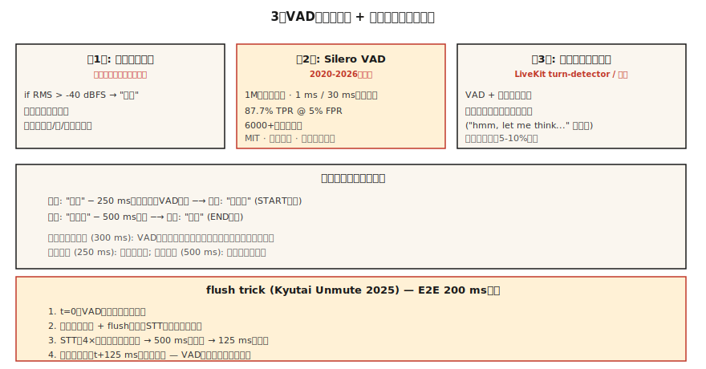

# Detecção de Atividade Vocal e Turn-Taking — Silero, Cobra e o Truque do Flush

> Todo agente de voz vive ou morre em duas decisões: o usuário está falando agora, e ele já terminou? VAD responde à primeira. Detecção de turno (VAD + hang-over de silêncio + modelo de endpointing semântico) responde à segunda. Erra qualquer uma e seu assistente ou corta o usuário ou nunca cala a boca.

**Tipo:** Construir
**Idiomas:** Python
**Pré-requisitos:** Fase 6 · 11 (Áudio em Tempo Real), Fase 6 · 12 (Assistente de Voz)
**Tempo:** ~45 minutos

## O Problema

Três decisões distintas que um agente de voz toma a cada chunk de 20 ms:

1. **Este frame é fala?** — VAD. Binário, por frame.
2. **O usuário começou uma nova utterance?** — detecção de onset.
3. **O usuário terminou?** — endpointing (fim de turno).

A resposta ingênua (limiar de energia) falha em qualquer ruído — trânsito, teclados, conversa multidão. A resposta de 2026: Silero VAD (open, deep-learned) + modelo de detecção de turno (endpointing semântico) + hang-over de silêncio calibrado pelo VAD.

## O Conceito



### A cascata VAD de três níveis

**Nível 1: gate de energia.** O mais barato. Threshold RMS em -40 dBFS. Filtra silêncio óbvio mas dispara em qualquer ruído acima do threshold.

**Nível 2: Silero VAD** (2020-2026, MIT). 1M parâmetros. Treinado em 6000+ idiomas. Roda ~1 ms por chunk de 30 ms em uma thread CPU. 87,7% TPR a 5% FPR. O padrão open-source.

**Nível 3: detector de turno semântico.** Modelo de detecção de turno do LiveKit (2024-2026) ou seu próprio classificador minúsculo. Distingue "pausa no meio da frase" de "terminou de falar". Usa contexto lingüístico (entonação + palavras recentes), não apenas silêncio.

### Parâmetros-chave e seus configurações-padrão

- **Threshold.** Silero emite uma probabilidade; classifique fala em > 0,5 (padrão) ou > 0,3 (sensível). Threshold menor = menos clips de primeira palavra, mais falsos positivos.
- **Duração mínima de fala.** Rejeite fala menor que 250 ms — geralmente tosses ou ruído de cadeira.
- **Hang-over de silêncio (endpointing).** Após VAD voltar a 0, espere 500-800 ms antes de declarar fim de turno. Curto demais → interrompe o usuário. Longo demais → parece lerdo.
- **Buffer de pre-roll.** Mantenha 300-500 ms de áudio antes do VAD disparar. Previne "ei" de ser cortado.

### O truque do flush (Kyutai 2025)

Modelos de STT streaming têm um atraso de lookahead (500 ms para Kyutai STT-1B, 2,5 s para STT-2,6B). Normalmente você esperaria esse tempo após o fim da fala para a transcrição. Truque do flush: quando VAD dispara fim de-fala, **envie um sinal de flush para o STT** que força saída imediata. STT processa a ~4× tempo real, então o buffer de 500 ms termina em ~125 ms.

End-to-end: 125 ms VAD + STT em flush = latência conversacional.

### Comparação VAD 2026

| VAD | TPR @ 5% FPR | Latência | Licença |
|-----|--------------|----------|---------|
| WebRTC VAD (Google, 2013) | 50,0% | 30 ms | BSD |
| Silero VAD (2020-2026) | 87,7% | ~1 ms | MIT |
| Cobra VAD (Picovoice) | 98,9% | ~1 ms | comercial |
| Segmentação pyannote | 95% | ~10 ms | MIT-ish |

Silero é o padrão correto. Cobra é o upgrade de conformidade/precisão. VAD só-por-energia não tem lugar na produção de 2026.

## Construa

### Passo 1: o gate de energia

```python
def energy_vad(chunk, threshold_dbfs=-40.0):
    rms = (sum(x * x for x in chunk) / len(chunk)) ** 0.5
    dbfs = 20.0 * math.log10(max(rms, 1e-10))
    return dbfs > threshold_dbfs
```

### Passo 2: Silero VAD em Python

```python
from silero_vad import load_silero_vad, get_speech_timestamps

vad = load_silero_vad()
audio = torch.tensor(waveform_16k, dtype=torch.float32)
segments = get_speech_timestamps(
    audio, vad, sampling_rate=16000,
    threshold=0.5,
    min_speech_duration_ms=250,
    min_silence_duration_ms=500,
    speech_pad_ms=300,
)
for s in segments:
    print(f"{s['start']/16000:.2f}s - {s['end']/16000:.2f}s")
```

### Passo 3: máquina de estados de fim-de-turno

```python
class TurnDetector:
    def __init__(self, silence_hangover_ms=500, min_speech_ms=250):
        self.state = "idle"
        self.speech_ms = 0
        self.silence_ms = 0
        self.silence_hangover_ms = silence_hangover_ms
        self.min_speech_ms = min_speech_ms

    def update(self, is_speech, chunk_ms=20):
        if is_speech:
            self.speech_ms += chunk_ms
            self.silence_ms = 0
            if self.state == "idle" and self.speech_ms >= self.min_speech_ms:
                self.state = "speaking"
                return "START"
        else:
            self.silence_ms += chunk_ms
            if self.state == "speaking" and self.silence_ms >= self.silence_hangover_ms:
                self.state = "idle"
                self.speech_ms = 0
                return "END"
        return None
```

### Passo 4: esqueleto do truque do flush

```python
def flush_on_end(stt_client, audio_buffer):
    stt_client.send_audio(audio_buffer)
    stt_client.send_flush()
    return stt_client.recv_transcript(timeout_ms=150)
```

STT (Kyutai, Deepgram, AssemblyAI) precisa suportar flush para isso funcionar. Whisper streaming não suporta — é baseado em blocos e sempre espera chunks.

## Use

| Situação | Escolha VAD |
|----------|-------------|
| Open, rápido, geral | Silero VAD |
| Call center comercial | Cobra VAD |
| On-device (celular) | Silero VAD ONNX |
| Pesquisa / diarização | Segmentação pyannote |
| Fallback sem dependências | WebRTC VAD (legado) |
| Precisa de qualidade de fim-de-turno | Silero + detector de turno LiveKit em camadas |

Regra de ouro: nunca faça implantação de VAD só-por-energia a menos que realmente não tenha outra opção.

## Armadilhas

- **Threshold fixo.** Funciona em silêncio, falha em ruído. Ou calibre on-device ou mude para Silero.
- **Hang-over de silêncio curto demais.** Agente interrompe no meio da frase. 500-800 ms é o sweet spot para fala conversacional.
- **Hang-over longo demais.** Parece lerdo. Teste A/B com usuários alvo.
- **Sem buffer de pre-roll.** Primeiros 200-300 ms do áudio do usuário perdem-se. Sempre mantenha um pre-roll rolante.
- **Ignorar endpointing semântico.** "Hmm, deixa eu pensar..." contém pausas longas. Usuários odeiam ser cortados no meio do pensamento. Use o detector de turno do LiveKit ou similar.

## Entregue

Salve como `outputs/skill-vad-tuner.md`. Escolha modelo VAD, threshold, hang-over, pre-roll e estratégia de detecção de turno para uma carga de trabalho.

## Exercícios

1. **Fácil.** Execute `code/main.py`. Simula uma sequência fala + silêncio + fala + tosses e testa os três níveis de VAD.
2. **Médio.** Instale `silero-vad`, processe uma gravação de 5 min, ajuste threshold para minimizar clips de primeira palavra e falsos triggers. Reporte precisão/recall.
3. **Difícil.** Construa um mini detector de turno: Silero VAD + MLP de 3 camadas nos embeddings das últimas 10 palavras (use sentence-transformers). Treine em um dataset de fim-de-turno anotado à mão. Supere Silero-only por 10% F1.

## Termos Chave

| Termo | O que a gente diz | O que significa de verdade |
|-------|-------------------|---------------------------|
| VAD | Detector de voz | Binário por frame: isto é fala? |
| Detecção de turno | Endpointing | VAD + hang-over de silêncio + endpoint semântico. |
| Hang-over de silêncio | Espera-após-fala | Tempo a esperar antes de declarar fim de turno; 500-800 ms. |
| Pre-roll | Buffer pré-fala | Mantenha 300-500 ms de áudio antes do VAD disparar. |
| Truque do flush | Hack do Kyutai | VAD → flush-STT → 125 ms em vez de 500 ms de atraso. |
| Endpoint semântico | "Eles quiseram parar?" | Classificador ML que olha palavras, não apenas silêncio. |
| TPR @ FPR 5% | Ponto ROC | Benchmark padrão de VAD; 87,7% para Silero, 50% WebRTC. |

## Leitura Adicional

- [Silero VAD](https://github.com/snakers4/silero-vad) — o VAD open de referência.
- [Picovoice Cobra VAD](https://picovoice.ai/products/cobra/) — líder de precisão comercial.
- [Kyutai — Unmute + truque do flush](https://kyutai.org/stt) — o truque de engenharia <200 ms.
- [LiveKit — detecção de turno](https://docs.livekit.io/agents/logic/turns/) — endpointing semântico em produção.
- [WebRTC VAD](https://webrtc.googlesource.com/src/) — o baseline legado.
- [Segmentação pyannote](https://github.com/pyannote/pyannote-audio) — segmentação de grau de diarização.
