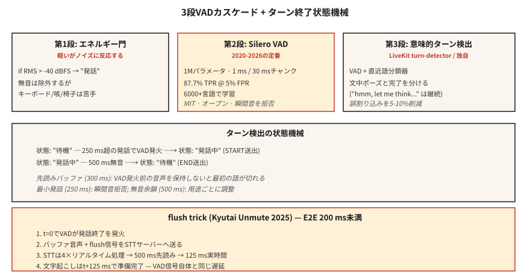

# Ses Etkinliği Algılama ve Sıra Alma — Silero, Cobra ve Flush Trick

> Her ses agent iki karara göre yaşar veya ölür: kullanıcı şu anda mı konuşuyor ve konuşması bitti mi? VAD ilkine cevap veriyor. Dönüş algılama (VAD + sessizlik-akşamdan kalma + anlamsal uç nokta modeli) ikincisine cevap verir. Ya yanılıyorsunuz ve asistanınız ya kullanıcıların sözünü kesiyor ya da hiç susmuyor.

**Tür:** Yapım
**Diller:** Python
**Önkoşullar:** Aşama 6 · 11 (Gerçek Zamanlı Ses), Aşama 6 · 12 (Sesli Asistan)
**Süre:** ~45 dakika

## Sorun

Bir agent sesinin her 20 ms'lik parçada verdiği üç farklı karar:

1. **Bu çerçeve konuşma mı?** — VAD. İkili, kare başına.
2. **Kullanıcı yeni bir ifadeye mi başladı?** — başlangıç ​​tespiti.
3. **Kullanıcı işini bitirdi mi?** — son noktayı işaretleme (dönüş sonu).

Naif cevap (enerji eşiği) herhangi bir gürültüde (trafik, klavyeler, kalabalığın gevezeliği) başarısız olur. 2026'nın cevabı: Silero VAD (açık, derin öğrenilmiş) + dönüş algılama modeli (anlamsal uç nokta belirleme) + VAD kalibreli sessizlik akşamdan kalma.

## Konsept



### Üç katmanlı VAD kademesi

**Kademe 1: enerji kapısı.** En ucuzu. -40 dBFS'de RMS eşiği. Bariz sessizliği filtreler ancak eşiğin üzerindeki herhangi bir gürültüye ateş açar.

**Kademe 2: Silero VAD** (2020-2026, MIT). 1M parametreler. 6000'den fazla dilde eğitim verildi. Tek bir CPU iş parçacığında 30 ms'lik öbek başına ~1 ms'de çalışır. %5 FPR'de %87,7 TPR. Açık kaynak varsayılanı.

**Kademe 3: anlamsal dönüş algılayıcı.** LiveKit'in dönüş algılama modeli (2024-2026) veya kendi küçük sınıflandırıcınız. "Cümlenin ortasında duraklatma"yı "konuşmayı bitirdim"den ayırır. Yalnızca sessizliği değil, dilsel bağlamı (tonlama + son kelimeler) kullanır.

### Anahtar parametreler ve bunların varsayılanları

- **Eşik.** Silero bir olasılık çıktısı verir; Konuşmayı > 0,5 (varsayılan) veya > 0,3 (hassas) olarak sınıflandırın. Daha düşük eşik = daha az ilk kelime klibi, daha fazla yanlış pozitif.
- **Minimum konuşma süresi.** 250 ms'den kısa konuşmayı reddedin; genellikle öksürük veya sandalye gürültüsü.
- **Akşamdan kalma sessizliği (son noktayı işaret etme).** VAD 0'a döndükten sonra, dönüşün sonunu bildirmeden önce 500-800 ms bekleyin. Çok kısa → kullanıcının sözünü kesin. Çok uzun → halsiz hissettiriyor.
- **Videodan önce gösterilen arabellek.** VAD etkinleşmeden önce sesi 300-500 ms tutun. "Hey" ifadesinin kırpılmasını önler.

### Sifon numarası (Kyutai 2025)

Akışlı STT modellerinde ileriye dönük bir gecikme bulunur (Kyutai STT-1B için 500 ms, STT-2.6B için 2,5 sn). Normalde konuşmanın bitiminden sonra transkripsiyon için bu kadar uzun süre beklerdiniz. Temizleme hilesi: VAD konuşmanın sonunu tetiklediğinde, **STT'ye anında çıkışı zorlayan bir temizleme sinyali gönderin**. STT ~4× gerçek zamanlı olarak işlenir, böylece 500 ms'lik arabellek ~125 ms'de tamamlanır.

Uçtan uca: 125 ms VAD + yıkama STT = konuşma gecikmesi.

### 2026 VAD karşılaştırması

| VAD | TPR @ %5 FPR | Gecikme | Lisans |
|-----|--------------|---------|---------|
| WebRTC VAD (Google, 2013) | %50,0 | 30 ms | BSD |
| Silero VAD (2020-2026) | %87,7 | ~1 ms | MİT |
| Kobra VAD (Picovoice) | %98,9 | ~1 ms | ticari |
| pyannote segmentasyonu | %95 | ~10 ms | MİT'e benzer |

Silero doğru varsayılandır. Cobra uyumluluk/doğruluk yükseltmesidir. Yalnızca enerji içeren VAD'ın 2026 üretiminde yeri yoktur.

## İnşa Et

### Adım 1: Enerji kapısı

```python
def energy_vad(chunk, threshold_dbfs=-40.0):
    rms = (sum(x * x for x in chunk) / len(chunk)) ** 0.5
    dbfs = 20.0 * math.log10(max(rms, 1e-10))
    return dbfs > threshold_dbfs
```

### Adım 2: Python'da Silero VAD

```python
from silero_vad import load_silero_vad, get_speech_timestamps

vad = load_silero_vad()
audio = torch.tensor(waveform_16k, dtype=torch.float32)
segments = get_speech_timestamps(
    audio, vad, sampling_rate=16000,
    threshold=0.5,
    min_speech_duration_ms=250,
    min_silence_duration_ms=500,
    speech_pad_ms=300,
)
for s in segments:
    print(f"{s['start']/16000:.2f}s - {s['end']/16000:.2f}s")
```

### Adım 3: son durum makinesi

```python
class TurnDetector:
    def __init__(self, silence_hangover_ms=500, min_speech_ms=250):
        self.state = "idle"
        self.speech_ms = 0
        self.silence_ms = 0
        self.silence_hangover_ms = silence_hangover_ms
        self.min_speech_ms = min_speech_ms

    def update(self, is_speech, chunk_ms=20):
        if is_speech:
            self.speech_ms += chunk_ms
            self.silence_ms = 0
            if self.state == "idle" and self.speech_ms >= self.min_speech_ms:
                self.state = "speaking"
                return "START"
        else:
            self.silence_ms += chunk_ms
            if self.state == "speaking" and self.silence_ms >= self.silence_hangover_ms:
                self.state = "idle"
                self.speech_ms = 0
                return "END"
        return None
```

### Adım 4: floş hilesi iskeleti

```python
def flush_on_end(stt_client, audio_buffer):
    stt_client.send_audio(audio_buffer)
    stt_client.send_flush()
    return stt_client.recv_transcript(timeout_ms=150)
```

Bunun çalışması için STT'nin (Kyutai, Deepgram, AssemblyAI) floş'u desteklemesi gerekir. Fısıltı akışı bunu yapmaz; blok tabanlıdır ve her zaman parçaları bekler.

## Kullan onu

| Durum | VAD seçimi |
|-----------|-----------|
| Açık, hızlı, genel | Silero VAD |
| Ticari çağrı merkezi | Kobra VAD |
| Cihazda (telefon) | Silero VAD ONNX |
| Araştırma / günlük tutma | pyannote segmentasyonu |
| Sıfır bağımlılık geri dönüşü | WebRTC VAD (eski) |
| Son derece kaliteli bir ürüne ihtiyacınız var | Silero + LiveKit dönüş dedektörü katmanlı |

Temel kural: Gerçekten başka seçeneğiniz olmadığı sürece asla yalnızca enerji içeren VAD'yi göndermeyin.

## Tuzaklar

- **Sabit eşik.** Sessizde çalışır, gürültülüyken başarısız olur. Cihazda kalibre edin veya Silero'ya geçin.
- **Çok kısa sessizlik akşamdan kalmalık.** Agent cümleyi yarıda kesiyor. 500-800 ms, konuşma konuşması için en uygun noktadır.
- **Çok uzun süren akşamdan kalmalık.** Yorgunluk hissi veriyor. Hedef kullanıcılarla A/B testi.
- **Videodan önce gösterilen arabellek yok.** İlk 200-300 ms kullanıcı sesi kaybı. Her zaman yuvarlanan bir ön video tutun.
- **Anlamsal son noktalama göz ardı ediliyor.** "Hmm, bir düşüneyim..." uzun duraklamalar içeriyor. Kullanıcılar, düşüncenin ortasında kesilmekten nefret ederler. LiveKit'in dönüş dedektörünü veya benzerini kullanın.

## Gönderin

`outputs/skill-vad-tuner.md` olarak kaydet. Bir iş yükü için VAD modeli, eşik, akşamdan kalma, videodan önce gösterilen reklam ve dönüş algılama stratejisini seçin.

## Egzersizler

1. **Kolay.** `code/main.py` komutunu çalıştırın. Bir konuşma + sessizlik + konuşma + öksürük dizisini simüle eder ve üç VAD katmanını test eder.
2. **Orta.** `silero-vad`'yi yükleyin, 5 dakikalık bir kayıt yapın, eşiği hem ilk kelime kliplerini hem de yanlış tetikleyicileri en aza indirecek şekilde ayarlayın. Hassasiyeti/geri çağırmayı bildirin.
3. **Zor.** Mini bir dönüş dedektörü oluşturun: Silero VAD + son 10 kelimenin embedding'leri (cümle-transformer'leri kullanın) üzerinde 3 katmanlı bir MLP. Elle etiketlenmiş bir dönüş ucunda dataset eğitim alın. Yalnızca Silero'yu %10 F1 yendi.

## Anahtar Terimler

| Dönem | İnsanlar ne diyor | Aslında ne anlama geliyor |
|------|-----------------|-----------------------|
| VAD | Ses dedektörü | Çerçeve başına ikili: Bu konuşma mı? |
| Dönüş algılama | Sonu işaretleme | VAD + sessizlik-akşamdan kalma + anlamsal son nokta. |
| Akşamdan kalma sessizliği | Konuşma sonrası bekleme | Dönüşün sona erdiğini bildirmeden önce bekleme süresi; 500-800 ms. |
| Videodan önce gösterilen reklam | Konuşma öncesi arabellek | VAD tetiklenmeden önce sesi 300-500 ms tutun. |
| Floş numarası | Kyutai'yi hacklemek | VAD → floş-STT → 500 ms gecikme yerine 125 ms. |
| Anlamsal uç nokta | "Durmak mı istediler?" | Yalnızca sessizliğe değil kelimelere de bakan ML sınıflandırıcısı. |
| TPR @ FPR %5 | ROC noktası | Standart VAD benchmark; Silero için %87,7, WebRTC için %50. |

## Daha Fazla Okuma

- [Silero VAD](https://github.com/snakers4/silero-vad) — referans açık VAD.
- [Picovoice Cobra VAD](https://picovoice.ai/products/cobra/) — ticari doğrulukta lider.
- [Kyutai — Sesi aç + temizleme numarası](https://kyutai.org/stt) — 200 ms'nin altındaki mühendislik numarası.
- [LiveKit — dönüş algılama](https://docs.livekit.io/agents/logic/turns/) — üretimde anlamsal uç nokta belirleme.
- [WebRTC VAD](https://webrtc.googlesource.com/src/) — eski temel.
- [pyannote segmentasyonu](https://github.com/pyannote/pyannote-audio) — günlükleştirme dereceli segmentasyon.
