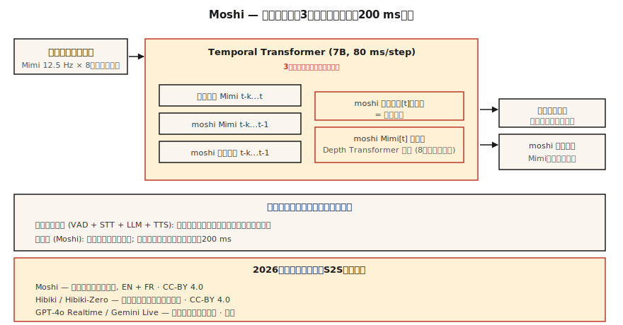

# Fala-para-Fala Streaming — Moshi, Hibiki e Diálogo Full-Duplex

> 2024-2026 redefiniu IA de voz. Moshi lança um modelo único que ouve e fala simultaneamente a 200 ms de latência. Hibiki faz tradução fala-para-fala chunk por chunk. Ambos abandonam a pipeline ASR → LLM → TTS por uma arquitetura full-duplex unificada sobre tokens de codec Mimi. Esse é o novo design de referência.

**Tipo:** Aprender
**Idiomas:** Python
**Pré-requisitos:** Fase 6 · 13 (Codecs Neurais de Áudio), Fase 6 · 11 (Áudio em Tempo Real), Fase 7 · 05 (Transformer Completo)
**Tempo:** ~75 minutos

## O Problema

Todo agente de voz construído com as Lições 11 + 12 tem um piso fundamental de latência em torno de 300-500 ms: VAD dispara, STT processa, LLM raciocina, TTS gera. Cada estágio tem sua latência mínima. Você pode ajustar e paralelizar, mas o formato da pipeline te limita.

Moshi (Kyutai, 2024-2026) faz uma pergunta diferente: e se não houvesse pipeline? E se um modelo único tomasse áudio como entrada e emitisse áudio como saída diretamente, continuamente, com texto como "monólogo interno" intermediário em vez de estágio obrigatório?

A resposta é **fala-para-fala full-duplex**. Latência teórica 160 ms (80 ms frame Mimi + 80 ms atraso acústico). Latência prática 200 ms numa GPU L4. Isso é metade do que um agente de voz pipeline de melhor classe alcança.

## O Conceito



### A arquitetura Moshi

**Entradas.** Duas streams de codec Mimi, ambas a 12,5 Hz × 8 codebooks:

- Stream 1: áudio do usuário (codificado por Mimi, chegando constantemente)
- Stream 2: áudio próprio do Moshi (gerado pelo Moshi)

**O transformer.** Um Temporal Transformer de 7B parâmetros processa as duas streams e uma stream de texto "monólogo interno". A cada passo de 80 ms, ele:

1. Consome os tokens Mimi mais recentes do usuário (8 codebooks).
2. Consome os tokens Mimi mais recentes do Moshi (8 codebooks, conforme produzidos).
3. Gera o próximo token de texto do Moshi (monólogo interno).
4. Gera os próximos tokens Mimi do Moshi (8 codebooks via um Depth Transformer pequeno).

As três streams — áudio do usuário, áudio do Moshi, texto do Moshi — rodam em paralelo. Moshi pode ouvir o usuário enquanto fala; pode interromper a si mesmo quando o usuário interrompe; pode fazer back-channel ("mhm") sem quebrar sua utterance principal.

**O depth transformer.** Dentro de um frame, os 8 codebooks não são previstos em paralelo — têm dependências inter-codebooks. Um pequeno depth transformer de 2 camadas os prevê sequencialmente dentro de 80 ms. Essa é a fatorização padrão para LMs de codec AR (também usado por VALL-E, VibeVoice).

### Por que o texto de monólogo interno ajuda

Sem texto explícito, o modelo precisa modelar lingüisticamente de forma implícita na stream acústica. O insight do Moshi: force-o a emitir tokens de texto ao lado do áudio. A stream de texto é essencialmente a transcrição do que Moshi está dizendo. Isso melhora coerência semântica, facilita trocar um head de modelo de linguagem e dá transcrições de graça.

### Hibiki: tradução streaming fala-para-fala

Mesma arquitetura, treinada em pares de tradução. Áudio fonte de entrada, áudio do idioma alvo de saída, continuamente. Hibiki-Zero (fev 2026) elimina a necessidade de dados de treino alinhados no nível de palavras — usa dados no nível de sentença + reforço GRPO para otimização de latência.

Quatro pares de idiomas suportados inicialmente; pode ser adaptado a um idioma novo com ≈1000 horas.

### A pilha Kyutai mais ampla (2026)

- **Moshi** — diálogo full-duplex (francês primeiro, inglês bem suportado)
- **Hibiki / Hibiki-Zero** — tradução de fala simultânea
- **Kyutai STT** — ASR streaming (500 ms ou 2,5 s de lookahead)
- **Kyutai Pocket TTS** — TTS de 100M params que roda em CPU (jan 2026)
- **Unmute** — pipeline completa combinando esses em servidores públicos

Throughput em GPU L40S: 64 sessões concorrentes a 3× tempo real.

### Sesame CSM — o primo

Sesame CSM (2025) usa ideia parecida — backbone Llama-3 com head de codec Mimi. Mas CSM é unidirecional (toma contexto + texto, produz fala) em vez de full-duplex. É o melhor TTS de "presença de voz" no mercado; não é exatamente a capacidade full-duplex do Moshi.

### Números de performance 2026

| Modelo | Latência | Caso de uso | Licença |
|--------|----------|-------------|---------|
| Moshi | 200 ms (L4) | diálogo full-duplex inglês / francês | CC-BY 4.0 |
| Hibiki | 12,5 Hz framerate | tradução streaming francês ↔ inglês | CC-BY 4.0 |
| Hibiki-Zero | igual | 5 pares de idiomas, sem dados alinhados | CC-BY 4.0 |
| Sesame CSM-1B | 200 ms TTFA | TTS condicionado a contexto | Apache-2.0 |
| GPT-4o Realtime | ~300 ms | fechado, API OpenAI | comercial |
| Gemini 2.5 Live | ~350 ms | fechado, API Google | comercial |

## Construa

### Passo 1: a interface

Moshi expõe um servidor WebSocket que recebe chunks de 80 ms de áudio codificado Mimi e retorna chunks de 80 ms de áudio codificado Mimi. Nos dois sentidos. Constantemente.

```python
import asyncio
import websockets
from moshi.client_utils import encode_audio_mimi, decode_audio_mimi

async def moshi_chat():
    async with websockets.connect("ws://localhost:8998/api/chat") as ws:
        mic_task = asyncio.create_task(stream_mic_to(ws))
        spk_task = asyncio.create_task(stream_from_to_speaker(ws))
        await asyncio.gather(mic_task, spk_task)
```

### Passo 2: o loop full-duplex

```python
async def stream_mic_to(ws):
    async for chunk_80ms in mic_stream_at_12_5_hz():
        mimi_tokens = encode_audio_mimi(chunk_80ms)
        await ws.send(serialize(mimi_tokens))

async def stream_from_to_speaker(ws):
    async for msg in ws:
        mimi_tokens, text_token = deserialize(msg)
        audio = decode_audio_mimi(mimi_tokens)
        await play(audio)
```

Ambas as direções rodam simultaneamente. Asyncio Python ou futures Rust são o transporte padrão.

### Passo 3: o objetivo de treino (conceitual)

Para cada frame de 80 ms `t`:

- Entrada: `user_mimi[0..t]`, `moshi_mimi[0..t-1]`, `moshi_text[0..t-1]`
- Prever: `moshi_text[t]`, depois `moshi_mimi[t, codebook_0..7]`

Texto é previsto antes do áudio (monólogo interno); áudio é previsto sequencialmente por codebook dentro do depth transformer.

### Passo 4: onde Moshi ganha e onde não ganha

Moshi ganha:

- Sub-250 ms de ponta a ponta em hardware barato.
- Back-channels e interrupções naturais.
- Sem código de cola de pipeline.

Moshi não ganha:

- Chamada de ferramentas (não treinado para isso; precisa de um caminho LLM separado).
- Raciocínio longo (Moshi é um modelo de diálogo de ~8B, não Claude/GPT-4).
- Precisão factual em tópicos de nicho.
- Maioria dos casos de uso enterprise em produção (ainda usam pipelines em 2026).

## Use

| Situação | Escolha |
|----------|---------|
| Companheiro de voz de menor latência | Moshi |
| Chamada com tradução ao vivo | Hibiki |
| Demo de voz / pesquisa | Moshi, CSM |
| Agente enterprise com ferramentas | Pipeline (Lição 12), não Moshi |
| TTS de voz custom em contexto | Sesame CSM |
| Fala-para-fala, qualquer idioma | GPT-4o Realtime ou Gemini 2.5 Live (comercial) |

## Armadilhas

- **Chamada de ferramenta limitada.** Moshi é um modelo de diálogo, não framework de agentes. Combine com pipeline para ferramentas.
- **Condição de voz eespecificaçãoífica.** Moshi usa uma persona treinada; clonagem é uma corrida de treino separada.
- **Cobertura de idiomas.** Francês + inglês é excelente; outros limitados. Hibiki-Zero ajuda, mas ainda precisa de dados de treino.
- **Custo de recursos.** Uma sessão completa de Moshi ocupa uma slot de GPU; não é um padrão de implantação de inquilino compartilhado barato.

## Entregue

Salve como `outputs/skill-duplex-pipeline.md`. Escolha pipeline vs arquitetura full-duplex para uma carga de trabalho de agente de voz, com justificativa.

## Exercícios

1. **Fácil.** Execute `code/main.py`. Simula a arquitetura de duas streams + monólogo interno simbolicamente.
2. **Médio.** Puxe o Moshi do HuggingFace, rode o servidor, teste uma conversa. Meça a latência de relógio do fim da fala do usuário até o início da resposta do Moshi.
3. **Difícil.** Pegue sua pipeline agente da Lição 12 e compare latência P50 vs Moshi em 20 utterances de teste pareadas. Escreva quando uma pipeline ganha arquiteturalmente mesmo assim.

## Termos Chave

| Termo | O que a gente diz | O que significa de verdade |
|-------|-------------------|---------------------------|
| Full-duplex | Ouvir-e-falar ao mesmo tempo | Duas streams de áudio ativas simultaneamente no mesmo modelo. |
| Monólogo interno | Stream de texto do modelo | Moshi emite tokens de texto ao lado de sua saída de áudio. |
| Depth transformer | Predictor inter-codebook | Transformer pequeno que prevê 8 codebooks dentro de um frame de 80 ms. |
| Mimi | Codec do Kyutai | 12,5 Hz × 8 codebooks; semântico+acústico; alimenta Moshi. |
| S2S streaming | Áudio → áudio ao vivo | Tradução/diálogo chunk por chunk, sem estágios de pipeline. |
| Back-channeling | Reações "mhm" | Moshi pode emitir pequenos reconhecimentos sem quebrar seu turno. |

## Leitura Adicional

- [Défossez et al. (2024). Moshi — speech-text foundation model](https://arxiv.org/html/2410.00037v2) — o paper.
- [Kyutai Labs (2026). Hibiki-Zero](https://arxiv.org/abs/2602.12345) — tradução streaming sem dados alinhados.
- [Sesame (2025). Crossing the uncanny valley of voice](https://www.sesame.com/research/crossing_the_uncanny_valley_of_voice) — eespecificaçãoificação CSM.
- [Kyutai — Moshi repo](https://github.com/kyutai-labs/moshi) — instalação + servidor.
- [OpenAI — Realtime API](https://platform.openai.com/docs/guides/realtime) — concorrente comercial fechado.
- [Kyutai — Delayed Streams Modeling](https://github.com/kyutai-labs/delayed-streams-modeling) — o framework STT/TTS por baixo.
