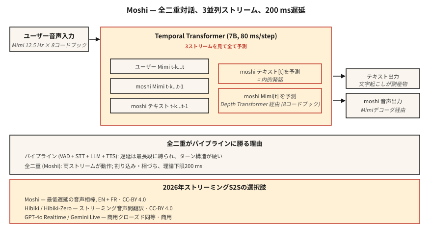

# Konuşmadan Konuşmaya Akış — Moshi, Hibiki ve Tam Çift Yönlü Diyalog

> 2024-2026 ses yapay zekasını yeniden tanımladı. Moshi, 200 ms gecikmeyle aynı anda dinleyen ve konuşan tek bir model sunuyor. Hibiki konuşmadan konuşmaya çeviriyi parça parça yapıyor. Her ikisi de Mimi codec'i token üzerinde birleşik bir tam çift yönlü mimari için ASR → Yüksek Lisans → TTS hattını terk ediyor. Bu yeni referans tasarımıdır.

**Tür:** Öğren
**Diller:** Python
**Önkoşullar:** Aşama 6 · 13 (Sinirsel Ses Codec'leri), Aşama 6 · 11 (Gerçek Zamanlı Ses), Aşama 7 · 05 (Tam Transformer)
**Süre:** ~75 dakika

## Sorun

Ders 11 + 12'den oluşturulan her agent sesinin 300-500 ms civarında temel bir gecikme tabanı vardır: VAD tetiklemeleri, STT işlemleri, LLM nedenleri, TTS oluşturur. Her aşamanın kendi minimum gecikme süresi vardır. Ayarlayabilir ve paralelleştirebilirsiniz ancak boru hattı şekli sizi sınırlıyor.

Moshi (Kyutai, 2024-2026) farklı bir soru soruyor: Peki ya boru hattı yoksa? Ya bir model, gerekli bir aşama yerine bir ara "iç monolog" olarak metinle birlikte sesi alıp doğrudan, sürekli olarak ses çıkışı verirse?

Cevap **tam çift yönlü konuşmadan konuşmaya**. Teorik gecikme süresi 160 ms (80 ms Mimi kare + 80 ms akustik gecikme). Tek bir L4 GPU'da pratik gecikme süresi 200 ms. Bu, sınıfının en iyisi ardışık düzene sahip ses agent'nin elde edebileceğinin yarısıdır.

## Konsept



### Moshi mimarisi

**Girişler.** İki Mimi codec akışı, her ikisi de 12,5 Hz × 8 kod kitabında:

- Akış 1: kullanıcı sesi (Mimi kodlu, sürekli gelen)
- Yayın 2: Moshi'nin kendi sesi (Moshi tarafından oluşturulmuştur)

**transformer.** 7B parametreli bir Geçici Transformer, hem akışları hem de bir metin "iç monolog" akışını işler. Her 80 ms'lik adımda:

1. En son kullanıcı Mimi token'leri (8 kod kitabı) kullanır.
2. En yeni Moshi Mimi token'leri (üretildiği şekliyle 8 kod kitabı) kullanır.
3. Sonraki Moshi metnini token (iç monolog) oluşturur.
4. Sonraki Moshi Mimi token'leri (küçük bir Derinlik Transformer aracılığıyla 8 kod kitabı) oluşturur.

Kullanıcı sesi, Moshi sesi, Moshi metni olmak üzere üç akışın tümü paralel olarak çalışır. Moshi kullanıcıyı konuşurken duyabiliyor; kullanıcı araya girdiğinde kendini kesebilir; ana ifadesini bozmadan arka kanal ("mhm") yapabilir.

**Derinlik transformer.** Bir çerçeve içinde, 8 kod kitabı paralel olarak tahmin edilmez; kod kitapları arası bağımlılıkları vardır. Küçük bir 2 katmanlı "derinlik transformer" bunları 80 ms içinde sırayla tahmin eder. Bu, AR codec LM'leri için standart çarpanlara ayırmadır (aynı zamanda VALL-E, VibeVoice tarafından da kullanılır).

### Monolog içi metin neden yardımcı olur?

Açık metin olmadan modelin, dili akustik akışında örtülü olarak modellemesi gerekir. Moshi'nin içgörüsü: sesin yanı sıra token metinlerini de yaymaya zorlamak. Metin akışı aslında Moshi'nin söylediklerinin transkripsiyonudur. Bu, anlamsal tutarlılığı artırır, dil modeli kafasını değiştirmeyi kolaylaştırır ve size ücretsiz olarak transkript sağlar.

### Hibiki: konuşmadan konuşmaya çeviri akışı

Çeviri çiftleri üzerinde eğitilmiş aynı mimari. Kaynak ses girişi, hedef dil ses çıkışı, sürekli. Hibiki-Zero (Şubat 2026), kelime düzeyinde hizalanmış eğitim verilerine olan ihtiyacı ortadan kaldırır; gecikme optimizasyonu için cümle düzeyinde veriler + GRPO takviyeli öğrenimi kullanır.

Başlangıçta dört dil çifti destekleniyor; ≈1000 saat ile yeni bir dile uyarlanabilir.

### Daha geniş Kyutai yığını (2026)

- **Moshi** — tam çift yönlü diyalog (önce Fransızca, İngilizce iyi desteklenir)
- **Hibiki / Hibiki-Zero** — eşzamanlı konuşma çevirisi
- **Kyutai STT** — ASR akışı (500 ms veya 2,5 sn ön izleme)
- **Kyutai Pocket TTS** — 100 milyon parametreli TTS, CPU'da çalışır (Ocak 2026)
- **Sesi aç** — bunları genel sunucularda birleştiren tam işlem hattı

L40S GPU'da verim: 3× gerçek zamanlı 64 eşzamanlı oturum.

### Susam CSM — kuzeni

Susam CSM (2025) de benzer bir fikir kullanıyor: Mimi codec kafasına sahip bir Llama-3 omurgası. Ancak CSM, tam çift yönlü olmaktan ziyade tek yönlüdür (bağlam + metni alır, konuşma üretir). Piyasadaki en iyi "sesli varlık" TTS'sidir; Moshi'nin tam çift yönlü yeteneği ile tam olarak aynı değil.

### 2026 performans rakamları

| Modeli | Gecikme | Kullanım örneği | Lisans |
|-------|---------|----------|---------|
| Moşi | 200 ms (L4) | tam çift yönlü İngilizce / Fransızca diyalog | CC-BY 4.0 |
| Hibiki | 12,5 Hz kare hızı | Fransızca ↔ İngilizce çeviri akışı | CC-BY 4.0 |
| Hibiki-Sıfır | aynı | 5 dil çifti, hizalanmış veri yok | CC-BY 4.0 |
| Susam CSM-1B | 200 ms TTFA | bağlam koşullu TTS | Apache-2.0 |
| GPT-4o Gerçek Zamanlı | ~300 ms | kapalı, OpenAI API | ticari |
| İkizler 2.5 Canlı | ~350 ms | kapalı, Google API | ticari |

## İnşa Et

### Adım 1: arayüz

Moshi, 80 ms'lik Mimi kodlu ses parçalarını alan ve 80 ms'lik Mimi kodlu ses parçalarını döndüren bir WebSocket sunucusunu kullanıma sunar. Her iki şekilde de. Sürekli.

```python
import asyncio
import websockets
from moshi.client_utils import encode_audio_mimi, decode_audio_mimi

async def moshi_chat():
    async with websockets.connect("ws://localhost:8998/api/chat") as ws:
        mic_task = asyncio.create_task(stream_mic_to(ws))
        spk_task = asyncio.create_task(stream_from_to_speaker(ws))
        await asyncio.gather(mic_task, spk_task)
```

### Adım 2: tam çift yönlü döngü

```python
async def stream_mic_to(ws):
    async for chunk_80ms in mic_stream_at_12_5_hz():
        mimi_tokens = encode_audio_mimi(chunk_80ms)
        await ws.send(serialize(mimi_tokens))

async def stream_from_to_speaker(ws):
    async for msg in ws:
        mimi_tokens, text_token = deserialize(msg)
        audio = decode_audio_mimi(mimi_tokens)
        await play(audio)
```

Her iki yön de aynı anda çalışır. Python asyncio veya Rust vadeli işlemleri standart taşımadır.

### Adım 3: eğitim hedefi (kavramsal)

Her 80 ms'lik çerçeve için `t`:

- Giriş: `user_mimi[0..t]`, `moshi_mimi[0..t-1]`, `moshi_text[0..t-1]`
- Tahmin: `moshi_text[t]`, ardından `moshi_mimi[t, codebook_0..7]`

Metin sesten önce tahmin edilir (iç monolog); sesin transformer derinliği dahilinde kod kitabı sıralı olduğu tahmin edilir.

### Adım 4: Moshi'nin kazandığı ve kazanamadığı yerler

Moshi kazanır:

- Ucuz donanımda uçtan uca 250 ms'nin altında.
- Doğal arka kanallar ve kesintiler.
- Boru hattı tutkal kodu yok.

Moshi kazanmıyor:

- Tool calling (bunun için eğitilmedi; ayrı bir Yüksek Lisans yoluna ihtiyacınız var).
- Uzun muhakeme (Moshi, Claude/GPT-4 değil, 8B benzeri bir diyalog modelidir).
- Niş konularda gerçek doğruluk.
- Çoğu üretim işletmesi kullanım senaryosu (2026'da hala boru hatları kullanılıyor).

## Kullan onu

| Durum | Seç |
|-----------|------|
| En düşük gecikmeli sesli yardımcı | Moşi |
| Canlı çeviri görüşmesi | Hibiki |
| Sesli demo / araştırma | Moshi, CSM |
| Araçlarla kurumsal agent | Boru Hattı (Ders 12), Moshi değil |
| Bağlamda özel sesli TTS | Susam CSM |
| Konuşmadan konuşmaya, herhangi bir dilde | GPT-4o Realtime veya Gemini 2.5 Live (ticari) |

## Tuzaklar

- **Sınırlı tool calling.** Moshi bir diyalog modelidir, agent framework değil. Aletler için boru hattıyla birleştirin.
- **Özel ses koşullandırma.** Moshi eğitimli tek bir kişiyi kullanır; klonlama ayrı bir eğitim çalışmasıdır.
- **Dil kapsamı.** Fransızca + İngilizce mükemmeldir; diğerleri sınırlıdır. Hibiki-Zero yardımcı olur, ancak yine de eğitim verilerine ihtiyacınız var.
- **Kaynak maliyeti.** Tam bir Moshi oturumunda bir GPU yuvası bulunur; ucuz bir paylaşılan kiracı dağıtım modeli değil.

## Gönderin

`outputs/skill-duplex-pipeline.md` olarak kaydedin. Sesli agent iş yükü için boru hattını ve tam çift yönlü mimariyi seçmek mantıklıdır.

## Egzersizler

1. **Kolay.** `code/main.py`'yi çalıştırın. İki akış + iç monolog mimarisini sembolik olarak simüle eder.
2. **Orta.** Moshi'yi HuggingFace'ten çekin, sunucuyu çalıştırın, bir konuşmayı test edin. Kullanıcı konuşmasının sonundan Moshi yanıtının başlangıcına kadar duvar saati gecikmesini ölçün.
3. **Zor.** Ders 12'deki agent ardışık düzenini alın ve 20 eşleşen test ifadesinde P50 gecikmesini Moshi ile karşılaştırın. Bir boru hattının mimari açıdan ne zaman kazanacağını yazın.

## Anahtar Terimler

| Dönem | İnsanlar ne diyor | Aslında ne anlama geliyor |
|------|-----------------|-----------------------|
| Tam çift yönlü | Aynı anda duyun ve konuşun | Aynı modelde aynı anda etkin olan iki ses akışı. |
| İç monolog | Modelin metin akışı | Moshi, ses çıkışının yanı sıra token metinlerini de yayar. |
| Derinlik transformer | Kod kitapları arası tahminci | 80 ms'lik bir çerçeve içinde 8 kod kitabını tahmin eden küçük transformer. |
| Mimi | Kyutai'nin kodeği | 12,5 Hz × 8 kod kitapları; anlamsal+akustik; Moshi'ye güç veriyor. |
| S2S Akışı | Ses → canlı ses | Parça parça çeviri/diyalog, ardışık düzen aşamaları yok. |
| Geri kanallama | "Mhm" tepkileri | Moshi sırasını bozmadan küçük teşekkür konuşmaları yapabilir. |

## Daha Fazla Okuma

- [Défossez ve ark. (2024). Moshi — konuşma metni temel modeli](https://arxiv.org/html/2410.00037v2) — makale.
- [Kyutai Laboratuvarları (2026). Hibiki-Zero](https://arxiv.org/abs/2602.12345) — hizalanmış veriler olmadan çeviri akışı.
- [Susam (2025). Esrarengiz ses vadisini geçmek](https://www.sesame.com/research/crossing_the_uncanny_valley_of_voice) — CSM spesifikasyonu.
- [Kyutai — Moshi repo](https://github.com/kyutai-labs/moshi) — kurulum + sunucu.
- [OpenAI — Gerçek Zamanlı API](https://platform.openai.com/docs/guides/realtime) — kapalı ticari eş.
- [Kyutai — Gecikmeli Akış Modellemesi](https://github.com/kyutai-labs/delayed-streams-modeling) — STT/TTS framework kaputun altında.
