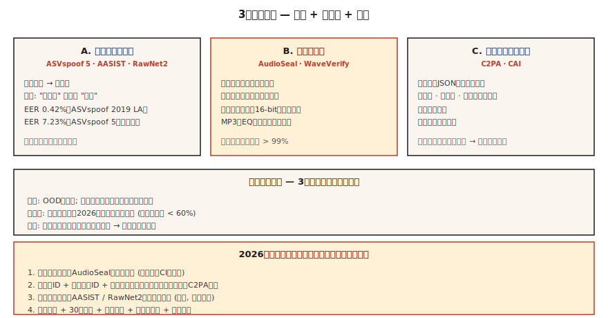

# Voice Anti-Spoofing & Audio Watermarking — ASVspoof 5、AudioSeal、WaveVerify

> Voice cloning は防御より速く出荷されました。2026 年の本番音声システムには 2 つが必要です。real vs fake speech を分類する detector (AASIST、RawNet2) と、圧縮や編集に耐える watermark (AudioSeal) です。両方を出荷するか、voice cloning を出荷しないかです。

**種別:** 構築
**言語:** Python
**前提条件:** Phase 6 · 06 (Speaker Recognition), Phase 6 · 08 (Voice Cloning)
**所要時間:** 約 75 分

## 問題

関連する防御は 3 つあります。

1. **Anti-spoofing / deepfake detection。** 音声クリップが与えられたとき、それは synthetic か real か。ASVspoof benchmarks (ASVspoof 2019 → 2021 → 5) が gold standard です。
2. **Audio watermarking。** 生成音声に不可聴の信号を埋め込み、後で detector が抽出できるようにします。AudioSeal (Meta) と WavMark がオープンな選択肢です。
3. **Authenticated provenance。** 音声ファイルと metadata の暗号署名です。C2PA / Content Authenticity Initiative。

Detection は協力しない攻撃者に対応します。Watermarking はコンプライアンスに対応します。AI-generated audio はそのように識別できるべきです。2026 年には両方が必要です。

## コンセプト



### ASVspoof 5 — 2024-2025 年の benchmark

以前の版からの最大の変更:

- **Crowdsourced data** (studio clean ではない) — 現実的な条件。
- **約 2000 speakers** (以前は約 100)。
- **32 attack algorithms。** TTS + voice conversion + adversarial perturbation。
- **2 tracks。** Countermeasure (CM) standalone detection と、biometric systems 向け Spoofing-robust ASV (SASV)。

ASVspoof 5 の state-of-the-art は約 7.23% EER。古い ASVspoof 2019 LA では 0.42% EER です。実世界展開では、in-the-wild clips で 5-10% EER を見込んでください。

### AASIST と RawNet2 — detection model families

**AASIST** (2021、2026 年まで更新)。spectral features 上の graph-attention。ASVspoof 5 countermeasure task の現在の SOTA です。

**RawNet2。** raw waveform 上の convolutional front-end + TDNN backbone。より単純な baseline ですが、fine-tuning すれば今でも競争力があります。

**NeXt-TDNN + SSL features。** 2025 年の変種です。ECAPA-style + WavLM features + focal loss。ASVspoof 2019 LA で 0.42% EER を達成します。

### AudioSeal — 2024 年の watermark default

Meta の **AudioSeal** (Jan 2024、v0.2 Dec 2024)。設計の要点:

- **Localized。** 16 kHz sample resolution (1/16000 s) でフレームごとに watermark を検出します。
- **Generator + detector jointly trained。** Generator は不可聴信号の埋め込みを学び、detector は augmentations を通してそれを見つけるよう学びます。
- **Robust。** MP3 / AAC compression、EQ、speed-shift ±10%、noise mix +10 dB SNR に耐えます。
- **Fast。** Detector は 485× realtime で動きます。WavMark より 1000× 速いです。
- **Capacity。** 16-bit payload (model ID、generation timestamp、user ID を符号化可能) を各 utterance に埋め込めます。

### WavMark

AudioSeal 以前のオープン baseline です。Invertible neural network、32 bits/sec。問題点:

- synchronization brute-force が遅い。
- Gaussian noise や MP3 compression で除去されることがある。
- real-time friendly ではない。

### WaveVerify (July 2025)

AudioSeal の弱点、特に temporal manipulations (reversal、speed) に対応します。FiLM-based generator + Mixture-of-Experts detector を使います。標準攻撃では AudioSeal と競争的で、temporal edits に対応します。

### 攻撃者が突くギャップ

AudioMarkBench より: "under pitch shift, all watermarks show Bit Recovery Accuracy below 0.6, indicating near-complete removal." **Pitch-shift は普遍的な攻撃です。** 2026 年時点で、強い pitch modification に完全に頑健な watermark はありません。だから watermarking と並行して detection (AASIST) が必要です。

### C2PA / Content Authenticity Initiative

ML 技術ではなく manifest format です。音声ファイルが、creation tool、author、date に関する暗号署名済み metadata を持ちます。Audobox / Seamless が使っています。provenance には有効ですが、悪意ある人物が再エンコードして metadata を剥がすと何もできません。

## 作ってみる

### Step 1: 単純な spectral-feature detector (toy)

```python
def spectral_rolloff(spec, percentile=0.85):
    cum = 0
    total = sum(spec)
    if total == 0:
        return 0
    threshold = total * percentile
    for k, v in enumerate(spec):
        cum += v
        if cum >= threshold:
            return k
    return len(spec) - 1

def is_suspicious(audio):
    spec = magnitude_spectrum(audio)
    rolloff = spectral_rolloff(spec)
    return rolloff / len(spec) > 0.92
```

Synthetic speech は高周波エネルギーが不自然に平坦なことがあります。本番 detectors はこのコードではなく AASIST を使います。ただし直感は同じです。

### Step 2: AudioSeal embed + detect

```python
from audioseal import AudioSeal
import torch

generator = AudioSeal.load_generator("audioseal_wm_16bits")
detector = AudioSeal.load_detector("audioseal_detector_16bits")

audio = load_wav("generated.wav", sr=16000)[None, None, :]
payload = torch.tensor([[1, 0, 1, 1, 0, 1, 0, 0, 1, 1, 0, 1, 0, 1, 1, 0]])
watermark = generator.get_watermark(audio, sample_rate=16000, message=payload)
watermarked = audio + watermark

result, decoded_payload = detector.detect_watermark(watermarked, sample_rate=16000)
# result: float in [0, 1] — probability of watermark presence
# decoded_payload: 16 bits; match against embedded payload
```

### Step 3: evaluation — EER

```python
def eer(real_scores, fake_scores):
    thresholds = sorted(set(real_scores + fake_scores))
    best = (1.0, 0.0)
    for t in thresholds:
        far = sum(1 for s in fake_scores if s >= t) / len(fake_scores)
        frr = sum(1 for s in real_scores if s < t) / len(real_scores)
        if abs(far - frr) < best[0]:
            best = (abs(far - frr), (far + frr) / 2)
    return best[1]
```

### Step 4: production integration

```python
def safe_tts(text, voice, clone_reference=None):
    if clone_reference is not None:
        verify_consent(user_id, clone_reference)
    audio = tts_model.synthesize(text, voice)
    audio_with_wm = audioseal_embed(audio, payload=build_payload(user_id, model_id))
    manifest = c2pa_sign(audio_with_wm, user_id, timestamp=now())
    return audio_with_wm, manifest
```

すべての生成は (1) watermark、(2) signed manifest、(3) retention-policy-compliant audit log を伴って出荷します。

## 使いどころ

| Use case | Defense |
|----------|---------|
| Shipping TTS / voice cloning | AudioSeal embed on every output (non-negotiable) |
| Biometric voice unlock | AASIST + ECAPA ensemble; liveness challenge |
| Call-center fraud detection | AASIST on 20% sample of incoming calls |
| Podcast authenticity | C2PA signing on upload, AudioSeal if AI-generated |
| Research / training detectors | ASVspoof 5 train/dev/eval sets |

## 落とし穴

- **Watermark without detector ever running。** 無意味です。detector を CI に入れて出荷します。
- **Detection without calibration。** ASVspoof LA で訓練した AASIST は過学習します。実世界精度は落ちます。自分のドメインで較正します。
- **Pitch-shift gap。** 強い pitch shift はほとんどの watermark を除去します。detection fallback を用意します。
- **Metadata strip-and-rehost。** C2PA は再エンコードで簡単に迂回できます。暗号的防御と知覚的防御 (watermark) を常に組み合わせます。
- **Liveness as detection。** ユーザーにランダムなフレーズを言わせます。replay attacks は防げますが、real-time cloning は防げません。

## 出荷する

`outputs/skill-spoof-defender.md` として保存します。voice-gen deployment 向けに detection model、watermark、provenance manifest、operational playbook を選びます。

## 演習

1. **Easy.** `code/main.py` を実行します。synthetic audio 上で toy detector + toy watermark embed/detect を動かします。
2. **Medium.** `audioseal` をインストールし、TTS output に 16-bit payload を埋め込み、再デコードします。ノイズで音声を壊し、Bit Recovery Accuracy を測ります。
3. **Hard.** ASVspoof 2019 LA で RawNet2 または AASIST を fine-tune します。EER を測ります。F5-TTS-generated clips の held-out set でテストし、OOD detection がどれだけ劣化するか確認します。

## 重要用語

| Term | What people say | What it actually means |
|------|-----------------|-----------------------|
| ASVspoof | The benchmark | 2 年ごとの challenge。2024 = ASVspoof 5。 |
| CM (countermeasure) | Detector | real speech と synthetic / converted を分類する classifier。 |
| SASV | Speaker verif + CM | biometric + spoof detection の統合。 |
| AudioSeal | Meta watermark | localized、16-bit payload、WavMark より 485× 速い。 |
| Bit Recovery Accuracy | Watermark survival | attack 後に復元できた payload bits の割合。 |
| C2PA | Provenance manifest | creation / authorship に関する暗号 metadata。 |
| AASIST | Detector family | graph-attention-based anti-spoofing SOTA。 |

## さらに読む

- [Todisco et al. (2024). ASVspoof 5](https://dl.acm.org/doi/10.1016/j.csl.2025.101825) — 現在の benchmark。
- [Defossez et al. (2024). AudioSeal](https://arxiv.org/abs/2401.17264) — watermark の既定選択。
- [Chen et al. (2025). WaveVerify](https://arxiv.org/abs/2507.21150) — temporal attacks 向け MoE detector。
- [Jung et al. (2022). AASIST](https://arxiv.org/abs/2110.01200) — SOTA detection backbone。
- [AudioMarkBench (2024)](https://proceedings.neurips.cc/paper_files/paper/2024/file/5d9b7775296a641a1913ab6b4425d5e8-Paper-Datasets_and_Benchmarks_Track.pdf) — robustness evaluation。
- [C2PA specification](https://c2pa.org/specifications/specifications/) — provenance manifest format。
