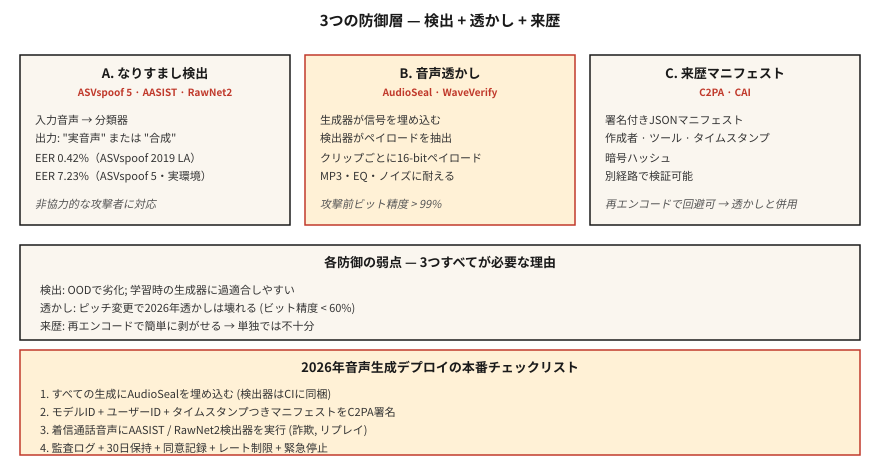

# Ses Sahtekarlığına Karşı Koruma ve Ses Filigranı — ASVspoof 5, AudioSeal, WaveVerify

> Ses klonlama, savunmalardan daha hızlı gönderilir. 2026 prodüksiyon ses sistemleri iki şeye ihtiyaç duyar: gerçek ve sahte konuşmayı sınıflandıran bir dedektör (AASIST, RawNet2) ve sıkıştırma ve düzenlemeye dayanıklı bir filigran (AudioSeal). Her ikisini de gönderin veya ses klonlamayı göndermeyin.

**Tür:** Yapım
**Diller:** Python
**Önkoşullar:** Aşama 6 · 06 (Konuşmacı Tanıma), Aşama 6 · 08 (Ses Klonlama)
**Süre:** ~75 dakika

## Sorun

İlgili üç savunma:

1. **Sahtekarlığa karşı koruma / derin sahte algılama.** Bir ses klibi verildiğinde sentetik mi yoksa gerçek mi? ASVspoof benchmark'lar (ASVspoof 2019 → 2021 → 5) altın standarttır.
2. **Ses filigranı.** Oluşturulan sese, dedektörün daha sonra çıkarabileceği algılanamayan bir sinyal ekleyin. AudioSeal (Meta) ve WavMark açık seçeneklerdir.
3. **Kimliği doğrulanmış kaynak.** Ses dosyalarının ve meta verilerin kriptografik olarak imzalanması. C2PA / İçerik Orijinalliği Girişimi.

Tespit, işbirliği yapmayan düşmanları ele alır. Filigranlama uyumluluğu yönetir; yapay zeka tarafından oluşturulan ses bu şekilde tanımlanabilir olmalıdır. Her ikisi de 2026'da gerekli.

## Konsept



### ASVspoof 5 — 2024-2025 benchmark

Önceki basımlara göre en büyük değişiklik:

- **Kitle kaynaklı veriler** (stüdyo temizliğinde değil) — gerçekçi koşullar.
- **~2000 hoparlör** (önceki ~100 hoparlöre kıyasla).
- **32 saldırı algoritması.** TTS + ses dönüşümü + düşmanca tedirginlik.
- **İki parça.** Karşı tedbir (CM) bağımsız tespiti; Biyometrik sistemler için kimlik sahtekarlığına dayanıklı ASV (SASV).

ASVspoof 5'te son teknoloji: ~%7,23 EER. Daha eski ASVspoof 2019 LA'de: %0,42 EER. Gerçek dünya deployment: Vahşi kliplerde %5-10 EER bekliyoruz.

### AASIST ve RawNet2 — algılama modeli aileleri

**AASIST** (2021, 2026'ya kadar güncellendi). Spektral özelliklere ilişkin grafik dikkati. ASVspoof 5 karşı önlem görevinde mevcut SOTA.

**RawNet2.** Ham dalga biçimi + TDNN omurgası üzerinden evrişimli ön uç. Daha basit temel; fine-tuning ile hâlâ rekabet halindeyiz.

**NeXt-TDNN + SSL özellikleri.** 2025 modeli: ECAPA tarzı + WavLM özellikleri + odak kaybı. ASVspoof 2019 LA'da %0,42 EER'ye ulaştı.

### AudioSeal — 2024 filigranı varsayılanı

Meta'nın **AudioSeal** (Ocak 2024, v0.2 Aralık 2024). Anahtar tasarımı:

- **Yerelleştirilmiş.** 16 kHz örnek çözünürlükte (1/16000 s) kare başına filigranı algılar.
- **Jeneratör + dedektör birlikte eğitilmiştir.** Jeneratör, duyulamayan sinyali yerleştirmeyi öğrenir; dedektör, büyütmeler yoluyla onu bulmayı öğrenir.
- **Sağlam.** MP3 / AAC sıkıştırmasına, EQ'ya, hız değişimine ±%10, gürültü karışımına +10 dB SNR'ye dayanır.
- **Hızlı.** Dedektör 485× gerçek zamanlı hızda çalışır; WavMark'tan 1000 kat daha hızlı.
- **Kapasite.** Her ifadeye yerleştirilebilir 16 bitlik yük (model kimliğini, oluşturma zaman damgasını, kullanıcı kimliğini kodlayabilir).

### WavMark

AudioSeal öncesi açık taban çizgisi. Tersine çevrilebilir neural network, 32 bit/sn. Sorunlar:

- Senkronizasyon kaba kuvveti yavaştır.
- Gauss gürültüsü veya MP3 sıkıştırmasıyla kaldırılabilir.
- Gerçek zamanlı dostu değil.

### WaveVerify (Temmuz 2025)

AudioSeal'in zayıf yönlerini, özellikle de zamansal manipülasyonları (geri alma, hız) giderir. FiLM tabanlı oluşturucu + Uzmanların Karışımı dedektörünü kullanır. Standart saldırılarda AudioSeal ile rekabet edebilir; zamansal düzenlemeleri yönetir.

### Rakiplerin yararlandığı boşluk

AudioMarkBench'ten: "perde değişimi altında, tüm filigranlar Bit Kurtarma Doğruluğunu 0,6'nın altında gösteriyor, bu da neredeyse tamamen kaldırıldığını gösteriyor." **Pitch-shift evrensel bir saldırıdır.** Hiçbir 2026 filigranı, agresif perde değişikliklerine karşı tamamen dayanıklı değildir. Bu nedenle filigranlamanın yanı sıra algılamaya (AASIST) ihtiyacınız var.

### C2PA / İçerik Orijinalliği Girişimi

Bir makine öğrenimi tekniği değil, bir bildirim biçimi. Ses dosyaları, oluşturma aracı, yazar ve tarih hakkında kriptografik olarak imzalanmış meta veriler taşır. Audobox / Seamless'ı kullanın. Köken açısından iyi; Kötü bir aktör meta verileri yeniden kodlayıp çıkardığında hiçbir şey yapmaz.

## İnşa Et

### Adım 1: basit bir spektral özellikli dedektör (oyuncak)

```python
def spectral_rolloff(spec, percentile=0.85):
    cum = 0
    total = sum(spec)
    if total == 0:
        return 0
    threshold = total * percentile
    for k, v in enumerate(spec):
        cum += v
        if cum >= threshold:
            return k
    return len(spec) - 1

def is_suspicious(audio):
    spec = magnitude_spectrum(audio)
    rolloff = spectral_rolloff(spec)
    return rolloff / len(spec) > 0.92
```

Sentetik konuşma genellikle alışılmadık derecede düz yüksek frekans enerjisine sahiptir. Üretim dedektörleri bunu değil AASIST'i kullanır. Ama sezgi geçerli.

### Adım 2: AudioSeal yerleştirme + algılama

```python
from audioseal import AudioSeal
import torch

generator = AudioSeal.load_generator("audioseal_wm_16bits")
detector = AudioSeal.load_detector("audioseal_detector_16bits")

audio = load_wav("generated.wav", sr=16000)[None, None, :]
payload = torch.tensor([[1, 0, 1, 1, 0, 1, 0, 0, 1, 1, 0, 1, 0, 1, 1, 0]])
watermark = generator.get_watermark(audio, sample_rate=16000, message=payload)
watermarked = audio + watermark

result, decoded_payload = detector.detect_watermark(watermarked, sample_rate=16000)
# result: float in [0, 1] — probability of watermark presence
# decoded_payload: 16 bits; match against embedded payload
```

### Adım 3: değerlendirme — EER

```python
def eer(real_scores, fake_scores):
    thresholds = sorted(set(real_scores + fake_scores))
    best = (1.0, 0.0)
    for t in thresholds:
        far = sum(1 for s in fake_scores if s >= t) / len(fake_scores)
        frr = sum(1 for s in real_scores if s < t) / len(real_scores)
        if abs(far - frr) < best[0]:
            best = (abs(far - frr), (far + frr) / 2)
    return best[1]
```

### Adım 4: üretim entegrasyonu

```python
def safe_tts(text, voice, clone_reference=None):
    if clone_reference is not None:
        verify_consent(user_id, clone_reference)
    audio = tts_model.synthesize(text, voice)
    audio_with_wm = audioseal_embed(audio, payload=build_payload(user_id, model_id))
    manifest = c2pa_sign(audio_with_wm, user_id, timestamp=now())
    return audio_with_wm, manifest
```

Her nesil şunları gönderir: (1) filigran, (2) imzalı bildirim, (3) saklama politikasına uygun denetim günlüğü.

## Kullan onu

| Kullanım örneği | Savunma |
|----------|---------|
| Nakliye TTS / ses klonlama | AudioSeal her çıktıya gömülüdür (pazarlık edilemez) |
| Biyometrik sesle kilit açma | AASIST + ECAPA topluluğu; canlılık mücadelesi |
| Çağrı merkezi dolandırıcılık tespiti | Gelen çağrıların %20 örneğinde AASIST |
| Podcast özgünlüğü | Yükleme sırasında C2PA imzalama, yapay zeka tarafından oluşturulmuşsa AudioSeal |
| Araştırma / eğitim dedektörleri | ASVspoof 5 eğitim/geliştirme/değerlendirme seti |

## Tuzaklar

- **Dedektör olmadan filigran hiç çalışmıyor.** Anlamsız. Dedektörü CI'nızda gönderin.
- **Kalibrasyon olmadan algılama.** AASIST, ASVspoof LA üst donanımları konusunda eğitilmiştir; gerçek dünyadaki doğruluk düşer. Alanınızda kalibre edin.
- **Pitch-shift boşluğu.** Agresif perde kaydırma çoğu filigranı kaldırır. Algılama geri dönüşüne sahip olun.
- **Meta verileri şeritleme ve yeniden barındırma.** C2PA, yeniden kodlamayla kolaylıkla atlanabilir. Her zaman kriptografik + algısal (filigran) savunmasını birlikte ekleyin.
- **Algılama olarak canlılık.** Kullanıcıdan rastgele bir ifade söylemesini isteyin. Tekrarlama saldırılarını önler ancak gerçek zamanlı klonlamayı engellemez.

## Gönderin

`outputs/skill-spoof-defender.md` olarak kaydet. Bir ses oluşturma deployment için algılama modelini, filigranı, kaynak bildirimini ve operasyonel taktik kitabını seçin.

## Egzersizler

1. **Kolay.** `code/main.py` komutunu çalıştırın. Oyuncak dedektörü + oyuncak filigranı sentetik sese yerleştirme/algılama.
2. **Orta.** `audioseal`'yi yükleyin, bir TTS çıkışına 16 bitlik bir veri gömün, kodu yeniden çözün. Sesi gürültüyle bozun ve Bit Kurtarma Doğruluğunu ölçün.
3. **Zor.** ASVspoof 2019 LA'da RawNet2 veya AASIST'e ince ayar yapın. EER'yi ölçün. F5-TTS tarafından oluşturulan uzun bir dizi klip üzerinde test yapın; OOD tespitinin nasıl kötüleştiğini görün.

## Anahtar Terimler

| Dönem | İnsanlar ne diyor | Aslında ne anlama geliyor |
|------|-----------------|-----------------------|
| ASV sahtekarlığı | benchmark | Bienal mücadelesi; 2024 = ASVspoof 5. |
| CM (karşı önlem) | Dedektör | Sınıflandırıcı: gerçek konuşma vs sentetik / dönüştürülmüş. |
| SASV | Hoparlör doğrulaması + CM | Entegre biyometrik + sahtekarlık tespiti. |
| Ses Mührü | Meta filigranı | Yerelleştirilmiş, 16 bit veri kapasitesi, WavMark'tan 485 kat daha hızlı. |
| Bit Kurtarma Doğruluğu | Filigran hayatta kalma | Saldırıdan sonra kurtarılan yük bitlerinin bir kısmı. |
| C2PA | Köken manifestosu | Yaratılış / yazarlıkla ilgili kriptografik meta veriler. |
| AASİST | Dedektör ailesi | Grafik dikkati tabanlı sahteciliğe karşı SOTA. |

## Daha Fazla Okuma

- [Todisco ve ark. (2024). ASVspoof 5](https://dl.acm.org/doi/10.1016/j.csl.2025.101825) — geçerli benchmark.
- [Defossez ve ark. (2024). AudioSeal](https://arxiv.org/abs/2401.17264) — varsayılan filigran.
- [Chen ve ark. (2025). WaveVerify](https://arxiv.org/abs/2507.21150) — Geçici saldırılar için MoE dedektörü.
- [Jung ve ark. (2022). AASIST](https://arxiv.org/abs/2110.01200) — SOTA algılama omurgası.
- [AudioMarkBench (2024)](https://proceedings.neurips.cc/paper_files/paper/2024/file/5d9b7775296a641a1913ab6b4425d5e8-Paper-Datasets_and_Benchmarks_Track.pdf) — sağlamlık değerlendirmesi.
- [C2PA spesifikasyonu](https://c2pa.org/specifications/specifications/) — kaynak bildirim biçimi.
