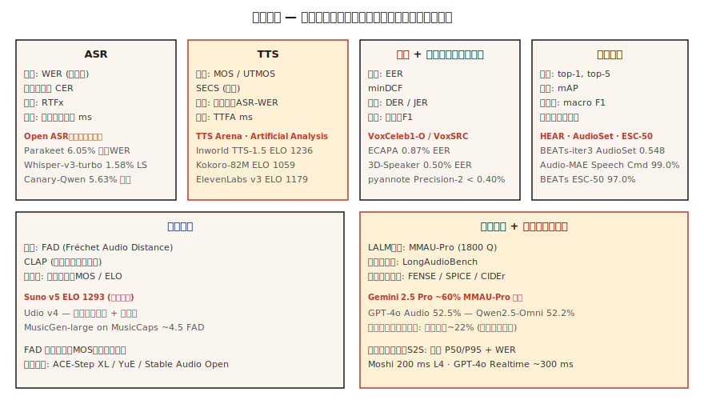

# Avaliação de Áudio — WER, MOS, UTMOS, MMAU, FAD e os Leaderboards Abertos

> Você não pode lançar o que não consegue medir. Esta aula lista as métricas de 2026 para cada tarefa de áudio: ASR (WER, CER, RTFx), TTS (MOS, UTMOS, SECS, WER-no-ida-e-volta-ASR), áudio-linguagem (MMAU, LongAudioBench), música (FAD, CLAP) e locutor (EER). Mais os rankings onde você compara.

**Tipo:** Aprender
**Linguagens:** Python
**Pré-requisitos:** Fase 6 · 04, 06, 07, 09, 10; Fase 2 · 09 (Avaliação de Modelos)
**Tempo:** ~60 minutos

## O Problema

Cada tarefa de áudio tem múltiplas métricas, cada uma medindo um eixo diferente. Usar a métrica errada é como lançar um modelo que parece ótimo no dashboard e péssimo em produção. A lista canônica de 2026:

|| Tarefa | Primária | Secundária |
||--------|---------|-----------|
|| ASR | WER | CER · RTFx · latência do primeiro token |
|| TTS | MOS / UTMOS | SECS · WER-no-ida-e-volta-ASR · CER · TTFA |
|| Clonagem de voz | SECS (cosseno ECAPA) | MOS · CER |
|| Verificação de locutor | EER | minDCF · FAR / FRR no ponto operacional |
|| Diarização | DER | JER · confusão de locutores |
|| Classificação de áudio | top-1 · mAP | F1 macro · recall por classe |
|| Geração musical | FAD | CLAP · MOS de painel de audição |
|| Modelo de linguagem de áudio | MMAU-Pro | LongAudioBench · AudioCaps FENSE |
|| S2S streaming | latência P50/P95 | WER · MOS |

## O Conceito



### Métricas de ASR

**WER (Word Error Rate).** `(S + D + I) / N`. Minúsculas, remove pontuação, normaliza números antes de pontuar. Use `jiwer` ou `whisper_normalizer` da OpenAI. < 5% = fala lida em paridade com humanos.

**CER (Character Error Rate).** Mesma fórmula, no nível de caractere. Usado para idiomas tons (Mandarim, Cantonês) onde a segmentação de palavras é ambígua.

**RTFx (fator de tempo real inverso).** Segundos de áudio processados por segundo de relógio. Quanto maior, melhor. Parakeet-TDT alcança 3380×. Whisper-large-v3 fica em ~30×.

**Latência do primeiro token.** Tempo de relógio desde a entrada de áudio até o primeiro token da transcrição. Crítico para streaming. Deepgram Nova-3: ~150 ms.

### Métricas de TTS

**MOS (Mean Opinion Score).** Nota humana de 1-5. Padrão ouro, mas lento. Colete 20+ ouvintes por amostra, 100+ amostras por modelo.

**UTMOS (2022-2026).** Preditor de MOS treinado. Correlaciona ~0,9 com MOS humano em benchmarks padrão. F5-TTS: UTMOS 3,95; ground truth: 4,08.

**SECS (Speaker Encoder Cosine Similarity).** Para clonagem de voz. Cosseno do embedding ECAPA entre referência e saída clonada. > 0,75 = clone reconhecível.

**WER-no-ida-e-volta-ASR.** Rode Whisper sobre a saída do TTS, calcule WER em relação ao texto de entrada. Detecta regressões de inteligibilidade. SOTA 2026: < 2% CER.

**TTFA (time-to-first-audio).** Latência de relógio. Kokoro-82M: ~100 ms; F5-TTS: ~1 s.

### Eespecificaçãoífico de clonagem de voz

**SECS + MOS + CER** como trio. Clonagem com SECS alto mas MOS baixo significa timbre certo mas voz antinatural; o oposto significa voz natural mas locutor errado.

### Verificação de locutor

**EER (Equal Error Rate).** O limiar onde a Taxa de Falso Aceite iguala a Taxa de Falso Rejeite. ECAPA no VoxCeleb1-O: 0,87%.

**minDCF (min Detection Cost).** Custo ponderado em um ponto operacional escolhido (geralmente FAR=0,01). Mais relevante para produção que EER.

### Diarização

**DER (Diarization Error Rate).** `(FA + Miss + Confusion) / total_speaker_time`. Fala perdida + falso alarme + confusão de locutores, cada um como fração. Reuniões AMI: DER ~10-20% é realista. pyannote 3.1 + Precision-2 comercial: <10% DER em áudio bem gravado.

**JER (Jaccard Error Rate).** Alternativa ao DER, robusto a viés de segmentos curtos.

### Classificação de áudio

Multirrótulo: **mAP (mean Average Precision)** sobre todas as classes. AudioSet: 0,548 mAP para BEATs-iter3.

Multiclasse exclusivo: **top-1, top-5 accuracy**. Speech Commands v2: 99,0% top-1 (Audio-MAE).

Desbalanceado: **F1 macro** + **recall por classe**. Reporte por classe — a acurácia agregada esconde quais classes falham.

### Geração musical

**FAD (Fréchet Audio Distance).** Distância entre distribuições de embeddings VGGish de áudio real vs gerado. MusicGen-small no MusicCaps: 4,5. MusicLM: 4,0. Quanto menor, melhor.

**CLIP Score.** Pontuação de alinhamento texto-áudio usando embeddings CLAP. > 0,3 = alinhamento razoável.

**MOS de painel de audição.** Ainda a palavra final para música de qualidade consumer. Suno v5 ELO 1293 no TTS Arena (de preferências humanas pareadas).

### Benchmarks de áudio-linguagem

**MMAU (Massive Multi-Audio Understanding).** 10k pares áudio-QA.

**MMAU-Pro.** 1800 itens difíceis, quatro categorias: fala / som / música / multiaáudio. Chance aleatória 25% em 4 vias. Gemini 2.5 Pro geral ~60%; multiaáudio ~22% em todos os modelos.

**LongAudioBench.** Clips multi-minuto com consultas semânticas. Audio Flamingo Next supera Gemini 2.5 Pro.

**AudioCaps / Clotho.** Benchmarks de legendagem. Métricas SPICE, CIDEr, FENSE.

### Fala-a-fala em streaming

**Latência P50 / P95 / P99.** Tempo de relógio do fim da fala do usuário até a primeira resposta audível. Moshi: 200 ms; GPT-4o Realtime: 300 ms.

**WER / MOS** na saída.

**Reatividade de interrupção.** Tempo do momento que o usuário interrompe até o assistente silenciar. Meta < 150 ms.

### Os rankings de 2026

|| Leaderboard | Faixas | URL |
||------------|--------|-----|
|| Open ASR Leaderboard (HF) | Inglês + multilíngue + long-form | `huggingface.co/spaces/hf-audio/open_asr_leaderboard` |
|| TTS Arena (HF) | TTS em inglês | `huggingface.co/spaces/TTS-AGI/TTS-Arena` |
|| Artificial Analysis Speech | TTS + STT, ELO de votos pareados | `artificialanalysis.ai/speech` |
|| MMAU-Pro | Raciocínio LALM | `mmaubenchmark.github.io` |
|| SpeakerBench / VoxSRC | Reconhecimento de locutor | `voxsrc.github.io` |
|| Subconjunto musical MMAU | Music LALM | (dentro do MMAU) |
|| HEAR benchmark | Áudio auto-supervisionado | `hearbenchmark.com` |

## Construa

### Passo 1: WER com normalização

```python
from jiwer import wer, Compose, ToLowerCase, RemovePunctuation, Strip

transform = Compose([ToLowerCase(), RemovePunctuation(), Strip()])
score = wer(
    truth="Please turn on the lights.",
    hypothesis="please turn on the light",
    truth_transform=transform,
    hypothesis_transform=transform,
)
# ~0.17
```

### Passo 2: WER de ida-e-volta TTS

```python
def ttr_wer(tts_model, asr_model, texts):
    errors = []
    for txt in texts:
        audio = tts_model.synthesize(txt)
        recog = asr_model.transcribe(audio)
        errors.append(wer(truth=txt, hypothesis=recog))
    return sum(errors) / len(errors)
```

### Passo 3: SECS para clonagem de voz

```python
from speechbrain.inference.speaker import EncoderClassifier
sv = EncoderClassifier.from_hparams("speechbrain/spkrec-ecapa-voxceleb")

emb_ref = sv.encode_batch(load_wav("reference.wav"))
emb_clone = sv.encode_batch(load_wav("cloned.wav"))
secs = torch.nn.functional.cosine_similarity(emb_ref, emb_clone, dim=-1).item()
```

### Passo 4: FAD para geração musical

```python
from frechet_audio_distance import FrechetAudioDistance
fad = FrechetAudioDistance()
score = fad.get_fad_score("generated_folder/", "reference_folder/")
```

### Passo 5: EER para verificação de locutor (mesmo código da Aula 6)

```python
def eer(same_scores, diff_scores):
    thresholds = sorted(set(same_scores + diff_scores))
    best = (1.0, 0.0)
    for t in thresholds:
        far = sum(1 for s in diff_scores if s >= t) / len(diff_scores)
        frr = sum(1 for s in same_scores if s < t) / len(same_scores)
        if abs(far - frr) < best[0]:
            best = (abs(far - frr), (far + frr) / 2)
    return best[1]
```

## Use

Acople cada implantação com um harness de avaliação fixo que roda a cada atualização de modelo. Três regras fundamentais:

1. **Normalize antes de pontuar.** Minúsculas, remove pontuação, expande números. Reporte a regra de normalização.
2. **Reporte distribuições, não médias.** P50/P95/P99 para latência. Recall por classe para classificação. Por categoria para MMAU.
3. **Execute um benchmark público canônico.** Mesmo que seus dados de produção diferem, reportar no Open ASR / TTS Arena / MMAU permite que revisores comparem igual com igual.

## Armadilhas

- **Extrapolação do UTMOS.** Treinado com fala limpa estilo VCTK; pontua mal áudio ruidoso/clonado/emocional.
- **Viés de painel MOS.** 20 trabalhadores do Amazon Mechanical Turk ≠ 20 usuários-alvo. Pague um painel de domínio se as consequências são altas.
- **FAD depende do conjunto de referência.** Compare contra a mesma distribuição de referência entre modelos.
- **WER agregado.** Um WER de 5% no geral pode esconder 30% WER em fala com sotaque. Reporte por fatia demográfica.
- **Saturação de benchmark público.** A maioria dos modelos de fronteira está perto do teto em benchmarks padrão. Construa um conjunto interno que reflita seu tráfego.

## Entregue

Salve como `outputs/skill-audio-evaluator.md`. Escolha métricas, benchmarks e formato de reporte para qualquer lançamento de modelo de áudio.

## Exercícios

1. **Fácil.** Execute `code/main.py`. Calcule WER / CER / EER / SECS / FAD-ish / MMAU-ish em entradas de brinquedo.
2. **Médio.** Construa um harness de WER de ida-e-volta TTS. Passe sua saída Kokoro ou F5-TTS pelo Whisper. Calcule WER em 50 prompts. Sinalize prompts com WER > 10%.
3. **Difícil.** Pontue sua escolha de LALM da Aula 10 nos subconjuntos de fala + multiaáudio do MMAU-Pro (50 itens cada). Reporte acurácia por categoria e compare com os números publicados.

## Termos Chave

|| Termo | O que as pessoas dizem | O que realmente significa |
||------|-----------------|-----------------------|
|| WER | Pontuação ASR | `(S+D+I)/N` no nível de palavra após normalização. |
|| CER | WER de caractere | Para idiomas tonais ou sistemas no nível de caractere. |
|| MOS | Opinião humana | Nota 1-5; 20+ ouvintes × 100 amostras. |
|| UTMOS | Preditor ML de MOS | Modelo treinado; correlaciona ~0,9 com MOS humano. |
|| SECS | Similaridade de clonagem de voz | Cosseno ECAPA entre referência e clone. |
|| EER | Pontuação de verificação de locutor | Limiar onde FAR = FRR. |
|| DER | Pontuação de diarização | (FA + Miss + Confusion) / total. |
|| FAD | Qualidade de geração musical | Distância Fréchet em embeddings VGGish. |
|| RTFx | Throughput | Segundos de áudio por segundo de relógio. |

## Leituras Complementares

- [jiwer](https://github.com/jitsi/jiwer) — biblioteca WER/CER com utilitários de normalização.
- [UTMOS (Saeki et al. 2022)](https://arxiv.org/abs/2204.02152) — preditor de MOS treinado.
- [Fréchet Audio Distance (Kilgour et al. 2019)](https://arxiv.org/abs/1812.08466) — o padrão para geração musical.
- [Open ASR Leaderboard](https://huggingface.co/spaces/hf-audio/open_asr_leaderboard) — rankings ao vivo de 2026.
- [TTS Arena](https://huggingface.co/spaces/TTS-AGI/TTS-Arena) — ranking de TTS por votos humanos.
- [MMAU-Pro benchmark](https://mmaubenchmark.github.io/) — ranking de raciocínio LALM.
- [HEAR benchmark](https://hearbenchmark.com/) — benchmarks de SSL de áudio.
