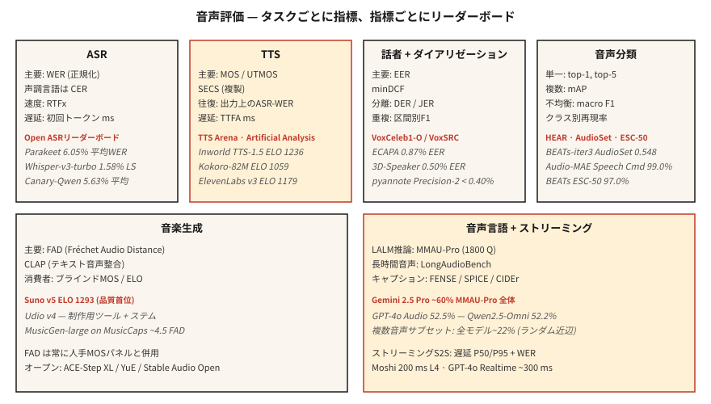

# Ses Değerlendirmesi — WER, MOS, UTMOS, MMAU, FAD ve Açık Skor Tabloları

> Ölçemediğiniz şeyi gönderemezsiniz. Bu ders her ses görevi için 2026 metriğini adlandırır: ASR (WER, CER, RTFx), TTS (MOS, UTMOS, SECS, WER-on-ASR-gidiş-dönüş), ses dili (MMAU, LongAudioBench), müzik (FAD, CLAP) ve hoparlör (EER). Ayrıca karşılaştırdığınız skor tabloları.

**Tür:** Öğren
**Diller:** Python
**Önkoşullar:** Aşama 6 · 04, 06, 07, 09, 10; Aşama 2 · 09 (Model Değerlendirmesi)
**Süre:** ~60 dakika

## Sorun

Her ses görevinin, her biri farklı bir ekseni ölçen birden fazla ölçümü vardır. Yanlış ölçümü kullanmak, kontrol panelinizde harika görünen ve üretimde berbat görünen bir modeli nasıl göndereceğinizdir. 2026 kanonik listesi:

| Görev | Birincil | İkincil |
|------|---------|-----------|
| ASR | WER | CER · RTFx · ilk-token gecikme |
| TTS | MOS / UTMOS | SECS · ASR'de gidiş-dönüş WER · CER · TTFA |
| Ses klonlama | SECS (ECAPA kosinüs) | MOS · CER |
| Konuşmacı doğrulaması | EER | minDCF · FAR / FRR çalışma noktasında |
| Günlükleştirme | DER | JER · konuşmacı karışıklığı |
| Ses sınıflandırması | ilk-1 · mAP | makro F1 · sınıf başına geri çağırma |
| Müzik üretimi | FAD | CLAP · dinleme paneli MOS |
| Ses dili modeli | MMAU-Pro | LongAudioBench · AudioCaps FENSE |
| S2S Akışı | gecikme P50/P95 | WER · MOS |

## Konsept



### ASR ölçümleri

**WER (Kelime Hata Oranı).** `(S + D + I) / N`. Küçük harf, noktalama işaretlerini soyun, puanlamadan önce sayıları normalleştirin. `jiwer` veya OpenAI'nin `whisper_normalizer`'sini kullanın. < %5 = insan benzeri okuma konuşması.

**CER (Karakter Hata Oranı).** Aynı formül, karakter düzeyinde. Kelime segmentasyonunun belirsiz olduğu ton dilleri (Mandarin, Kantonca) için kullanılır.

**RTFx (ters gerçek zaman faktörü).** Duvar saati saniyesi başına işlenen ses saniyesi. Daha yüksek daha iyidir. Parakeet-TDT 3380x'e ulaşıyor. Whisper-large-v3 ~30× değerindedir.

**İlk-token gecikme.** Ses girişinden ilk transkript token'e kadar duvar saati. Akış için kritik. Deepgram Nova-3: ~150 ms.

### TTS metrikleri

**MOS (Ortalama Görüş Puanı).** 1-5 insan derecelendirmesi. Altın standart ama yavaş. Örnek başına 20'den fazla dinleyici, model başına 100'den fazla örnek toplayın.

**UTMOS (2022-2026).** Öğrenilmiş MOS tahmincisi. Standart benchmark'larda insan MOS'u ile ~0,9 korelasyon gösterir. F5-TTS: UTMOS 3.95; temel gerçek: 4.08.

**SECS (Hoparlör Kodlayıcı Kosinüs Benzerliği).** Ses klonlama için. ECAPA embedding referans ve klonlanmış çıktı arasında kosinüs. > 0,75 = tanınabilir klon.

**ASR üzerinde gidiş-dönüş WER.** TTS çıkışı üzerinden Whisper'ı çalıştırın, giriş metnine göre WER'yi hesaplayın. Anlaşılabilirlik regresyonlarını yakalar. 2026 SOTA: < %2 CER.

**TTFA (ilk sese kadar geçen süre).** Duvar saati gecikmesi. Kokoro-82M: ~100 ms; F5-TTS: ~1 sn.

### Ses klonlamaya özel

**SECS + MOS + CER** üçlü olarak. Yüksek SECS puanı alan, ancak düşük MOS puanı alan klonlama, tını doğru ama doğal olmayan anlamına gelir; bunun tersi ise doğal ses fakat yanlış konuşmacı anlamına gelir.

### Konuşmacı doğrulaması

**EER (Eşit Hata Oranı).** Yanlış Kabul Oranının Yanlış Reddetme Oranına eşit olduğu eşik. VoxCeleb1-O'da ECAPA: %0,87.

**minDCF (min. Tespit Maliyeti).** Seçilen bir işletim noktasında ağırlıklı maliyet (genellikle FAR=0,01). EER'den daha fazla üretimle ilgilidir.

### Günlükleştirme

**DER (Günlükleştirme Hata Oranı).** `(FA + Miss + Confusion) / total_speaker_time`. Kaçırılan konuşma + yanlış alarm konuşması + konuşmacının kafa karışıklığı, her biri kesir olarak. AMI toplantıları: DER ~%10-20 gerçekçidir. pyannote 3.1 + Precision-2 reklamı: İyi kaydedilmiş seste <%10 DER.

**JER (Jaccard Hata Oranı).** DER'ye alternatif, kısa segment sapmasına karşı dayanıklı.

### Ses sınıflandırması

Çoklu etiket: Tüm sınıflarda **mAP (ortalama Hassasiyet)**. AudioSet: BEATs-iter3 için 0,548 mAP.

Çoklu sınıfa özel: **en iyi 1, en iyi 5 doğruluk**. Konuşma Komutları v2: %99,0 ilk-1 (Ses-MAE).

Dengesiz: **makro F1** + **sınıf başına geri çağırma**. Sınıf başına rapor — toplam doğruluk, hangi sınıfların başarısız olduğunu gizler.

### Müzik üretimi

**FAD (Fréchet Audio Distance).** Gerçek ve oluşturulan sesin VGGish-embedding dağılımları arasındaki mesafe. MusicCaps'te MusicGen-small: 4.5. MüzikLM: 4.0. Daha düşük.

**CLAP Puanı.** CLAP embedding'leri kullanan metin-ses hizalama puanı. > 0,3 = makul hizalama.

**MOS dinleme paneli.** Tüketici sınıfı müzik için hala son söz. TTS Arena'da Suno v5 ELO 1293 (eşleştirilmiş insan tercihlerinden).

### Ses dili benchmarks

**MMAU (Massive Multi-Audio Understanding).** 10 bin ses-QA çifti.

**MMAU-Pro.** 1800 sert öğe, dört kategori: konuşma / ses / müzik / çoklu ses. Rastgele şans 4 yönlüde %25. Gemini 2.5 Pro genel olarak ~%60; çoklu ses tüm modellerde ~%22.

**LongAudioBench.** Anlamsal sorgular içeren çok dakikalık klipler. Audio Flamingo Next, Gemini 2.5 Pro'yu yener.

**AudioCaps / Clotho.** Altyazı ekleme benchmarks. SPICE, CIDEr, FENSE ölçümleri.

### Konuşmadan konuşmaya akış

**Gecikme P50 / P95 / P99.** Kullanıcının konuşmasının sonundan ilk sesli yanıta kadar duvar saati. Moshi: 200 ms; GPT-4o Gerçek Zamanlı: 300 ms.

Çıkışta **WER / MOS**.

**Katılma yanıt verme hızı.** Kullanıcının araya girmesinden asistanın sesini kapatmasına kadar geçen süre. Hedef < 150 ms.

### 2026 skor tabloları

| Skor Tablosu | Parçalar | URL'si |
|------------|--------|-----|
| ASR Skor Tablosunu (HF) açın | İngilizce + çok dilli + uzun biçimli | `huggingface.co/spaces/hf-audio/open_asr_leaderboard` |
| TTS Arena (HF) | İngilizce TTS | `huggingface.co/spaces/TTS-AGI/TTS-Arena` |
| Yapay Analiz Konuşması | TTS + STT, eşleştirilmiş oylardan ELO | `artificialanalysis.ai/speech` |
| MMAU-Pro | LALM muhakemesi | `mmaubenchmark.github.io` |
| Hoparlör Tezgahı / VoxSRC | Konuşmacı tanıma | `voxsrc.github.io` |
| MMAU müzik alt kümesi | Müzik LALM | (MMAU dahilinde) |
| DUYUN benchmark | Kendi kendini denetleyen ses | `hearbenchmark.com` |

## İnşa Et

### Adım 1: Normalleştirme ile WER

```python
from jiwer import wer, Compose, ToLowerCase, RemovePunctuation, Strip

transform = Compose([ToLowerCase(), RemovePunctuation(), Strip()])
score = wer(
    truth="Please turn on the lights.",
    hypothesis="please turn on the light",
    truth_transform=transform,
    hypothesis_transform=transform,
)
# ~0.17
```

### Adım 2: TTS gidiş-dönüş WER

```python
def ttr_wer(tts_model, asr_model, texts):
    errors = []
    for txt in texts:
        audio = tts_model.synthesize(txt)
        recog = asr_model.transcribe(audio)
        errors.append(wer(truth=txt, hypothesis=recog))
    return sum(errors) / len(errors)
```

### Adım 3: Ses klonlama için SECS

```python
from speechbrain.inference.speaker import EncoderClassifier
sv = EncoderClassifier.from_hparams("speechbrain/spkrec-ecapa-voxceleb")

emb_ref = sv.encode_batch(load_wav("reference.wav"))
emb_clone = sv.encode_batch(load_wav("cloned.wav"))
secs = torch.nn.functional.cosine_similarity(emb_ref, emb_clone, dim=-1).item()
```

### Adım 4: Müzik üretimi için FAD

```python
from frechet_audio_distance import FrechetAudioDistance
fad = FrechetAudioDistance()
score = fad.get_fad_score("generated_folder/", "reference_folder/")
```

### Adım 5: Konuşmacı doğrulaması için EER (Ders 6 ile aynı kod)

```python
def eer(same_scores, diff_scores):
    thresholds = sorted(set(same_scores + diff_scores))
    best = (1.0, 0.0)
    for t in thresholds:
        far = sum(1 for s in diff_scores if s >= t) / len(diff_scores)
        frr = sum(1 for s in same_scores if s < t) / len(same_scores)
        if abs(far - frr) < best[0]:
            best = (abs(far - frr), (far + frr) / 2)
    return best[1]
```

## Kullan onu

Her dağıtımı, her model güncellemesinde çalışan sabit bir değerlendirme donanımıyla eşleştirin. Üç temel kural:

1. **Puanlamadan önce normalleştirin.** Küçük harf, noktalama işareti-şerit, sayı-genişletme. Normalleştirme kuralını bildirin.
2. **Ortalamaları değil, dağılımları rapor edin.** Gecikme için P50/P95/P99. Sınıflandırma için sınıf başına hatırlama. MMAU için kategori başına.
3. **Bir kanonik genel benchmark çalıştırın.** Üretim verileriniz farklı olsa bile, Open ASR / TTS Arena / MMAU üzerinde raporlama, incelemecilerin elmaları elmalarla karşılaştırmasına olanak tanır.

## Tuzaklar

- **UTMOS ekstrapolasyonu.** VCTK tarzı temiz konuşma eğitimi almış; Gürültülü/klonlanmış/duygusal ses puanları zayıf.
- **MOS panel önyargısı.** 20 Amazon Mechanical Turk çalışanı ≠ 20 hedef kullanıcı. Bahisler yüksekse bir alan adı paneli için ödeme yapın.
- **FAD referans setine bağlıdır.** Modeller arasında aynı referans dağılımıyla karşılaştırın.
- **Toplam WER.** Genel olarak %5'lik bir WER, aksanlı konuşmada %30 WER'yi gizleyebilir. Demografik dilime göre raporlayın.
- **Genel benchmark doygunluğu.** Çoğu sınır modeli, standart benchmark'larda tavana yakındır. Trafiğinizi yansıtan şirket içi bir set oluşturun.

## Gönderin

`outputs/skill-audio-evaluator.md` olarak kaydet. Herhangi bir ses modeli sürümü için metrikleri, benchmark'leri ve raporlama biçimini seçin.

## Egzersizler

1. **Kolay.** `code/main.py` komutunu çalıştırın. Oyuncak girişlerinde WER / CER / EER / SECS / FAD-ish / MMAU-ish'i hesaplayın.
2. **Orta.** Bir TTS gidiş-dönüş WER koşum takımı oluşturun. Kokoro veya F5-TTS çıkışınızı Whisper aracılığıyla çalıştırın. 50 prompts üzerinden WER'yi hesaplayın. WER > %10 olan prompt'leri işaretleyin.
3. **Zor.** Ders 10 LALM seçiminizi MMAU-Pro konuşma + çoklu ses alt kümelerine (her biri 50 öğe) göre puanlayın. Kategori başına doğruluğu raporlayın ve yayınlanan sayıyla karşılaştırın.

## Anahtar Terimler

| Dönem | İnsanlar ne diyor | Aslında ne anlama geliyor |
|------|-----------------|-----------------------|
| WER | ASR puanı | Normalleştirmeden sonra kelime düzeyinde `(S+D+I)/N`. |
| CER | Karakter WER | Ton dilleri veya karakter seviyesi sistemleri için. |
| MOS | İnsan görüşü | 1-5 derecelendirme; 20'den fazla dinleyici × 100 örnek. |
| UTMOS | ML MOS tahmincisi | Öğrenilen model; ~0,9'u insan MOS'u ile ilişkilendirir. |
| SEC | Ses klonu benzerliği | Referans ve klon arasındaki ECAPA kosinüsü. |
| EER | Konuşmacı doğrulama puanı | FAR = FRR olan eşik. |
| DER | Günlükleştirme puanı | (FA + Kaçırılan + Karışıklık) / toplam. |
| FAD | Müzik üretme kalitesi | VGGish embeddings üzerinde Fréchet mesafesi. |
| RTFx | Verim | Duvar saati saniyesi başına ses saniyesi. |

## Daha Fazla Okuma

- [jiwer](https://github.com/jitsi/jiwer) — Normalleştirme yardımcı programlarına sahip WER/CER kitaplığı.
- [UTMOS (Saeki ve diğerleri 2022)](https://arxiv.org/abs/2204.02152) — öğrenilmiş MOS tahmincisi.
- [Fréchet Audio Distance (Kilgour ve diğerleri 2019)](https://arxiv.org/abs/1812.08466) — müzik oluşturma standardı.
- [ASR Skor Tablosunu Aç](https://huggingface.co/spaces/hf-audio/open_asr_leaderboard) — 2026 canlı sıralamaları.
- [TTS Arena](https://huggingface.co/spaces/TTS-AGI/TTS-Arena) — insan oyu ile TTS skor tablosu.
- [MMAU-Pro benchmark](https://mmaubenchmark.github.io/) — LALM akıl yürütme skor tablosu.
- [HEAR benchmark](https://hearbenchmark.com/) — ses SSL'si benchmark'ler.
