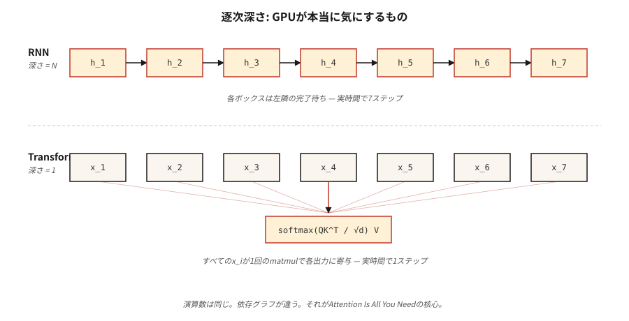

# Neden Transformer'ler — RNN'lerle İlgili Sorunlar

> RNN'ler token'leri teker teker işler. Transformer'ler tüm token'leri aynı anda işler. Bu tek mimari bahis, 2017'den sonra deep learning'daki tüm ölçeklendirme eğrisini değiştirdi.

**Tür:** Öğren
**Diller:** Python
**Önkoşullar:** Aşama 3 (Deep Learning Çekirdek), Aşama 5 · 09 (Sıradan Sıraya), Aşama 5 · 10 (Attention Mechanism)
**Süre:** ~45 dakika

## Sorun

2017'den önce gezegendeki her son teknoloji dizi modeli (dil, çeviri, konuşma) yinelenen bir neural network idi. LSTM'ler ve GRU'lar yarım on yıl boyunca ImageNet'e eşdeğer çeviri benchmark'ler kazandı. Bir insanın sahip olduğu tek araç onlardı.

Üç ölümcül zayıflıkları vardı. Sıralı hesaplama, zaman ekseni boyunca paralelleştiremeyeceğiniz anlamına geliyordu: token `t+1`, token `t`'den gizli duruma ihtiyaç duyuyor. 1.024-token dizisi, döngü başına 1.000.000 kayan nokta işlemi yapabilen bir GPU'da 1.024 seri adım anlamına geliyordu. Paralellik için tasarlanmış donanım üzerinde sıra uzunluğuyla doğrusal olarak ölçeklendirilmiş eğitim duvar saati süresi.

gradient'ların kaybolması, 50 token saniye önceki bilginin zaten 50 doğrusal olmayan durum aracılığıyla sıkıştırıldığı anlamına geliyordu. Geçitli tekrarlayan üniteler (LSTM, GRU) ezilmeyi yumuşattı ancak hiçbir zaman ortadan kaldırmadı. Uzun vadeli bağımlılıklar - "geçen yaz Kyoto'ya giden bir uçakta okuduğum kitap..." - rutin olarak başarısızlığa uğradı.

Sabit genişlikte gizli durumlar, kod çözücü herhangi bir şey görmeden önce kodlayıcının tüm kaynak dizisini tek bir vektöre sıkıştırması anlamına geliyordu. Kaynağın 5 tokens veya 500 olması fark etmez; darboğaz aynı şekildedir.

2017 tarihli "İhtiyacınız Olan Tek Şey Dikkat" makalesi radikal bir şey önerdi: tekrarlamayı tamamen bırakın. Her pozisyonun diğer pozisyonlara paralel olarak katılmasına izin verin. 1.024 ardışık matris yerine büyük bir matris çarpımı konusunda eğitim alın.

Sonuç, 2026 yılına kadar her modaliteye hakim olacak. Dil (GPT-5, Claude 4, Llama 4), görme (ViT, DINOv2, SAM 3), ses (Whisper), biyoloji (AlphaFold 3), robotik (RT-2). Aynı blok, farklı girişler.

## Konsept



**Darboğaz olarak yinelenme.** Bir RNN, `h_t = f(h_{t-1}, x_t)`'yi hesaplar. Her adım bir öncekine bağlıdır. `h_5`'yi `h_4`'den önce hesaplayamazsınız. 10.000'den fazla paralel çekirdeğe sahip modern GPU'larda bu, uzun bir dizide silikonun %99'unun boşa harcanmasına neden olur.

**Yayın olarak dikkat.** Öz-dikkat aynı anda her `(i, j)` çifti için `output_i = sum_j(a_ij * v_j)` değerini hesaplar. N × N dikkat matrisinin tamamı bir toplu matmul'u doldurur. Hiçbir adım diğerine bağlı değildir. GPU'lar buna bayılıyor.

**Hızlanma sabit değildir.** `O(N)` seri derinliği ile `O(1)` seri derinliği arasındaki farktır. Uygulamada, transformer'ler, N=512'deki eşleşen donanım üzerinde çağ başına 5 ila 10 kat daha hızlı eğitilir ve siz dikkatin `O(N²)` bellek duvarına ulaşana kadar aralık dizi uzunluğuyla birlikte genişler (bu Flash Attention daha sonra düzeltildi - bkz. Ders 12).

**transformer'nin maliyeti nedir?** Dikkat belleği `O(N²)` olarak ölçeklenir. 2K bağlamı için gayet iyi. 128K bağlamı için kayan pencerelere, RoPE ekstrapolasyonuna, Flash Attention döşemeye veya doğrusal dikkat çeşitlerine ihtiyacınız vardır. Tekrarlanma hem zaman hem de hafıza açısından `O(N)` idi; transformer'lar zamanı hafızayla takas et ve ardından paralellik yoluyla zamanı geri kazan.

**Tümevarımsal önyargı kayması.** RNN'ler yerellik ve güncelliği varsayar. Transformer'lar hiçbir şey varsaymaz; her çift dikkat çekmeye adaydır. Bu nedenle transformer'lerin iyi eğitilmeleri için daha fazla veriye ihtiyaçları vardır, ancak bu verilere sahip olduklarında daha da ölçeklenirler. Chinchilla (2022) bunu resmileştirdi: Yeterli sayıda token verildiğinde, bir transformer her zaman eşit parametre sayısına sahip bir RNN'yi yener.

## Build It — Kendin Oluştur

Burada neural network yok — çekirdek darboğazını sayısal olarak simüle ediyoruz, böylece boşluğu dizüstü bilgisayarınızda hissedebilirsiniz.

### Adım 1: seri derinliği ölçün

Bkz. `code/main.py`. İki fonksiyon inşa ediyoruz. Biri, bir diziyi bir eklemeler zinciri (bir RNN gibi seri) olarak kodlar. Biri bunu paralel bir azalma (yayın, dikkat gibi) olarak kodlar. Aynı matematik, farklı bağımlılık grafiği.

```python
def rnn_style(xs):
    h = 0.0
    for x in xs:
        h = 0.9 * h + x   # can't parallelize: h depends on previous h
    return h

def attention_style(xs):
    return sum(xs) / len(xs)  # every x is independent
```

Her ikisini de 100.000 öğeye kadar dizilerde zamanlıyoruz. RNN sürümü O(N)'dir ve tek bir CPU hattıdır. Saf Python'da bile, dikkat tarzının azaltılması ≥ 1.000 uzunlukta onu geride bırakır çünkü Python'un `sum()`'si C'de uygulanır ve adım başına yorumlayıcı ek yükü olmadan yinelenir.

### Adım 2: teorik işlemleri sayın

Her iki algoritma da N ekleme yapar. Aradaki fark *bağımlılık derinliği*: bir sonraki işlemin başlayabilmesi için kaç işlemin sırayla gerçekleşmesi gerektiğidir. RNN derinliği = N. Dikkat derinliği = ağaç azaltmayla log(N) veya paralel taramayla 1. GPU süresini operasyon sayısı değil derinlik belirler.

### Adım 3: uzun dizilerde ampirik ölçeklendirme

O(N) boşluğunu görünür kılan bir zamanlama tablosu yazdırıyoruz. 2026 Mac dizüstü bilgisayarda 1000 öğenin altındaki diziler ölçülemeyecek kadar hızlıdır. 100.000'lik diziler temiz bir doğrusal taramayı gösterir. Bunu 12 katmanlı LSTM eşdeğeri ile 16,384-token transformer'ye ölçeklendirin ve duvar saati eğitiminin 2016'da neden engelleyici olduğunu göreceksiniz.

## Use It — Uygula

2026'da hala bir RNN ne zaman seçilmelidir:

| Durum | Seç |
|-----------|------|
| inference akışı, her seferinde bir token, sabit bellek | RNN veya durum uzayı modeli (Mamba, RWKV) |
| Dikkat hafızasının patladığı çok uzun diziler (>1M tokens) | Doğrusal dikkat, Mamba 2, Sırtlan |
| Matmul hızlandırıcısı olmayan uç cihaz | Derinlemesine ayrılabilir RNN hala FLOP/watt'ta kazanıyor |
| Başka herhangi bir şey (eğitim, toplu inference, 128K'ya kadar bağlam) | Transformer |

Mamba gibi durum-uzay modelleri (SSM'ler), esas olarak, onlara her ikisinin de en iyisini veren yapılandırılmış parametreleştirmeye sahip RNN'lerdir: `O(N)` tarama belleği, seçici tarama yoluyla paralel eğitim. Daha iyi uzun bağlam ölçeklendirmesi ile transformer kalitesinin %90'ını kurtarırlar. 2026'da çoğu öncü laboratuvar hibrit SSM+transformer modellerini (e.g. Jamba, Samba) eğitiyor — yineleme ölü değil, bir bileşen.

## Ship It — Kullanıma Sun

Bkz. `outputs/skill-architecture-picker.md`. Beceri, uzunluk, verim ve eğitim bütçesi kısıtlamaları göz önüne alındığında yeni bir dizi problemi için bir mimari seçer. Dengeyi belirtmeden, 1B token'ın üzerindeki eğitim çalışmaları için saf bir RNN önermeyi her zaman reddetmelidir.

## Egzersizler

1. **Kolay.** `code/main.py`'den `rnn_style`'yi alın ve skaler gizli durumu, gizli durumların uzunluğu 64 olan bir vektörle değiştirin. Yeniden ölçün. Gizli durum boyutuyla seri yükü ne kadar büyüyor?
2. **Orta.** Saf Python'da paralel bir önek toplamı (Hillis-Steele taraması) uygulayın. 1024 uzunluğundaki seri taramayla aynı sayısal çıktıyı ürettiğini doğrulayın. Derinliği sayın.
3. **Zor.** Dikkat tarzı indirgemeyi GPU'daki PyTorch'a taşıyın. Her ikisini de tarama dizisi uzunluğunu 64'ten 65.536'ya çıkarırken zamanlayın. Eğri şeklini çizin ve açıklayın.

## Anahtar Terimler

| Terim | Yaygın ifade | Gerçek anlamı |
|------|-----------------|-----------------------|
| Tekrarlama | "RNN'ler sıralıdır" | `t` adımının `t-1` adımına bağlı olduğu hesaplama, zaman ekseni boyunca seri yürütmeyi zorlar. |
| Seri derinliği | "Grafik ne kadar derin" | En uzun bağımlı operasyon zinciri; Sonsuz donanımda bile duvar saatini sınırlar. |
| Dikkat | "Hadi token'ların birbirine bakalım" | Ağırlıklı toplam `sum_j a_ij v_j` burada `a_ij`, i ve j konumları arasındaki benzerlik puanından gelir. |
| Context window | "Model ne kadar görüyor" | Bir dikkat katmanının girdi olarak alabileceği konumların sayısı; İkinci dereceden bellek maliyeti burada ölçeklenir. |
| Endüktif önyargı | "Mimariye işlenmiş varsayımlar" | Verilerin neye benzediğine dair öncesinde; CNN'ler çevirinin değişmezliğini, RNN'ler ise güncelliği varsayar. |
| Durum uzayı modeli | "Arkasında cebir bulunan RNN" | Yapılandırılmış durum uzayı matrisleri aracılığıyla paralel eğitim için parametrelendirilmiş yineleme. |
| İkinci dereceden darboğaz | "Bağlam neden bu kadar maliyetli?" | Dikkat belleği = dizi uzunluğunda `O(N²)`; Flash Attention, ölçeklendirmeyi değil sabitleri gizler. |

## Daha Fazla Okuma

- [Vaswani ve ark. (2017). Tek İhtiyacınız Olan Dikkat](https://arxiv.org/abs/1706.03762) — ana akım NLP'de tekrarlamayı ortadan kaldıran makale.
- [Bahdanau, Cho, Bengio (2014). Ortak Öğrenme ve Hizalamayı Öğrenme yoluyla Neural MT](https://arxiv.org/abs/1409.0473) — dikkatin doğduğu yer, bir RNN'ye cıvatalandı.
- [Hochreiter, Schmidhuber (1997). Uzun Kısa Süreli Bellek](https://www.bioinf.jku.at/publications/older/2604.pdf) — orijinal LSTM belgesi, kayıt için.
- [Gu, Dao (2023). Mamba: Seçici Durum Uzaylarıyla Doğrusal Zamanlı Dizi Modellemesi](https://arxiv.org/abs/2312.00752) — transformer'lara modern yinelenen yanıt.
