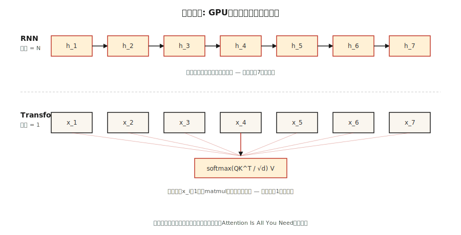

# 为什么选择变形金刚-RNN的问题

> RNN一次处理一个令牌。变形金刚一次处理所有代币。2017年后，这一单一的架构赌注改变了深度学习的每一条扩展曲线。

** 类型：** 学习
** 语言：** Python
** 先决条件：** 阶段3（深度学习核心）、阶段5 · 09（序列到序列）、阶段5 · 10（注意力机制）
** 时间：** ~45分钟

## 问题

2017年之前，地球上每一个最先进的序列模型--语言、翻译、语音--都是一个循环神经网络。LSTM和GROUP在五年的时间里赢得了与ImageNet同等的翻译基准。它们是人们唯一拥有的工具。

他们有三个致命的弱点。顺序计算意味着你不能沿着时间轴并行化：token `t+1`需要token `t`的隐藏状态。1，024个令牌序列意味着GPU上的1，024个串行步骤，每个周期可以执行1，000，000次浮点运算。训练挂钟时间与为并行性设计的硬件上的序列长度成线性比例。

消失的梯度意味着50个令牌返回的信息已经通过50个非线性进行了压缩。门控循环单元（LSTM、GRU）软化了压力，但从未消除它。长期依赖性--“我去年夏天在飞往京都的飞机上读的那本书……”--经常失败。

固定宽度的隐藏状态意味着编码器在解码器看到任何东西之前将整个源序列压缩到一个单一载体中。来源是5个代币还是500个代币都没有关系;瓶颈的形状是相同的。

2017年的论文《注意力就是你所需要的一切》提出了一些激进的建议：完全减少复发。让每个位置平行地关注每个其他位置。训练一个大矩阵相乘，而不是1，024个顺序的矩阵相乘。

到2026年，该结果将主导所有模式。语言（GPT-5、Claude 4、Llama 4）、视觉（ViT、DINOv 2、Sam 3）、音频（Whisper）、生物学（AlphaFold 3）、机器人（RT-2）。相同的块，不同的输入。

## 概念



** 复发是瓶颈。** RNN计算“h_t = f（h_{t-1}，x_t）”。每一步都取决于前一步。您不能在“h_4”之前计算“h_5”。在具有10，000多个并行核心的现代图形处理器上，这在长序列上浪费了99%的硅。

** 作为广播引起注意。** Self-attention同时为每对“（i，j）”计算“put_i = sum_j（a_aj * v_j）”。整个N×N注意力矩阵填充在一个批量矩阵中。没有一步取决于另一步。图形处理器喜欢它。

** 加速不是一个常数。**这是“O（N）”序列深度和“O（1）”序列深度之间的区别。实际上，在N=512的匹配硬件上，变压器每个历元的训练速度快5-10倍，并且间隙随着序列长度的增加而扩大，直到您击中“O（N²）”记忆力墙（Flash Attention后来修复了这一点--参见第12课）。

** 变压器的价格。**注意力记忆的规模为“O（N²）”。对于2K上下文，很好。对于128 K上下文，您需要滑动窗口、RoPE外推、Flash注意力瓷砖或线性注意力变体。重现性在时间和记忆上都是“O（N）”;变形者用时间换取记忆，然后通过并行性赢回时间。

** 感性偏差转变。** RNN假设地点性和最近性。变形金刚什么也不做--每对都是值得关注的候选人。这就是为什么转换器需要更多数据才能很好地训练，但一旦有了这些数据，就会进一步扩展。Chinchilla（2022）正式化了这一点：给定足够的令牌，Transformer总是击败参数数相等的RNN。

## 建设党

这里没有神经网络-我们以数字方式模拟核心瓶颈，以便您感受到笔记本电脑上的差距。

### 第1步：测量序列深度

请参阅' code/main.py '。我们构建两个功能。人们将序列编码为添加链（连续的，就像RNN）。人们将其编码为并行简化（广播，就像注意力一样）。同样的数学，不同的依赖图。

```python
def rnn_style(xs):
    h = 0.0
    for x in xs:
        h = 0.9 * h + x   # can't parallelize: h depends on previous h
    return h

def attention_style(xs):
    return sum(xs) / len(xs)  # every x is independent
```

我们对多达100，000个元素的序列进行计时。RNN版本为O（N）和单中央处理器管道。即使在纯Python中，注意力风格的降低也会在长度等于1，000时胜过它，因为Python的“sum（）”是用C实现的，并且每步迭代时没有解释器负担。

### 第二步：计算理论运算

两种算法都进行N次加法。区别在于 * 依赖深度 *：在下一个操作开始之前必须顺序发生多少个操作。RNN深度= N。注意力深度= log（N）（树约简），或1（并行扫描）。决定图形处理时间的是深度，而不是运算次数。

### 第3步：长序列的经验缩放

我们打印一个计时表，使O（N）差距可见。在2026年Mac笔记本电脑上，低于1，000个元素的序列太快，无法测量。100，000个序列显示清晰的线性扫描。将其扩展到具有12层LSTM等效物的16，384个令牌Transformer，您就会明白为什么训练壁挂时钟在2016年成为一个障碍。

## 使用它

2026年何时仍选择RNN：

| 情况 | 接 |
|-----------|------|
| 流推理，一次一个令牌，持续记忆 | RNN或状态空间模型（Mamba、RWKN） |
| 注意力记忆爆炸的超长序列（> 100万个代币） | 线性注意力，曼巴2，鬣狗 |
| 没有Matmul加速器的边缘设备 | 深度可分离的RNN仍然在FLOPs/瓦上获胜 |
| 其他任何内容（训练、批量推理、高达128 K的上下文） | Transformer |

像Mamba这样的状态空间模型（SSms）本质上是具有结构化参数化的RNN，使它们具有两者的优点：“O（N）”扫描记忆、通过选择性扫描进行并行训练。它们通过更好的长上下文扩展恢复了90%的Transformer质量。在2026年，大多数前沿实验室训练混合SSM+Transformer模型（例如Jamba，Samba）-递归不是死的，它是一个组件。

## 把它运

请参阅“输出/skill-architecture-picker.md”。该技能在给定长度、吞吐量和训练预算约束的情况下为新序列问题选择架构。它应该始终拒绝推荐纯RNN来训练1B代币以上的运行，而不说明权衡。

## 演习

1. ** 简单。**从' code/main.py&#39;中提取&#39; rnn_style &#39;，并用长度为64的隐藏状态载体替换纯量隐藏状态。重新测量。随着隐藏状态维度的增加，序列开销会增加多少？
2. ** 中等。**在纯Python中实现并行前置和（Hillis-Steele扫描）。验证其是否产生与长度为1024的连续扫描相同的数字输出。数数深度。
3. ** 很难。**将注意力风格的降低移植到图形处理器上的PyTorch。当您扫描序列长度从64到65，536时，对两者进行计时。绘制并解释曲线形状。

## 关键术语

| Term | 别人怎么说 | 它实际上意味着什么 |
|------|-----------------|-----------------------|
| 复发 | “RNN是连续的” | 步骤' t '取决于步骤' t-1 '的计算，强制沿着时间轴连续执行。 |
| 序列深度 | “图表有多深” | 最长的依赖操作链;即使在无限的硬件上也能限制壁挂时钟。 |
| 关注 | “让代币互相看着” | 加权总和' sum_j a_aj v_j '其中' a_aj '来自位置i和j之间的相似性得分。 |
| 上下文窗口 | “模型能看到多少” | 注意力层可以作为输入的位置数量;二次存储成本在这里按比例计算。 |
| 归纳偏置 | “建筑中的假设” | 先了解数据的外观; CNN假设翻译不变性，RNN假设近度。 |
| 状态空间模型 | “RNN背后有代数” | 通过结构化状态空间矩阵为并行训练参数化回归。 |
| 二次瓶颈 | “为什么背景成本这么高” | 注意力内存=序列长度' O（N²）' Flash注意力隐藏了常数，而不是缩放。 |

## 进一步阅读

- [Vaswani et al. (2017). Attention Is All You Need](https://arxiv.org/abs/1706.03762) — the paper that killed recurrence in mainstream NLP.
- [Bahdanau, Cho, Bengio (2014). Neural MT by Jointly Learning to Align and Translate](https://arxiv.org/abs/1409.0473) — where attention was born, bolted onto an RNN.
- [Hochreiter, Schmidhuber (1997). Long Short-Term Memory](https://www.bioinf.jku.at/publications/older/2604.pdf) — the original LSTM paper, for the record.
- [Gu，Dao（2023）. Mamba：Linear-Time Sequence Modeling with Selective State Spaces]（https：//arxiv.org/abs/2312.00752）-对transformers的现代经常性回答。
