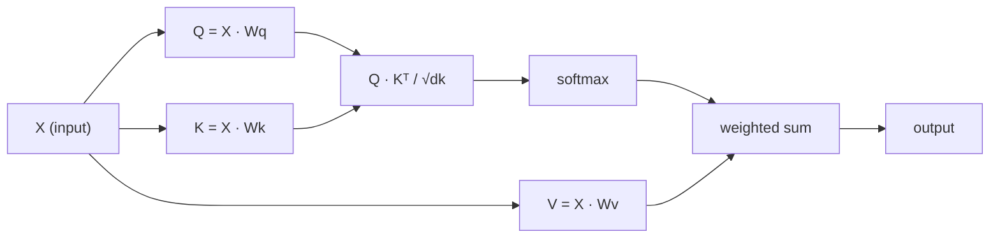

# Sıfırdan Self-Attention

> Dikkat, her kelimenin "Benim için kim önemli?" diye sorduğu bir arama tablosudur. - ve cevabı öğrenir.

**Tür:** Yapım
**Diller:** Python
**Önkoşullar:** Aşama 3 (Deep Learning Temel), Aşama 5 Ders 10 (Sıradan Sıraya)
**Süre:** ~90 dakika

## Öğrenme Hedefleri

- Sorgu/anahtar/değer projeksiyonları ve softmax ağırlıklı toplam dahil olmak üzere yalnızca NumPy kullanarak ölçeklendirilmiş nokta-ürün öz dikkatini sıfırdan uygulayın
- Kafaları bölen, paralel dikkati hesaplayan ve sonuçları birleştiren çok kafalı bir dikkat katmanı oluşturun
- Dikkat matrisinin token ilişkilerini nasıl yakaladığını izleyin ve sqrt(d_k) ile ölçeklendirmenin neden softmax doygunluğunu engellediğini açıklayın
- Çift yönlü dikkati otoregresif (kod çözücü tarzı) dikkat haline dönüştürmek için nedensel maskeleme uygulayın

## Sorun

RNN'ler her seferinde bir token diziyi işler. token 50'ye ulaştığınızda, token 1'den gelen bilgiler 50 sıkıştırma adımıyla sıkıştırılmıştır. Uzun menzilli bağımlılıklar, sabit boyutlu gizli bir duruma sıkıştırılır; bu, hiçbir LSTM geçidinin tam olarak çözemediği bir darboğazdır.

2014 Bahdanau dikkat belgesi düzeltmeyi gösterdi: Kod çözücünün her kodlayıcı konumuna dönüp bakmasına ve mevcut adım için hangisinin önemli olduğuna karar vermesine izin verin. Ama yine de bir RNN'ye cıvatalanmıştı. 2017 tarihli "İhtiyacınız Olan Tek Şey Dikkat" makalesi daha keskin bir soru sordu: Ya dikkat *tek* mekanizmaysa? Tekrarlama yok. Evrişim yok. Sadece dikkat.

Self-attention, bir dizideki her konumun tek bir paralel adımla diğer tüm konumlara katılmasını sağlar. transformer'ları hızlı, ölçeklenebilir ve baskın kılan da budur.

## Konsept

### Veritabanı Arama Analojisi

Dikkati yumuşak bir veritabanı araması olarak düşünün:

```
Traditional database:
  Query: "capital of France"  -->  exact match  -->  "Paris"

Attention:
  Query: "capital of France"  -->  similarity to ALL keys  -->  weighted blend of ALL values
```

Her token üç vektör üretir:
- **Sorgu (S)**: "Neyi arıyorum?"
- **Anahtar (K)**: "İçimde ne var?"
- **Değer (V)**: "Seçilirsem hangi bilgileri sağlayacağım?"

Bir sorgu ile tüm anahtarlar arasındaki nokta çarpımı dikkat puanları üretir. Yüksek puan "bu anahtar benim sorgumla eşleşiyor" anlamına gelir. Bu puanlar değerleri ağırlıklandırıyor. Çıktı, değerlerin ağırlıklı toplamıdır.

### Q, K, V Hesaplama

Her token embedding, öğrenilen üç ağırlık matrisi yoluyla tahmin edilir:

```
Input embeddings (sequence of n tokens, each d-dimensional):

  X = [x1, x2, x3, ..., xn]       shape: (n, d)

Three weight matrices:

  Wq  shape: (d, dk)
  Wk  shape: (d, dk)
  Wv  shape: (d, dv)

Projections:

  Q = X @ Wq    shape: (n, dk)      each token's query
  K = X @ Wk    shape: (n, dk)      each token's key
  V = X @ Wv    shape: (n, dv)      each token's value
```

Görsel olarak bir token için:

```
             Wq
  x_i ------[*]------> q_i    "What am I looking for?"
       |
       |     Wk
       +----[*]------> k_i    "What do I contain?"
       |
       |     Wv
       +----[*]------> v_i    "What do I offer?"
```

### Dikkat Matrisi

Tüm token'lar için Q, K, V'ye sahip olduğunuzda, dikkat puanları bir matris oluşturur:

```
Scores = Q @ K^T    shape: (n, n)

              k1    k2    k3    k4    k5
        +-----+-----+-----+-----+-----+
   q1   | 2.1 | 0.3 | 0.1 | 0.8 | 0.2 |   <- how much q1 attends to each key
        +-----+-----+-----+-----+-----+
   q2   | 0.4 | 1.9 | 0.7 | 0.1 | 0.3 |
        +-----+-----+-----+-----+-----+
   q3   | 0.2 | 0.6 | 2.3 | 0.5 | 0.1 |
        +-----+-----+-----+-----+-----+
   q4   | 0.9 | 0.1 | 0.4 | 1.7 | 0.6 |
        +-----+-----+-----+-----+-----+
   q5   | 0.1 | 0.3 | 0.2 | 0.5 | 2.0 |
        +-----+-----+-----+-----+-----+

Each row: one token's attention over the entire sequence
```

Her seferinde bir sorgunun tuşları taradığını izleyin: her satır her token puan alır, softmax puanları ağırlıklara dönüştürür ve bağlam vektörü değerlerin ağırlıklı karışımıdır.

```figure
attention-matrix
```

### Neden Ölçeklendirmeli?

Nokta çarpımları dk boyutuyla büyür. Eğer dk = 64 ise, nokta çarpımları onlarca aralığında olabilir ve softmax'ı gradient'ların kaybolduğu bölgelere iter. Çözüm: sqrt(dk)'ye bölmek.

```
Scaled scores = (Q @ K^T) / sqrt(dk)
```

Bu, değerleri softmax'ın faydalı gradient'lar ürettiği bir aralıkta tutar.

### Softmax Puanları Ağırlığa Dönüştürüyor

Softmax, ham puanları her satırdaki olasılık dağılımına dönüştürür:

```
Raw scores for q1:   [2.1, 0.3, 0.1, 0.8, 0.2]
                            |
                         softmax
                            |
Attention weights:   [0.52, 0.09, 0.07, 0.14, 0.08]   (sums to ~1.0)
```

Artık her bir token, her bir token ile ne kadar ilgilenmesi gerektiğini söyleyen bir ağırlık setine sahiptir.

### Ağırlıklı Değerler Toplamı

Her token için nihai çıktı, tüm değer vektörlerinin ağırlıklı toplamıdır:

```
output_i = sum( attention_weight[i][j] * v_j  for all j )

For token 1:
  output_1 = 0.52 * v1 + 0.09 * v2 + 0.07 * v3 + 0.14 * v4 + 0.08 * v5
```

### Tam Boru Hattı



Formül tek satırda:

```
Attention(Q, K, V) = softmax( Q @ K^T / sqrt(dk) ) @ V
```

```figure
softmax-attention-scaling
```

## Build It — Kendin Oluştur

### Adım 1: Sıfırdan Softmax

Softmax ham logitleri olasılıklara dönüştürür. Sayısal kararlılık için maksimumu çıkarın.

```python
import numpy as np

def softmax(x):
    shifted = x - np.max(x, axis=-1, keepdims=True)
    exp_x = np.exp(shifted)
    return exp_x / np.sum(exp_x, axis=-1, keepdims=True)

logits = np.array([2.0, 1.0, 0.1])
print(f"logits:  {logits}")
print(f"softmax: {softmax(logits)}")
print(f"sum:     {softmax(logits).sum():.4f}")
```

### 2. Adım: Ölçeklendirilmiş nokta çarpım dikkati

Çekirdek işlevi. Q, K, V matrislerini alır ve dikkat çıktısı artı ağırlık matrisini döndürür.

```python
def scaled_dot_product_attention(Q, K, V):
    dk = Q.shape[-1]
    scores = Q @ K.T / np.sqrt(dk)
    weights = softmax(scores)
    output = weights @ V
    return output, weights
```

### 3. Adım: Öğrenilmiş projeksiyonlarla self-attention dersi

Xavier benzeri ölçeklendirmeyle başlatılan Wq, Wk, Wv ağırlık matrislerine sahip tam bir self-attention modülü.

```python
class SelfAttention:
    def __init__(self, d_model, dk, dv, seed=42):
        rng = np.random.default_rng(seed)
        scale = np.sqrt(2.0 / (d_model + dk))
        self.Wq = rng.normal(0, scale, (d_model, dk))
        self.Wk = rng.normal(0, scale, (d_model, dk))
        scale_v = np.sqrt(2.0 / (d_model + dv))
        self.Wv = rng.normal(0, scale_v, (d_model, dv))
        self.dk = dk

    def forward(self, X):
        Q = X @ self.Wq
        K = X @ self.Wk
        V = X @ self.Wv
        output, weights = scaled_dot_product_attention(Q, K, V)
        return output, weights
```

### Adım 4: Bir cümle üzerinde çalıştırın

Bir cümle için sahte embedding'ler oluşturun ve dikkat ağırlıklarını izleyin.

```python
sentence = ["The", "cat", "sat", "on", "the", "mat"]
n_tokens = len(sentence)
d_model = 8
dk = 4
dv = 4

rng = np.random.default_rng(42)
X = rng.normal(0, 1, (n_tokens, d_model))

attn = SelfAttention(d_model, dk, dv, seed=42)
output, weights = attn.forward(X)

print("Attention weights (each row: where that token looks):\n")
print(f"{'':>6}", end="")
for token in sentence:
    print(f"{token:>6}", end="")
print()

for i, token in enumerate(sentence):
    print(f"{token:>6}", end="")
    for j in range(n_tokens):
        w = weights[i][j]
        print(f"{w:6.3f}", end="")
    print()
```

### Adım 5: ASCII ısı haritasıyla dikkati görselleştirin

Hızlı bir görsellik için dikkat ağırlıklarını karakterlere eşleyin.

```python
def ascii_heatmap(weights, tokens, chars=" ░▒▓█"):
    n = len(tokens)
    print(f"\n{'':>6}", end="")
    for t in tokens:
        print(f"{t:>6}", end="")
    print()

    for i in range(n):
        print(f"{tokens[i]:>6}", end="")
        for j in range(n):
            level = int(weights[i][j] * (len(chars) - 1) / weights.max())
            level = min(level, len(chars) - 1)
            print(f"{'  ' + chars[level] + '   '}", end="")
        print()

ascii_heatmap(weights, sentence)
```

## Use It — Uygula

PyTorch'un `nn.MultiheadAttention`'ı tam olarak bizim geliştirdiğimiz şeyin yanı sıra çok kafalı bölme ve çıktı projeksiyonunu da yapıyor:

```python
import torch
import torch.nn as nn

d_model = 8
n_heads = 2
seq_len = 6

mha = nn.MultiheadAttention(embed_dim=d_model, num_heads=n_heads, batch_first=True)

X_torch = torch.randn(1, seq_len, d_model)

output, attn_weights = mha(X_torch, X_torch, X_torch)

print(f"Input shape:            {X_torch.shape}")
print(f"Output shape:           {output.shape}")
print(f"Attention weight shape: {attn_weights.shape}")
print(f"\nAttn weights (averaged over heads):")
print(attn_weights[0].detach().numpy().round(3))
```

Temel fark: çok kafalı dikkat, her biri dk = d_model / n_heads boyutunda kendi Q, K, V projeksiyonlarına sahip birden fazla dikkat fonksiyonunu paralel olarak çalıştırır ve ardından sonuçları birleştirir. Bu, modelin aynı anda farklı ilişki türlerine katılmasını sağlar.

## Ship It — Kullanıma Sun

Bu ders şunları üretir:
- `outputs/prompt-attention-explainer.md` - veritabanı arama benzetmesi yoluyla dikkati açıklamak için bir prompt

## Egzersizler

1. Softmax'tan önce belirli konumları negatif sonsuza ayarlayan isteğe bağlı bir maske matrisini kabul etmek için `scaled_dot_product_attention`'yi değiştirin (nedensel/kod çözücü maskeleme bu şekilde çalışır)
2. Çok kafalı dikkati sıfırdan uygulayın: Q, K, V'yi `n_heads` parçaya bölün, her birine dikkat edin, birleştirin ve son ağırlık matrisi Wo'ya yansıtın
3. Aynı uzunlukta iki farklı cümle alın, onları aynı SelfAttention örneğiyle besleyin ve dikkat modellerini karşılaştırın. Ne gibi değişiklikler var? Ne aynı kalıyor?

## Anahtar Terimler

| Terim | Yaygın ifade | Gerçek anlamı |
|------|----------------|----------------------|
| Sorgu (S) | "Soru vektörü" | Bu token'nin hangi bilgiyi aradığını temsil eden girdinin öğrenilmiş bir projeksiyonu |
| Anahtar (K) | "Etiket vektörü" | Bu token'nin içerdiği bilgileri temsil eden ve sorgularla eşleşen öğrenilmiş bir projeksiyon |
| Değer (V) | "İçerik vektörü" | Dikkat puanlarına göre bir araya getirilen gerçek bilgileri taşıyan öğrenilmiş bir projeksiyon |
| Ölçeklendirilmiş nokta çarpım dikkati | "Dikkat formülü" | softmax(QK^T / sqrt(dk)) @ V - ölçeklendirme, yüksek boyutlarda softmax doygunluğunu önler |
| Kendine dikkat | "token kendisine ve başkalarına bakıyor" | Q, K, V'nin hepsinin aynı diziden geldiğine dikkat edin, her pozisyonun diğer pozisyona bağlı olmasına izin verin |
| Dikkat ağırlıkları | "Ne kadar odaklanma" | Softmax tarafından ölçeklendirilmiş nokta çarpımları tarafından üretilen pozisyonlar üzerinde olasılık dağılımı |
| Çok kafalı dikkat | "Paralel dikkat" | Farklı projeksiyonlarla birden fazla dikkat fonksiyonunu çalıştırma, ardından daha zengin temsiller için sonuçları birleştirme |

## Daha Fazla Okuma

- [Attention Is All You Need (Vaswani ve diğerleri, 2017)](https://arxiv.org/abs/1706.03762) - orijinal transformer makalesi
- [The Illustrated Transformer (Jay Alammar)](https://jalammar.github.io/illustrated-transformer/) - tüm mimarinin en iyi görsel açıklaması
- [Açıklamalı Transformer (Harvard NLP)](https://nlp.seas.harvard.edu/annotated-transformer/) - açıklamalarla birlikte satır satır PyTorch uygulaması
