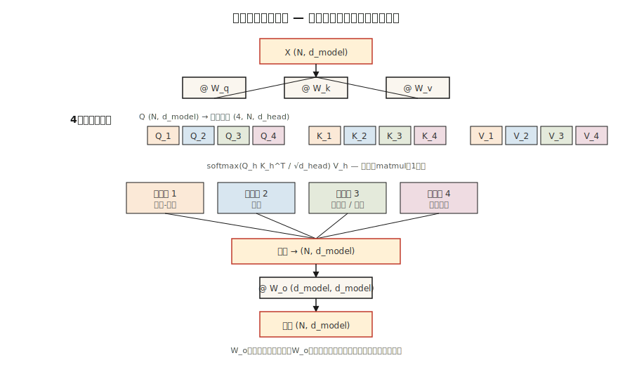

# Multi-Head Attention

> 1 つの attention head は一度に 1 つの関係を学びます。8 個の head は 8 個を学びます。head は安いので、もっと使いましょう。

**種別:** 構築
**言語:** Python
**前提条件:** Phase 7 · 02 (Self-Attention from Scratch)
**所要時間:** 約 75 分

## 問題

単一の self-attention head は 1 つの attention 行列を計算します。その行列が捉えられる関係は 1 種類です。多くの場合、それは学習信号に対して損失を最小化する関係です。データの中に主語と動詞の一致、共参照、長距離の談話構造、構文的なチャンクがすべて絡み合っている場合、単一 head はそれらを 1 つの softmax 分布に塗り込めてしまい、信号の半分を失います。

2017 年の Vaswani 論文による解決策は、複数の attention 関数を並列に走らせ、それぞれに独自の Q, K, V projection を持たせ、出力を連結することでした。各 head は `d_model / n_heads` 次元のより小さな部分空間で動作します。総パラメータ数は同じまま、表現力が上がります。

2026 年に出荷される Transformer では、multi-head attention が標準です。議論になるのは、head を*いくつ*使うか、そして key と value が projection を共有するかどうか（Grouped-Query Attention、Multi-Query Attention、Multi-head Latent Attention）だけです。

## コンセプト



**分割。** 形状 `(N, d_model)` の `X` を取ります。それぞれ形状 `(N, d_model)` の Q, K, V へ projection します。`d_head = d_model / n_heads` として `(N, n_heads, d_head)` に reshape し、`(n_heads, N, d_head)` に transpose します。

**並列に attention する。** 各 head の内部で scaled dot-product attention を実行します。各 head は `(N, d_head)` を生成します。head は embedding の異なる部分空間で動作し、attention 計算そのものの間は互いに通信しません。

**連結して projection する。** head を `(N, d_model)` に戻して積み重ね、形状 `(d_model, d_model)` の学習済み出力行列 `W_o` を掛けます。head 同士が混ざるのは `W_o` です。

**なぜ効くのか。** 各 head は、他の head と表現予算を奪い合うことなく専門化できます。2019〜2024 年の probing 研究では、位置 head、直前のトークンに attention する head、copy head、固有表現 head、induction head（in-context learning の基盤）など、異なる head の役割が示されています。

**2026 年における変種の系譜:**

| Variant | Q heads | K/V heads | Used by |
|---------|---------|-----------|---------|
| Multi-head (MHA) | N | N | GPT-2, BERT, T5 |
| Multi-query (MQA) | N | 1 | PaLM, Falcon |
| Grouped-query (GQA) | N | G (e.g. N/8) | Llama 2 70B, Llama 3+, Qwen 2+, Mistral |
| Multi-head latent (MLA) | N | compressed to low-rank | DeepSeek-V2, V3 |

GQA は、ほぼ完全な品質を保ちながら KV-cache メモリを `N/G` 倍削減するため、現代の標準になっています。MLA はさらに進み、K/V を latent space に圧縮し、計算時に元へ projection し直します。FLOPs は増えますが、より多くのメモリを節約できます。

## 作ってみる

### Step 1: 既存の single-head attention から head を分割する

Lesson 02 の `SelfAttention` を取り、split/concat のペアで包みます。NumPy 実装は `code/main.py` を参照してください。ロジックは次のとおりです。

```python
def split_heads(X, n_heads):
    n, d = X.shape
    d_head = d // n_heads
    return X.reshape(n, n_heads, d_head).transpose(1, 0, 2)  # (heads, n, d_head)

def combine_heads(H):
    h, n, d_head = H.shape
    return H.transpose(1, 0, 2).reshape(n, h * d_head)
```

reshape 1 回と transpose 1 回だけです。ループはありません。これは PyTorch が `nn.MultiheadAttention` の内部で行っていることそのものです。

### Step 2: head ごとに scaled-dot-product attention を実行する

各 head は Q, K, V の独自の slice を受け取ります。attention は batched matmul になります。

```python
def mha_forward(X, W_q, W_k, W_v, W_o, n_heads):
    Q = X @ W_q
    K = X @ W_k
    V = X @ W_v
    Qh = split_heads(Q, n_heads)         # (heads, n, d_head)
    Kh = split_heads(K, n_heads)
    Vh = split_heads(V, n_heads)
    scores = Qh @ Kh.transpose(0, 2, 1) / np.sqrt(Qh.shape[-1])
    weights = softmax(scores, axis=-1)
    out = weights @ Vh                    # (heads, n, d_head)
    concat = combine_heads(out)
    return concat @ W_o, weights
```

実際のハードウェアでは、`Qh @ Kh.transpose(...)` は 1 回の `bmm` です。GPU から見ると、形状 `(heads, N, d_head) × (heads, d_head, N) -> (heads, N, N)` の単一の batched matmul です。head を増やすコストは小さいです。

### Step 3: Grouped-Query Attention の変種

変わるのは key と value の projection だけです。Q は `n_heads` 個の group を持ちます。K と V は `n_kv_heads < n_heads` 個の group を持ち、対応するように繰り返されます。

```python
def gqa_project(X, W, n_kv_heads, n_heads):
    kv = split_heads(X @ W, n_kv_heads)       # (kv_heads, n, d_head)
    repeat = n_heads // n_kv_heads
    return np.repeat(kv, repeat, axis=0)      # (n_heads, n, d_head)
```

推論時には、KV cache に置かれるコピーが `n_heads` 個ではなく `n_kv_heads` 個だけになるため、メモリを節約できます。Llama 3 70B は 64 個の query head と 8 個の KV head を使い、cache を 8 倍削減しています。

### Step 4: 各 head が学んだものを調べる

短い文に対して 4 head の MHA を実行します。各 head について `(N, N)` の attention 行列を出力してください。ランダム初期化でも、異なる head が異なる構造を拾う様子が見えます。それは部分的には信号であり、部分的には部分空間内の回転対称性です。

## 使いどころ

PyTorch では 1 行で書けます。

```python
import torch.nn as nn

mha = nn.MultiheadAttention(embed_dim=512, num_heads=8, batch_first=True)
```

PyTorch 2.5+ における GQA:

```python
from torch.nn.functional import scaled_dot_product_attention

# scaled_dot_product_attention auto-dispatches Flash Attention on CUDA.
# For GQA, pass Q of shape (B, n_heads, N, d_head) and K,V of shape
# (B, n_kv_heads, N, d_head). PyTorch handles the repeat.
out = scaled_dot_product_attention(q, k, v, is_causal=True, enable_gqa=True)
```

**head はいくつにするか。** 2026 年の本番モデルからの経験則:

| Model size | d_model | n_heads | d_head |
|------------|---------|---------|--------|
| Small (~125M) | 768 | 12 | 64 |
| Base (~350M) | 1024 | 16 | 64 |
| Large (~1B) | 2048 | 16 | 128 |
| Frontier (~70B) | 8192 | 64 | 128 |

`d_head` はほぼ常に 64 または 128 になります。これは 1 つの head がどれだけ「見られるか」の単位です。32 未満にすると head はスケーリング係数 `sqrt(d_head)` と戦い始めます。256 を超えると、「小さな専門家をたくさん持つ」利点を失います。

## 仕上げる

`outputs/skill-mha-configurator.md` を見てください。この skill は、パラメータ予算、系列長、デプロイ先をもとに、新しい Transformer の head count、kv-head count、projection strategy を推奨します。

## 演習

1. **Easy.** `code/main.py` の MHA を使い、`d_model=64` は固定したまま `n_heads` を 1 から 16 に変えてください。synthetic copy task 上の小さな 1 層モデルの loss をプロットします。head を増やすと助けになるでしょうか、頭打ちになるでしょうか、それとも悪化するでしょうか。
2. **Medium.** MQA（すべての query head で共有される 1 つの KV head）を実装してください。full MHA と比べてパラメータ数がどれだけ減るかを測ります。N=2048 の推論で KV-cache size がどれだけ縮むかを計算してください。
3. **Hard.** Multi-head Latent Attention の小さな版を実装してください。K,V を rank-`r` の latent に圧縮し、その latent を KV cache に保存し、attention 時に展開します。どの `r` で cache memory が full MHA の 1/8 未満になり、かつ品質が validation ppl の 1 bit 以内に収まるでしょうか。

## 重要用語

| 用語 | よくある言い方 | 実際の意味 |
|------|-----------------|-----------------------|
| Head | 「単一の attention 回路」 | 独自の attention 行列を持つ、次元 `d_head = d_model / n_heads` の 1 つの Q/K/V projection。 |
| d_head | 「head 次元」 | head ごとの隠れ幅。本番ではほぼ常に 64 または 128。 |
| Split / combine | 「reshape の小技」 | attention の前後で行う `(N, d_model) ↔ (n_heads, N, d_head)` の reshape+transpose。 |
| W_o | 「出力 projection」 | head を連結した後に適用される `(d_model, d_model)` 行列。head が混ざる場所。 |
| MQA | 「1 つの KV head」 | Multi-Query Attention。単一の共有 K/V projection。KV cache は最小だが、多少の品質低下がある。 |
| GQA | 「Llama 2 以降の標準」 | `n_kv_heads < n_heads` の Grouped-Query Attention。Q に合わせて繰り返す。 |
| MLA | 「DeepSeek の工夫」 | Multi-head Latent Attention。K,V を低ランク latent に圧縮し、attention 時に展開する。 |
| Induction head | 「in-context learning の背後にある回路」 | 過去の出現を検出し、その後に続いたものをコピーする head のペア。 |

## 参考文献

- [Vaswani et al. (2017). Attention Is All You Need §3.2.2](https://arxiv.org/abs/1706.03762) — 元祖 multi-head 仕様。
- [Shazeer (2019). Fast Transformer Decoding: One Write-Head is All You Need](https://arxiv.org/abs/1911.02150) — MQA 論文。
- [Ainslie et al. (2023). GQA: Training Generalized Multi-Query Transformer Models from Multi-Head Checkpoints](https://arxiv.org/abs/2305.13245) — 学習済み MHA を GQA に変換する方法。
- [DeepSeek-AI (2024). DeepSeek-V2 Technical Report](https://arxiv.org/abs/2405.04434) — MLA と、それが cache memory で MHA/GQA に勝つ理由。
- [Olsson et al. (2022). In-context Learning and Induction Heads](https://transformer-circuits.pub/2022/in-context-learning-and-induction-heads/index.html) — head が実際に何をしているかを機構的に見る。
