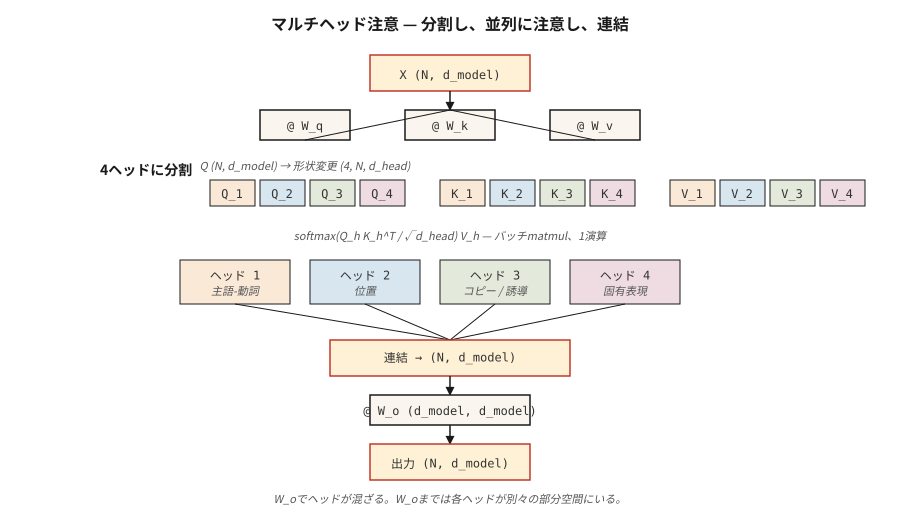

# Multi-Head Attention

> 一个注意力头一次学习一种关系。八个头学习八种。Head 是免费的。多拿一些。

**Type:** Build
**Languages:** Python
**Prerequisites:** Phase 7 · 02 (Self-Attention from Scratch)
**Time:** ~75 分钟

## 问题

单个 self-attention head 计算一个注意力矩阵。这个矩阵捕获一种关系——通常是使训练信号损失最小的那种。如果你的数据同时包含主谓一致、指代消解、长程话语和句法组块，单个 head 将它们混入一个 softmax 分布中，丢失了一半的信号。

2017 年 Vaswani 论文的修复方案：并行运行多个注意力函数，每个函数有自己的 Q、K、V 投影，然后拼接输出。每个 head 在维度为 `d_model / n_heads` 的更小子空间中运作。总参数量保持不变。表达能力提升。

Multi-head attention 是 2026 年每个 transformer 的默认配置。唯一的争论在于*多少个* heads 以及 keys 和 values 是否共享投影（Grouped-Query Attention、Multi-Query Attention、Multi-head Latent Attention）。

## 概念



**拆分。** 取形状为 `(N, d_model)` 的 `X`。投影到 Q、K、V，每个形状为 `(N, d_model)`。重塑为 `(N, n_heads, d_head)`，其中 `d_head = d_model / n_heads`。转置为 `(n_heads, N, d_head)`。

**并行注意力。** 在每个 head 内部运行 scaled dot-product attention。每个 head 产生 `(N, d_head)`。Heads 在嵌入的不同子空间上运作，在注意力计算本身期间从不交流。

**拼接和投影。** 将 heads 堆回 `(N, d_model)` 并与形状为 `(d_model, d_model)` 的学习输出矩阵 `W_o` 相乘。`W_o` 是 heads 混合的地方。

**为什么有效。** 每个 head 可以专门化而无需与其他 head 竞争表征预算。2019–2024 年的探针研究显示了不同的 head 角色：位置 head、关注前一个 token 的 head、复制 head、命名实体 head、归纳 head（in-context learning 的基础）。

**2026 年变体的谱系：**

| 变体 | Q heads | K/V heads | 使用方 |
|---------|---------|-----------|---------|
| Multi-head (MHA) | N | N | GPT-2, BERT, T5 |
| Multi-query (MQA) | N | 1 | PaLM, Falcon |
| Grouped-query (GQA) | N | G（如 N/8） | Llama 2 70B, Llama 3+, Qwen 2+, Mistral |
| Multi-head latent (MLA) | N | 压缩为低秩 | DeepSeek-V2, V3 |

GQA 是现代默认选择，因为它将 KV-cache 内存减少了 `N/G` 倍，同时保持几乎完整的质量。MLA 更进一步，将 K/V 压缩到潜在空间中，然后在计算时投影回来——消耗 FLOPs，节省更多内存。

## 动手构建

### 步骤 1：从已有的 single-head attention 拆分 heads

从第 02 课取出 `SelfAttention`，用拆分/拼接对包装它。参见 `code/main.py` 获取 numpy 实现；逻辑如下：

```python
def split_heads(X, n_heads):
    n, d = X.shape
    d_head = d // n_heads
    return X.reshape(n, n_heads, d_head).transpose(1, 0, 2)  # (heads, n, d_head)

def combine_heads(H):
    h, n, d_head = H.shape
    return H.transpose(1, 0, 2).reshape(n, h * d_head)
```

一次 reshape 和一次 transpose。没有循环。这正是 PyTorch 在 `nn.MultiheadAttention` 下所做的。

### 步骤 2：每个 head 运行 scaled-dot-product attention

每个 head 获得自己的 Q、K、V 切片。注意力变为批处理 matmul：

```python
def mha_forward(X, W_q, W_k, W_v, W_o, n_heads):
    Q = X @ W_q
    K = X @ W_k
    V = X @ W_v
    Qh = split_heads(Q, n_heads)         # (heads, n, d_head)
    Kh = split_heads(K, n_heads)
    Vh = split_heads(V, n_heads)
    scores = Qh @ Kh.transpose(0, 2, 1) / np.sqrt(Qh.shape[-1])
    weights = softmax(scores, axis=-1)
    out = weights @ Vh                    # (heads, n, d_head)
    concat = combine_heads(out)
    return concat @ W_o, weights
```

在真实硬件上 `Qh @ Kh.transpose(...)` 是一个 `bmm`。GPU 看到单个批处理 matmul，形状为 `(heads, N, d_head) × (heads, d_head, N) -> (heads, N, N)`。添加 heads 是免费的。

### 步骤 3：Grouped-Query Attention 变体

只有 key 和 value 投影发生变化。Q 有 `n_heads` 组；K 和 V 有 `n_kv_heads < n_heads` 组并被重复以匹配：

```python
def gqa_project(X, W, n_kv_heads, n_heads):
    kv = split_heads(X @ W, n_kv_heads)       # (kv_heads, n, d_head)
    repeat = n_heads // n_kv_heads
    return np.repeat(kv, repeat, axis=0)      # (n_heads, n, d_head)
```

在推理时这节省内存，因为只有 `n_kv_heads` 份副本留在 KV cache 中，而不是 `n_heads`。Llama 3 70B 使用 64 个 query heads 和 8 个 KV heads——8 倍的缓存缩减。

### 步骤 4：探查每个 head 学到了什么

用 4 个 heads 在一个短句子上运行 MHA。为每个 head 打印 `(N, N)` 注意力矩阵。即使随机初始化，你也会看到不同的 heads 挑选出不同的结构——这既有信号成分，也有子空间中的旋转对称性。

## 实际应用

在 PyTorch 中，一行版本：

```python
import torch.nn as nn

mha = nn.MultiheadAttention(embed_dim=512, num_heads=8, batch_first=True)
```

GQA 在 PyTorch 2.5+ 中：

```python
from torch.nn.functional import scaled_dot_product_attention

# scaled_dot_product_attention 在 CUDA 上自动分发 Flash Attention。
# 对于 GQA，传入形状为 (B, n_heads, N, d_head) 的 Q
# 和形状为 (B, n_kv_heads, N, d_head) 的 K、V。PyTorch 处理重复。
out = scaled_dot_product_attention(q, k, v, is_causal=True, enable_gqa=True)
```

**多少个 heads？** 2026 年生产模型的实践经验：

| 模型大小 | d_model | n_heads | d_head |
|------------|---------|---------|--------|
| Small (~125M) | 768 | 12 | 64 |
| Base (~350M) | 1024 | 16 | 64 |
| Large (~1B) | 2048 | 16 | 128 |
| Frontier (~70B) | 8192 | 64 | 128 |

`d_head` 几乎总是 64 或 128。它是一个 head 能"看到"多少的单位。低于 32，heads 开始与缩放因子 `sqrt(d_head)` 对抗；高于 256，你就失去了"多个小专家"的优势。

## 交付

参见 `outputs/skill-mha-configurator.md`。该 skill 根据参数预算、序列长度和部署目标，为新的 transformer 推荐 head 数量、kv-head 数量和投影策略。

## 练习

1. **简单。** 从 `code/main.py` 取出 MHA，固定 `d_model=64`，将 `n_heads` 从 1 改为 16。在一个合成复制任务上绘制单层小模型的损失。更多 heads 是帮助、达到平台期还是有害？
2. **中等。** 实现 MQA（所有 query heads 共享一个 KV head）。测量与完整 MHA 相比参数量下降多少。计算在 N=2048 时推理时 KV-cache 大小缩小了多少。
3. **困难。** 实现一个微型 Multi-head Latent Attention：将 K、V 压缩到秩为 `r` 的潜在空间，将潜在向量存储在 KV cache 中，在注意力计算时解压缩。在多大的 `r` 下，缓存内存降到完整 MHA 的 1/8 以下，同时质量保持在验证 ppl 的 1 bit 以内？

## 关键术语

| 术语 | 人们说的 | 实际含义 |
|------|-----------------|-----------------------|
| Head | "单个注意力回路" | 维度为 `d_head = d_model / n_heads` 的单个 Q/K/V 投影，有自己的注意力矩阵。 |
| d_head | "Head 维度" | 每个 head 的隐藏宽度；生产中几乎总是 64 或 128。 |
| Split / combine | "Reshape 技巧" | 围绕注意力的 `(N, d_model) ↔ (n_heads, N, d_head)` reshape+transpose。 |
| W_o | "输出投影" | 拼接 heads 后应用的 `(d_model, d_model)` 矩阵；heads 在此混合。 |
| MQA | "一个 KV head" | Multi-Query Attention：单个共享 K/V 投影。最小的 KV cache，一些质量损失。 |
| GQA | "Llama 2 以来的默认" | Grouped-Query Attention，`n_kv_heads < n_heads`；重复以匹配 Q。 |
| MLA | "DeepSeek 的诀窍" | Multi-head Latent Attention：K、V 压缩为低秩潜在向量，在注意力计算时解压缩。 |
| Induction head | "In-context learning 背后的回路" | 一对 heads，检测之前的出现并复制其后出现的内容。 |

## 延伸阅读

- [Vaswani et al. (2017). Attention Is All You Need §3.2.2](https://arxiv.org/abs/1706.03762) — 原始 multi-head 规范。
- [Shazeer (2019). Fast Transformer Decoding: One Write-Head is All You Need](https://arxiv.org/abs/1911.02150) — MQA 论文。
- [Ainslie et al. (2023). GQA: Training Generalized Multi-Query Transformer Models from Multi-Head Checkpoints](https://arxiv.org/abs/2305.13245) — 如何在训练后将 MHA 转换为 GQA。
- [DeepSeek-AI (2024). DeepSeek-V2 Technical Report](https://arxiv.org/abs/2405.04434) — MLA 以及它为何在缓存内存上优于 MHA/GQA。
- [Olsson et al. (2022). In-context Learning and Induction Heads](https://transformer-circuits.pub/2022/in-context-learning-and-induction-heads/index.html) — 对 heads 实际作用的机制性研究。
