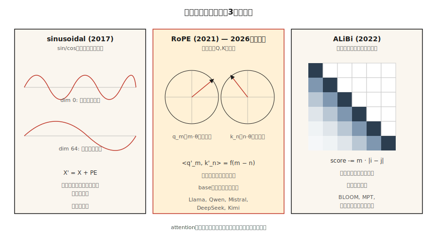

# Positional Encoding — Sinusoidal, RoPE, ALiBi

> Attention は permutation-invariant です。位置情報がなければ、"The cat sat on the mat" と "mat the on sat cat the" は同じ出力を生みます。3 つのアルゴリズムがこれを修正します。それぞれが「位置」とは何かについて異なる仮定を置いています。

**種別:** 構築
**言語:** Python
**前提条件:** Phase 7 · 02 (Self-Attention), Phase 7 · 03 (Multi-Head Attention)
**所要時間:** 約 45 分

## 問題

Scaled dot-product attention は順序を見ません。attention 行列 `softmax(Q K^T / √d) V` はペアごとの類似度から計算されます。`X` の行をシャッフルすると、出力の行も同じようにシャッフルされます。attention の内部には、位置を気にするものが何もありません。

これは bag-of-words モデルではバグではありません。しかし、言語、コード、音声、動画など、順序が意味を持つものでは致命的です。

解決策は、何らかの方法で位置を embedding に注入することです。答えには 3 つの時代があります。

1. **Absolute sinusoidal** (Vaswani 2017)。位置の `sin/cos` を embedding に加える。単純で、学習パラメータは不要だが、学習長を超える外挿は弱い。
2. **RoPE — Rotary Position Embeddings** (Su 2021)。Q と K のベクトルを、位置に比例した角度で回転させる。内積の中に*相対*位置を直接エンコードする。2026 年の主流。
3. **ALiBi — Attention with Linear Biases** (Press 2022)。embedding を完全に避け、距離に基づく head ごとの線形ペナルティを attention score に加える。長さ外挿が非常に強い。

2026 年時点で、ほぼすべての frontier open model は RoPE を使っています。Llama 2/3/4、Qwen 2/3、Mistral、Mixtral、DeepSeek-V3、Kimi などです。一部の long-context model は ALiBi やその現代的な変種を使います。Absolute sinusoidal は歴史的な方式になっています。

## コンセプト



### Absolute sinusoidal

形状 `(max_len, d_model)` の固定行列 `PE` を事前計算します。

```
PE[pos, 2i]   = sin(pos / 10000^(2i / d_model))
PE[pos, 2i+1] = cos(pos / 10000^(2i / d_model))
```

その後、attention の前に `X' = X + PE[:N]` とします。各次元は異なる周波数の sinusoid です。モデルは位相パターンから位置を読み取ることを学びます。`max_len` を超えると失敗します。位置 0〜2047 しか見ていないモデルには、位置 2048 で何が起こるかが何も教えられていないからです。

### RoPE

Q と K のベクトルを回転させます（embedding ではありません）。次元ペア `(2i, 2i+1)` について:

```
[q'_2i    ]   [ cos(pos·θ_i)  -sin(pos·θ_i) ] [q_2i   ]
[q'_2i+1  ] = [ sin(pos·θ_i)   cos(pos·θ_i) ] [q_2i+1 ]

θ_i = base^(-2i / d_head),  base = 10000 by default
```

位置 `pos_k` の key にも同じ回転を適用します。内積 `q'_m · k'_n` は `(m - n)` だけの関数になります。つまり、回転は絶対位置に基づいているにもかかわらず、**attention score は相対距離だけに依存します**。見事なトリックです。

RoPE の拡張では、再学習なしにより長いコンテキストへ外挿するため、`base` をスケールできます（NTK-aware、YaRN、LongRoPE）。Llama 3 はこの方法で 8K から 128K context へ拡張しました。

### ALiBi

embedding の仕掛けを使わず、attention score に直接 bias を加えます。

```
attn_score[i, j] = (q_i · k_j) / √d  -  m_h · |i - j|
```

ここで `m_h` は head 固有の slope です（例: `1 / 2^(8·h/H)`）。近いトークンは強められ、遠いトークンは罰せられます。学習時コストはありません。論文では、長さ外挿で sinusoidal を上回り、元の学習長では RoPE に匹敵することが示されています。

### 2026 年に何を選ぶか

| Variant | Extrapolation | Training cost | Used by |
|---------|---------------|---------------|---------|
| Absolute sinusoidal | poor | free | original transformer, early BERT |
| Learned absolute | none | tiny | GPT-2, GPT-3 |
| RoPE | good with scaling | free | Llama 2/3/4, Qwen 2/3, Mistral, DeepSeek-V3, Kimi |
| RoPE + YaRN | excellent | fine-tune stage | Qwen2-1M, Llama 3.1 128K |
| ALiBi | excellent | free | BLOOM, MPT, Baichuan |

RoPE が勝った理由は、アーキテクチャを変えずに attention へ差し込め、相対位置をエンコードでき、`base` hyperparameter が long-context fine-tuning のための明確なノブになるからです。

## 作ってみる

### Step 1: sinusoidal encoding

`code/main.py` を見てください。4 行程度の計算です。

```python
def sinusoidal(N, d):
    pe = [[0.0] * d for _ in range(N)]
    for pos in range(N):
        for i in range(d // 2):
            theta = pos / (10000 ** (2 * i / d))
            pe[pos][2 * i]     = math.sin(theta)
            pe[pos][2 * i + 1] = math.cos(theta)
    return pe
```

これを最初の attention 層の前で embedding 行列に加えます。

### Step 2: Q, K に RoPE を適用する

RoPE は Q と K に対して in-place に動作します。各次元ペアについて:

```python
def apply_rope(x, pos, base=10000):
    d = len(x)
    out = list(x)
    for i in range(d // 2):
        theta = pos / (base ** (2 * i / d))
        c, s = math.cos(theta), math.sin(theta)
        a, b = x[2 * i], x[2 * i + 1]
        out[2 * i]     = a * c - b * s
        out[2 * i + 1] = a * s + b * c
    return out
```

重要なのは、位置 `m` の Q と位置 `n` の K に同じ関数を適用することです。それらの内積は、各座標ペアで `cos((m-n)·θ_i)` 因子を得ます。attention は相対位置を無料で学べます。

### Step 3: ALiBi の slope と bias

```python
def alibi_bias(n_heads, seq_len):
    # slope_h = 2 ** (-8 * h / n_heads) for h = 1..n_heads
    slopes = [2 ** (-8 * (h + 1) / n_heads) for h in range(n_heads)]
    bias = []
    for m in slopes:
        row = [[-m * abs(i - j) for j in range(seq_len)] for i in range(seq_len)]
        bias.append(row)
    return bias  # add to attention scores before softmax
```

`bias[h]` を head `h` の `(seq_len, seq_len)` attention score 行列に加え、その後 softmax します。

### Step 4: RoPE の相対距離性を検証する

ランダムな 2 つのベクトル `a, b` を選びます。`(pos_a, pos_b)` で回転させます。次に `(pos_a + k, pos_b + k)` で回転させます。両方の内積は浮動小数点誤差の範囲で一致しなければなりません。この性質こそが RoPE の要点です。絶対オフセットには不変で、相対的な差だけが重要になります。

## 使いどころ

PyTorch 2.5+ は `torch.nn.functional` に RoPE utilities を含んでいます。本番コードの多くは `flash_attn` または `xformers` を使い、RoPE は attention kernel の内部で適用されます。

```python
from transformers import AutoModel
model = AutoModel.from_pretrained("meta-llama/Llama-3.2-3B")
# model.config.rope_scaling → {"type": "yarn", "factor": 32.0, "original_max_position_embeddings": 8192}
```

**2026 年の long-context の工夫:**

- **NTK-aware interpolation.** 4K から 16K+ に拡張するとき、`base` を `base * (scale_factor)^(d/(d-2))` に rescale する。
- **YaRN.** 長いコンテキストで attention entropy を保つ、より賢い interpolation。Llama 3.1 128K が使っている。
- **LongRoPE.** 次元ごとの scale factor を選ぶために evolutionary search を使う Microsoft の 2024 年の手法。Phi-3-Long が使っている。
- **Position interpolation + fine-tuning.** extension factor で位置を縮め、1〜5B tokens で fine-tune するだけ。驚くほど有効。

## 仕上げる

`outputs/skill-positional-encoding-picker.md` を見てください。この skill は、target context length、外挿要件、学習予算をもとに、新しいモデルの encoding strategy を選びます。

## 演習

1. **Easy.** `max_len=512, d=128` の sinusoidal `PE` 行列をヒートマップとしてプロットしてください。「次元 index が大きくなるほど縞が広くなる」パターンを確認します。
2. **Medium.** NTK-aware RoPE scaling を実装してください。長さ 256 の系列で小さな LM を学習し、scaling あり/なしで長さ 1024 に対してテストします。perplexity を測ってください。
3. **Hard.** 同じ attention module に ALiBi と RoPE を実装してください。長さ 512 の copy task で 4 層 Transformer を学習します。テスト時に 2048 へ外挿し、劣化を比較してください。

## 重要用語

| 用語 | よくある言い方 | 実際の意味 |
|------|-----------------|-----------------------|
| Positional encoding | 「attention に順序を教える」 | 位置をエンコードするために embedding または attention に加えられる任意の信号。 |
| Sinusoidal | 「元祖」 | 幾何的な周波数の `sin/cos` を embedding に加える方式。外挿しない。 |
| RoPE | 「Rotary embeddings」 | Q, K を位置依存の角度で回転させる。内積が相対距離をエンコードする。 |
| ALiBi | 「線形 bias の工夫」 | attention score に `-m·\|i-j\|` を加える。embedding は不要で、外挿に強い。 |
| base | 「RoPE のノブ」 | RoPE の周波数 scaler。推論時に context を拡張するために大きくする。 |
| NTK-aware | 「RoPE scaling の工夫」 | context 拡張時に高周波次元が詰まりすぎないよう、`base` を rescale する。 |
| YaRN | 「凝った方式」 | attention entropy を保つ、次元ごとの interpolation+extrapolation。 |
| Extrapolation | 「学習長を超えて動く」 | 学習時に見た `max_len` を超えても、その位置方式が正しい出力を出せるか。 |

## 参考文献

- [Vaswani et al. (2017). Attention Is All You Need §3.5](https://arxiv.org/abs/1706.03762) — 元祖 sinusoidal。
- [Su et al. (2021). RoFormer: Enhanced Transformer with Rotary Position Embedding](https://arxiv.org/abs/2104.09864) — RoPE 論文。
- [Press, Smith, Lewis (2021). Train Short, Test Long: Attention with Linear Biases Enables Input Length Extrapolation](https://arxiv.org/abs/2108.12409) — ALiBi。
- [Peng et al. (2023). YaRN: Efficient Context Window Extension of Large Language Models](https://arxiv.org/abs/2309.00071) — 最先端の RoPE scaling。
- [Chen et al. (2023). Extending Context Window of Large Language Models via Positional Interpolation](https://arxiv.org/abs/2306.15595) — Meta の Llama 2 long-context 論文。
- [Ding et al. (2024). LongRoPE: Extending LLM Context Window Beyond 2 Million Tokens](https://arxiv.org/abs/2402.13753) — Phi-3-Long で使われ、「使いどころ」セクションで言及した Microsoft の手法。
- [HuggingFace Transformers — `modeling_rope_utils.py`](https://github.com/huggingface/transformers/blob/main/src/transformers/modeling_rope_utils.py) — すべての RoPE scaling scheme（default、linear、dynamic、YaRN、LongRoPE、Llama-3）の本番品質実装。
