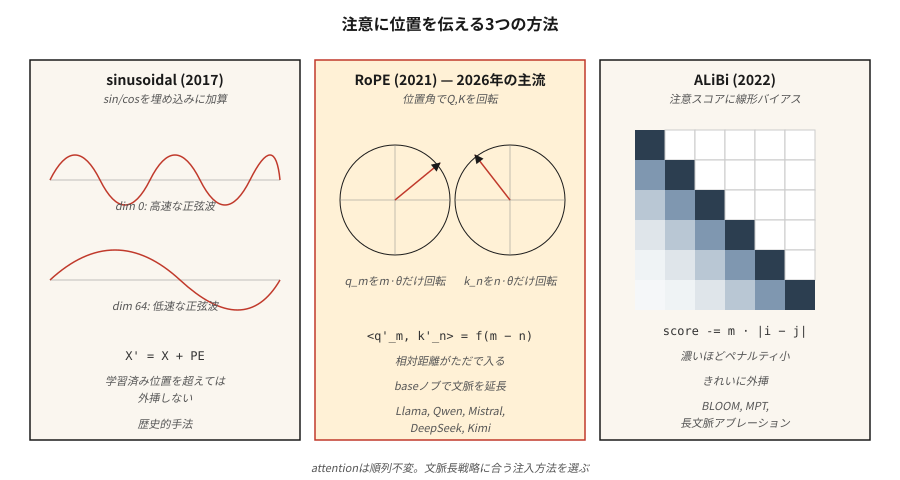

# Konumsal Kodlama — Sinüzoidal, RoPE, ALiBi

> Dikkat permütasyonla değişmez. "Kedi matın üzerine oturdu" ve "mat satta kedinin üzerine oturdu" konumsal sinyal olmadan aynı çıktıyı üretir. Üç algoritma bu sorunu çözüyor; her biri "konum"un ne anlama geldiğine dair farklı bir iddiaya sahip.

**Tür:** Yapım
**Diller:** Python
**Önkoşullar:** Aşama 7 · 02 (Self-Attention), Aşama 7 · 03 (Çok Kafalı Dikkat)
**Süre:** ~45 dakika

## Sorun

Ölçeklendirilmiş nokta-çarpım dikkati sıralama açısından kördür. Dikkat matrisi `softmax(Q K^T / √d) V` ikili benzerliklerden hesaplanır. `X`'nin satırlarını karıştırın, çıktının satırlarının da aynı şekilde karıştırılmasını sağlayın. Dikkatin içindeki hiçbir şey konumla ilgilenmez.

Bu, kelime çantası modelindeki bir hata değil. Dil, kod, ses, video (düzenin anlam taşıdığı her şey) açısından ölümcüldür.

Çözüm, konumu bir şekilde embedding'lara enjekte etmektir. Üç yanıt dönemi:

1. **Mutlak sinüzoidal** (Vaswani 2017). embedding'e konumun `sin/cos`'ını ekleyin. Basit, öğrenilebilirlik gerektirmez, eğitimde görülen uzunlukların ötesinde tahminlerde bulunmaz.
2. **RoPE — Döner Konum Embeddings** (Su 2021). Q ve K vektörlerini konumla orantılı bir açıyla döndürün. *göreceli* konumu doğrudan nokta çarpımda kodlar. 2026'da baskın.
3. **ALiBi — Doğrusal Önyargılara Dikkat** (Press 2022). embedding'ları tamamen atla; Mesafeye bağlı olarak dikkat puanlarına head başına doğrusal bir ceza ekleyin. Mükemmel uzunluk ekstrapolasyonu.

2026 itibariyle, esasen tüm sınır açık modellerde RoPE kullanılmaktadır: Llama 2/3/4, Qwen 2/3, Mistral, Mixtral, DeepSeek-V3, Kimi. Bir avuç uzun bağlamlı model ALiBi'yi veya onun modern varyantlarını kullanıyor. Mutlak sinüzoidal tarihseldir.

## Konsept



### Mutlak sinüzoidal

`(max_len, d_model)` şeklindeki sabit bir `PE` matrisini önceden hesaplayın:

```
PE[pos, 2i]   = sin(pos / 10000^(2i / d_model))
PE[pos, 2i+1] = cos(pos / 10000^(2i / d_model))
```

Daha sonra dikkat etmeden önce `X' = X + PE[:N]`. Her boyut farklı frekansta bir sinüzoiddir. Model, faz deseninden konumu okumayı öğrenir. `max_len` ötesinde başarısız: modele yalnızca 0-2047 konumlarını gördüğünde 2048 konumunda ne olacağını hiçbir şey söylemedi.

### Halat

Q ve K vektörlerini döndürün (embedding'leri değil). Bir boyut çifti için `(2i, 2i+1)`:

```
[q'_2i    ]   [ cos(pos·θ_i)  -sin(pos·θ_i) ] [q_2i   ]
[q'_2i+1  ] = [ sin(pos·θ_i)   cos(pos·θ_i) ] [q_2i+1 ]

θ_i = base^(-2i / d_head),  base = 10000 by default
```

Aynı dönüşü `pos_k` konumuna sahip tuşlara da uygulayın. `q'_m · k'_n` iç çarpımı tek başına `(m - n)`'nin bir fonksiyonu haline gelir. Yani: rotasyon mutlak konumlara kilitlenmiş olsa bile **dikkat puanı yalnızca göreceli mesafeye bağlıdır**. Güzel numara.

RoPE'yi Genişletme: `base`, yeniden eğitim gerektirmeden daha uzun bağlamlara tahminde bulunmak için ölçeklendirilebilir (NTK uyumlu, YaRN, LongRoPE). Llama 3 bu şekilde 8K'dan 128K bağlamına genişletildi.

### ALiBi

embedding numarasını atla. Dikkat puanlarını doğrudan saptırın:

```
attn_score[i, j] = (q_i · k_j) / √d  -  m_h · |i - j|
```

Burada `m_h` başa özgü bir eğimdir (e.g. `1 / 2^(8·h/H)`). Yakındaki token'lar güçlendirilir; uzaktaki token'lar cezalandırılıyor. Eğitim süresi maliyeti yok. Makale, uzunluk ekstrapolasyonunun sinüzoidalden daha iyi olduğunu ve RoPE'yi orijinal eğitilmiş uzunluğuyla eşleştirdiğini gösteriyor.

### 2026'da ne seçilmeli

| Varyant | Ekstrapolasyon | Eğitim maliyeti | Kullanan |
|---------|---------------|---------------|---------|
| Mutlak sinüzoidal | fakir | ücretsiz | orijinal transformer, erken BERT |
| Mutlak öğrenildi | hiçbiri | minik | GPT-2, GPT-3 |
| RoPE | ölçeklendirme konusunda iyi | ücretsiz | Llama 2/3/4, Qwen 2/3, Mistral, DeepSeek-V3, Kimi |
| RoPE + YaRN | mükemmel | sahneye ince ayar | Qwen2-1M, Llama 3.1 128K |
| ALiBi | mükemmel | ücretsiz | BLOOM, MPT, Baichuan |

RoPE kazandı çünkü mimariyi değiştirmeden dikkati üzerine çekiyor, göreceli konumu kodluyor ve `base` hiperparametresi uzun bağlam fine-tuning için temiz bir düğme veriyor.

```figure
rope-explorer
```

## Build It — Kendin Oluştur

### Adım 1: sinüzoidal kodlama

Bkz. `code/main.py`. 4 satırlık bir hesaplama:

```python
def sinusoidal(N, d):
    pe = [[0.0] * d for _ in range(N)]
    for pos in range(N):
        for i in range(d // 2):
            theta = pos / (10000 ** (2 * i / d))
            pe[pos][2 * i]     = math.sin(theta)
            pe[pos][2 * i + 1] = math.cos(theta)
    return pe
```

Bunu ilk dikkat katmanından önceki embedding matrisine ekleyin.

### Adım 2: Q, K'ye RoPE uygulandı

RoPE, Q ve K üzerinde yerinde çalışır. Her bir karartma çifti için:

```python
def apply_rope(x, pos, base=10000):
    d = len(x)
    out = list(x)
    for i in range(d // 2):
        theta = pos / (base ** (2 * i / d))
        c, s = math.cos(theta), math.sin(theta)
        a, b = x[2 * i], x[2 * i + 1]
        out[2 * i]     = a * c - b * s
        out[2 * i + 1] = a * s + b * c
    return out
```

Çok önemli: aynı fonksiyonu `m` konumundaki Q'ya ve `n` konumundaki K'ya uygulayın. Nokta çarpımları her koordinat çiftinde bir `cos((m-n)·θ_i)` çarpanı alır. Dikkat, göreceli konumu ücretsiz olarak öğrenir.

### Adım 3: ALiBi eğimleri ve önyargı

```python
def alibi_bias(n_heads, seq_len):
    # slope_h = 2 ** (-8 * h / n_heads) for h = 1..n_heads
    slopes = [2 ** (-8 * (h + 1) / n_heads) for h in range(n_heads)]
    bias = []
    for m in slopes:
        row = [[-m * abs(i - j) for j in range(seq_len)] for i in range(seq_len)]
        bias.append(row)
    return bias  # add to attention scores before softmax
```

Başın `h` `(seq_len, seq_len)` dikkat puanı matrisine `bias[h]` ekleyin, ardından softmax'ı ekleyin.

### Adım 4: RoPE'nin göreceli mesafe özelliğini doğrulayın

İki rastgele `a, b` vektörü seçin. `(pos_a, pos_b)` kadar döndür. Daha sonra `(pos_a + k, pos_b + k)` tarafından. Her iki nokta ürünü de kayan nokta hatası dahilinde eşleşmelidir. RoPE'nin asıl amacı bu özelliktir; mutlak sapmaya göre değişmez, yalnızca göreceli boşluk önemlidir.

## Use It — Uygula

PyTorch 2.5+, `torch.nn.functional`'da RoPE yardımcı programları sunar. Çoğu üretim kodu, dikkat çekirdeğinin içinde RoPE'nin uygulandığı `flash_attn` veya `xformers` kullanır.

```python
from transformers import AutoModel
model = AutoModel.from_pretrained("meta-llama/Llama-3.2-3B")
# model.config.rope_scaling → {"type": "yarn", "factor": 32.0, "original_max_position_embeddings": 8192}
```

**2026'da uzun bağlamlı püf noktaları:**

- **NTK uyumlu enterpolasyon.** 4K'dan 16K+'ya genişletirken `base`'yi `base * (scale_factor)^(d/(d-2))` olarak yeniden ölçeklendirin.
- **YaRN.** Uzun bağlamlarda dikkat entropisini koruyan daha akıllı enterpolasyon. Llama 3.1 128K bunu kullanıyor.
- **LongRoPE.** Boyut başına ölçek faktörlerini seçmek için evrimsel aramayı kullanan Microsoft'un 2024 yöntemi. Phi-3-Long bunu kullanıyor.
- **Konum enterpolasyonu + fine-tuning.** Sadece konumları uzatma faktörüne göre küçültün ve 1–5B tokens için ince ayar yapın. Şaşırtıcı derecede etkili.

## Ship It — Kullanıma Sun

Bkz. `outputs/skill-positional-encoding-picker.md`. Beceri, hedef bağlam uzunluğu, tahmin ihtiyaçları ve eğitim bütçesi göz önüne alındığında yeni bir model için bir kodlama stratejisi seçer.

## Egzersizler

1. **Kolay.** `max_len=512, d=128` için ısı haritası olarak sinüzoidal `PE` matrisini çizin. "Boyut indeksi büyüdükçe şeritler genişler" desenini doğrulayın.
2. **Orta.** NTK uyumlu RoPE ölçeklendirmesini uygulayın. 256 uzunluğundaki diziler üzerinde küçük bir LM eğitin, ardından ölçeklendirme ile ve ölçeklendirme olmadan 1024 uzunluğunda test edin. Şaşkınlığı ölçün.
3. **Zor.** ALiBi ve RoPE'yi aynı dikkat modülünde uygulayın. 4 katmanlı bir transformer'yi, uzunluğu 512 olan dizilerle bir kopyalama görevi üzerinde eğitin. Test zamanında 2048'e tahmin edin. Bozulmayı karşılaştırın.

## Anahtar Terimler

| Terim | Yaygın ifade | Gerçek anlamı |
|------|-----------------|-----------------------|
| Konumsal kodlama | "Düzenle ilgili dikkati anlatır" | embedding'lara eklenen herhangi bir sinyal veya konumu kodlayan dikkat. |
| Sinüzoidal | "Orijinal olan" | embeddings'ye eklenen geometrik frekanslarda `sin/cos`; tahminde bulunmaz. |
| RoPE | "Döner embedding'ler" | Q, K'yi konuma bağlı açıyla döndürün; nokta çarpımı göreceli mesafeyi kodlar. |
| ALiBi | "Doğrusal önyargı hilesi" | Dikkat puanlarına `-m·\|i-j\|` ekleyin; embedding'e gerek yok, harika bir tahmin. |
| baz | "RoPE'nin düğmesi" | RoPE'deki frekans ölçekleyici; inference'daki bağlamı genişletmek için artırın. |
| NTK uyumlu | "Bir RoPE ölçeklendirme numarası" | Bağlam genişlediğinde yüksek frekanslı karartmaların sıkışmaması için `base`'yi yeniden ölçeklendirin. |
| YaRN | "Süslü olan" | Dikkat entropisini koruyan boyut başına enterpolasyon + ekstrapolasyon. |
| Ekstrapolasyon | "Eğitimli uzunluğun ötesinde çalışır" | Konum şeması eğitimde görülen `max_len` sonrasında doğru çıktıyı sunabilir mi? |

## Daha Fazla Okuma

- [Vaswani ve ark. (2017). Tek İhtiyacınız Olan Dikkat §3.5](https://arxiv.org/abs/1706.03762) — orijinal sinüzoidal.
- [Su ve ark. (2021). RoFormer: Döner Konumlu Embedding](https://arxiv.org/abs/2104.09864) Geliştirilmiş Transformer — RoPE kağıdı.
- [Press, Smith, Lewis (2021). Kısa Eğitim, Uzun Test: Doğrusal Önyargılarla Dikkat Giriş Uzunluğu Ekstrapolasyonunu Etkinleştirir](https://arxiv.org/abs/2108.12409) — ALiBi.
- [Peng ve ark. (2023). YaRN: Verimli Context Window Büyük Dil Modellerinin Uzantısı](https://arxiv.org/abs/2309.00071) — son teknoloji RoPE ölçeklendirmesi.
- [Chen ve ark. (2023). Konumsal İnterpolasyon Yoluyla Büyük Dil Modellerinin Context Window Genişletilmesi](https://arxiv.org/abs/2306.15595) — Meta'nın Llama 2 uzun bağlamlı makalesi.
- [Ding ve ark. (2024). LongRoPE: LLM Context Window'yi 2 Milyon Token'ın](https://arxiv.org/abs/2402.13753) Ötesine Uzatmak — Phi-3-Long tarafından kullanılan ve Kullan bölümünde alıntılanan Microsoft yöntemi.
- [HuggingFace Transformers — `modeling_rope_utils.py`](https://github.com/huggingface/transformers/blob/main/src/transformers/modeling_rope_utils.py) — her RoPE ölçeklendirme planının (varsayılan, doğrusal, dinamik, YaRN, LongRoPE, Llama-3) üretim düzeyinde uygulamaları.
