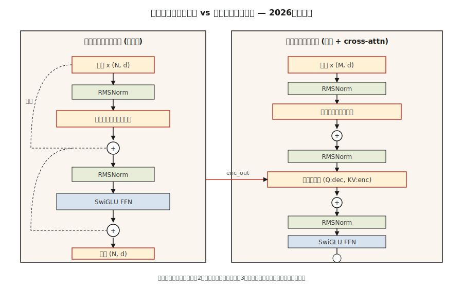

# The Full Transformer — Encoder + Decoder

> 注意力是明星。其他一切--残余、正规化、前向、交叉注意--都是让您将其深入堆叠的脚手架。

** 类型：** 构建
** 语言：** Python
** 先决条件：** 阶段7 · 02（自我注意力）、阶段7 · 03（多头注意力）、阶段7 · 04（位置编码）
** 时间：** ~75分钟

## The Problem

单个注意力层是特征提取器，而不是模型。每层一个matmul对于语言来说是不够的。您需要深度和深度中断，而没有正确的管道。

2017年Vaswani论文包含了六个设计决策，将一个注意力层转变为可堆叠块。每个Transformer（仅编码器（BERT），仅解码器（GPT），编码器-解码器（T5））都继承了相同的骨架。2026年，模块已被细化（RMSNorm、SwiGLU、pre-norm、RoPE），但骨架相同。

这个教训是骨架。接下来的课程专门介绍它- 06代表编码器，07代表解码器，08代表编码器-解码器。

## The Concept



### The six pieces

1. ** 嵌入+位置信号。**代币-载体。通过RoPE（现代）或Sinus（经典）注射位置。
2. ** 自我关注。**每个职位都相互照顾。被屏蔽在解码器中。
3. ** 前向网络（FFN）。**位置两层MLP：“W_2 ·激活（W_1 · x）”。默认扩展比4倍。
4. ** 剩余连接。** ' x +子层（x）'。如果没有这个，梯度会消失超过6层。
5. ** 层规范化。**“LayerNorm”或“RMSNorm”（现代）。稳定剩余流。
6. ** 交叉注意（仅限解码器）。**别名来自解码器，密钥和值来自编码器输出。

### Encoder block (used by BERT, T5 encoder)

```
x → LN → MHA(self) → + → LN → FFN → + → out
                     ^              ^
                     |              |
                     └── residual ──┘
```

编码器是双向的。没有掩蔽。所有职位都可以看到所有职位。

### Decoder block (used by GPT, T5 decoder)

```
x → LN → MHA(masked self) → + → LN → MHA(cross to encoder) → + → LN → FFN → + → out
```

解码器每个块有三个子层。中间的一个--交叉注意--是信息从编码器流向解码器的唯一位置。在纯粹的仅解码器架构（GPT）中，交叉注意被省略，并且您只需掩蔽的自我注意力+ FFN。

### Pre-norm vs post-norm

原文：“x +子层（LN（x））”与“LN（x +子层（x））”。后规范在2019年左右失去了青睐--如果没有仔细的热身，深入训练就会变得更加困难。Pre-norm（“LN”*before* 子层）是2026年默认值：Llama、Qwen、GPT-3+、Mistral均使用它。

### The 2026 modernized block

Vaswani 2017推出LayerNorm + ReLU。现代堆栈取代了两者。生产模块实际上是什么样子：

| 组件 | 2017 | 2026 |
|-----------|------|------|
| 正常化 | 层规范 | RMSNorm |
| FFN激活 | ReLU | SwigLU |
| FFN扩展 | 4× | 2.6 x（SwiGLU使用三个矩阵，总参数匹配） |
| 位置 | 正弦绝对值 | 绳 |
| 关注 | 完整MHA | GQA（或MLA） |
| 偏置项 | 是的 | 没有 |

RMSNorm放弃了LayerNorm的均值中心化（减少一项减法），这节省了计算，并且至少在经验上同样稳定。在Llama、PaLM和Qwen论文中，SwiGLU（“Swish（W1 x）ðW 3 x”）的表现始终优于ReLU/GELU FFN约0.5分。

### Parameter count

对于具有“d_mode = d”和FFN扩展为“r”的一个块：

- MHA：“4 · d²”（Q、K、V、O预测）
- FFN（SwiGLU）：' 3 · d ·（r · d）'第3 ² '
- 规范：微不足道

在' d = 4096，r = 2.6，层= 32 '（大约Lama 3 8 B），总数：' 32 ·（4·4096² + 3·2.6·4096²）ð 32 ·（16 + 32）M = ~1.5B每层参数x 32 ð 7 B '（加上嵌入和头部）。已发布的比赛计数。

## Build It

### Step 1: the building blocks

使用第03课中的小型“Matrix”类（为了独立性，复制到此文件）：

- `layer_norm（x，eps= 1 e-5）` -减去平均值，除以标准值。
- ' ms_norm（x，eps= 1 e-6）'-除以RMS。没有平均减法。
- ' gelu（x）'和' silu（x）* W3 x '（SwiGLU）。
- ' ffn_swiglu（x，W1，W2，W3）'。
- “encoder_bank（x，params）”和“decoder_bank（x，enc_out，params）”。

参见`code/main.py`了解完整布线。

### Step 2: wire a 2-layer encoder and a 2-layer decoder

把它们堆起来。将编码器输出传递给每个解码器交叉注意。在输出投影之前添加最终LN。

```python
def encode(tokens, params):
    x = embed(tokens, params.emb) + sinusoidal(len(tokens), params.d)
    for block in params.encoder_blocks:
        x = encoder_block(x, block)
    return x

def decode(target_tokens, encoder_out, params):
    x = embed(target_tokens, params.emb) + sinusoidal(len(target_tokens), params.d)
    for block in params.decoder_blocks:
        x = decoder_block(x, encoder_out, block)
    return x
```

### Step 3: run forward on a toy example

提供6个令牌的源和5个令牌的目标。验证输出形状是“（5，vocab）”。没有培训--这堂课是关于架构的，而不是损失的。

### Step 4: swap in RMSNorm + SwiGLU

用RMSNorm和SwiGLU替换LayerNorm和ReLU-FFN。确认形状仍然匹配。这是2026年一项功能替代的现代化。

## Use It

PyTorch/TF参考实现：' nn.TransformerEncoderLayer '、' nn.TransformerDecoderLayer '。但大多数2026年生产代码都会滚动自己的区块，因为：

- 闪光注意力被称为内在注意力，而不是通过“nn.MultiheadAttention”。
- GQA / MLA不在stdlib参考中。
- RoPE、RMSNorm、SwiGLU不是PyTorch默认设置。

HF“transformers”具有干净的参考块，您应该阅读：“modeling_llama.py”是典型的2026年仅限解码器的块。大约有500条线，值得走一遍。

** 编码器vs解码器vs编码器-解码器-何时选择：**

| 需要 | 接 | 例如 |
|------|------|---------|
| 分类、嵌入、文本质量保证 | 仅限编码器 | BERT、DeBERTa、ModernBERT |
| 文本生成、聊天、代码、推理 | 仅限解码器 | GPT、Llama、Claude、Qwen |
| 结构化输入-结构化输出（翻译、总结） | 编码器-解码器 | T5，BART，Whisper |

仅限解码器的语言赢得了语言，因为它可扩展性最清晰，并且可以处理理解和生成。当输入具有明确的“源序列”身份（翻译、语音识别、结构化任务）时，编码器-解码器仍然是最好的。

## Ship It

请参阅“输出/skill-transformer-block-reviewer.md”。该技能根据2026年默认值审查新的Transformer块实施并标记缺失的部分（pre-norm、RoPE、RMSNorm、GQA、FFN扩展比）。

## Exercises

1. ** 简单。**计算encoder_block中的参数：`d_model=512，n_heads=8，ffn_expansion=4，swiglu=True`。通过实现该块并使用`sum（p.numel（）for p in block.parameters（））`来实现。
2. ** 中等。**从后规范转换到前规范。初始化两者，并在随机输入的12个堆叠层之后测量激活范数。后规范的激活应该爆炸;前规范的应该保持有界。
3. ** 很难。**在玩具复制任务上实现4层编码器-解码器（复制‘x’反向）。训练100步。报告损失。交换RMSNorm + SwiGLU + RoPE -损失会下降吗？

## Key Terms

| Term | 别人怎么说 | 它实际上意味着什么 |
|------|-----------------|-----------------------|
| 块 | “一个Transformer层” | 规范+注意力+规范+ FFN的堆栈，包裹在剩余连接中。 |
| 残余 | “跳过连接” | ' x + f（x）'输出;使梯度流动通过深堆栈。 |
| 前范数 | “之前规范，而不是之后” | 现代：“x +子层（LN（x））”。在没有热身体操的情况下进行更深入的训练。 |
| RMSNorm | “LayerNorm without the mean” | 除以RMS;少一个op，相同的经验稳定性。 |
| SwigLU | “每个人都转向了FFN” | ' Swish（W1 x）' s ' Swish（W1 x）' W3 x '。击败LM上的ReLU/GELU。 |
| 交叉注意力 | “解码器如何看待编码器” | MHA，Q来自解码器，K/V来自编码器输出。 |
| FFN扩展 | “中间MLP有多宽” | 隐藏大小与d_模型的比率，通常为4（LayerNorm）或2.6（SwiGLU）。 |
| 无偏见 | “放弃+b术语” | 现代堆栈省略了线性层中的偏差; PPL略有改进，模型更小。 |

## Further Reading

- [瓦斯瓦尼等人（2017）。注意力就是你所需要的]（https：//arxiv.org/abs/1706.03762）-原始区块规范。
- [熊等人（2020）。关于Transformer架构中的层规范化]（https：//arxiv.org/ab/2002.04745）-为什么前规范远远优于后规范。
- [张，Sennrich（2019）。平方根层标准化]（https：//arxiv.org/ab/1910.07467）- RMSNorm。
- [Shazeer（2020）。GLU变体改进Transformer]（https：//arxiv.org/ab/2002.05202）-SwiGLU论文。
- [HuggingFace ' modeling_llama.py ']（https：//github.com/huggingface/transformers/blo/main/SRC/transformers/models/llama/modeling_llama.py）-典型的2026年仅解码器块。
