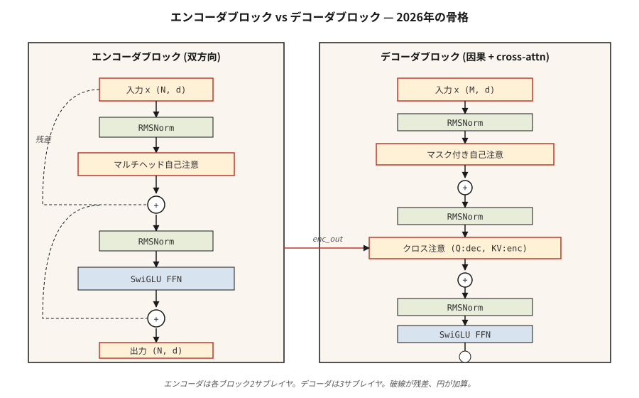

# The Full Transformer — 编码器 + 解码器

> 注意力是明星。其他一切——残差、归一化、前馈网络、交叉注意力——是让你能堆叠深度的脚手架。

**Type:** Build
**Languages:** Python
**Prerequisites:** Phase 7 · 02 (Self-Attention), Phase 7 · 03 (Multi-Head Attention), Phase 7 · 04 (Positional Encoding)
**Time:** ~75 分钟

## 问题

单个注意力层是一个特征提取器，而不是模型。每层一次 matmul 对语言来说容量不够。你需要深度——而没有正确的管道，深度就会出问题。

2017 年 Vaswani 论文打包了六个设计决策，将一个注意力层变成了可堆叠的模块。此后的每个 transformer——编码器专用（BERT）、解码器专用（GPT）、编码器-解码器（T5）——都继承了相同的骨架。到 2026 年，这些模块已经被改进（RMSNorm、SwiGLU、pre-norm、RoPE），但骨架是相同的。

本课程就是这个骨架。后续课程将专门化它——06 讲编码器，07 讲解码器，08 讲编码器-解码器。

## 概念



### 六个组成部分

1. **嵌入 + 位置信号。** Token → 向量。通过 RoPE（现代）或正弦编码（经典）注入位置。
2. **Self-attention。** 每个位置关注所有其他位置。解码器中是 masked。
3. **前馈网络（FFN）。** 逐位置的两层 MLP：`W_2 · activation(W_1 · x)`。默认扩展比为 4×。
4. **残差连接。** `x + sublayer(x)`。没有它，梯度在超过约 6 层后消失。
5. **层归一化。** `LayerNorm` 或 `RMSNorm`（现代）。稳定残差流。
6. **交叉注意力（仅解码器）。** Queries 来自解码器，keys 和 values 来自编码器输出。

观察向量流经一个模块：注意力跨位置混合，残差将其向前传递，FFN 对其进行变换，归一化保持流稳定。

### 编码器模块（BERT、T5 编码器使用）

```
x → LN → MHA(self) → + → LN → FFN → + → out
                     ^              ^
                     |              |
                     └── residual ──┘
```

编码器是双向的。无掩码。所有位置看到所有位置。

### 解码器模块（GPT、T5 解码器使用）

```
x → LN → MHA(masked self) → + → LN → MHA(cross to encoder) → + → LN → FFN → + → out
```

解码器每个模块有三个子层。中间那个——交叉注意力——是信息从编码器流向解码器的唯一地方。在纯解码器架构（GPT）中，交叉注意力被省略，只有 masked self-attention + FFN。

### Pre-norm vs Post-norm

原始论文：`x + sublayer(LN(x))` vs `LN(x + sublayer(x))`。Post-norm 在 2019 年左右失宠——没有仔细的 warmup，深度训练更难。Pre-norm（`LN` 在子层*之前*）是 2026 年的默认设置：Llama、Qwen、GPT-3+、Mistral 都使用它。

### 2026 年的现代化模块

Vaswani 2017 使用 LayerNorm + ReLU。现代堆栈已替换了二者。生产模块的实际样貌：

| 组件 | 2017 | 2026 |
|-----------|------|------|
| Normalization | LayerNorm | RMSNorm |
| FFN activation | ReLU | SwiGLU |
| FFN expansion | 4× | 2.6×（SwiGLU 使用三个矩阵，总参数量匹配） |
| Position | Sinusoidal absolute | RoPE |
| Attention | Full MHA | GQA（或 MLA） |
| Bias terms | 是 | 否 |

RMSNorm 去掉了 LayerNorm 的均值居中（少一次减法），节省了计算，并且经验上至少同样稳定。SwiGLU（`Swish(W1 x) ⊙ W3 x`）在 Llama、PaLM 和 Qwen 论文中持续以约 0.5 ppl 点优于 ReLU/GELU FFN。

### 参数量

对于一个 `d_model = d` 且 FFN 扩展比为 `r` 的模块：

- MHA：`4 · d²`（Q、K、V、O 投影）
- FFN（SwiGLU）：`3 · d · (r · d)` ≈ `3rd²`
- Norms：可忽略

在 `d = 4096, r = 2.6, layers = 32`（大致 Llama 3 8B）时，总计：`32 · (4·4096² + 3·2.6·4096²) ≈ 32 · (16 + 32) M = ~1.5B 参数每层 × 32 ≈ 7B`（加上嵌入和 head）。与已公布的数据一致。

## 动手构建

### 步骤 1：构建模块

使用第 03 课的微型 `Matrix` 类（为独立运行已复制到本文件）：

- `layer_norm(x, eps=1e-5)` — 减去均值，除以标准差。
- `rms_norm(x, eps=1e-6)` — 除以 RMS。无均值减法。
- `gelu(x)` 和 `silu(x) * W3 x`（SwiGLU）。
- `ffn_swiglu(x, W1, W2, W3)`。
- `encoder_block(x, params)` 和 `decoder_block(x, enc_out, params)`。

完整连线参见 `code/main.py`。

### 步骤 2：连线一个 2 层编码器和一个 2 层解码器

堆叠它们。将编码器输出传入每个解码器交叉注意力。在输出投影前添加一个最终的 LN。

```python
def encode(tokens, params):
    x = embed(tokens, params.emb) + sinusoidal(len(tokens), params.d)
    for block in params.encoder_blocks:
        x = encoder_block(x, block)
    return x

def decode(target_tokens, encoder_out, params):
    x = embed(target_tokens, params.emb) + sinusoidal(len(target_tokens), params.d)
    for block in params.decoder_blocks:
        x = decoder_block(x, encoder_out, block)
    return x
```

### 步骤 3：在玩具示例上运行前向传播

输入一个 6-token 源序列和一个 5-token 目标序列。验证输出形状为 `(5, vocab)`。不训练——本课程关注架构，而非损失。

### 步骤 4：替换为 RMSNorm + SwiGLU

将 LayerNorm 和 ReLU-FFN 替换为 RMSNorm 和 SwiGLU。确认形状仍然匹配。这是通过一次函数替换完成的 2026 年现代化。

## 实际应用

PyTorch/TF 参考实现：`nn.TransformerEncoderLayer`、`nn.TransformerDecoderLayer`。但大多数 2026 年生产代码自己编写模块，因为：

- Flash Attention 在注意力内部调用，而非通过 `nn.MultiheadAttention`。
- GQA / MLA 不在标准库参考中。
- RoPE、RMSNorm、SwiGLU 不是 PyTorch 的默认选项。

HF `transformers` 有你应该阅读的清晰参考模块：`modeling_llama.py` 是 2026 年解码器模块的典范。约 500 行，值得完整通读一次。

**编码器 vs 解码器 vs 编码器-解码器——何时选择：**

| 需求 | 选择 | 示例 |
|------|------|---------|
| 分类、嵌入、文本 QA | Encoder-only | BERT, DeBERTa, ModernBERT |
| 文本生成、聊天、代码、推理 | Decoder-only | GPT, Llama, Claude, Qwen |
| 结构化输入 → 结构化输出（翻译、摘要） | Encoder-decoder | T5, BART, Whisper |

Decoder-only 赢得了语言领域，因为它的扩展最干净，且同时处理理解和生成。当输入有清晰的"源序列"身份时（翻译、语音识别、结构化任务），Encoder-decoder 仍然最佳。

## 交付

参见 `outputs/skill-transformer-block-reviewer.md`。该 skill 对照 2026 年默认配置审查新的 transformer 模块实现，并标记缺失的部分（pre-norm、RoPE、RMSNorm、GQA、FFN 扩展比）。

## 练习

1. **简单。** 在 `d_model=512, n_heads=8, ffn_expansion=4, swiglu=True` 时计算你的 encoder_block 的参数。通过实现模块并使用 `sum(p.numel() for p in block.parameters())` 验证。
2. **中等。** 从 post-norm 切换到 pre-norm。初始化两者，在随机输入上测量 12 层堆叠后的激活范数。Post-norm 的激活应该爆炸；pre-norm 的应该保持有界。
3. **困难。** 在一个玩具复制任务（反转复制 `x`）上实现一个 4 层编码器-解码器。训练 100 步。报告损失。替换为 RMSNorm + SwiGLU + RoPE——损失是否下降？

## 关键术语

| 术语 | 人们说的 | 实际含义 |
|------|-----------------|-----------------------|
| Block | "一个 transformer 层" | Norm + attention + norm + FFN 的堆叠，包裹在残差连接中。 |
| Residual | "跳跃连接" | `x + f(x)` 输出；使梯度能流经深层堆叠。 |
| Pre-norm | "先归一化，后操作" | 现代：`x + sublayer(LN(x))`。无需 warmup 技巧就能训练更深。 |
| RMSNorm | "没有均值的 LayerNorm" | 除以 RMS；少一次操作，相同的经验稳定性。 |
| SwiGLU | "大家都换用的 FFN" | `Swish(W1 x) ⊙ W3 x → W2`。在 LM ppl 上优于 ReLU/GELU。 |
| Cross-attention | "解码器如何看到编码器" | Q 来自解码器、K/V 来自编码器输出的 MHA。 |
| FFN expansion | "中间 MLP 有多宽" | 隐藏大小与 d_model 之比，通常为 4（LayerNorm）或 2.6（SwiGLU）。 |
| Bias-free | "去掉 +b 项" | 现代堆栈在线性层中省略偏置；略微改善 ppl，模型更小。 |

## 延伸阅读

- [Vaswani et al. (2017). Attention Is All You Need](https://arxiv.org/abs/1706.03762) — 原始模块规范。
- [Xiong et al. (2020). On Layer Normalization in the Transformer Architecture](https://arxiv.org/abs/2002.04745) — 为什么 pre-norm 在深层优于 post-norm。
- [Zhang, Sennrich (2019). Root Mean Square Layer Normalization](https://arxiv.org/abs/1910.07467) — RMSNorm。
- [Shazeer (2020). GLU Variants Improve Transformer](https://arxiv.org/abs/2002.05202) — SwiGLU 论文。
- [HuggingFace `modeling_llama.py`](https://github.com/huggingface/transformers/blob/main/src/transformers/models/llama/modeling_llama.py) — 典范的 2026 年解码器模块。
