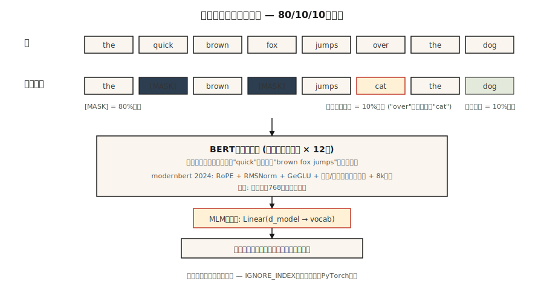

# BERT — Masked Language Modeling

> GPT は次の単語を予測します。BERT は欠けた単語を予測します。違いはたった 1 文ですが、embedding 系のあらゆる仕事を 5 年分変えました。

**種別:** 構築
**言語:** Python
**前提条件:** Phase 7 · 05 (Full Transformer), Phase 5 · 02 (Text Representation)
**所要時間:** 約45分

## 問題

2018 年当時、sentiment、NER、QA、entailment など、すべての NLP task はそれぞれの labeled data で独自 model を scratch から学習していました。fine-tune できる事前学習済みの「英語を理解する」checkpoint はありませんでした。ELMo (2018) は、bidirectional LSTM で contextual embedding を pre-train できることを示しました。効果はありましたが、十分には generalize しませんでした。

BERT (Devlin et al. 2018) はこう問いかけました。transformer encoder を取り、internet 上のあらゆる sentence で学習し、両側の context から欠けた単語を予測させたらどうなるか。その後、downstream task 用の head を 1 つ fine-tune します。parameter efficiency は衝撃的でした。

結果として、18 か月以内に BERT とその variants (RoBERTa、ALBERT、ELECTRA) は存在する NLP leaderboard を席巻しました。2020 年までに、地球上のあらゆる search engine、content moderation pipeline、semantic-search system の内部に BERT が入りました。

2026 年でも encoder-only model は classification、retrieval、structured extraction に適した道具です。decoder より token あたり 5–10× 高速に動き、embedding は現代的 retrieval stack の backbone です。ModernBERT (Dec 2024) は Flash Attention + RoPE + GeGLU により、architecture を 8K context まで押し上げました。

## コンセプト



### Training signal

文を 1 つ取ります: `the quick brown fox jumps over the lazy dog`.

token の 15% を random に mask します。

```
input:  the [MASK] brown fox jumps [MASK] the lazy dog
target: the  quick brown fox jumps  over  the lazy dog
```

masked position の original token を予測するように model を学習します。encoder は bidirectional なので、position 1 の `[MASK]` を予測するときに position 2 以降の `brown fox jumps` を使えます。これが GPT にはできないことです。

### BERT mask rules

prediction 用に選ばれた 15% の token について:

- 80% は `[MASK]` に置き換える。
- 10% は random token に置き換える。
- 10% は変更しない。

なぜ常に `[MASK]` にしないのでしょうか。`[MASK]` は inference time には出現しないからです。masked position の 100% で `[MASK]` を期待するように model を学習すると、pretraining と fine-tuning の間に distribution shift が生じます。10% random + 10% unchanged によって、model を現実に近い入力に慣らします。

### Next Sentence Prediction (NSP) — そして落とされた理由

Original BERT は NSP も学習しました。2 つの sentence A と B が与えられ、B が A の次に続くかを予測します。RoBERTa (2019) はこれを ablation し、NSP は役に立たずむしろ悪化させることを示しました。現代の encoder はこれを使いません。

### 2026 年に何が変わったか: ModernBERT

2024 年の ModernBERT paper は、2026 年の primitives で block を組み直しました。

| Component | Original BERT (2018) | ModernBERT (2024) |
|-----------|----------------------|-------------------|
| Positional | Learned absolute | RoPE |
| Activation | GELU | GeGLU |
| Normalization | LayerNorm | Pre-norm RMSNorm |
| Attention | Full dense | Alternating local (128) + global |
| Context length | 512 | 8192 |
| Tokenizer | WordPiece | BPE |

さらに 2018 年の stack と違い、Flash-Attention-native です。sequence length 8K での inference は DeBERTa-v3 より 2–3× 高速で、GLUE score も高くなっています。

### 2026 年でも encoder を選ぶ use case

| Task | decoder より encoder が勝つ理由 |
|------|---------------------------|
| Retrieval / semantic search embeddings | Bidirectional context = token あたりの embedding quality が高い |
| Classification (sentiment, intent, toxicity) | 1 回の forward pass。generation overhead がない |
| NER / token labeling | position ごとの output。自然に bidirectional |
| Zero-shot entailment (NLI) | encoder の上に classifier head |
| Reranker for RAG | Cross-encoder scoring。LLM reranker より 10x 高速 |

## 作ってみる

### Step 1: masking logic

`code/main.py` を見てください。`create_mlm_batch` function は token ID の list、vocab size、mask probability を受け取ります。mask 適用後の input IDs と labels を返します。labels は masked position のみで、それ以外は -100 です。これは PyTorch の ignore index convention です。

```python
def create_mlm_batch(tokens, vocab_size, mask_prob=0.15, rng=None):
    input_ids = list(tokens)
    labels = [-100] * len(tokens)
    for i, t in enumerate(tokens):
        if rng.random() < mask_prob:
            labels[i] = t
            r = rng.random()
            if r < 0.8:
                input_ids[i] = MASK_ID
            elif r < 0.9:
                input_ids[i] = rng.randrange(vocab_size)
            # else: keep original
    return input_ids, labels
```

### Step 2: tiny corpus で MLM prediction を走らせる

20 語の vocabulary、200 sentences で、2-layer encoder + MLM head を学習します。gradient は使わず、forward-pass sanity check だけをします。本格的な training には PyTorch が必要です。

### Step 3: mask type を比較する

3-way rule により、`[MASK]` がなくても model が使えることを示します。unmasked sentence と masked sentence で予測します。model は両方の pattern を training で見ているため、どちらも妥当な token distribution を出すはずです。

### Step 4: fine-tune head

MLM head を toy sentiment dataset 用の classification head に置き換えます。学習するのは head だけで、encoder は frozen です。これはすべての BERT application が従う pattern です。

## 使ってみる

```python
from transformers import AutoModel, AutoTokenizer

tok = AutoTokenizer.from_pretrained("answerdotai/ModernBERT-base")
model = AutoModel.from_pretrained("answerdotai/ModernBERT-base")

text = "Attention is all you need."
inputs = tok(text, return_tensors="pt")
out = model(**inputs).last_hidden_state   # (1, N, 768)
```

**Embedding models are fine-tuned BERT.** `sentence-transformers` の `all-MiniLM-L6-v2` のような model は、contrastive loss で学習された BERT です。encoder は同じで、loss が変わっています。

**Cross-encoder rerankers are also fine-tuned BERT.** `[CLS] query [SEP] doc [SEP]` に対する pair-classification です。query と doc の間の bidirectional attention こそが、cross-encoder が biencoder より品質面で有利な理由です。

**2026 年に BERT を選ばない場面。** 生成を伴うものすべてです。encoder には token を autoregressive に生成する自然な方法がありません。また、1B params 未満で小さな decoder がより柔軟に同等品質を出せる場合 (Phi-3-Mini、Qwen2-1.5B) も該当します。

## Ship It

`outputs/skill-bert-finetuner.md` を見てください。この skill は、新しい classification または extraction task に対する BERT fine-tune を scope します (backbone choice、head spec、data、eval、stopping)。

## 演習

1. **Easy.** `code/main.py` を実行し、10,000 tokens に対する mask distribution を出力してください。約 15% が選ばれ、そのうち約 80% が `[MASK]` になることを確認します。
2. **Medium.** whole-word masking を実装してください。ある word が subword に tokenized される場合、すべての subword をまとめて mask するか、どれも mask しないようにします。500-sentence corpus で MLM accuracy が改善するか測ります。
3. **Hard.** public dataset の 10,000 sentences で tiny (2-layer, d=64) BERT を学習してください。SST-2 sentiment 用に `[CLS]` token を fine-tune します。同じ params に合わせた decoder-only baseline と比較し、どちらが勝つか確認します。

## Key Terms

| Term | What people say | What it actually means |
|------|-----------------|-----------------------|
| MLM | 「Masked language modeling」 | 15% の token を random に `[MASK]` へ置換し、original を予測する training signal。 |
| Bidirectional | 「両側を見る」 | Encoder attention には causal mask がない。すべての position が他のすべての position を見る。 |
| `[CLS]` | 「Pooler token」 | すべての sequence の先頭に置く special token。final embedding が sentence-level representation として使われる。 |
| `[SEP]` | 「Segment separator」 | paired sequence を区切る (例: query/doc、sentence A/B)。 |
| NSP | 「Next sentence prediction」 | BERT の 2 つ目の pretraining task。RoBERTa で無意味と示され、2019 年以降は dropped。 |
| Fine-tuning | 「task に適応する」 | encoder はほぼ frozen のまま、downstream task 用に上の small head を学習する。 |
| Cross-encoder | 「reranker」 | query と doc の両方を input に取り、relevance score を出す BERT。 |
| ModernBERT | 「2024 refresh」 | RoPE、RMSNorm、GeGLU、alternating local/global attention、8K context で組み直した encoder。 |

## 参考文献

- [Devlin et al. (2018). BERT: Pre-training of Deep Bidirectional Transformers for Language Understanding](https://arxiv.org/abs/1810.04805) — original paper。
- [Liu et al. (2019). RoBERTa: A Robustly Optimized BERT Pretraining Approach](https://arxiv.org/abs/1907.11692) — BERT を正しく学習する方法。NSP を退場させた。
- [Clark et al. (2020). ELECTRA: Pre-training Text Encoders as Discriminators Rather Than Generators](https://arxiv.org/abs/2003.10555) — 同じ compute なら replaced-token detection が MLM を上回る。
- [Warner et al. (2024). Smarter, Better, Faster, Longer: A Modern Bidirectional Encoder](https://arxiv.org/abs/2412.13663) — ModernBERT paper。
- [HuggingFace `modeling_bert.py`](https://github.com/huggingface/transformers/blob/main/src/transformers/models/bert/modeling_bert.py) — canonical encoder reference。
