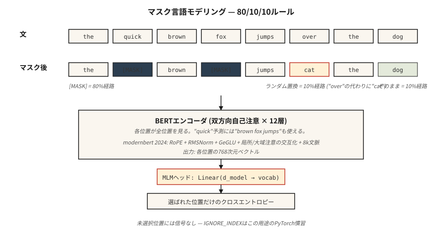

# BERT — 掩码语言建模

> GPT 预测下一个词。BERT 预测缺失的词。一句话的差别——以及半十年的一切嵌入形态。

**Type:** Build
**Languages:** Python
**Prerequisites:** Phase 7 · 05 (Full Transformer), Phase 5 · 02 (Text Representation)
**Time:** ~45 分钟

## 问题

2018 年，每个 NLP 任务——情感分析、NER、QA、蕴含——都在自己的标注数据上从头训练自己的模型。没有预训练的"理解英语"检查点可以微调。ELMo（2018）展示了可以用双向 LSTM 预训练上下文嵌入；它有所帮助但未能泛化。

BERT（Devlin et al. 2018）问道：如果我们拿一个 transformer 编码器，在互联网上的每个句子上训练它，并强迫它从两侧上下文预测缺失的词，会怎样？然后你在下游任务上微调一个 head。参数效率是一个启示。

结果：18 个月内 BERT 及其变体（RoBERTa、ALBERT、ELECTRA）主导了每个存在的 NLP 排行榜。到 2020 年，地球上的每个搜索引擎、内容审核管道和语义搜索系统内部都有一个 BERT。

到 2026 年，编码器专用模型仍然是分类、检索和结构化提取的正确工具——它们每 token 运行速度比解码器快 5–10 倍，其嵌入是每个现代检索系统的基础。ModernBERT（2024 年 12 月）将架构推至 8K 上下文，配有 Flash Attention + RoPE + GeGLU。

## 概念



### 训练信号

取一个句子：`the quick brown fox jumps over the lazy dog`。

随机掩码 15% 的 token：

```
input:  the [MASK] brown fox jumps [MASK] the lazy dog
target: the  quick brown fox jumps  over  the lazy dog
```

训练模型在掩码位置预测原始 token。因为编码器是双向的，预测位置 1 的 `[MASK]` 可以使用位置 2+ 的 `brown fox jumps`。这是 GPT 做不到的事情。

### BERT 掩码规则

在选中的 15% 用于预测的 token 中：

- 80% 被替换为 `[MASK]`。
- 10% 被替换为随机 token。
- 10% 保持不变。

为什么不全用 `[MASK]`？因为 `[MASK]` 在推理时从不出现。训练模型期望 100% 的掩码位置是 `[MASK]` 会在预训练和微调之间造成分布偏移。10% 随机 + 10% 不变让模型保持诚实。

### 下一句预测（NSP）——以及为何被弃用

原始 BERT 还训练了 NSP：给定两个句子 A 和 B，预测 B 是否跟随 A。RoBERTa（2019）消融了它并显示 NSP 有害而无益。现代编码器跳过了它。

### 2026 年的变化：ModernBERT

2024 年的 ModernBERT 论文用 2026 年原语重建了模块：

| 组件 | 原始 BERT（2018） | ModernBERT（2024） |
|-----------|----------------------|-------------------|
| Positional | Learned absolute | RoPE |
| Activation | GELU | GeGLU |
| Normalization | LayerNorm | Pre-norm RMSNorm |
| Attention | Full dense | 交替局部（128）+ 全局 |
| Context length | 512 | 8192 |
| Tokenizer | WordPiece | BPE |

与 2018 年的堆栈不同，它是 Flash-Attention 原生的。在序列长度 8K 时推理速度比 DeBERTa-v3 快 2–3 倍，且 GLUE 分数更高。

### 2026 年仍选编码器的用例

| 任务 | 编码器为何优于解码器 |
|------|---------------------------|
| 检索 / 语义搜索嵌入 | 双向上下文 = 每 token 更好的嵌入质量 |
| 分类（情感、意图、毒性） | 一次前向传播；无生成开销 |
| NER / token 标注 | 逐位置输出，原生双向 |
| 零样本蕴含（NLI） | 编码器顶部分类器 head |
| RAG 的重排序器 | Cross-encoder 评分，比 LLM 重排序器快 10 倍 |

## 动手构建

### 步骤 1：掩码逻辑

参见 `code/main.py`。函数 `create_mlm_batch` 接受 token ID 列表、词汇表大小和掩码概率。返回 input IDs（应用了掩码）和 labels（仅在掩码位置，其他位置为 -100——PyTorch 的忽略索引约定）。

```python
def create_mlm_batch(tokens, vocab_size, mask_prob=0.15, rng=None):
    input_ids = list(tokens)
    labels = [-100] * len(tokens)
    for i, t in enumerate(tokens):
        if rng.random() < mask_prob:
            labels[i] = t
            r = rng.random()
            if r < 0.8:
                input_ids[i] = MASK_ID
            elif r < 0.9:
                input_ids[i] = rng.randrange(vocab_size)
            # else: keep original
    return input_ids, labels
```

### 步骤 2：在小型语料库上运行 MLM 预测

在 20 个词、200 个句子的词汇表上训练一个 2 层编码器 + MLM head。没有梯度——我们做前向传播的合理性检查。完整训练需要 PyTorch。

### 步骤 3：比较掩码类型

展示三元规则如何让模型在无 `[MASK]` 的情况下仍可使用。在未掩码句子和掩码句子上预测。两者都应产生合理的 token 分布，因为模型在训练中看到了两种模式。

### 步骤 4：微调 head

在玩具情感数据集上将 MLM head 替换为分类 head。只有 head 训练；编码器冻结。这是每个 BERT 应用遵循的模式。

## 实际应用

```python
from transformers import AutoModel, AutoTokenizer

tok = AutoTokenizer.from_pretrained("answerdotai/ModernBERT-base")
model = AutoModel.from_pretrained("answerdotai/ModernBERT-base")

text = "Attention is all you need."
inputs = tok(text, return_tensors="pt")
out = model(**inputs).last_hidden_state   # (1, N, 768)
```

**嵌入模型是微调过的 BERT。** `sentence-transformers` 模型如 `all-MiniLM-L6-v2` 是用对比损失训练的 BERT。编码器相同。损失不同。

**Cross-encoder 重排序器也是微调过的 BERT。** 在 `[CLS] query [SEP] doc [SEP]` 上的成对分类。query 和 doc 之间的双向注意力正是 cross-encoder 在质量上优于 biencoder 的原因。

**2026 年何时不选 BERT。** 任何生成式任务。编码器没有合理的方式自回归地生成 token。另外：任何小于 1B 参数的情况，此时小解码器能以更多灵活性匹配质量（Phi-3-Mini、Qwen2-1.5B）。

## 交付

参见 `outputs/skill-bert-finetuner.md`。该 skill 为新的分类或提取任务规划 BERT 微调（backbone 选择、head 规范、数据、评估、停止条件）。

## 练习

1. **简单。** 运行 `code/main.py`，打印 10,000 个 token 上的掩码分布。确认约 15% 被选中，其中约 80% 变成 `[MASK]`。
2. **中等。** 实现全词掩码：如果一个词被分词为子词，要么全部掩码要么全部不掩码。测量这是否在 500 句子的语料库上提高 MLM 准确率。
3. **困难。** 在来自公共数据集的 10,000 个句子上训练一个微型（2 层，d=64）BERT。为 SST-2 情感微调 `[CLS]` token。与参数匹配的解码器基线比较——哪个胜出？

## 关键术语

| 术语 | 人们说的 | 实际含义 |
|------|-----------------|-----------------------|
| MLM | "掩码语言建模" | 训练信号：随机将 15% 的 token 替换为 `[MASK]`，预测原文。 |
| Bidirectional | "双向看" | 编码器注意力没有 causal mask——每个位置看到所有其他位置。 |
| `[CLS]` | "池化 token" | 预置在每个序列前的特殊 token；其最终嵌入用作句子级表示。 |
| `[SEP]` | "分段分隔符" | 分隔成对序列（如 query/doc，句子 A/B）。 |
| NSP | "下一句预测" | BERT 的第二个预训练任务；在 RoBERTa 中被证明无用，2019 年后弃用。 |
| Fine-tuning | "适应任务" | 基本冻结编码器；在顶部训练一个小 head 用于下游任务。 |
| Cross-encoder | "重排序器" | 一个 BERT，同时接收 query 和 doc 作为输入，输出相关性分数。 |
| ModernBERT | "2024 刷新" | 用 RoPE、RMSNorm、GeGLU、交替局部/全局注意力、8K 上下文重建的编码器。 |

## 延伸阅读

- [Devlin et al. (2018). BERT: Pre-training of Deep Bidirectional Transformers for Language Understanding](https://arxiv.org/abs/1810.04805) — 原始论文。
- [Liu et al. (2019). RoBERTa: A Robustly Optimized BERT Pretraining Approach](https://arxiv.org/abs/1907.11692) — 如何正确训练 BERT；消灭了 NSP。
- [Clark et al. (2020). ELECTRA: Pre-training Text Encoders as Discriminators Rather Than Generators](https://arxiv.org/abs/2003.10555) — 在匹配计算下，替换 token 检测优于 MLM。
- [Warner et al. (2024). Smarter, Better, Faster, Longer: A Modern Bidirectional Encoder](https://arxiv.org/abs/2412.13663) — ModernBERT 论文。
- [HuggingFace `modeling_bert.py`](https://github.com/huggingface/transformers/blob/main/src/transformers/models/bert/modeling_bert.py) — 典范编码器参考。
