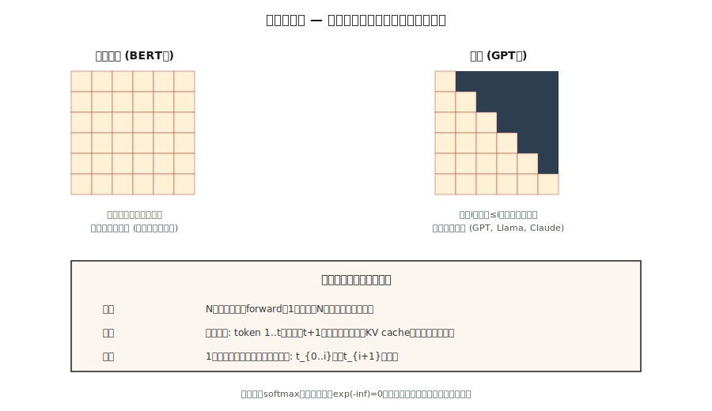

# GPT — Modelagem de Linguagem Causal

> BERT vê os dois lados. GPT vê só o passado. A máscara triangular é a única linha de código mais consequente da IA moderna.

**Tipo:** Construir
**Linguagens:** Python
**Pré-requisitos:** Fase 7 · 02 (Self-Attention), Fase 7 · 05 (Transformer Completo), Fase 7 · 06 (BERT)
**Tempo:** ~75 minutos

## O Problema

Um modelo de linguagem responde uma pergunta: dados os primeiros `t-1` tokens, qual é a distribuição de probabilidade sobre o token `t`? Treine nesse sinal — predição do próximo token — e você consegue um modelo que gera texto arbitrário um token por vez.

Pra treinar de ponta a ponta numa sequência inteira em paralelo, você precisa que a predição de cada posição dependa só de posições anteriores. Caso contrário o modelo trapaceia olhando a resposta.

A máscara causal faz isso. É uma única matriz triangular superior de valores `-inf` adicionada aos scores de attention antes do softmax. Depois do softmax, aquelas posições viram 0. Cada posição só attend a si mesma e posições anteriores. E como você aplica isso uma vez na sequência inteira, consegue N predições paralelas do próximo token num forward pass.

GPT-1 (2018), GPT-2 (2019), GPT-3 (2020), GPT-4 (2023), GPT-5 (2024), Claude, Llama, Qwen, Mistral, DeepSeek, Kimi — são todos transformers causais decoder-only com o mesmo loop central. Só maiores, melhores dados e melhor RLHF.

## O Conceito



### A máscara

Dada uma sequência de comprimento `N`, construa uma matriz `N × N`:

```
M[i, j] = 0       if j <= i
M[i, j] = -inf    if j > i
```

Adicione `M` aos scores brutos de attention antes do softmax. `exp(-inf) = 0`, então posições mascaradas contribuem peso zero. Cada linha da matriz de attention é uma distribuição de probabilidade só sobre posições anteriores.

Custo de implementação: uma chamada `torch.tril()`. Tempo de computação: nanossegundos. Impacto no campo: tudo.

### Treinamento paralelo, inferência serial

Treinamento: forward pass na sequência inteira `(N, d_model)` uma vez, calcula N perdas de entropia cruzada (uma por posição), soma, backprop. Paralelo ao longo da sequência. É por isso que treinamento GPT escala — você processa 1M tokens num batch em uma passada de GPU.

Inferência: você gera token por token. Alimenta `[t1, t2, t3]`, recebe `t4`. Alimenta `[t1, t2, t3, t4]`, recebe `t5`. O KV cache (Aula 12) salva os estados ocultos de `t1…tn` pra não recomputar a cada passo. Mas profundidade serial na inferência = comprimento da saída. Esse é o custo autoregressivo e por que decodificação é o gargalo de latência de todo LLM.

### A perda — shift-by-one

Dados tokens `[t1, t2, t3, t4]`:

- Entrada: `[t1, t2, t3]`
- Alvos: `[t2, t3, t4]`

Pra cada posição `i`, calcule `-log P(target_i | inputs[:i+1])`. Some. Essa é a entropia cruzada pra sequência inteira.

Todo transformer LM que você conhece treina com essa perda. Pré-treinamento, fine-tuning, SFT — mesma perda, dados diferentes.

### Estratégias de decodificação

Depois do treinamento, escolhas de amostragem importam mais que as pessoas pensam.

| Método | O que faz | Quando usar |
|--------|-----------|-------------|
| Guloso | Argmax a cada passo | Tarefas determinísticas, completar código |
| Temperatura | Divide logits por T, amostra | Tarefas criativas, T maior = mais diversidade |
| Top-k | Amostra só dos top-k tokens | Mata caudas de baixa probabilidade |
| Top-p (núcleo) | Amostra do menor conjunto com prob cumulativa ≥ p | Padrão pós-2020; se adapta à forma da distribuição |
| Min-p | Mantém tokens com `p > min_p * max_p` | Pós-2024; melhor que top-p pra rejeitar caudas longas |
| Decodificação eespecificaçãoulativa | Modelo rascunho propõe N tokens, modelo grande verifica | Redução de latência de 2–3× na mesma qualidade |

Em 2026, min-p + temperatura 0,7 é um padrão razoável pra modelos de pesos abertos. Decodificação eespecificaçãoulativa é requisito básico em qualquer stack de inferência de produção.

### O que fez a "receita GPT" funcionar

1. **Decoder-only.** Sem custo de encoder. Uma passada de attention + FFN por camada.
2. **Escala.** 124M → 1,5B → 175B → trilhões. Leis de escala Chinchilla (Aula 13) dizem como gastar compute.
3. **Aprendizado em contexto.** Emergiu por volta de 6B–13B. O modelo segue exemplos few-shot sem fine-tuning.
4. **RLHF.** Pós-treinamento em preferências humanas converteu texto pré-treinado bruto em assistentes de chat.
5. **Pre-norm + RoPE + SwiGLU.** Treinamento estável em escala.

A arquitetura central não mudou muito desde GPT-2. Tudo interessante aconteceu em dados, escala e pós-treinamento.

## Construindo

### Passo 1: a máscara causal

Veja `code/main.py`. Uma linha:

```python
def causal_mask(n):
    return [[0.0 if j <= i else float("-inf") for j in range(n)] for i in range(n)]
```

Adicione aos scores de attention antes do softmax. É o mecanismo inteiro.

### Passo 2: um modelo GPTzinho de 2 camadas

Empilhe dois blocos de decoder (self-attention mascarada + FFN, sem cross-attention). Adicione um embedding de token, uma codificação positional e uma unembedding (compartilhada com a matriz de embedding de token — truque padrão desde GPT-2).

### Passo 3: predição do próximo token, de ponta a ponta

Num vocabulário brinquedo de 20 tokens, gere logits em cada posição. Calcule perda de entropia cruzada contra o alvo shift-by-one. Sem gradiente — é verificação de forward pass.

### Passo 4: amostragem

Implemente guloso, temperatura, top-k, top-p, min-p. Rode cada um num prompt fixo e compare saídas. Uma função de amostragem tem 10 linhas.

## Usando

PyTorch, idioma de 2026:

```python
from transformers import AutoModelForCausalLM, AutoTokenizer
model = AutoModelForCausalLM.from_pretrained("meta-llama/Llama-3.2-3B-Instruct")
tok = AutoTokenizer.from_pretrained("meta-llama/Llama-3.2-3B-Instruct")

prompt = "Attention is all you need because"
inputs = tok(prompt, return_tensors="pt")
out = model.generate(
    **inputs,
    max_new_tokens=64,
    temperature=0.7,
    top_p=0.9,
    do_sample=True,
)
print(tok.decode(out[0]))
```

Por baixo dos panos, `generate()` roda o forward pass, puxa os logits da última posição, amostra o próximo token, anexa e repete. Toda stack de inferência de LLM de produção (vLLM, TensorRT-LLM, llama.cpp, Ollama, MLX) implementa o mesmo loop com muita otimização — prefill em batch, batch contínuo, paginação de KV cache, decodificação eespecificaçãoulativa.

**GPT vs BERT, uma linha cada:** GPT prevê `P(x_t | x_{<t})`. BERT prevê `P(x_masked | x_unmasked)`. A perda determina se o modelo pode gerar.

## Entregando

Veja `outputs/skill-sampling-tuner.md`. A skill escolhe parâmetros de amostragem pra uma nova tarefa de geração e marca quando decodificação determinística é necessária.

## Exercícios

1. **Fácil.** Rode `code/main.py` e verifique que a matriz de attention causal é triangular inferior depois do softmax. Checagem rápida: linha 3 deve ter pesos só nas colunas 0–3.
2. **Médio.** Implemente beam search com largura 4. Compare perplexidade de beam-4 vs guloso em 10 prompts curtos. Beam sempre ganha? (Dica: geralmente pra tradução, não pra chat aberto.)
3. **Difícil.** Implemente decodificação eespecificaçãoulativa: use um tiny modelo de 2 camadas como rascunho e um de 6 camadas como verificador. Meça aceleração em tempo real em 100 completões de comprimento 64. Confirme que saídas combinam com o guloso do verificador.

## Termos-Chave

| Termo | O que as pessoas dizem | O que realmente significa |
|-------|------------------------|--------------------------|
| Máscara causal | "O triângulo" | Matriz triangular superior `-inf` adicionada aos scores de attention pra que posição `i` só veja posições `≤ i`. |
| Predição do próximo token | "A perda" | Entropia cruzada da distribuição do modelo contra o próximo token verdadeiro em cada posição. |
| Autoregressivo | "Gera um de cada vez" | Alimenta saída como entrada; paralelismo só durante treinamento, não durante geração. |
| Logits | "Scores pré-softmax" | Saída bruta da head LM antes do softmax; amostragem acontece aqui. |
| Temperatura | "Controle de criatividade" | Divide logits por T; T→0 = guloso, T→∞ = uniforme. |
| Top-p | "Amostragem de núcleo" | Trunca distribuição pro menor conjunto somando ≥p; amostra do que sobra. |
| Min-p | "Melhor que top-p" | Mantém tokens onde `p ≥ min_p × max_p`; adapta corte à agudeza da distribuição. |
| Decodificação eespecificaçãoulativa | "Rascunho + verificação" | Modelo rascunho barato propõe tokens; modelo grande verifica k em uma passada. |
| Teacher forcing | "Truque de treinamento" | Durante treinamento, alimenta o token anterior verdadeiro, não a previsão do modelo. Padrão pra todo LM seq2seq. |

## Leituras Complementares

- [Radford et al. (2018). Improving Language Understanding by Generative Pre-Training](https://cdn.openai.com/research-covers/language-unsupervised/language_understanding_paper.pdf) — GPT-1.
- [Radford et al. (2019). Language Models are Unsupervised Multitask Learners](https://cdn.openai.com/better-language-models/language_models_are_unsupervised_multitask_learners.pdf) — GPT-2.
- [Brown et al. (2020). Language Models are Few-Shot Learners](https://arxiv.org/abs/2005.14165) — GPT-3 e aprendizado em contexto.
- [Leviathan, Kalman, Matias (2023). Fast Inference from Transformers via Speculative Decoding](https://arxiv.org/abs/2211.17192) — paper de decodificação eespecificaçãoulativa.
- [HuggingFace `modeling_llama.py`](https://github.com/huggingface/transformers/blob/main/src/transformers/models/llama/modeling_llama.py) — código canônico de referência de causal-LM.
