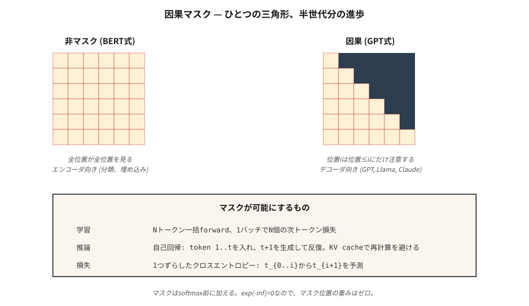

# GPT — 因果语言建模

> BERT 看到两侧。GPT 只看到过去。三角形掩码是现代 AI 中最具影响力的一行代码。

**Type:** Build
**Languages:** Python
**Prerequisites:** Phase 7 · 02 (Self-Attention), Phase 7 · 05 (Full Transformer), Phase 7 · 06 (BERT)
**Time:** ~75 分钟

## 问题

语言模型回答一个问题：给定前 `t-1` 个 token，token `t` 的概率分布是什么？在这个信号上训练——下一个 token 预测——你就得到一个可以一次一个 token 地生成任意文本的模型。

为了在整个序列上并行端到端训练，每个位置的预测必须只依赖于更早的位置。否则模型会通过看答案而简单作弊。

因果掩码做到了这一点。它是一个在 softmax 之前添加到注意力分数中的上三角 `-inf` 矩阵。经过 softmax 后，这些位置变为 0。每个位置只能关注自身和更早的位置。因为你一次对整个序列应用它，你在一次前向传播中获得了 N 个并行的下一个 token 预测。

GPT-1（2018）、GPT-2（2019）、GPT-3（2020）、GPT-4（2023）、GPT-5（2024）、Claude、Llama、Qwen、Mistral、DeepSeek、Kimi——它们都是解码器专用的因果 transformer，具有相同的核心循环。只是更大、更好的数据和更好的 RLHF。

## 概念



### 掩码

给定长度为 `N` 的序列，构建一个 `N × N` 矩阵：

```
M[i, j] = 0       if j <= i
M[i, j] = -inf    if j > i
```

在 softmax 之前将 `M` 加到原始注意力分数上。`exp(-inf) = 0`，所以掩码位置贡献零权重。注意力矩阵的每一行是仅对先前位置的概率分布。

实现成本：一次 `torch.tril()` 调用。计算时间：纳秒级。对领域的影响：一切。

### 并行训练，串行推理

训练：一次前向传递整个 `(N, d_model)` 序列，计算 N 个交叉熵损失（每个位置一个），求和，反向传播。沿序列并行。这就是 GPT 训练可扩展的原因——你在一次 GPU 传递中处理一批 100 万个 token。

推理：你逐个 token 生成。输入 `[t1, t2, t3]`，得到 `t4`。输入 `[t1, t2, t3, t4]`，得到 `t5`。输入 `[t1, t2, t3, t4, t5]`，得到 `t6`。KV cache（第 12 课）保存 `t1…tn` 的隐藏状态，这样你就不必每一步都重新计算它们。但推理时的串行深度 = 输出长度。这就是自回归税，也是为什么解码是每个 LLM 的延迟瓶颈。

### 损失——移位一位

给定 token `[t1, t2, t3, t4]`：

- 输入：`[t1, t2, t3]`
- 目标：`[t2, t3, t4]`

对于每个位置 `i`，计算 `-log P(target_i | inputs[:i+1])`。求和。这是整个序列的交叉熵。

你听说过的每个 transformer LM 都在这个损失上训练。预训练、微调、SFT——相同的损失，不同的数据。

### 解码策略

训练后，采样选择比人们想象的重要得多。

| 方法 | 作用 | 何时使用 |
|--------|--------------|-------------|
| Greedy | 每一步 argmax | 确定性任务，代码补全 |
| Temperature | 将 logits 除以 T，采样 | 创意任务，T 越高多样性越高 |
| Top-k | 仅从 top-k token 中采样 | 杀死低概率尾部 |
| Top-p（nucleus） | 从累积概率 ≥ p 的最小集合中采样 | 2020+ 默认；适应分布形状 |
| Min-p | 保留 `p > min_p * max_p` 的 token | 2024+；比 top-p 更好地拒绝长尾 |
| Speculative decoding | Draft 模型提出 N 个 token，大模型验证 | 相同质量下 2–3× 延迟降低 |

在 2026 年，min-p + temperature 0.7 是开源权重模型的合理默认值。Speculative decoding 是任何生产推理堆栈的基本要求。

### "GPT 配方"成功的原因

1. **Decoder-only。** 无编码器开销。每层一次 attention + FFN 传递。
2. **Scaling。** 124M → 1.5B → 175B → 万亿。Chinchilla 扩展定律（第 13 课）告诉你如何分配计算。
3. **In-context learning。** 约在 6B–13B 时出现。模型可以无需微调就能遵循 few-shot 示例。
4. **RLHF。** 在人类偏好上的后训练将原始预训练文本转化为聊天助手。
5. **Pre-norm + RoPE + SwiGLU。** 大规模稳定训练。

自 GPT-2 以来，核心架构变化不大。一切有趣的事情都发生在数据、规模和后训练上。

## 动手构建

### 步骤 1：因果掩码

参见 `code/main.py`。一行代码：

```python
def causal_mask(n):
    return [[0.0 if j <= i else float("-inf") for j in range(n)] for i in range(n)]
```

在 softmax 之前将其添加到注意力分数。这就是整个机制。

### 步骤 2：一个 2 层 GPT 风格模型

堆叠两个解码器模块（masked self-attention + FFN，无交叉注意力）。添加 token 嵌入、位置编码和解嵌入（与 token 嵌入矩阵绑定——自 GPT-2 以来的标准技巧）。

### 步骤 3：端到端的下一 token 预测

在 20 个 token 的玩具词汇表上，在每个位置生成 logits。计算与移位一位目标的交叉熵损失。没有梯度——这是前向传播的合理性检查。

### 步骤 4：采样

实现 greedy、temperature、top-k、top-p、min-p。在固定 prompt 上运行每种方法并比较输出。采样函数只需 10 行。

## 实际应用

PyTorch，2026 年惯用写法：

```python
from transformers import AutoModelForCausalLM, AutoTokenizer
model = AutoModelForCausalLM.from_pretrained("meta-llama/Llama-3.2-3B-Instruct")
tok = AutoTokenizer.from_pretrained("meta-llama/Llama-3.2-3B-Instruct")

prompt = "Attention is all you need because"
inputs = tok(prompt, return_tensors="pt")
out = model.generate(
    **inputs,
    max_new_tokens=64,
    temperature=0.7,
    top_p=0.9,
    do_sample=True,
)
print(tok.decode(out[0]))
```

在底层，`generate()` 运行前向传播，提取最后位置的 logits，采样下一个 token，追加，重复。每个生产 LLM 推理堆栈（vLLM、TensorRT-LLM、llama.cpp、Ollama、MLX）都实现了相同的循环，并带有大量优化——批处理 prefill、continuous batching、KV cache paging、speculative decoding。

**GPT vs BERT，一句话总结：** GPT 预测 `P(x_t | x_{<t})`。BERT 预测 `P(x_masked | x_unmasked)`。损失决定了模型是否能生成。

## 交付

参见 `outputs/skill-sampling-tuner.md`。该 skill 为新的生成任务选择采样参数，并在需要确定性解码时进行标记。

## 练习

1. **简单。** 运行 `code/main.py`，验证因果注意力矩阵在 softmax 后是下三角的。抽查：第 3 行应仅在列 0–3 有权重。
2. **中等。** 实现宽度为 4 的 beam search。在 10 个短 prompt 上比较 beam-4 与 greedy 的 perplexity。Beam 总是赢吗？（提示：通常翻译时是，开放聊天时不是。）
3. **困难。** 实现 speculative decoding：使用微型 2 层模型作为 draft，6 层模型作为 verifier。在 100 个长度为 64 的补全上测量墙钟加速。确认输出与 verifier 的 greedy 匹配。

## 关键术语

| 术语 | 人们说的 | 实际含义 |
|------|-----------------|-----------------------|
| Causal mask | "三角形" | 上三角 `-inf` 矩阵，加到注意力分数上，使位置 `i` 只看到位置 `≤ i`。 |
| Next-token prediction | "损失" | 模型分布与每个位置真实下一 token 的交叉熵。 |
| Autoregressive | "一次生成一个" | 将输出反馈为输入；仅在训练时并行，生成时不行。 |
| Logits | "Pre-softmax 分数" | LM head 在 softmax 之前的原始输出；采样在此进行。 |
| Temperature | "创意旋钮" | 将 logits 除以 T；T→0 = greedy，T→∞ = 均匀。 |
| Top-p | "Nucleus 采样" | 截断分布至总和 ≥ p 的最小集合；从剩余部分采样。 |
| Min-p | "优于 top-p" | 保留 `p ≥ min_p × max_p` 的 token；根据分布锐度调整截断。 |
| Speculative decoding | "起草 + 验证" | 廉价模型提议 N 个 token；大模型并行验证。 |
| Teacher forcing | "训练技巧" | 训练时输入真实的先前 token，而非模型的预测。每个 seq2seq LM 的标准做法。 |

## 延伸阅读

- [Radford et al. (2018). Improving Language Understanding by Generative Pre-Training](https://cdn.openai.com/research-covers/language-unsupervised/language_understanding_paper.pdf) — GPT-1。
- [Radford et al. (2019). Language Models are Unsupervised Multitask Learners](https://cdn.openai.com/better-language-models/language_models_are_unsupervised_multitask_learners.pdf) — GPT-2。
- [Brown et al. (2020). Language Models are Few-Shot Learners](https://arxiv.org/abs/2005.14165) — GPT-3 和 in-context learning。
- [Leviathan, Kalman, Matias (2023). Fast Inference from Transformers via Speculative Decoding](https://arxiv.org/abs/2211.17192) — spec decoding 论文。
- [HuggingFace `modeling_llama.py`](https://github.com/huggingface/transformers/blob/main/src/transformers/models/llama/modeling_llama.py) — 典范因果 LM 参考代码。
