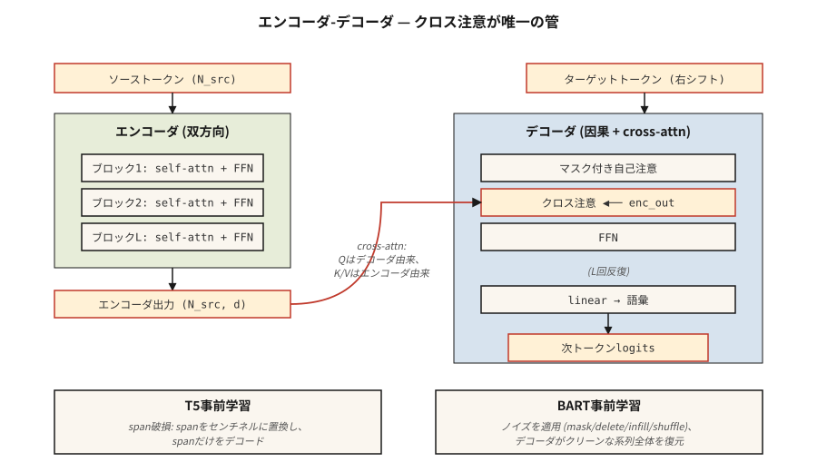

# T5, BART — Kodlayıcı-Kod Çözücü Modelleri

> Kodlayıcılar anlar. Kod çözücüler üretir. Bunları tekrar bir araya getirdiğinizde girdi → çıktı görevleri için oluşturulmuş bir model elde edersiniz: tercüme etme, özetleme, yeniden yazma, metne dönüştürme.

**Tür:** Öğren
**Diller:** Python
**Önkoşullar:** Aşama 7 · 05 (Tam Transformer), Aşama 7 · 06 (BERT), Aşama 7 · 07 (GPT)
**Süre:** ~45 dakika

## Sorun

Yalnızca kod çözücü GPT ve yalnızca kodlayıcı BERT'in her biri, farklı bir amaç için 2017 mimarisini temelden ayırır. Ancak birçok görev doğal olarak girdi-çıktıdır:

- Çeviri: İngilizce → Fransızca.
- Özetleme: 5.000-token makale → 200-token özet.
- Konuşma tanıma: ses token'ler → metin token'ler.
- Yapılandırılmış çıkarma: düzyazı → JSON.

Bunlar için kodlayıcı-kod çözücü en temiz uyumu sağlar. Kodlayıcı kaynağın yoğun bir temsilini üretir. Kod çözücü, her adımda bu temsile çapraz katılım sağlayarak çıktıyı üretir. Eğitim çıktı tarafında tek tek vardiya şeklindedir. Yalnızca kodlayıcı çıkışına bağlı olarak GPT ile aynı kayıp.

Modern taktik kitabını iki makale tanımladı:

1. **T5** (Raffel ve ark. 2019). "Metinden Metne Aktarım Transformer." Her NLP görevi metin girişi ve çıkışı olarak yeniden çerçevelendi. Tek mimari, tek kelime dağarcığı, tek kayıp. Maskelenmiş aralık tahmini konusunda önceden eğitilmiştir (girişte bozuk aralıklar, çıktıda bunların kodunu çözer).
2. **BART** (Lewis ve ark. 2019). "Çift Yönlü ve Otomatik Gerileyen Transformer." Otomatik kodlayıcının gürültüsünü giderir: girişi birden çok yolla (karıştır, maskele, sil, döndür) bozar, kod çözücüden orijinali yeniden oluşturmasını isteyin.

2026'da kodlayıcı-kod çözücü formatı, girdi yapısının önemli olduğu yerlerde varlığını sürdürüyor:

- Fısıltı (konuşma → metin).
- Google'ın çeviri yığını.
- Farklı bağlam ve düzenleme yapılarına sahip bazı kod tamamlama / onarım modelleri.
- Flan-T5 ve yapılandırılmış muhakeme görevleri için çeşitleri.

Yalnızca kod çözücü ilgi odağı oldu ancak kodlayıcı-kod çözücü hiçbir zaman ortadan kaybolmadı.

## Konsept



### İleri döngü

```
source tokens ─▶ encoder ─▶ (N_src, d_model)  ──┐
                                                 │
target tokens ─▶ decoder block                   │
                 ├─▶ masked self-attention       │
                 ├─▶ cross-attention ◀───────────┘
                 └─▶ FFN
                ↓
              next-token logits
```

En önemlisi kodlayıcı giriş başına bir kez çalışır. Kod çözücü otomatik regresif olarak çalışır ancak her adımda *aynı* kodlayıcı çıkışına çapraz katılım sağlar. Kodlayıcı çıktısının önbelleğe alınması, uzun girişler için ücretsiz bir hızlandırmadır.

### T5 ön eğitimi — aralık bozulması

Girişin rastgele aralıklarını seçin (ortalama uzunluk 3 tokens, toplam %15). Her yayılma alanını benzersiz bir nöbetçi ile değiştirin: `<extra_id_0>`, `<extra_id_1>`, vb. Kod çözücü yalnızca bozuk yayılma alanlarını nöbetçi önekleriyle birlikte çıkarır:

```
source: The quick <extra_id_0> fox jumps <extra_id_1> dog
target: <extra_id_0> brown <extra_id_1> over the lazy
```

Tüm diziyi tahmin etmekten daha ucuz sinyal. T5 belgesinin ablasyonunda MLM (BERT) ve önek-LM (UniLM) ile rekabet eder.

### BART ön eğitimi — çoklu gürültü giderme

BART beş gürültü çıkarma işlevini dener:

1. Token maskeleme.
2. Token silme.
3. Metin doldurma (bir aralığı maskeleyin, kod çözücü doğru uzunluğu ekler).
4. Cümle permütasyonu.
5. Belge döndürme.

Metin doldurma + cümle permütasyonunun birleştirilmesi en iyi alt sayıları üretti. Kod çözücü her zaman orijinali yeniden oluşturur. BART'ın çıktısı yalnızca bozuk aralıklar değil tam dizidir; dolayısıyla eğitim öncesi hesaplama T5'ten daha yüksektir.

### Inference

GPT ile aynı otoregresif nesil. Açgözlü/kiriş/üst-p örnekleme uygulanır. Çıkış dağıtımı sohbetten daha dar olduğundan ışın araması (genişlik 4-5) çeviri ve özetleme için standarttır.

### 2026'da her bir varyant ne zaman seçilmeli?

| Görev | Kodlayıcı-kod çözücü? | Neden |
|------|------------------|-----|
| Çeviri | Evet, genellikle | Kaynak sırasını temizle; sabit çıktı dağıtımı; ışın arama çalışmaları |
| Konuşmayı metne dönüştürme | Evet (Fısıltı) | Giriş yöntemi çıktıdan farklıdır; kodlayıcı ses özelliklerini şekillendirir |
| Sohbet / muhakeme | Hayır, yalnızca kod çözücü | Kalıcı "giriş" yok — konuşma diziden oluşuyor |
| Kod tamamlama | Genellikle hayır | Uzun bağlamlı yalnızca kod çözücü kazanır; Qwen 2.5 Coder gibi kod modelleri yalnızca kod çözücüye yöneliktir |
| Özetleme | İkisi de işe yarıyor | BART ve PEGASUS, yalnızca kod çözücüye yönelik önceki temel çizgileri geride bıraktı; yalnızca kod çözücüye yönelik modern LLM'ler bunlarla eşleşiyor |
| Yapılandırılmış ekstraksiyon | Ya | T5 temizdir çünkü "metin → metin" tüm çıktı formatlarını emer |

~2022'den bu yana eğilim: yalnızca kod çözücü, eskiden kodlayıcı-kod çözücünün sahip olduğu görevleri devralır çünkü (a) yalnızca talimat ayarlı kod çözücü LLM'leri prompting yoluyla her şeye geneller, (b) bir mimari ikiden daha kolay ölçeklenir, (c) RLHF bir kod çözücüyü varsayar. Kodlayıcı-kod çözücü, giriş yönteminin farklı olduğu (konuşma, görüntüler) veya ışın arama kalitesinin önemli olduğu yerlerde çalışır.

## Build It — Kendin Oluştur

Bkz. `code/main.py`. Bir oyuncak topluluğu için T5 tarzı yayılma bozulması uyguluyoruz; bu dersin en yararlı tek parçası çünkü o zamandan bu yana her kodlayıcı-kod çözücü ön eğitim tarifinde ortaya çıkıyor.

### Adım 1: yayılma bozulması

```python
def corrupt_spans(tokens, mask_rate=0.15, mean_span=3.0, rng=None):
    """Pick spans summing to ~mask_rate of tokens. Return (corrupted_input, target)."""
    n = len(tokens)
    n_mask = max(1, int(n * mask_rate))
    n_spans = max(1, int(round(n_mask / mean_span)))
    ...
```

Hedef format T5 kuralıdır: `<sent0> span0 <sent1> span1 ...`. Bozuk giriş, yayılma konumlarında değişmeyen token'leri nöbetçi token'lerle serpiştirir.

### Adım 2: gidiş-dönüş yolculuğunu doğrulayın

Bozuk girdi ve hedef göz önüne alındığında, orijinal cümleyi yeniden oluşturun. Bozulmanız geri döndürülebilirse ileri geçiş iyi tanımlanmıştır. Bu bir akıl sağlığı kontrolüdür; gerçek eğitim bunu asla yapmaz, ancak test ucuzdur ve aralık muhasebenizdeki hataları tek tek yakalar.

### Adım 3: BART'ın sesi

Beş fonksiyon: `token_mask`, `token_delete`, `text_infill`, `sentence_permute`, `document_rotate`. Bunlardan ikisini oluşturun ve sonucu gösterin.

## Use It — Uygula

HuggingFace referansı:

```python
from transformers import T5ForConditionalGeneration, T5Tokenizer
tok = T5Tokenizer.from_pretrained("google/flan-t5-base")
model = T5ForConditionalGeneration.from_pretrained("google/flan-t5-base")

inputs = tok("translate English to French: Attention is all you need.", return_tensors="pt")
out = model.generate(**inputs, max_new_tokens=32)
print(tok.decode(out[0], skip_special_tokens=True))
```

T5 numarası: görev adı giriş metnine girer. Her görev metin girişi ve metin çıkışı olduğundan aynı model onlarca görevi yerine getirir. 2026'da bu model, yalnızca talimat ayarlı kod çözücü modelleriyle genelleştirildi, ancak bunu ilk olarak T5 kodladı.

## Ship It — Kullanıma Sun

Bkz. `outputs/skill-seq2seq-picker.md`. Beceri, giriş-çıkış yapısı, gecikme süresi ve kalite hedefleri göz önüne alındığında yeni bir görev için kodlayıcı-kod çözücü ve yalnızca kod çözücü arasında seçim yapar.

## Egzersizler

1. **Kolay.** `code/main.py` komutunu çalıştırın, 30-token cümleye yayılma bozulması uygulayın, nöbetçi olmayan kaynak token'leri kodu çözülmüş hedef yayılmalarla birleştirmenin orijinali yeniden ürettiğini doğrulayın.
2. **Orta.** BART'ın `text_infill` gürültüsünü uygulayın: rastgele yayılmaları tek bir `<mask>` token ile değiştirin; kod çözücünün doğru açıklık uzunluğu artı içerikleri çıkarması gerekir. Bir örnek göster.
3. **Zor.** Küçük bir İngilizce → domuz-Latin külliyatı (200 çift) üzerinde `flan-t5-small`'ye ince ayar yapın. 50 çiftlik uzatılmış bir sette BLEU'yu ölçün. Aynı hesaplama ile aynı veriler üzerinde fine-tuning `Llama-3.2-1B` ile karşılaştırın.

## Anahtar Terimler

| Terim | Yaygın ifade | Gerçek anlamı |
|------|-----------------|-----------------------|
| Kodlayıcı-kod çözücü | "Sıra2sıra transformer" | İki yığın: giriş için çift yönlü kodlayıcı, çıkış için çapraz dikkat içeren nedensel kod çözücü. |
| Çapraz dikkat | "Kaynağın hedefle konuştuğu yer" | Kod çözücünün Q × kodlayıcının K/V'si. Kodlayıcı bilgisinin kod çözücüye girdiği tek yer. |
| Yayılma yolsuzluğu | "T5'in eğitim öncesi numarası" | Rastgele aralıkları sentinel token'larla değiştirin; Kod çözücü açıklıkların çıktısını verir. |
| Gürültü giderme hedefi | "BART'ın oyunu" | Girişe bir gürültü fonksiyonu uygulayın, kod çözücüyü temiz diziyi yeniden yapılandırması için eğitin. |
| Nöbetçi token | "`<extra_id_N>` yer tutucusu" | Kaynaktaki bozuk yayılma alanlarını etiketleyen ve bunları hedefte yeniden etiketleyen özel token'ler. |
| turta | "Talimatlara göre ayarlanmış T5" | T5'te 1.800'den fazla göreve ince ayar yapıldı; talimat takibinde kodlayıcı-kod çözücüyü rekabetçi hale getirdi. |
| Işın arama | "Kod çözme stratejisi" | Her adımda üst-k kısmi dizilerini koruyun; çeviri/özetleme standardı. |
| Öğretmen zorlama | "Eğitim süresi girişi" | Eğitim sırasında kod çözücüye örneklenen çıkışı değil, önceki gerçek çıkışı token besleyin. |

## Daha Fazla Okuma

- [Raffel ve ark. (2019). Birleşik Metinden Metne Dönüştürme Transformer](https://arxiv.org/abs/1910.10683) ile Transfer Öğrenmenin Sınırlarını Keşfetmek — T5.
- [Lewis ve ark. (2019). BART: Doğal Dil Oluşturma, Çeviri ve Anlama için Sıradan Sıraya Gürültüyü Giderme Ön Eğitimi](https://arxiv.org/abs/1910.13461) — BART.
- [Chung ve ark. (2022). Talimat-İnce Ayarlı Dil Modellerini Ölçeklendirme](https://arxiv.org/abs/2210.11416) — Flan-T5.
-[Radford ve ark. (2022). Büyük Ölçekli Zayıf Denetim aracılığıyla Güçlü Konuşma Tanıma](https://arxiv.org/abs/2212.04356) — Whisper, standart 2026 kodlayıcı-kod çözücü.
- [HuggingFace `modeling_t5.py`](https://github.com/huggingface/transformers/blob/main/src/transformers/models/t5/modeling_t5.py) — referans uygulaması.
