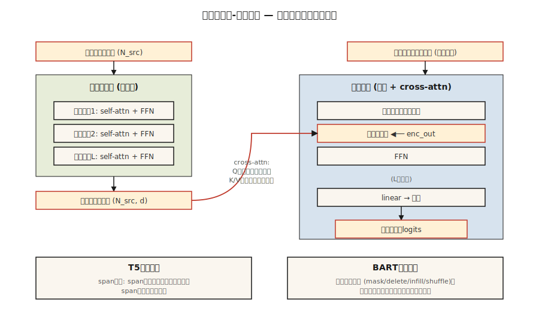

# T5, BART — 编码器-解码器（Encoder-Decoder）模型

> 编码器理解输入，解码器生成输出。将它们重新组合，你就得到了一个专为输入→输出任务设计的模型：翻译、摘要、改写、转录。

**类型：** 学习
**语言：** Python
**先修知识：** 阶段 7 · 05（完整 Transformer），阶段 7 · 06（BERT），阶段 7 · 07（GPT）
**时间：** ~45 分钟

## 问题

仅含解码器（Decoder-only）的 GPT 和仅含编码器（Encoder-only）的 BERT 各自为了不同的目标对 2017 年的原始架构进行了精简。但许多任务天然就是输入-输出的：

- 翻译：英语 → 法语。
- 摘要：5,000 token 的文章 → 200 token 的摘要。
- 语音识别：音频 token → 文本 token。
- 结构化提取：散文 → JSON。

对于这些任务，编码器-解码器（Encoder-Decoder）是最简洁的匹配方案。编码器生成输入的密集表示（dense representation），解码器生成输出，每一步都通过交叉注意力（Cross-Attention）与该表示交互。训练时在输出侧采用移位一位（shift-by-one）的策略。损失函数与 GPT 相同，只是额外以编码器输出为条件。

两篇论文奠定了现代实践手册：

1. **T5**（Raffel 等人, 2019）。"Text-to-Text Transfer Transformer"。将所有 NLP 任务重新定义为文本输入、文本输出。单一架构、单一词表、单一损失。基于掩码跨度预测（Masked Span Prediction）进行预训练（在输入中破坏跨度，在输出中解码它们）。
2. **BART**（Lewis 等人, 2019）。"Bidirectional and Auto-Regressive Transformer"。去噪自编码器（Denoising Autoencoder）：以多种方式破坏输入（打乱、掩码、删除、旋转），要求解码器重建原始文本。

到了 2026 年，编码器-解码器格式在输入结构重要的场景中仍然活跃：

- Whisper（语音 → 文本）。
- 谷歌的翻译栈。
- 一些具有明确上下文+编辑结构的代码补全/修复模型。
- Flan-T5 及其变体，用于结构化推理任务。

仅含解码器（Decoder-only）赢得了聚光灯，但编码器-解码器从未消失。

## 概念



### 前向循环

```
源 token ─▶ 编码器 ─▶ (N_src, d_model)  ──┐
                                           │
目标 token ─▶ 解码器块                   │
              ├─▶ 掩码自注意力            │
              ├─▶ 交叉注意力 ◀───────────┘
              └─▶ 前馈网络
             ↓
          下一个 token 的 logits
```

关键点：编码器对每个输入只运行一次。解码器自回归运行，但在每一步都交叉注意（cross-attend）到**相同的**编码器输出。缓存编码器输出对于长输入来说是一个免费的加速。

### T5 预训练——跨度破坏（Span Corruption）

在输入中随机选择一些跨度（平均长度 3 个 token，占总量的 15%）。每个跨度用一个唯一的哨兵 token（sentinel）替换：`<extra_id_0>`、`<extra_id_1>` 等。解码器仅输出被破坏的跨度及其哨兵前缀：

```
源: The quick <extra_id_0> fox jumps <extra_id_1> dog
目标: <extra_id_0> brown <extra_id_1> over the lazy
```

这比预测整个序列的信号成本更低。根据 T5 论文的消融实验，该方法与 MLM（BERT）和前缀语言模型（UniLM）具有竞争力。

### BART 预训练——多噪声去噪（Multi-Noise Denoising）

BART 尝试了五种噪声函数：

1. Token 掩码（Token Masking）。
2. Token 删除（Token Deletion）。
3. 文本填充（Text Infilling）（掩码一个跨度，解码器插入正确长度）。
4. 句子排列（Sentence Permutation）。
5. 文档旋转（Document Rotation）。

文本填充 + 句子排列的组合在下游指标上表现最佳。解码器总是重建原始序列。BART 的输出是整个序列，而不仅仅是破坏的跨度——因此预训练计算量比 T5 更大。

### 推理

与 GPT 相同的自回归生成方式。贪心搜索（Greedy）、束搜索（Beam Search）、top-p 采样均适用。束搜索（宽度 4–5）是翻译和摘要的标准策略，因为输出分布比对话更窄。

### 2026 年如何选择变体

| 任务 | 编码器-解码器？ | 原因 |
|------|------------------|------|
| 翻译 | 通常是的 | 清晰的源序列；固定的输出分布；束搜索有效 |
| 语音转文本 | 是的（Whisper） | 输入模态与输出不同；编码器塑造音频特征 |
| 对话/推理 | 不需要，仅解码器 | 没有持久的"输入"——对话就是序列本身 |
| 代码补全 | 通常不需要 | 带有长上下文的仅解码器模型胜出；例如 Qwen 2.5 Coder 是仅解码器 |
| 摘要 | 两者均可 | BART、PEGASUS 早期超过仅解码器基线；现代仅解码器大模型可与之匹敌 |
| 结构化提取 | 两者均可 | T5 很简洁，因为"文本→文本"可以吸收任何输出格式 |

自 ~2022 年以来的趋势：仅解码器接管了原本属于编码器-解码器的任务，因为：(a) 经过指令微调的仅解码器大语言模型可以通过提示（Prompting）泛化到任何任务，(b) 一种架构比两种更容易扩展，(c) RLHF 假设是解码器。编码器-解码器在输入模态不同（语音、图像）或束搜索质量重要时仍然存活。

## 构建它

参见 `code/main.py`。我们为一个玩具语料库实现 T5 风格的跨度破坏（Span Corruption）——这是本课中最有用的单个部分，因为自那以后它在每个编码器-解码器预训练方案中都会出现。

### 步骤 1：跨度破坏

```python
def corrupt_spans(tokens, mask_rate=0.15, mean_span=3.0, rng=None):
    """选取总长度约为 mask_rate * token 数的跨度。返回 (破坏后的输入, 目标)。"""
    n = len(tokens)
    n_mask = max(1, int(n * mask_rate))
    n_spans = max(1, int(round(n_mask / mean_span)))
    ...
```

目标格式是 T5 的约定：`<sent0> span0 <sent1> span1 ...`。破坏后的输入将未改变的 token 与跨度位置处的哨兵 token 交错排列。

### 步骤 2：验证往返（Round-Trip）

给定破坏后的输入和目标，重建原始句子。如果破坏是可逆的，则前向传播定义明确。这是一个理智检查——真实训练中不会这样做，但测试成本低廉，能捕获跨度记录中的差一错误（Off-by-One）。

### 步骤 3：BART 噪声化

五个函数：`token_mask`、`token_delete`、`text_infill`、`sentence_permute`、`document_rotate`。组合其中两个并展示结果。

## 使用它

HuggingFace 参考代码：

```python
from transformers import T5ForConditionalGeneration, T5Tokenizer
tok = T5Tokenizer.from_pretrained("google/flan-t5-base")
model = T5ForConditionalGeneration.from_pretrained("google/flan-t5-base")

inputs = tok("translate English to French: Attention is all you need.", return_tensors="pt")
out = model.generate(**inputs, max_new_tokens=32)
print(tok.decode(out[0], skip_special_tokens=True))
```

T5 的诀窍：任务名称直接放入输入文本中。同一个模型可以处理数十个任务，因为每个任务都是文本输入、文本输出。到了 2026 年，这一模式已被经过指令微调的仅解码器模型泛化，但 T5 首先将其规范化。

## 部署它

参见 `outputs/skill-seq2seq-picker.md`。该技能根据输入输出结构、延迟和质量目标，在新任务上在编码器-解码器和仅解码器之间进行选择。

## 练习

1. **简单。** 运行 `code/main.py`，对一个包含 30 个 token 的句子应用跨度破坏，验证将非哨兵源 token 与解码后的目标跨度拼接起来是否能还原原始句子。
2. **中等。** 实现 BART 的 `text_infill` 噪声：用单个 `<mask>` token 替换随机跨度，解码器必须推断出正确的跨度长度和内容。展示一个示例。
3. **困难。** 在一个小型英语→猪拉丁文（Pig Latin）语料库（200 对）上对 `flan-t5-small` 进行微调。在保留的 50 对测试集上测量 BLEU 值。与在相同数据上使用相同算力微调 `Llama-3.2-1B` 的结果进行比较。

## 关键术语

| 术语 | 人们怎么说 | 实际含义 |
|------|-----------------|-----------------------|
| 编码器-解码器 | "序列到序列 Transformer" | 两个栈：用于输入的双向编码器，用于输出的带有交叉注意力的因果解码器。 |
| 交叉注意力 | "源与目标对话的地方" | 解码器的 Q × 编码器的 K/V。编码器信息进入解码器的唯一位置。 |
| 跨度破坏 | "T5 的预训练技巧" | 用哨兵 token 替换随机跨度；解码器输出跨度内容。 |
| 去噪目标 | "BART 的游戏" | 对输入应用噪声函数，训练解码器重建干净序列。 |
| 哨兵 token | "`<extra_id_N>` 占位符" | 特殊 token，在源中标记被破坏的跨度，在目标中重新标记它们。 |
| Flan | "指令微调的 T5" | T5 在超过 1,800 个任务上进行微调；使编码器-解码器在指令遵循方面具有竞争力。 |
| 束搜索 | "解码策略" | 每一步保留 top-k 的局部序列；翻译/摘要的标准方法。 |
| 教师强制 | "训练时的输入" | 训练期间，向解码器输入真实的前一个输出 token，而非采样得到的 token。 |

## 进一步阅读

- [Raffel 等人 (2019). Exploring the Limits of Transfer Learning with a Unified Text-to-Text Transformer](https://arxiv.org/abs/1910.10683) — T5。
- [Lewis 等人 (2019). BART: Denoising Sequence-to-Sequence Pre-training for Natural Language Generation, Translation, and Comprehension](https://arxiv.org/abs/1910.13461) — BART。
- [Chung 等人 (2022). Scaling Instruction-Finetuned Language Models](https://arxiv.org/abs/2210.11416) — Flan-T5。
- [Radford 等人 (2022). Robust Speech Recognition via Large-Scale Weak Supervision](https://arxiv.org/abs/2212.04356) — Whisper，2026 年标准的编码器-解码器模型。
- [HuggingFace `modeling_t5.py`](https://github.com/huggingface/transformers/blob/main/src/transformers/models/t5/modeling_t5.py) — 参考实现。