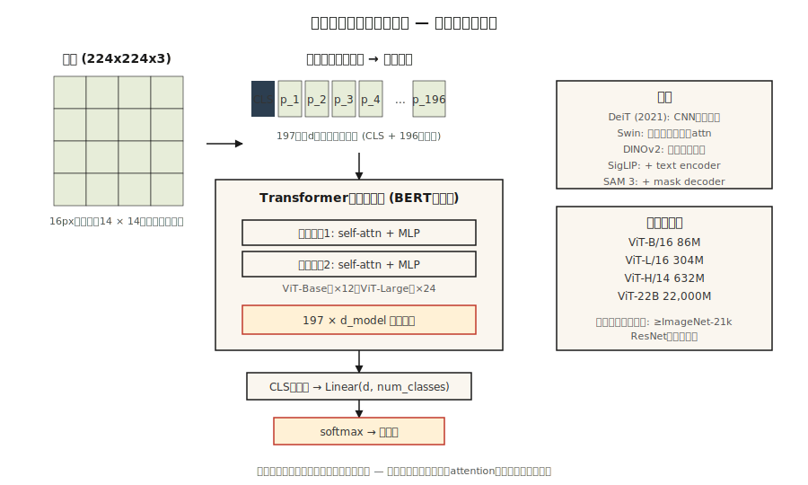

# Vision Transformers（ViT）

> 译注：本文译自同目录 [`en.md`](./en.md)。术语遵循仓根 [TRANSLATION_GUIDE.md](../../../../TRANSLATION_GUIDE.md)。

> 一张图像是一格格 patch（图块）的网格。一句话是一个个 token 的网格。同一个 transformer 都能吃。

**Type:** Build
**Languages:** Python
**Prerequisites:** Phase 7 · 05（Full Transformer）、Phase 4 · 03（CNNs）、Phase 4 · 14（Vision Transformers intro）
**Time:** ~45 minutes

## 问题（The Problem）

2020 年以前，计算机视觉就等同于卷积。ImageNet、COCO、检测各类基准上的 SOTA，全都用 CNN 作为骨干。transformer 是给语言用的。

Dosovitskiy 等人（2020）——《An Image is Worth 16x16 Words》——证明你可以彻底丢掉卷积。把图像切成固定大小的 patch，每个 patch 用一个线性投影映射成 embedding，再把这串序列喂给一个普普通通的 transformer encoder。在足够大的规模上（ImageNet-21k 预训练或更大），ViT 就能追平甚至超过基于 ResNet 的模型。

ViT 是 2026 年一个更宏大趋势的开端：一种架构，多种模态。Whisper 把音频 token 化。ViT 把图像 token 化。机器人有 action token。视频有 pixel token。transformer 不在乎——给它一个序列，它就能学。

到 2026 年，ViT 及其后代（DeiT、Swin、DINOv2、ViT-22B、SAM 3）已经占据视觉领域的大半江山。CNN 仍然在端侧设备和延迟敏感任务上更胜一筹。其他几乎所有地方，技术栈里某处都藏着一个 ViT。

## 概念（The Concept）



### 第 1 步——patchify（切块）

把一张 `H × W × C` 的图像切成 `N × (P·P·C)` 的扁平 patch 序列。典型配置：`224 × 224` 图像、`16 × 16` patch → 196 个 patch，每个 768 维。

```
image (224, 224, 3) → 14 × 14 grid of 16x16x3 patches → 196 vectors of length 768
```

patch 大小是关键调节杆。patch 越小 = token 越多、分辨率越高、attention 的二次方代价越大。patch 越大 = 越粗糙、越便宜。

### 第 2 步——线性 embedding

一个共享的可学习矩阵把每个扁平 patch 投影到 `d_model`。它等价于一个 kernel size 为 `P`、stride 为 `P` 的卷积。在 PyTorch 里就字面意义的一句 `nn.Conv2d(C, d_model, kernel_size=P, stride=P)`——两行代码搞定。

### 第 3 步——前置 `[CLS]` token，加位置 embedding

- 在序列最前面拼一个可学习的 `[CLS]` token。它最终的 hidden state 就是用于分类的图像表示。
- 加上可学习的位置 embedding（ViT 原版），或正弦 2D（后续变体）。
- 2024 年以后，RoPE 被扩展到 2D 用于位置编码，有时甚至不再用显式的位置 embedding。

### 第 4 步——标准 transformer encoder

堆叠 L 个 `LayerNorm → Self-Attention → + → LayerNorm → MLP → +` 块。和 BERT 一模一样。没有任何视觉专属层。这就是论文的教学核心点。

### 第 5 步——head（分类头）

分类任务：取 `[CLS]` 的 hidden state → 线性层 → softmax。DINOv2 或 SAM 则丢掉 `[CLS]`，直接用 patch embedding。

### 历史上重要的几个变体

| 模型 | 年份 | 改动 |
|-------|------|--------|
| ViT | 2020 | 原版。固定 patch 大小，全局 attention。 |
| DeiT | 2021 | 蒸馏（distillation）；只用 ImageNet-1k 就能训。 |
| Swin | 2021 | 层级化 + 移位窗口。把代价压到亚二次方。 |
| DINOv2 | 2023 | 自监督（无标签）。当下最好的通用视觉特征。 |
| ViT-22B | 2023 | 22B 参数量；scaling law 适用。 |
| SigLIP | 2023 | ViT + 语言成对训练，sigmoid 对比损失。 |
| SAM 3 | 2025 | Segment anything；ViT-Large + 可提示 mask decoder。 |

### 为什么这事拖了一段时间

ViT 需要*海量*数据才能追上 CNN，因为它没有 CNN 自带的归纳偏置（平移不变性、局部性）。在没有 >100M 标注图像或强自监督预训练的情况下，等算力比拼 CNN 仍然胜出。DeiT 在 2021 年用蒸馏技巧暂时解决了这个问题；DINOv2 在 2023 年用自监督彻底解决了它。

## 动手实现（Build It）

见 `code/main.py`。纯 stdlib 的 patchify + 线性 embedding + sanity check。不做训练——任何现实规模的 ViT 都需要 PyTorch 和数小时 GPU 时间。

### Step 1: 假图像

一张 24 × 24 的 RGB 图像，表示成由 `(R, G, B)` 元组行组成的列表。我们用 6×6 的 patch → 16 个 patch，每个 embedding 向量 108 维。

### Step 2: patchify

```python
def patchify(image, P):
    H = len(image)
    W = len(image[0])
    patches = []
    for i in range(0, H, P):
        for j in range(0, W, P):
            patch = []
            for di in range(P):
                for dj in range(P):
                    patch.extend(image[i + di][j + dj])
            patches.append(patch)
    return patches
```

光栅顺序：在网格上按行优先扫描。每个 ViT 都是这个顺序。

### Step 3: 线性 embed

把每个扁平 patch 乘上一个随机的 `(patch_flat_size, d_model)` 矩阵。在前置 `[CLS]` 之后，验证输出形状是 `(N_patches + 1, d_model)`。

### Step 4: 算一下现实 ViT 的参数量

打印 ViT-Base 的参数数：12 层、12 个 head、d=768、patch=16。和 ResNet-50（约 25M）比一比。ViT-Base 大约 86M。ViT-Large 约 307M。ViT-Huge 约 632M。

## 用起来（Use It）

```python
from transformers import ViTImageProcessor, ViTModel
import torch
from PIL import Image

processor = ViTImageProcessor.from_pretrained("google/vit-base-patch16-224-in21k")
model = ViTModel.from_pretrained("google/vit-base-patch16-224-in21k")

img = Image.open("cat.jpg")
inputs = processor(img, return_tensors="pt")
out = model(**inputs).last_hidden_state   # (1, 197, 768): [CLS] + 196 patches
cls_emb = out[:, 0]                       # image representation
```

**DINOv2 的 embedding 是 2026 年图像特征的默认选择。** 冻结骨干，训一个小小的 head。分类、检索、检测、captioning 都能用。Meta 的 DINOv2 checkpoint 在所有非文本视觉任务上都打过 CLIP。

**patch 大小怎么选。** 小模型用 16×16（ViT-B/16）。密集预测（分割）用 8×8 或 14×14（SAM、DINOv2）。超大模型用 14×14。

## 上线部署（Ship It）

见 `outputs/skill-vit-configurator.md`。这个 skill 会根据数据集大小、分辨率和算力预算，为新的视觉任务挑选 ViT 变体和 patch 大小。

## 练习（Exercises）

1. **简单。** 跑一遍 `code/main.py`。验证 patch 数等于 `(H/P) * (W/P)`，并且扁平 patch 维度等于 `P*P*C`。
2. **中等。** 实现 2D 正弦位置 embedding——为每个 patch 的 `row` 和 `col` 各算一个独立的正弦码再拼接。把它喂进一个迷你版的 PyTorch ViT，在 CIFAR-10 上和可学习位置 embedding 比一比准确率。
3. **困难。** 用 PyTorch 搭一个 3 层 ViT，在 1,000 张 MNIST 图像上、用 4×4 的 patch 训练。测一下测试准确率。然后在同样这 1,000 张图上加上 DINOv2 风格的预训练（简化版：让 encoder 从被遮挡的 patch 预测 patch embedding）。准确率有提升吗？

## 关键术语（Key Terms）

| 术语 | 大家嘴上说的 | 实际含义 |
|------|-----------------|-----------------------|
| Patch | 「vision transformer 的 token」 | 图像中一个 `P × P × C` 区域的像素值，扁平化后的向量。 |
| Patchify | 「切 + 拍扁」 | 把图像切成不重叠的 patch，每个 patch 拍扁成一个向量。 |
| `[CLS]` token | 「图像的总结」 | 前置的可学习 token；其最终 embedding 即图像表示。 |
| Inductive bias（归纳偏置） | 「模型自带的假设」 | ViT 比 CNN 先验更少；要更多数据才能弥补差距。 |
| DINOv2 | 「自监督 ViT」 | 用图像增强 + 动量教师（momentum teacher）无标签训练。2026 年最好的通用图像特征。 |
| SigLIP | 「CLIP 的接班人」 | ViT + 文本 encoder，用 sigmoid 对比损失训练；等算力下优于 CLIP。 |
| Swin | 「窗口化 ViT」 | 层级化 ViT，使用局部 attention + 移位窗口；亚二次方代价。 |
| Register tokens | 「2023 年的小技巧」 | 几个额外的可学习 token，用来吸收 attention 汇点；提升 DINOv2 特征质量。 |

## 延伸阅读（Further Reading）

- [Dosovitskiy et al. (2020). An Image is Worth 16x16 Words: Transformers for Image Recognition at Scale](https://arxiv.org/abs/2010.11929) — ViT 论文。
- [Touvron et al. (2021). Training data-efficient image transformers & distillation through attention](https://arxiv.org/abs/2012.12877) — DeiT。
- [Liu et al. (2021). Swin Transformer: Hierarchical Vision Transformer using Shifted Windows](https://arxiv.org/abs/2103.14030) — Swin。
- [Oquab et al. (2023). DINOv2: Learning Robust Visual Features without Supervision](https://arxiv.org/abs/2304.07193) — DINOv2。
- [Darcet et al. (2023). Vision Transformers Need Registers](https://arxiv.org/abs/2309.16588) — DINOv2 的 register token 修复方案。
