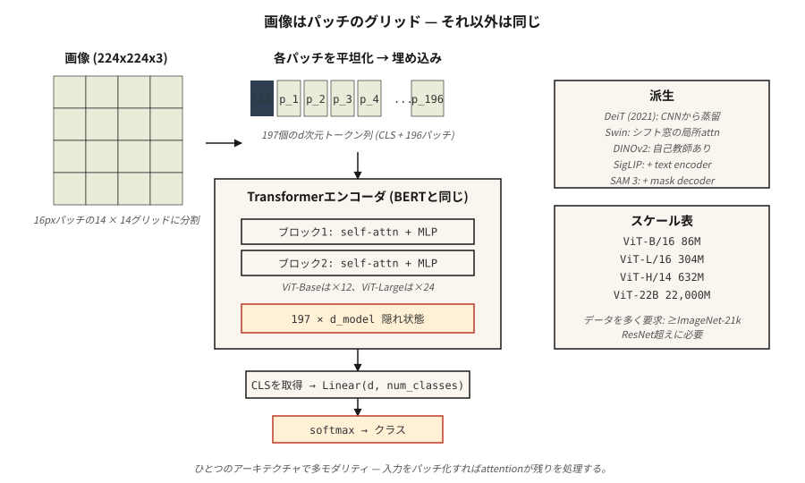

# Vision Transformers (ViT)

> 图像是补丁的网格。句子是 token 的网格。同一个 transformer 处理两者。

**Type:** Build
**Languages:** Python
**Prerequisites:** Phase 7 · 05 (Full Transformer), Phase 4 · 03 (CNNs), Phase 4 · 14 (Vision Transformers intro)
**Time:** ~45 分钟

## 问题

2020 年之前，计算机视觉意味着卷积。ImageNet、COCO 和检测基准上的每个 SOTA 都使用 CNN 主干。Transfomer 是为语言准备的。

Dosovitskiy 等人（2020）——"An Image is Worth 16x16 Words"——展示了你完全可以抛弃卷积。将图像切成固定大小的补丁，将每个补丁线性投影到嵌入中，将序列输入到普通的 transformer 编码器。在足够的规模下（ImageNet-21k 预训练或更大），ViT 匹配或超越基于 ResNet 的模型。

ViT 是 2026 年更广泛模式的开始：一种架构，多种模态。Whisper 将音频 token 化。ViT 将图像 token 化。机器人技术的行动 token。视频的像素 token。Transformer 不在乎——给它一个序列，它就能学习。

到 2026 年，ViT 及其后代（DeiT、Swin、DINOv2、ViT-22B、SAM 3）拥有大多数视觉领域。CNN 在边缘设备和延迟敏感任务上仍然胜出。其他一切都在堆栈中的某处有 ViT。

## 概念



### 步骤 1 — 补丁化

将 `H × W × C` 的图像拆分为 `N × (P·P·C)` 的扁平补丁序列。典型设置：`224 × 224` 图像，`16 × 16` 补丁 → 196 个补丁，每个 768 个值。

```
image (224, 224, 3) → 14 × 14 grid of 16x16x3 patches → 196 vectors of length 768
```

补丁大小是杠杆。更小的补丁 = 更多 token，更好的分辨率，二次注意力成本。更大的补丁 = 更粗糙，更便宜。

### 步骤 2 — 线性嵌入

单个学习矩阵将每个扁平补丁投影到 `d_model`。等价于核大小 `P` 和步长 `P` 的卷积。在 PyTorch 中这就是 `nn.Conv2d(C, d_model, kernel_size=P, stride=P)`——一个 2 行实现。

### 步骤 3 — 预置 `[CLS]` token，添加位置嵌入

- 预置一个可学习的 `[CLS]` token。其最终隐藏状态是用于分类的图像表示。
- 添加可学习的位置嵌入（ViT 原始）或正弦 2D（后来的变体）。
- 在 2024+，RoPE 扩展到 2D 用于位置，有时无需显式嵌入。

### 步骤 4 — 标准 transformer 编码器

堆叠 L 个 `LayerNorm → Self-Attention → + → LayerNorm → MLP → +` 模块。与 BERT 相同。没有视觉专用层。这是论文的教学核心。

### 步骤 5 — head

对于分类：取 `[CLS]` 隐藏状态 → 线性 → softmax。对于 DINOv2 或 SAM，丢弃 `[CLS]`，直接使用补丁嵌入。

### 重要的变体

| 模型 | 年份 | 变化 |
|-------|------|--------|
| ViT | 2020 | 原始版本。固定补丁大小，全全局注意力。 |
| DeiT | 2021 | 蒸馏；仅在 ImageNet-1k 上可训练。 |
| Swin | 2021 | 层次化带移位窗口。固定的次二次成本。 |
| DINOv2 | 2023 | 自监督（无标签）。最佳通用视觉特征。 |
| ViT-22B | 2023 | 22B 参数；扩展定律适用。 |
| SigLIP | 2023 | ViT + 语言对，sigmoid 对比损失。 |
| SAM 3 | 2025 | Segment anything；ViT-Large + 可提示掩码解码器。 |

### 为什么花了些时间

ViT 需要*大量*数据才能匹配 CNN，因为它没有 CNN 的归纳偏置（平移不变性、局部性）。没有 >1 亿标记图像或强大的自监督预训练，CNN 在匹配计算下仍然胜出。DeiT 在 2021 年通过蒸馏技巧修复了这一点；DINOv2 在 2023 年通过自监督永久修复了它。

## 动手构建

参见 `code/main.py`。纯标准库的补丁化 + 线性嵌入 + 合理性检查。无训练——任何现实规模的 ViT 都需要 PyTorch 和数小时的 GPU 时间。

### 步骤 1：假图像

一个 24 × 24 的 RGB 图像，表示为 `(R, G, B)` 元组的行列表。我们使用 6×6 补丁 → 16 个补丁，每个 108 维嵌入向量。

### 步骤 2：补丁化

```python
def patchify(image, P):
    H = len(image)
    W = len(image[0])
    patches = []
    for i in range(0, H, P):
        for j in range(0, W, P):
            patch = []
            for di in range(P):
                for dj in range(P):
                    patch.extend(image[i + di][j + dj])
            patches.append(patch)
    return patches
```

光栅顺序：行主序过网格。每个 ViT 都使用这种顺序。

### 步骤 3：线性嵌入

将每个扁平补丁乘以一个随机的 `(patch_flat_size, d_model)` 矩阵。验证在预置 `[CLS]` 后输出形状为 `(N_patches + 1, d_model)`。

### 步骤 4：计算真实 ViT 的参数

打印 ViT-Base 的参数计数：12 层、12 heads、d=768、patch=16。与 ResNet-50（~25M）比较。ViT-Base 约为 ~86M。ViT-Large ~307M。ViT-Huge ~632M。

## 实际应用

```python
from transformers import ViTImageProcessor, ViTModel
import torch
from PIL import Image

processor = ViTImageProcessor.from_pretrained("google/vit-base-patch16-224-in21k")
model = ViTModel.from_pretrained("google/vit-base-patch16-224-in21k")

img = Image.open("cat.jpg")
inputs = processor(img, return_tensors="pt")
out = model(**inputs).last_hidden_state   # (1, 197, 768): [CLS] + 196 patches
cls_emb = out[:, 0]                       # image representation
```

**DINOv2 嵌入是 2026 年图像特征的默认选择。** 冻结主干，训练一个微小的 head。适用于分类、检索、检测、描述。Meta 的 DINOv2 检查点在所有非文本视觉任务上优于 CLIP。

**补丁大小选择。** 小模型使用 16×16（ViT-B/16）。稠密预测（分割）使用 8×8 或 14×14（SAM、DINOv2）。非常大的模型使用 14×14。

## 交付

参见 `outputs/skill-vit-configurator.md`。该 skill 根据数据集大小、分辨率和计算预算，为新视觉任务选择 ViT 变体和补丁大小。

## 练习

1. **简单。** 运行 `code/main.py`。验证补丁数量等于 `(H/P) * (W/P)`，且扁平补丁维度等于 `P*P*C`。
2. **中等。** 实现 2D 正弦位置嵌入——每个补丁的 `row` 和 `col` 的两个独立正弦编码，拼接起来。将其输入到微型 PyTorch ViT 中，并在 CIFAR-10 上与可学习的位置嵌入比较准确率。
3. **困难。** 构建一个 3 层 ViT（PyTorch），在 1,000 张 MNIST 图像上使用 4×4 补丁进行训练。测量测试准确率。现在在相同的 1,000 张图像上添加 DINOv2 预训练（简化版：仅训练编码器从掩码补丁预测补丁嵌入）。准确率会提高吗？

## 关键术语

| 术语 | 人们说的 | 实际含义 |
|------|-----------------|-----------------------|
| Patch | "视觉 transformer 的 token" | 图像中 `P × P × C` 区域的像素值扁平向量。 |
| Patchify | "切碎 + 展平" | 将图像切成不重叠的补丁，每个展平为向量。 |
| `[CLS]` token | "图像摘要" | 预置的可学习 token；其最终嵌入是图像表示。 |
| Inductive bias | "模型假设的东西" | ViT 的先验比 CNN 少；需要更多数据来弥补差距。 |
| DINOv2 | "自监督 ViT" | 使用图像增强 + 动量教师在无标签下训练。2026 年最佳通用图像特征。 |
| SigLIP | "CLIP 的继任者" | 使用 sigmoid 对比损失训练的 ViT + 文本编码器；在匹配计算下优于 CLIP。 |
| Swin | "窗口化 ViT" | 具有局部注意力和移位窗口的层次化 ViT；次二次复杂度。 |
| Register tokens | "2023 年的技巧" | 一些额外的可学习 token，吸收注意力汇；改善 DINOv2 特征。 |

## 延伸阅读

- [Dosovitskiy et al. (2020). An Image is Worth 16x16 Words: Transformers for Image Recognition at Scale](https://arxiv.org/abs/2010.11929) — ViT 论文。
- [Touvron et al. (2021). Training data-efficient image transformers & distillation through attention](https://arxiv.org/abs/2012.12877) — DeiT。
- [Liu et al. (2021). Swin Transformer: Hierarchical Vision Transformer using Shifted Windows](https://arxiv.org/abs/2103.14030) — Swin。
- [Oquab et al. (2023). DINOv2: Learning Robust Visual Features without Supervision](https://arxiv.org/abs/2304.07193) — DINOv2。
- [Darcet et al. (2023). Vision Transformers Need Registers](https://arxiv.org/abs/2309.16588) — 为 DINOv2 添加 register token 的修复方案。
