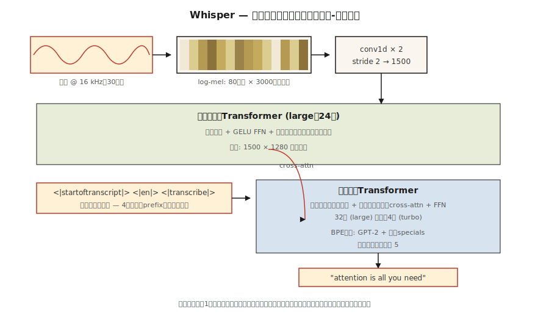

# Audio Transformers — Whisper Architecture

> 音声は、時間に沿った周波数の画像です。Whisper は mel spectrogram を食べて言葉を返す ViT です。

**種別:** 学習
**言語:** Python
**前提条件:** Phase 7 · 05 (Full Transformer), Phase 7 · 08 (Encoder-Decoder), Phase 7 · 09 (ViT)
**所要時間:** 約45分

## 課題

Whisper (OpenAI, Radford et al. 2022) 以前、最先端の automatic speech recognition (ASR) は wav2vec 2.0 や HuBERT でした。self-supervised feature extractors に fine-tuned head を足す方式です。品質は高いものの、data pipelines は高価で、domain-brittle でした。多言語音声認識では、言語ファミリーごとに別モデルが必要でした。

Whisper は 3 つに賭けました。

1. **あらゆる音声で学習する。** 97 言語にまたがり、インターネットから集めた weakly-labeled audio 680,000 時間。きれいな academic corpus なし。phoneme labels なし。
2. **Multi-task single model。** 1 つの decoder を、transcription、translation、voice activity detection、language ID、timestamping に task tokens 経由で共同学習する。
3. **標準 encoder-decoder transformer。** Encoder は log-mel spectrograms を消費する。Decoder は text tokens を autoregressively に生成する。vocoder なし、CTC なし、HMM なし。

結果として、Whisper large-v3 は accents、noise、クリーンなラベル付きデータがゼロの言語にも頑健です。2026 年には、あらゆる open-source voice assistant と多くの商用 voice assistant のデフォルト speech front-end になっています。

## コンセプト



### Step 1 — resample + window

音声は 16 kHz。30 秒に clip/pad します。log-mel spectrogram を計算します。80 mel bins、10 ms stride なので、約 3,000 frames × 80 features になります。これが Whisper から見える「input image」です。

### Step 2 — convolutional stem

kernel 3、stride 2 の Conv1D layers 2 つで、3,000 frames を 1,500 に減らします。多くの parameters を増やさずに sequence length を半分にします。

### Step 3 — encoder

1,500 timesteps に対する 24-layer (large の場合) transformer encoder です。Sinusoidal positional encoding、self-attention、GELU FFN を使います。1,500 × 1,280 hidden states を生成します。

### Step 4 — decoder

24-layer transformer decoder です。GPT-2 の語彙を上位集合にし、少数の audio-specific special tokens を加えた BPE vocabulary から tokens を autoregressively に生成します。

### Step 5 — task tokens

Decoder prompt は、モデルに何をすべきかを伝える control tokens から始まります。

```
<|startoftranscript|>  <|en|>  <|transcribe|>  <|0.00|>
```

または

```
<|startoftranscript|>  <|fr|>  <|translate|>   <|0.00|>
```

モデルはこの慣習で学習されています。task は prefix で制御します。2026 年版の instruction-tuning に相当しますが、音声に適用されています。

### Step 6 — output

log-prob threshold 付きの beam search (width 5) を使います。`<|notimestamps|>` token がない場合、timestamps は音声 0.02 秒ごとに予測されます。

### Whisper sizes

| Model | Params | Layers | d_model | Heads | VRAM (fp16) |
|-------|--------|--------|---------|-------|-------------|
| Tiny | 39M | 4 | 384 | 6 | ~1 GB |
| Base | 74M | 6 | 512 | 8 | ~1 GB |
| Small | 244M | 12 | 768 | 12 | ~2 GB |
| Medium | 769M | 24 | 1024 | 16 | ~5 GB |
| Large | 1550M | 32 | 1280 | 20 | ~10 GB |
| Large-v3 | 1550M | 32 | 1280 | 20 | ~10 GB |
| Large-v3-turbo | 809M | 32 | 1280 | 20 | ~6 GB (4-layer decoder) |

Large-v3-turbo (2024) は decoder を 32 layers から 4 layers に削りました。decoding は 8× 高速になり、WER の悪化は 1 point 未満です。この decode speed の解放が、2026 年に Whisper-turbo を real-time voice agents のデフォルトにしています。

### Whisper がしないこと

- Diarization、つまり誰が話しているかの判定はしません。必要なら pyannote と組み合わせます。
- Native な real-time streaming はありません。30 秒 window が固定です。現代的な wrappers (`faster-whisper`, `WhisperX`) は VAD + overlap で streaming を後付けします。
- 外部 chunking なしでは 30 秒を超える long-form context は扱えません。実務では、人間の発話は文字起こしに長距離文脈をほとんど必要としないため、十分うまく動きます。

### 2026 landscape

| Task | Model | Notes |
|------|-------|-------|
| English ASR | Whisper-turbo, Moonshine | Moonshine は edge で 4× 高速 |
| Multilingual ASR | Whisper-large-v3 | 97 言語 |
| Streaming ASR | faster-whisper + VAD | 150 ms latency targets が達成可能 |
| TTS | Piper, XTTS-v2, Kokoro | Encoder-decoder pattern だが Whisper-shaped |
| Audio + language | AudioLM, SeamlessM4T | 1 つの transformer 内に text tokens + audio tokens |

## 作ってみる

`code/main.py` を見てください。Whisper の学習はしません。log-mel spectrogram pipeline と task-token prompt formatter を作ります。production で実際に触るのはこの部分です。

### Step 1: synthesize audio

16 kHz でサンプリングされた 440 Hz の 1 秒 sine wave を生成します。16,000 samples です。

### Step 2: log-mel spectrogram (simplified)

完全な mel spectrogram には FFT が必要です。ここでは `librosa` を要求せずに pipeline を示すため、simplified framing + per-frame energy 版を使います。

```python
def frame_signal(x, frame_size=400, hop=160):
    frames = []
    for start in range(0, len(x) - frame_size + 1, hop):
        frames.append(x[start:start + frame_size])
    return frames
```

Frame = 25 ms、hop = 10 ms です。Whisper の windowing と一致します。教育用に、per-frame energy が mel bins の代わりになります。

### Step 3: pad to 30 s

Whisper は常に 30 秒 chunks を処理します。spectrogram を 3,000 frames に pad または clip します。

### Step 4: build the prompt tokens

```python
def whisper_prompt(lang="en", task="transcribe", timestamps=True):
    tokens = ["<|startoftranscript|>", f"<|{lang}|>", f"<|{task}|>"]
    if not timestamps:
        tokens.append("<|notimestamps|>")
    return tokens
```

これが task-control surface 全体です。4-token prefix だけです。

## 使ってみる

```python
import whisper
model = whisper.load_model("large-v3-turbo")
result = model.transcribe("meeting.wav", language="en", task="transcribe")
print(result["text"])
print(result["segments"][0]["start"], result["segments"][0]["end"])
```

より高速で OpenAI-compatible な例です。

```python
from faster_whisper import WhisperModel
model = WhisperModel("large-v3-turbo", compute_type="int8_float16")
segments, info = model.transcribe("meeting.wav", vad_filter=True)
for s in segments:
    print(f"{s.start:.2f} - {s.end:.2f}: {s.text}")
```

**2026 年に Whisper を選ぶ場面:**

- 1 つのモデルで multilingual ASR をしたい。
- noisy で多様な音声を頑健に transcription したい。
- Research / prototype ASR の最速の出発点がほしい。

**別のものを選ぶ場面:**

- edge で ultra-low latency streaming が必要な場合。Moonshine は同等品質で Whisper に勝ちます。
- <200 ms が必要な real-time conversational AI。dedicated streaming ASR を使います。
- Speaker diarization。Whisper はこれをしないため、pyannote を後付けします。

## Ship It

`outputs/skill-asr-configurator.md` を見てください。この skill は、新しい speech application 向けに ASR model、decoding parameters、preprocessing pipeline を選びます。

## 演習

1. **Easy.** `code/main.py` を実行してください。16 kHz、10 ms hop の 1 秒 signal の frame count が約 100 frames であることを確認します。30 秒では約 3,000 frames です。
2. **Medium.** `numpy.fft` を使って完全な log-mel spectrogram を作ってください。80 mel bins が `librosa.feature.melspectrogram(n_mels=80)` と numerical error の範囲で一致することを確認します。
3. **Hard.** Streaming inference を実装してください。音声を 2 s overlap 付きの 10 s windows に分け、各 chunk で Whisper を実行し、transcripts を merge します。5 分の podcast sample で single-pass に対する word-error rate を測ります。

## 重要語句

| Term | What people say | What it actually means |
|------|-----------------|-----------------------|
| Mel spectrogram | 「Audio image」 | 2D representation。一方の軸に frequency bins、もう一方の軸に time frames を置き、各 cell に log-scaled energy を持つ。 |
| Log-mel | 「What Whisper sees」 | Mel spectrogram に log を通したもの。人間の loudness perception に近い。 |
| Frame | 「One time slice」 | samples の 25 ms window。10 ms stride で重なり合う。 |
| Task token | 「Prompt prefix for speech」 | decoder prompt 内の `<\|transcribe\|>` / `<\|translate\|>` のような special tokens。 |
| Voice activity detection (VAD) | 「Find the speech」 | ASR 前に silence を除去する gate。cost を大幅に下げる。 |
| CTC | 「Connectionist Temporal Classification」 | alignment-free training 用の古典的 ASR loss。Whisper は使わない。 |
| Whisper-turbo | 「Small decoder, full encoder」 | large-v3 encoder + 4-layer decoder。decoding が 8× 高速。 |
| Faster-whisper | 「The production wrapper」 | CTranslate2 reimplementation。int8 quantization。OpenAI reference より 4× 高速。 |

## 参考資料

- [Radford et al. (2022). Robust Speech Recognition via Large-Scale Weak Supervision](https://arxiv.org/abs/2212.04356) — Whisper 論文。
- [OpenAI Whisper repo](https://github.com/openai/whisper) — reference code + model weights。`whisper/model.py` を読むと、Conv1D stem + encoder + decoder が約 400 行で上から下まで見られます。
- [OpenAI Whisper — `whisper/decoding.py`](https://github.com/openai/whisper/blob/main/whisper/decoding.py) — Steps 5–6 で説明した beam-search + task-token logic はここにあります。500 行で読みやすいです。
- [Baevski et al. (2020). wav2vec 2.0: A Framework for Self-Supervised Learning of Speech Representations](https://arxiv.org/abs/2006.11477) — 前身。いくつかの設定では今でも SOTA features です。
- [SYSTRAN/faster-whisper](https://github.com/SYSTRAN/faster-whisper) — production wrapper。reference より 4× 高速です。
- [Jia et al. (2024). Moonshine: Speech Recognition for Live Transcription and Voice Commands](https://arxiv.org/abs/2410.15608) — 2024 年の edge-friendly ASR。Whisper-shaped ですが小型です。
- [HuggingFace blog — "Fine-Tune Whisper For Multilingual ASR with 🤗 Transformers"](https://huggingface.co/blog/fine-tune-whisper) — mel spectrogram preprocessor と token-timestamp handling を含む標準的な fine-tuning recipe。
- [HuggingFace `modeling_whisper.py`](https://github.com/huggingface/transformers/blob/main/src/transformers/models/whisper/modeling_whisper.py) — lesson の architecture diagram を反映した完全実装 (encoder, decoder, cross-attention, generation)。
