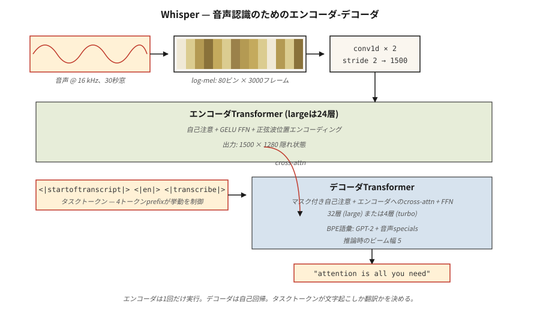

# Audio Transformers — Whisper 架构

> 音频是频率随时间变化的图像。Whisper 是一个吃 mel 频谱图并能说话回应的 ViT。

**Type:** Learn
**Languages:** Python
**Prerequisites:** Phase 7 · 05 (Full Transformer), Phase 7 · 08 (Encoder-Decoder), Phase 7 · 09 (ViT)
**Time:** ~45 分钟

## 问题

在 Whisper（OpenAI, Radford et al. 2022）之前，最先进的自动语音识别（ASR）意味着 wav2vec 2.0 和 HuBERT——自监督特征提取器加上微调的 head。高质量，昂贵的数据流水线，领域脆弱。多语言语音识别需要每个语言族使用单独的模型。

Whisper 做出了三个赌注：

1. **在所有数据上训练。** 从互联网上收集的 680,000 小时跨 97 种语言的弱标注音频。没有干净的学术语料库。没有音素标签。
2. **多任务单一模型。** 一个解码器，通过任务 token 联合训练转录、翻译、语音活动检测、语言识别和时间戳。
3. **标准编码器-解码器 transformer。** 编码器处理 log-mel 频谱图。解码器自回归生成文本 token。没有声码器、CTC 或 HMM。

结果：Whisper large-v3 在口音、噪声和零干净标注数据的语言上都很鲁棒。它是 2026 年每个开源语音助手和大多数商业语音助手的默认语音前端。

## 概念



### 步骤 1 — 重采样 + 加窗

16 kHz 的音频。截断/填充到 30 秒。计算 log-mel 频谱图：80 个 mel 条带，10 ms 步长 → 约 3,000 帧 × 80 个特征。这是 Whisper 看到的"输入图像"。

### 步骤 2 — 卷积 stem

两个 Conv1D 层，核大小为 3，步长为 2，将 3,000 帧减少到 1,500。在不增加大量参数的情况下将序列长度减半。

### 步骤 3 — 编码器

一个 24 层（large 版本）transformer 编码器，处理 1,500 个时间步。正弦位置编码、self-attention、GELU FFN。产生 1,500 × 1,280 隐藏状态。

### 步骤 4 — 解码器

一个 24 层 transformer 解码器。它自回归地从 BPE 词汇表生成 token，该词汇表是 GPT-2 的超集，带有一些音频专用的特殊 token。

### 步骤 5 — 任务 token

解码器 prompt 以控制 token 开始，告诉模型要做什么：

```
<|startoftranscript|>  <|en|>  <|transcribe|>  <|0.00|>
```

或

```
<|startoftranscript|>  <|fr|>  <|translate|>   <|0.00|>
```

模型是在这种约定上训练的。通过前缀控制任务。这是 2026 年指令微调在语音领域的等价物。

### 步骤 6 — 输出

Beam search（宽度 5）加上对数概率阈值。当 `<|notimestamps|>` token 不存在时，每 0.02 秒预测一次时间戳。

### Whisper 各型号

| 模型 | 参数量 | 层数 | d_model | Heads | VRAM (fp16) |
|-------|--------|--------|---------|-------|-------------|
| Tiny | 39M | 4 | 384 | 6 | ~1 GB |
| Base | 74M | 6 | 512 | 8 | ~1 GB |
| Small | 244M | 12 | 768 | 12 | ~2 GB |
| Medium | 769M | 24 | 1024 | 16 | ~5 GB |
| Large | 1550M | 32 | 1280 | 20 | ~10 GB |
| Large-v3 | 1550M | 32 | 1280 | 20 | ~10 GB |
| Large-v3-turbo | 809M | 32 | 1280 | 20 | ~6 GB（4 层解码器） |

Large-v3-turbo（2024）将解码器从 32 层减少到 4 层。解码速度快 8 倍，WER 退化小于 1 个百分点。这种解码速度的解锁是为什么 Whisper-turbo 是 2026 年实时语音代理的默认选择。

### Whisper 不做的事

- 无说话人分离（谁在说话）。将其与 pyannote 配对使用。
- 非原生实时流式——30 秒窗口是固定的。现代封装（`faster-whisper`、`WhisperX`）通过 VAD + 重叠实现流式。
- 超过 30 秒的长形式上下文需要外部分块。在实践中效果良好，因为人类语音很少需要长距离上下文进行转录。

### 2026 年的格局

| 任务 | 模型 | 备注 |
|------|-------|-------|
| 英语 ASR | Whisper-turbo, Moonshine | Moonshine 在边缘设备上快 4 倍 |
| 多语言 ASR | Whisper-large-v3 | 97 种语言 |
| 流式 ASR | faster-whisper + VAD | 可实现 150 ms 延迟目标 |
| TTS | Piper, XTTS-v2, Kokoro | Encoder-decoder 模式，但 Whisper 形状 |
| 音频 + 语言 | AudioLM, SeamlessM4T | 同一 transformer 中的文本 token + 音频 token |

## 动手构建

参见 `code/main.py`。我们不训练 Whisper——我们构建 log-mel 频谱图流水线 + 任务 token prompt 格式化器。这些是你实际在生产中要接触的部分。

### 步骤 1：合成音频

生成一个 1 秒的 440 Hz 正弦波，采样率为 16 kHz。16,000 个采样点。

### 步骤 2：Log-mel 频谱图（简化版）

完整的 mel 频谱图需要 FFT。我们做一个简化的帧化 + 每帧能量版本，展示流水线而不需要 `librosa`：

```python
def frame_signal(x, frame_size=400, hop=160):
    frames = []
    for start in range(0, len(x) - frame_size + 1, hop):
        frames.append(x[start:start + frame_size])
    return frames
```

帧 = 25 ms，跳跃 = 10 ms。与 Whisper 的加窗匹配。为教学目的，每帧能量代替 mel 条带。

### 步骤 3：填充到 30 秒

Whisper 总是处理 30 秒的块。将频谱图填充（或截断）到 3,000 帧。

### 步骤 4：构建 prompt token

```python
def whisper_prompt(lang="en", task="transcribe", timestamps=True):
    tokens = ["<|startoftranscript|>", f"<|{lang}|>", f"<|{task}|>"]
    if not timestamps:
        tokens.append("<|notimestamps|>")
    return tokens
```

这就是整个任务控制界面。一个 4 token 的前缀。

## 实际应用

```python
import whisper
model = whisper.load_model("large-v3-turbo")
result = model.transcribe("meeting.wav", language="en", task="transcribe")
print(result["text"])
print(result["segments"][0]["start"], result["segments"][0]["end"])
```

更快、兼容 OpenAI 的方式：

```python
from faster_whisper import WhisperModel
model = WhisperModel("large-v3-turbo", compute_type="int8_float16")
segments, info = model.transcribe("meeting.wav", vad_filter=True)
for s in segments:
    print(f"{s.start:.2f} - {s.end:.2f}: {s.text}")
```

**2026 年何时选择 Whisper：**

- 用一个模型处理多语言 ASR。
- 嘈杂、多样化音频的鲁棒转录。
- 研究 / 原型 ASR——最快的起点。

**何时选择其他：**

- 边缘设备上的超低延迟流式——Moonshine 在匹配质量下优于 Whisper。
- 需要 <200 ms 的实时对话 AI——专用流式 ASR。
- 说话人分离——Whisper 不做这个；搭配 pyannote 使用。

## 交付

参见 `outputs/skill-asr-configurator.md`。该 skill 为新的语音应用选择 ASR 模型、解码参数和预处理流水线。

## 练习

1. **简单。** 运行 `code/main.py`。确认 16 kHz、10 ms 跳跃下 1 秒信号的帧数约为 100 帧。30 秒：约 3,000 帧。
2. **中等。** 使用 `numpy.fft` 构建完整的 log-mel 频谱图。验证 80 个 mel 条带与 `librosa.feature.melspectrogram(n_mels=80)` 在数值误差内匹配。
3. **困难。** 实现流式推理：将音频分成 10 秒窗口，重叠 2 秒，在每个窗口上运行 Whisper，合并转录。在一个 5 分钟播客样本上测量单词错误率与单次传递的比较。

## 关键术语

| 术语 | 人们说的 | 实际含义 |
|------|-----------------|-----------------------|
| Mel spectrogram | "音频图像" | 2D 表示：一个轴上的频率条带，另一个轴上的时间帧；每格的对数缩放能量。 |
| Log-mel | "Whisper 看到的东西" | 经过对数的 Mel 频谱图；近似人类对响度的感知。 |
| Frame | "一个时间片" | 25 ms 的采样窗口；以 10 ms 步长重叠。 |
| Task token | "语音的 prompt 前缀" | 解码器 prompt 中的特殊 token，如 `<\|transcribe\|>` / `<\|translate\|>`。 |
| Voice activity detection (VAD) | "找到语音" | 在 ASR 前去除静音的网关；大幅降低成本。 |
| CTC | "Connectionist Temporal Classification" | 经典的无对齐训练 ASR 损失；Whisper 不使用它。 |
| Whisper-turbo | "小解码器，全编码器" | large-v3 编码器 + 4 层解码器；解码速度快 8 倍。 |
| Faster-whisper | "生产封装" | CTranslate2 重实现；int8 量化；比 OpenAI 参考快 4 倍。 |

## 延伸阅读

- [Radford et al. (2022). Robust Speech Recognition via Large-Scale Weak Supervision](https://arxiv.org/abs/2212.04356) — Whisper 论文。
- [OpenAI Whisper repo](https://github.com/openai/whisper) — 参考代码 + 模型权重。阅读 `whisper/model.py` 查看约 400 行从 Conv1D stem 到编码器到解码器的完整结构。
- [OpenAI Whisper — `whisper/decoding.py`](https://github.com/openai/whisper/blob/main/whisper/decoding.py) — 步骤 5–6 中描述的 beam-search + 任务 token 逻辑在此；500 行，完全可读。
- [Baevski et al. (2020). wav2vec 2.0: A Framework for Self-Supervised Learning of Speech Representations](https://arxiv.org/abs/2006.11477) — 前身；在某些设置中仍是最先进的特征。
- [SYSTRAN/faster-whisper](https://github.com/SYSTRAN/faster-whisper) — 生产封装，比参考快 4 倍。
- [Jia et al. (2024). Moonshine: Speech Recognition for Live Transcription and Voice Commands](https://arxiv.org/abs/2410.15608) — 2024 年边缘友好型 ASR，Whisper 形状但更小。
- [HuggingFace blog — "Fine-Tune Whisper For Multilingual ASR with 🤗 Transformers"](https://huggingface.co/blog/fine-tune-whisper) — 典范的微调配方，包括 mel 频谱图预处理器和 token-时间戳处理。
- [HuggingFace `modeling_whisper.py`](https://github.com/huggingface/transformers/blob/main/src/transformers/models/whisper/modeling_whisper.py) — 完整实现（编码器、解码器、交叉注意力、生成），与本课的架构图对应。
