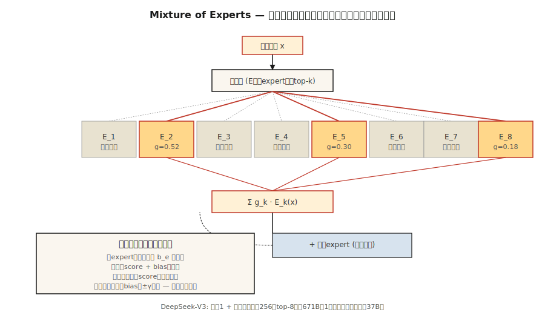

# 专家混合（Mixture of Experts, MoE）

> 一个密集的70B Transformer对每个Token激活所有参数。一个671B的MoE每个Token仅激活37B，并在所有基准测试中胜过前者。稀疏性是这十年最重要的扩展思路。

**类型：** 构建
**语言：** Python
**前置知识：** 阶段7·05（完整Transformer），阶段7·07（GPT）
**时间：** 约45分钟

## 问题

密集Transformer在推理时的FLOPs等于其参数量（前向传播乘以2）。扩展密集模型时，每个Token都要支付全部代价。到2024年，前沿模型遇到了计算瓶颈：要真正变得更智能，每个Token需要的FLOPs呈指数级增长。

专家混合（Mixture of Experts, MoE）打破了这种关联。将每个前馈网络（FFN）替换为 `E` 个独立专家加上一个路由器（Router），路由器为每个Token选择 `k` 个专家。总参数量 = `E × FFN_size`。每个Token的活跃参数量 = `k × FFN_size`。2026年的典型配置：`E=256`，`k=8`。存储随 `E` 扩展，计算随 `k` 扩展。

2026年的前沿模型几乎全部是MoE：DeepSeek-V3（总计671B / 活跃37B）、Mixtral 8×22B、Qwen2.5-MoE、Llama 4、Kimi K2、gpt-oss。在Artificial Analysis的独立排行榜上，前十名开源模型全是MoE。

## 概念



### 替换FFN

密集Transformer块：

```
h = x + attn(norm(x))
h = h + FFN(norm(h))
```

MoE块：

```
h = x + attn(norm(x))
scores = router(norm(h))              # (N_tokens, E)
top_k = argmax_k(scores)              # 每个Token选择E中的k个
h = h + sum_{e in top_k}(
        gate(scores[e]) * Expert_e(norm(h))
    )
```

每个专家都是一个独立的FFN（通常是SwiGLU）。路由器是一个单线性层。每个Token选择自己的 `k` 个专家，并获得它们输出的门控混合。

### 负载均衡问题

如果路由器将90%的Token分配给专家3，其他专家就会饥饿。尝试过三种修复方法：

1. **辅助负载均衡损失**（Switch Transformer, Mixtral）。添加一个与专家使用方差成正比的惩罚项。有效，但增加了一个超参数和第二个梯度信号。
2. **专家容量 + Token丢弃**（早期Switch）。每个专家最多处理 `C × N/E` 个Token；溢出的Token跳过该层。损害质量。
3. **无辅助损失均衡**（DeepSeek-V3）。为每个专家添加一个可学习的偏置（Bias），该偏置会改变路由器的top-k选择。偏置在训练损失之外更新。对主要目标没有惩罚。这是2024年的重大突破。

DeepSeek-V3的方法：每个训练步骤后，对于每个专家，检查其使用量是否高于或低于目标。将偏置向 `±γ` 方向调整。选择过程使用 `scores + bias`。用于门控的专家概率是原始的 `scores`，不做更改。将路由与表达解耦。

### 共享专家

DeepSeek-V2/V3还将专家分为*共享*和*路由*。每个Token都通过所有共享专家。路由专家通过top-k选择。共享专家捕获通用知识；路由专家专精化。V3使用1个共享专家加上从256个路由专家中选出的top-8。

### 细粒度专家

经典MoE（GShard, Switch）：每个专家与完整FFN同宽。`E` 较小（8–64），`k` 较小（1–2）。

现代细粒度MoE（DeepSeek-V3, Qwen-MoE）：每个专家更窄（1/8 FFN大小）。`E` 很大（256+），`k` 也更大（8+）。总参数量相同，但组合数量增长更快。每个Token可能的“专家”组合为 `C(256, 8) = 400万亿`。质量提升，延迟不变。

### 成本概况

每个Token，每层：

| 配置 | 每Token活跃参数量 | 总参数量 |
|--------|-----------------------|--------------|
| Mixtral 8×22B | ~39B | 141B |
| Llama 3 70B（密集） | 70B | 70B |
| DeepSeek-V3 | 37B | 671B |
| Kimi K2（MoE） | ~32B | 1T |

DeepSeek-V3几乎在所有基准测试中击败Llama 3 70B（密集），同时每个Token的**活跃FLOPs更少**。更多参数 = 更多知识。更多活跃FLOPs = 每个Token更多计算。MoE将它们解耦。

### 弊端：内存

无论哪些专家被激活，所有专家都常驻GPU。一个671B的模型需要约1.3 TB的VRAM来存储fp16权重。前沿MoE部署需要专家并行（Expert Parallelism）——将专家分片到不同GPU，通过网络路由Token。延迟主要由全对全通信（all-to-all）决定，而非矩阵乘法。

## 构建

参见 `code/main.py`。一个仅使用stdlib的紧凑MoE层，包含：

- `n_experts=8` 个类似SwiGLU的专家（为演示目的，每个专家只有一个线性层）
- top-k=2路由
- softmax归一化的门控权重
- 通过逐专家偏置实现的无辅助损失均衡

### 第一步：路由器

```python
def route(hidden, W_router, top_k, bias):
    scores = [sum(h * w for h, w in zip(hidden, W_router[e])) for e in range(len(W_router))]
    biased = [s + b for s, b in zip(scores, bias)]
    top_idx = sorted(range(len(biased)), key=lambda i: -biased[i])[:top_k]
    # 对所选专家的原始分数进行softmax
    chosen = [scores[i] for i in top_idx]
    m = max(chosen)
    exps = [math.exp(c - m) for c in chosen]
    s = sum(exps)
    gates = [e / s for e in exps]
    return top_idx, gates
```

偏置影响选择，但不影响门控权重。这就是DeepSeek-V3的诀窍——偏置纠正负载不均衡，而不影响模型预测。

### 第二步：让100个Token通过路由器

跟踪每个专家被激活的频率。没有偏置时，使用分布是倾斜的。使用偏置更新循环（对过度使用专家 `-γ`，对使用不足专家 `+γ`），经过几次迭代后，使用分布收敛到均匀分布。

### 第三步：参数量对比

打印MoE配置的“密集等效”参数量。以DeepSeek-V3形状为例：256个路由专家 + 1个共享专家，8个活跃，d_model=7168。总参数量惊人。活跃参数量仅为密集的Llama 3 70B的七分之一。

## 使用

HuggingFace加载：

```python
from transformers import AutoModelForCausalLM, AutoTokenizer
model = AutoModelForCausalLM.from_pretrained("mistralai/Mixtral-8x22B-v0.1")
```

2026年生产推理：vLLM原生支持MoE路由。SGLang拥有最快的专家并行路径。两者都自动处理top-k选择与专家并行。

**何时选择MoE：**
- 你希望在较低推理成本下获得前沿质量。
- 你拥有足够的VRAM/专家并行基础设施。
- 你的工作负载以Token为主（聊天、代码），而非上下文为主（长文档）。

**何时不应选择MoE：**
- 边缘部署——无论活跃FLOPs多少，你都要支付全部存储成本。
- 延迟敏感的单用户服务——专家路由带来额外开销。
- 小模型（<7B）——MoE的质量优势只在超过一定计算阈值（约6B活跃参数）时才显现。

## 交付

参见 `outputs/skill-moe-configurator.md`。该技能根据参数预算、训练Token和部署目标，为新的MoE选择E、k和共享专家布局。

## 练习

1. **简单。** 运行 `code/main.py`。观察无辅助损失偏置更新如何在50次迭代内平衡专家使用率。
2. **中等。** 将学习到的路由器替换为基于哈希的路由器（确定性，无需学习）。比较质量和平衡性。为什么学习到的路由器更好？
3. **困难。** 实现GRPO风格的“推出匹配路由”（DeepSeek-V3.2的诀窍）：记录推理期间哪些专家被激活，在梯度计算期间强制使用相同的路由。在一个玩具策略梯度设置中测量其效果。

## 关键术语

| 术语 | 通常说法 | 实际含义 |
|------|-----------------|-----------------------|
| 专家（Expert） | "众多FFN中的一个" | 一个独立的前馈网络；专用于FFN计算中一个稀疏分片的参数。 |
| 路由器（Router） | "门控" | 一个微小的线性层，为每个Token对每个专家评分；进行top-k选择。 |
| 顶层k路由（Top-k routing） | "每个Token的k个活跃专家" | 每个Token的FFN计算恰好通过k个专家，由门控加权。 |
| 辅助损失（Auxiliary loss） | "负载均衡惩罚" | 额外的损失项，惩罚倾斜的专家使用分布。 |
| 无辅助损失（Auxiliary-loss-free） | "DeepSeek-V3的诀窍" | 通过仅影响路由器选择的逐专家偏置进行均衡；没有额外梯度。 |
| 共享专家（Shared expert） | "始终开启" | 每个Token都通过的额外专家；捕获通用知识。 |
| 专家并行（Expert parallelism） | "按专家分片" | 将不同专家分配到不同GPU；通过网络路由Token。 |
| 稀疏性（Sparsity） | "活跃参数 < 总参数" | 比率 `k × expert_size / (E × expert_size)`；对于DeepSeek-V3为37/671 ≈ 5.5%。 |

## 延伸阅读

- [Shazeer et al. (2017). Outrageously Large Neural Networks: The Sparsely-Gated Mixture-of-Experts Layer](https://arxiv.org/abs/1701.06538) — 思想的起源。
- [Fedus, Zoph, Shazeer (2022). Switch Transformer: Scaling to Trillion Parameter Models with Simple and Efficient Sparsity](https://arxiv.org/abs/2101.03961) — Switch，经典MoE。
- [Jiang et al. (2024). Mixtral of Experts](https://arxiv.org/abs/2401.04088) — Mixtral 8×7B。
- [DeepSeek-AI (2024). DeepSeek-V3 Technical Report](https://arxiv.org/abs/2412.19437) — MLA + 无辅助损失MoE + MTP。
- [Wang et al. (2024). Auxiliary-Loss-Free Load Balancing Strategy for Mixture-of-Experts](https://arxiv.org/abs/2408.15664) — 基于偏置的均衡论文。
- [Dai et al. (2024). DeepSeekMoE: Towards Ultimate Expert Specialization in Mixture-of-Experts Language Models](https://arxiv.org/abs/2401.06066) — 本课程路由器使用的细粒度+共享专家划分。
- [Kim et al. (2022). DeepSpeed-MoE: Advancing Mixture-of-Experts Inference and Training](https://arxiv.org/abs/2201.05596) — 原始的共享专家论文。