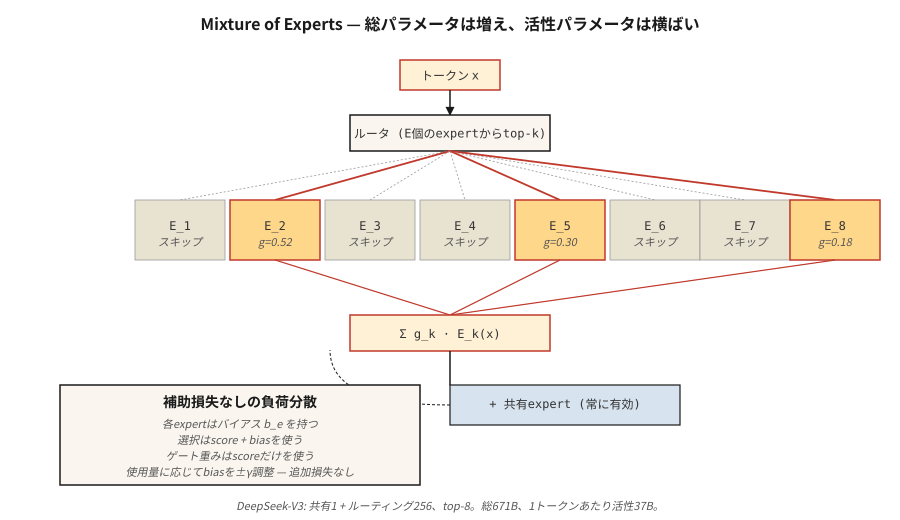

# Mixture of Experts (MoE)

> 稠密 70B transformer 对每个 token 激活每个参数。671B MoE 每 token 仅激活 37B 并在每个基准上击败它。稀疏性是这十年最重要的扩展思想。

**Type:** Build
**Languages:** Python
**Prerequisites:** Phase 7 · 05 (Full Transformer), Phase 7 · 07 (GPT)
**Time:** ~45 分钟

## 问题

稠密 transformer 在推理时的 FLOPs 等于其参数量（乘以 2 用于前向传播）。扩展稠密模型时，每个 token 支付完整的账单。到 2024 年，前沿遇到了计算墙：要变得明显更聪明，每 token 需要指数级更多的 FLOPs。

Mixture of Experts 打破了这一联系。将每个 FFN 替换为 `E` 个独立专家 + 一个为每 token 选择 `k` 个专家的路由器。总参数 = `E × FFN_size`。每 token 激活参数 = `k × FFN_size`。2026 年的典型配置：`E=256`，`k=8`。存储随 `E` 扩展，计算随 `k` 扩展。

2026 年的前沿几乎完全是 MoE：DeepSeek-V3（671B 总 / 37B 激活）、Mixtral 8×22B、Qwen2.5-MoE、Llama 4、Kimi K2、gpt-oss。在 Artificial Analysis 的独立排行榜上，排名前 10 的开源模型都是 MoE。

## 概念



### FFN 替换

稠密 transformer 模块：

```
h = x + attn(norm(x))
h = h + FFN(norm(h))
```

MoE 模块：

```
h = x + attn(norm(x))
scores = router(norm(h))              # (N_tokens, E)
top_k = argmax_k(scores)              # pick k of E per token
h = h + sum_{e in top_k}(
        gate(scores[e]) * Expert_e(norm(h))
    )
```

每个专家是一个独立的 FFN（通常是 SwiGLU）。路由器是一个单一的线性层。每个 token 选择自己的 `k` 个专家，并得到它们输出的门控混合。

### 负载均衡问题

如果路由器将 90% 的 token 送到专家 3，其他专家就会饿死。已经尝试了三种修复方案：

1. **辅助负载均衡损失**（Switch Transformer, Mixtral）。添加一个与专家使用方差成比例的惩罚。有效，但增加了一个超参数和第二个梯度信号。
2. **专家容量 + token 丢弃**（早期 Switch）。每个专家最多处理 `C × N/E` 个 token；溢出的 token 跳过该层。损害质量。
3. **无辅助损失的均衡**（DeepSeek-V3）。添加一个学习的每专家偏置，移动路由器的 top-k 选择。偏置在训练损失之外更新。主目标上没有惩罚。2024 年的重大突破。

DeepSeek-V3 的方法：每个训练步骤后，对每个专家，检查其使用是否高于或低于目标。将偏置调整 `±γ`。选择使用 `scores + bias`。用于门控的专家概率是原始 `scores`，不变。将路由与表达解耦。

### 共享专家

DeepSeek-V2/V3 还将专家分为*共享*和*路由*。每个 token 通过所有共享专家。路由专家通过 top-k 选择。共享专家捕获常识；路由专家专门化。V3 使用 1 个共享专家加上 256 个路由专家中的 top-8。

### 细粒度专家

经典 MoE（GShard、Switch）：每个专家与完整 FFN 一样宽。`E` 很小（8–64），`k` 很小（1–2）。

现代细粒度 MoE（DeepSeek-V3、Qwen-MoE）：每个专家更窄（1/8 FFN 大小）。`E` 很大（256+），`k` 更大（8+）。相同总参数，但组合扩展快得多。`C(256, 8) = 400 万亿` 种可能的每 token "专家"。质量提升，延迟保持不变。

### 成本概况

每 token、每层：

| 配置 | 每 token 激活参数 | 总参数 |
|--------|-----------------------|--------------|
| Mixtral 8×22B | ~39B | 141B |
| Llama 3 70B（稠密） | 70B | 70B |
| DeepSeek-V3 | 37B | 671B |
| Kimi K2 (MoE) | ~32B | 1T |

DeepSeek-V3 在几乎每个基准上都击败了 Llama 3 70B（稠密），同时每 token 执行**更少的激活 FLOPs**。更多参数 = 更多知识。更多激活 FLOPs = 每 token 更多计算。MoE 将它们解耦。

### 陷阱：内存

无论哪些专家被触发，所有专家都存在于 GPU 上。671B 模型在 fp16 权重下需要约 1.3 TB 的 VRAM。前沿 MoE 部署需要专家并行——将专家分片到多个 GPU 上，跨网络路由 token。延迟由 all-to-all 通信主导，而非矩阵乘法。

## 动手构建

参见 `code/main.py`。一个紧凑的 MoE 层，纯标准库实现，包含：

- `n_experts=8` 的 SwiGLU 风格专家（举例用，每个一个线性层）
- top-k=2 路由
- softmax 归一化的门控权重
- 通过每专家偏置实现的无辅助损失均衡

### 步骤 1：路由器

```python
def route(hidden, W_router, top_k, bias):
    scores = [sum(h * w for h, w in zip(hidden, W_router[e])) for e in range(len(W_router))]
    biased = [s + b for s, b in zip(scores, bias)]
    top_idx = sorted(range(len(biased)), key=lambda i: -biased[i])[:top_k]
    # softmax over ORIGINAL scores of the chosen experts
    chosen = [scores[i] for i in top_idx]
    m = max(chosen)
    exps = [math.exp(c - m) for c in chosen]
    s = sum(exps)
    gates = [e / s for e in exps]
    return top_idx, gates
```

偏置影响选择，而不影响门控权重。这就是 DeepSeek-V3 的技巧——偏置纠正负载不平衡，而不影响模型的预测。

### 步骤 2：将 100 个 token 通过路由器运行

跟踪每个专家触发的频率。没有偏置时，使用是有偏的。使用偏置更新循环（过度使用专家 `-γ`，未充分使用专家 `+γ`），使用在几次迭代内收敛到均匀分布。

### 步骤 3：参数计数比较

打印 MoE 配置的"稠密等效"。DeepSeek-V3 形状：256 路由 + 1 共享，8 激活，d_model=7168。总参数数量令人瞠目。激活参数数量是稠密 Llama 3 70B 的七分之一。

## 实际应用

HuggingFace 加载：

```python
from transformers import AutoModelForCausalLM, AutoTokenizer
model = AutoModelForCausalLM.from_pretrained("mistralai/Mixtral-8x22B-v0.1")
```

2026 年生产推理：vLLM 原生支持 MoE 路由。SGLang 拥有最快的专家并行路径。两者都自动处理 top-k 选择和专家并行。

**何时选择 MoE：**
- 你希望以更低的每 token 推理成本获得前沿质量。
- 你有 VRAM / 专家并行基础设施。
- 你的工作负载是 token 密集型的（聊天、代码）而非上下文密集型的（长文档）。

**何时不选择 MoE：**
- 边缘部署——你为任何激活 FLOP 支付完整存储。
- 延迟关键的单用户服务——专家路由增加开销。
- 小模型（<7B）——MoE 的质量优势只在高于某个计算阈值（约 6B 激活参数）时才显现。

## 交付

参见 `outputs/skill-moe-configurator.md`。该 skill 根据参数预算、训练 token 和部署目标，为新的 MoE 选择 E、k 和共享专家布局。

## 练习

1. **简单。** 运行 `code/main.py`。观察无辅助损失的偏置更新如何在 50 次迭代内使专家使用趋于均衡。
2. **中等。** 将学习路由器替换为基于哈希的路由器（确定性，无学习）。比较质量和均衡性。为什么学习路由器更好？
3. **困难。** 实现 GRPO 风格的"rollout-matched routing"（DeepSeek-V3.2 技巧）：记录推理时哪些专家触发，在梯度计算期间强制相同的路由。在玩具策略梯度设置上测量效果。

## 关键术语

| 术语 | 人们说的 | 实际含义 |
|------|-----------------|-----------------------|
| Expert | "众多 FFN 中的一个" | 独立的前馈网络；专用于 FFN 计算的稀疏切片的参数。 |
| Router | "门" | 一个微小的线性层，为每个 token 对每个专家评分；top-k 选择。 |
| Top-k routing | "每 token k 个激活专家" | 每个 token 的 FFN 计算精确通过 k 个专家，由门控加权。 |
| Auxiliary loss | "负载均衡惩罚" | 惩罚偏斜专家使用的额外损失项。 |
| Auxiliary-loss-free | "DeepSeek-V3 的技巧" | 通过在路由器选择上使用每专家偏置进行均衡；无额外梯度。 |
| Shared expert | "始终在线" | 每个 token 通过的额外专家；捕获常识。 |
| Expert parallelism | "按专家分片" | 将不同专家分配到不同 GPU；跨网络路由 token。 |
| Sparsity | "激活参数 < 总参数" | 比率 `k × expert_size / (E × expert_size)`；DeepSeek-V3 为 37/671 ≈ 5.5%。 |

## 延伸阅读

- [Shazeer et al. (2017). Outrageously Large Neural Networks: The Sparsely-Gated Mixture-of-Experts Layer](https://arxiv.org/abs/1701.06538) — 这个想法。
- [Fedus, Zoph, Shazeer (2022). Switch Transformer: Scaling to Trillion Parameter Models with Simple and Efficient Sparsity](https://arxiv.org/abs/2101.03961) — Switch，经典 MoE。
- [Jiang et al. (2024). Mixtral of Experts](https://arxiv.org/abs/2401.04088) — Mixtral 8×7B。
- [DeepSeek-AI (2024). DeepSeek-V3 Technical Report](https://arxiv.org/abs/2412.19437) — MLA + 无辅助损失 MoE + MTP。
- [Wang et al. (2024). Auxiliary-Loss-Free Load Balancing Strategy for Mixture-of-Experts](https://arxiv.org/abs/2408.15664) — 基于偏置的均衡论文。
- [Dai et al. (2024). DeepSeekMoE: Towards Ultimate Expert Specialization in Mixture-of-Experts Language Models](https://arxiv.org/abs/2401.06066) — 本课路由器使用的细粒度 + 共享专家拆分。
- [Kim et al. (2022). DeepSpeed-MoE: Advancing Mixture-of-Experts Inference and Training](https://arxiv.org/abs/2201.05596) — 原始共享专家论文。
