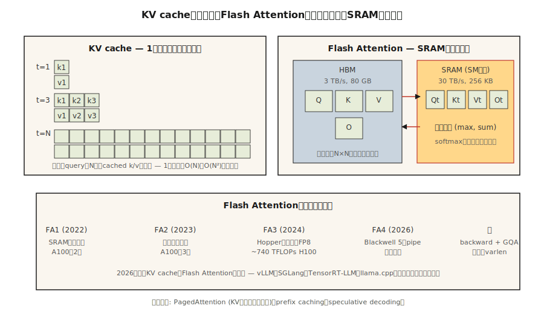

# KV Cache, Flash Attention & Inference Optimization

> Training は parallel で FLOP-bound です。Inference は serial で memory-bound です。bottleneck が違えば、tricks も違います。

**種別:** 構築
**言語:** Python
**前提条件:** Phase 7 · 02 (Self-Attention), Phase 7 · 05 (Full Transformer), Phase 7 · 07 (GPT)
**所要時間:** 約75分

## 課題

Naive な autoregressive decoder は、`N` tokens を生成するために `O(N²)` の仕事をします。各 step で full prefix に対する attention を再計算するためです。4K-token response では 16M attention operations になり、その大半は冗長です。prefix token の hidden state は一度計算すれば決定的です。必要なのは、新しい token の query を、それ以前すべての cached keys and values に当てることだけです。

さらに、attention 自体も大量のデータを移動します。Standard attention は N×N score matrix、N×d softmax output、N×d final output を materialize します。HBM への read/write が多すぎます。N≥2K では、attention は FLOP-bound になる前に memory-bound になります。古典的な attention kernels は現代 GPU を 4–10× も使い切れません。

Dao et al. 由来の 2 つの最適化が、frontier inference を「遅い」から「速い」に押し上げました。

1. **KV cache。** すべての prefix token の K and V vectors を保存します。各 new token の attention は、cached keys に対する 1 つの query になります。Inference は generation step ごとに `O(N²)` から `O(N)` に下がります。
2. **Flash Attention。** full N×N matrix が HBM に載らないよう attention computation を tile 化します。softmax + matmul はすべて SRAM 内で起きます。A100 で 2–4×、FP8 を使う H100 で 5–10× の wall-clock speedup です。

2026 年にはどちらも普遍的です。すべての production inference stack (vLLM, TensorRT-LLM, SGLang, llama.cpp) がこれらを前提にしています。すべての frontier model は Flash Attention enabled で提供されます。

## コンセプト



### KV cache math

decoder layer ごと、token ごと、head ごと:

```
bytes_per_token_per_layer = 2 * d_head * dtype_size
                          ^
                          K and V
```

32 layers、32 heads、d_head=128、fp16 の 7B model では:

```
per token per layer = 2 * 128 * 2 = 512 bytes
per token (32 layers) = 16 KB
per 32K context = 512 MB
```

Llama 3 70B (80 layers, d_head=128, GQA with 8 KV heads) では:

```
per token per layer = 2 * 8 * 128 * 2 = 4096 bytes (4 KB)
per 32K context = 10.4 GB
```

この 10 GB が、128K context の Llama 3 70B が batch size 1 でも 40 GB A100 の大部分を KV cache だけに使う理由です。

**GQA は KV-cache の勝ち筋です。** MHA with 64 heads なら 32 GB になります。MLA はさらに圧縮します。

### Flash Attention — tiling trick

Standard attention:

```
S = Q @ K^T          (HBM read, N×N, HBM write)
P = softmax(S)       (HBM read, HBM write)
O = P @ V            (HBM read, HBM write)
```

HBM round trips が 3 回あります。H100 の HBM bandwidth は 3 TB/s、SRAM は 30 TB/s です。HBM trip のたびに、on-chip に保持する場合と比べて 10 倍遅くなります。

Flash Attention:

```
for each block of Q (tile size ~128 × 128):
    load Q_tile into SRAM
    for each block of K, V:
        load K_tile, V_tile into SRAM
        compute S_tile = Q_tile @ K_tile^T     (SRAM)
        running softmax aggregation             (SRAM)
        accumulate into O_tile                  (SRAM)
    write O_tile to HBM
```

tile ごとに HBM trip は 1 回です。total memory footprint は `O(N²)` から `O(N)` に落ちます。Backward pass では forward pass から一部の値を保存する代わりに再計算するため、さらに memory win になります。

**Numerical trick。** Running softmax は tile 間で `(max, sum)` を維持するため、最終 normalization は正確です。近似ではありません。Flash Attention は standard attention と bit-identical な output を計算します。ただし fp16 の non-associativity による差はあります。

**Version evolution:**

| Version | Year | Key change | Speedup on reference hardware |
|---------|------|-----------|-------------------------------|
| Flash 1 | 2022 | Tiled SRAM kernel | 2× on A100 |
| Flash 2 | 2023 | Better parallelism, causal-first ordering | 3× on A100 |
| Flash 3 | 2024 | Hopper asynchrony, FP8 | 1.5–2× on H100 (~740 TFLOPs FP16) |
| Flash 4 | 2026 | Blackwell 5-stage pipeline, software exp2 | Inference-first (forward only initially) |

Flash 4 は launch 時点で forward-pass only です。Training はまだ Flash 3 を使います。Flash 4 の GQA と varlen support は pending (mid-2026) です。

### Speculative decoding — もう 1 つの latency win

安い model が N tokens を提案します。大きい model が N 個すべてを parallel に検証します。verification が k tokens を受け入れれば、1 回の big-model forward pass で k generations 分を払ったことになります。code や prose では典型的に k=3–5 です。

2026 年のデフォルト:
- **EAGLE 2 / Medusa。** verifier の hidden states を共有する integrated draft heads。quality loss なしで 2–3× speedup。
- **Speculative decoding with draft model。** consumer hardware で 2–4× speedup。
- **Lookahead decoding。** Jacobi iteration。draft model は不要。niche ですが無料です。

### Continuous batching

古典的な batched inference では、最も遅い sequence が終わるのを待ってから new batch を開始します。short responses が早く終わると GPU が無駄になります。

Continuous batching は Orca で初めて提供され、今では vLLM、TensorRT-LLM、SGLang に入っています。古い requests が終わった瞬間に新しい requests を batch に差し込みます。典型的な chat workloads で throughput が 5–10× 向上します。

### PagedAttention — virtual memory としての KV cache

vLLM の看板機能です。KV cache を 16-token blocks に割り当て、page table が logical positions を physical blocks に対応付けます。これにより、parallel samples (beam search, parallel sampling) 間で KV を共有でき、prompt caching 用に prefixes を hot-swap でき、memory を defragment できます。naive contiguous allocation と比べて throughput が 4× 改善します。

## 作ってみる

`code/main.py` を見てください。次を実装します。

1. naive な `O(N²)` incremental decoder。
2. `O(N)` の KV-cached decoder。
3. Flash Attention の running-max algorithm を模した tiled softmax。

### Step 1: KV cache

```python
class KVCache:
    def __init__(self, n_layers, n_heads, d_head):
        self.K = [[[] for _ in range(n_heads)] for _ in range(n_layers)]
        self.V = [[[] for _ in range(n_heads)] for _ in range(n_layers)]

    def append(self, layer, head, k, v):
        self.K[layer][head].append(k)
        self.V[layer][head].append(v)

    def read(self, layer, head):
        return self.K[layer][head], self.V[layer][head]
```

単純に、per-layer、per-head lists に per-token K, V vectors を伸ばしていきます。

### Step 2: tiled softmax

```python
def tiled_softmax_dot(q, K, V, tile=4):
    """Flash-attention-style softmax(qK^T)V with running max/sum."""
    m = float("-inf")
    s = 0.0
    out = [0.0] * len(V[0])
    for start in range(0, len(K), tile):
        k_block = K[start:start + tile]
        v_block = V[start:start + tile]
        scores = [sum(qi * ki for qi, ki in zip(q, k)) for k in k_block]
        new_m = max(m, *scores)
        exp_old = math.exp(m - new_m) if m != float("-inf") else 0.0
        exp_new = [math.exp(sc - new_m) for sc in scores]
        s = s * exp_old + sum(exp_new)
        for j in range(len(out)):
            out[j] = out[j] * exp_old + sum(e * v[j] for e, v in zip(exp_new, v_block))
        m = new_m
    return [o / s for o in out]
```

`softmax(qK) V` を一括で計算した場合と bit-identical な output ですが、任意の時点の working set は full `N × d_head` ではなく `tile × d_head` block です。

### Step 3: 100-token generation で naive vs cached decoding を比較する

attention operations を数えます。Naive は `O(N²)` = 5050。Cached は `O(N)` = 100。コードは両方を出力します。

## 使ってみる

```python
# HuggingFace transformers auto-enables KV cache on decoder-only generate().
from transformers import AutoModelForCausalLM
model = AutoModelForCausalLM.from_pretrained(
    "meta-llama/Llama-3.2-3B",
    attn_implementation="flash_attention_2",  # use FA3 if Hopper
    torch_dtype="bfloat16",
)
# generate() uses KV cache automatically
```

vLLM production:

```bash
pip install vllm
vllm serve meta-llama/Llama-3.1-70B-Instruct \
    --tensor-parallel-size 4 \
    --max-model-len 32768 \
    --enable-prefix-caching \
    --kv-cache-dtype fp8
```

requests 間の prefix caching は 2026 年の大きな勝ち筋です。同じ system prompt、few-shot examples、long context document が calls 間で KV を再利用します。repeated tool prompts を持つ agent workloads では、prefix caching による throughput gain は日常的に 5× です。

## Ship It

`outputs/skill-inference-optimizer.md` を見てください。この skill は、新しい inference deployment 向けに attention implementation、KV cache strategy、quantization、speculative decoding を選びます。

## 演習

1. **Easy.** `code/main.py` を実行してください。naive decoder と cached decoder が同じ output を生成することを確認し、op-count difference を確認します。
2. **Medium.** Prefix caching を実装してください。prompt P と複数の completions が与えられたら、P に対する forward pass を 1 回実行して KV cache を埋め、completion ごとに branch します。各 completion で P を再 encoding する場合と speedup を測ります。
3. **Hard.** toy PagedAttention を実装してください。free-list を持つ固定 16-token blocks に KV cache を置きます。sequence が終わったら、その blocks を pool に返します。長さが異なる 1,000 個の chat completions を simulate します。contiguous allocation と memory fragmentation を比較します。

## 重要語句

| Term | What people say | What it actually means |
|------|-----------------|-----------------------|
| KV cache | 「decoding を速くする trick」 | すべての prefix token からの K and V を保存したもの。new queries は再計算せず、それらに attend する。 |
| HBM | 「GPU main memory」 | High Bandwidth Memory。H100 で 80 GB、B200 で 192 GB。bandwidth は約 3 TB/s。 |
| SRAM | 「On-chip memory」 | per-SM の高速 memory。H100 で SM あたり約 256 KB。bandwidth は約 30 TB/s。 |
| Flash Attention | 「Tiled attention kernel」 | HBM に N×N を materialize せずに attention を計算する。 |
| Continuous batching | 「No-wait batching」 | batch を drain せずに finished sequences を出し、新しい ones を入れる。 |
| PagedAttention | 「vLLM's headline」 | page table 付き固定 blocks に割り当てられる KV cache。fragmentation をなくす。 |
| Prefix caching | 「Reuse long prompts」 | requests 間で shared prefix の KV を cache する。agents の大きな cost cut。 |
| Speculative decoding | 「Draft + verify」 | 安い draft model が tokens を提案し、大きい model が k 個を 1 pass で検証する。 |

## 参考資料

- [Dao et al. (2022). FlashAttention: Fast and Memory-Efficient Exact Attention with IO-Awareness](https://arxiv.org/abs/2205.14135) — Flash 1。
- [Dao (2023). FlashAttention-2: Faster Attention with Better Parallelism and Work Partitioning](https://arxiv.org/abs/2307.08691) — Flash 2。
- [Shah et al. (2024). FlashAttention-3: Fast and Accurate Attention with Asynchrony and Low-precision](https://arxiv.org/abs/2407.08608) — Flash 3。
- [FlashAttention-4 release notes (Dao-AILab, 2026)](https://github.com/Dao-AILab/flash-attention) — Blackwell 5-stage pipeline と software-exp2 trick。この lesson が触れた forward-only launch caveats は repo README を読んでください。
- [Kwon et al. (2023). Efficient Memory Management for Large Language Model Serving with PagedAttention](https://arxiv.org/abs/2309.06180) — vLLM paper。
- [Leviathan et al. (2023). Fast Inference from Transformers via Speculative Decoding](https://arxiv.org/abs/2211.17192) — spec decoding。
- [Li et al. (2024). EAGLE: Speculative Sampling Requires Rethinking Feature Uncertainty](https://arxiv.org/abs/2401.15077) — lesson が引用する integrated-draft approach に関する EAGLE-1/2 paper。
- [Cai et al. (2024). Medusa: Simple LLM Inference Acceleration Framework with Multiple Decoding Heads](https://arxiv.org/abs/2401.10774) — EAGLE と並んで参照される Medusa approach。
- [vLLM docs — PagedAttention](https://docs.vllm.ai/en/latest/design/kernel/paged_attention.html) — 16-token block と page-table design についての標準的な deep dive。
