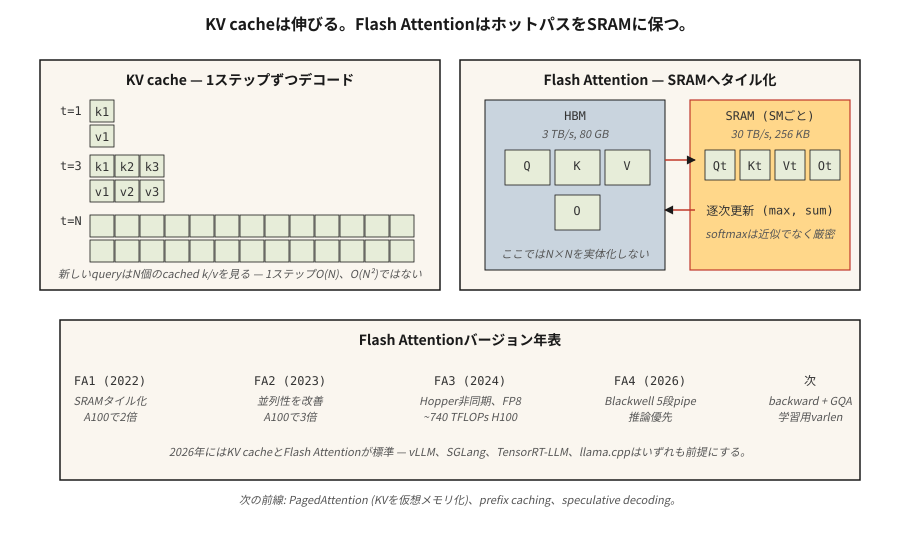

# KV 快取、Flash Attention 與推論最佳化

> 訓練是平行的，卡在 FLOP 上。推論是序列的，卡在記憶體頻寬上。瓶頸不同，招數也不同。

**類型：** 實作
**程式語言：** Python
**先修單元：** 階段 7 · 02（自注意力）、階段 7 · 05（完整的 Transformer）、階段 7 · 07（GPT）
**時間：** 約 75 分鐘

## 問題所在

一個天真的自迴歸解碼器，要生成 `N` 個詞元得做 `O(N²)` 的工作量：每一步都對整段前綴重算一次注意力。對一段 4K 詞元的回應來說，那是 1,600 萬次注意力運算，其中大部分是重複的。前綴中每個詞元的隱藏狀態一旦算出來就是確定的 —— 你只需要拿新詞元的 query，去對上前面所有內容已快取的 key 與 value。

除此之外，注意力本身還搬動大量資料。標準注意力會實際產生一個 N×N 的分數矩陣、N×d 的 softmax 輸出、N×d 的最終輸出 —— 對 HBM 的讀寫次數太多了。當 N≥2K 時，注意力在還沒被 FLOP 卡住之前，就先被記憶體頻寬卡住。傳統的注意力核心讓現代 GPU 的算力閒置了 4 到 10 倍。

兩項最佳化（都出自 Dao 等人）把前沿模型的推論從「慢」推到了「快」：

1. **KV 快取。** 把每個前綴詞元的 K 與 V 向量存起來。每個新詞元的注意力，就是一個 query 去比對已快取的 key。推論的每一步生成成本從 `O(N²)` 降到 `O(N)`。
2. **Flash Attention。** 把注意力運算切成小塊（tiling），讓完整的 N×N 矩陣從頭到尾都不碰 HBM。softmax 與矩陣乘法全都在 SRAM 裡完成。在 A100 上實測快 2 到 4 倍；在 H100 上搭配 FP8 可達 5 到 10 倍。

到了 2026 年，這兩者都已是標準配備。每一套生產級推論堆疊（vLLM、TensorRT-LLM、SGLang、llama.cpp）都預設它們存在，每個前沿模型出廠時都啟用 Flash Attention。

## 核心概念



### KV 快取的數學

每一層解碼器、每個詞元、每個頭：

```
bytes_per_token_per_layer = 2 * d_head * dtype_size
                          ^
                          K and V
```

以一個 7B 模型為例，32 層、32 個頭、d_head=128、fp16：

```
per token per layer = 2 * 128 * 2 = 512 bytes
per token (32 layers) = 16 KB
per 32K context = 512 MB
```

以 Llama 3 70B 為例（80 層、d_head=128、採用 GQA 且有 8 個 KV 頭）：

```
per token per layer = 2 * 8 * 128 * 2 = 4096 bytes (4 KB)
per 32K context = 10.4 GB
```

正是這 10 GB，讓 Llama 3 70B 在 128K 脈絡下、批次大小只有 1 的時候，光是 KV 快取就吃掉一張 40 GB A100 的大半。

**GQA 真正省的就是 KV 快取。** 換成 64 個頭的 MHA 會是 32 GB，而 MLA 壓得更狠。

拖動下面的維度，看看快取大小怎麼變。把序列長度或批次往上推，你會看到它多快就超出單張 GPU 的容量：

```figure
kv-cache-sizer
```

### Flash Attention —— 分塊的把戲

標準注意力：

```
S = Q @ K^T          (HBM read, N×N, HBM write)
P = softmax(S)       (HBM read, HBM write)
O = P @ V            (HBM read, HBM write)
```

來回 HBM 三趟。在 H100 上，HBM 頻寬是 3 TB/s，SRAM 是 30 TB/s。相較於把所有東西留在晶片上，每跑一趟 HBM 就等於慢十倍。

Flash Attention：

```
for each block of Q (tile size ~128 × 128):
    load Q_tile into SRAM
    for each block of K, V:
        load K_tile, V_tile into SRAM
        compute S_tile = Q_tile @ K_tile^T     (SRAM)
        running softmax aggregation             (SRAM)
        accumulate into O_tile                  (SRAM)
    write O_tile to HBM
```

每一塊只跑一趟 HBM。記憶體佔用總量從 `O(N²)` 降到 `O(N)`。反向傳播則從前向傳播的結果重算部分數值，而不是把它們存下來 —— 又省一筆記憶體。

**數值上的巧思。** 滾動式 softmax 會跨分塊維護 `(max, sum)`，因此最後的正規化是精確的。這不是近似 —— Flash Attention 算出的輸出與標準注意力逐位元相同（除去 fp16 不具結合律造成的差異）。

**版本演進：**

| 版本 | 年份 | 關鍵變化 | 在參考硬體上的加速 |
|---------|------|-----------|-------------------------------|
| Flash 1 | 2022 | 分塊的 SRAM 核心 | A100 上 2 倍 |
| Flash 2 | 2023 | 更好的平行度、因果優先的排序 | A100 上 3 倍 |
| Flash 3 | 2024 | Hopper 非同步機制、FP8 | H100 上 1.5 到 2 倍（約 740 TFLOPs FP16） |
| Flash 4 | 2026 | Blackwell 五階段管線、軟體實作的 exp2 | 以推論為先（初期只有前向傳播） |

Flash 4 剛推出時只支援前向傳播，訓練仍然使用 Flash 3。Flash 4 對 GQA 與變長序列的支援還在路上（2026 年中）。

### 推測式解碼 —— 另一項延遲上的勝利

用便宜的模型提出 N 個詞元，大模型再一次平行驗證這 N 個。如果驗證接受了 k 個詞元，你就用一次大模型的前向傳播換到了 k 次生成。在程式碼與散文上，k 通常是 3 到 5。

2026 年的預設做法：

- **EAGLE 2／Medusa。** 內建的草稿頭，與驗證模型共用隱藏狀態。加速 2 到 3 倍且不損品質。
- **搭配草稿模型的推測式解碼。** 在消費級硬體上加速 2 到 4 倍。
- **Lookahead decoding。** 用 Jacobi 迭代，不需要草稿模型。用途較窄，但不花額外成本。

### 連續批次（continuous batching）

傳統的批次推論：等最慢的那條序列跑完，才開始下一批。短回應提早結束時，GPU 就閒著浪費。

連續批次（最早出現在 Orca，現在 vLLM、TensorRT-LLM、SGLang 都有）：舊的請求一結束，就立刻把新請求換進這一批。對典型的聊天工作負載，吞吐量提升 5 到 10 倍。

### PagedAttention —— 把 KV 快取當虛擬記憶體

vLLM 的招牌功能。KV 快取以 16 個詞元為一個區塊配置，再用一張分頁表把邏輯位置映射到實體區塊。這讓你能在多條平行取樣之間共享 KV（beam search、平行取樣）、為提示詞快取熱抽換前綴，並且整理記憶體碎片。相較於天真的連續配置，吞吐量提升 4 倍。

```figure
flash-attention-memory
```

## 動手實作

請看 `code/main.py`。我們會實作：

1. 一個天真的 `O(N²)` 增量式解碼器。
2. 一個帶 KV 快取的 `O(N)` 解碼器。
3. 一個分塊 softmax，模擬 Flash Attention 的滾動最大值演算法。

### 步驟 1：KV 快取

```python
class KVCache:
    def __init__(self, n_layers, n_heads, d_head):
        self.K = [[[] for _ in range(n_heads)] for _ in range(n_layers)]
        self.V = [[[] for _ in range(n_heads)] for _ in range(n_layers)]

    def append(self, layer, head, k, v):
        self.K[layer][head].append(k)
        self.V[layer][head].append(v)

    def read(self, layer, head):
        return self.K[layer][head], self.V[layer][head]
```

很單純：在每層、每個頭的清單裡，持續累積每個詞元的 K、V 向量。

### 步驟 2：分塊 softmax

```python
def tiled_softmax_dot(q, K, V, tile=4):
    """Flash-attention-style softmax(qK^T)V with running max/sum."""
    m = float("-inf")
    s = 0.0
    out = [0.0] * len(V[0])
    for start in range(0, len(K), tile):
        k_block = K[start:start + tile]
        v_block = V[start:start + tile]
        scores = [sum(qi * ki for qi, ki in zip(q, k)) for k in k_block]
        new_m = max(m, *scores)
        exp_old = math.exp(m - new_m) if m != float("-inf") else 0.0
        exp_new = [math.exp(sc - new_m) for sc in scores]
        s = s * exp_old + sum(exp_new)
        for j in range(len(out)):
            out[j] = out[j] * exp_old + sum(e * v[j] for e, v in zip(exp_new, v_block))
        m = new_m
    return [o / s for o in out]
```

輸出與一次算完的 `softmax(qK) V` 逐位元相同，但任何時刻的工作集都只是一個 `tile × d_head` 的區塊，而不是完整的 `N × d_head`。

### 步驟 3：在 100 個詞元的生成上比較天真解碼與快取解碼

數一下注意力運算次數。天真版：`O(N²)` = 5050。快取版：`O(N)` = 100。程式會把兩者都印出來。

## 框架應用

```python
# HuggingFace transformers auto-enables KV cache on decoder-only generate().
from transformers import AutoModelForCausalLM
model = AutoModelForCausalLM.from_pretrained(
    "meta-llama/Llama-3.2-3B",
    attn_implementation="flash_attention_2",  # use FA3 if Hopper
    torch_dtype="bfloat16",
)
# generate() uses KV cache automatically
```

vLLM 的生產環境用法：

```bash
pip install vllm
vllm serve meta-llama/Llama-3.1-70B-Instruct \
    --tensor-parallel-size 4 \
    --max-model-len 32768 \
    --enable-prefix-caching \
    --kv-cache-dtype fp8
```

跨請求的前綴快取是 2026 年的一大進展 —— 同一段系統提示詞、同一組少量範例，或同一份長脈絡文件，都能跨呼叫重用 KV。對於一再重複工具提示詞的代理程式工作負載，前綴快取常態性帶來 5 倍的吞吐量。

## 產出交付

請看 `outputs/skill-inference-optimizer.md`。這項技能會為一次新的推論部署，挑選注意力實作、KV 快取策略、量化方式與推測式解碼設定。

## 練習

1. **簡單。** 執行 `code/main.py`。確認天真解碼器與快取解碼器產生相同輸出，並記下運算次數的差異。
2. **中等。** 實作前綴快取：給定一段提示詞 P 與數個續寫，先對 P 跑一次前向傳播把 KV 快取填好，再依每個續寫分支下去。量測相較於每次都重新編碼 P 的加速幅度。
3. **困難。** 實作一個玩具版 PagedAttention：KV 快取切成固定 16 個詞元的區塊，並維護一份空閒清單。序列結束時把它的區塊還回池子。模擬 1,000 次長度不一的聊天續寫，並與連續配置比較記憶體碎片情況。

## 關鍵術語

| 術語 | 大家怎麼說 | 實際上是什麼 |
|------|-----------------|-----------------------|
| KV 快取 | 「讓解碼變快的那個把戲」 | 存下每個前綴詞元的 K 與 V；新的 query 直接注意它們，而不是重算。 |
| HBM | 「GPU 的主記憶體」 | High Bandwidth Memory；H100 上 80 GB，B200 上 192 GB，頻寬約 3 TB/s。 |
| SRAM | 「晶片內記憶體」 | 每個 SM 專屬的快速記憶體，H100 上每個 SM 約 256 KB，頻寬約 30 TB/s。 |
| Flash Attention | 「分塊的注意力核心」 | 計算注意力時，不在 HBM 中實際產生 N×N 矩陣。 |
| 連續批次 | 「不用等的批次處理」 | 把跑完的序列換出、新的換入，不必等整批清空。 |
| PagedAttention | 「vLLM 的招牌」 | KV 快取以固定區塊配置並搭配分頁表，消除記憶體碎片。 |
| 前綴快取 | 「重用長提示詞」 | 為跨請求共享的前綴快取 KV；對代理程式來說是重大的成本削減。 |
| 推測式解碼 | 「草稿加驗證」 | 便宜的草稿模型提出詞元，大模型一次驗證 k 個。 |

## 延伸閱讀

- [Dao et al. (2022). FlashAttention: Fast and Memory-Efficient Exact Attention with IO-Awareness](https://arxiv.org/abs/2205.14135) —— Flash 1。
- [Dao (2023). FlashAttention-2: Faster Attention with Better Parallelism and Work Partitioning](https://arxiv.org/abs/2307.08691) —— Flash 2。
- [Shah et al. (2024). FlashAttention-3: Fast and Accurate Attention with Asynchrony and Low-precision](https://arxiv.org/abs/2407.08608) —— Flash 3。
- [FlashAttention-4 release notes (Dao-AILab, 2026)](https://github.com/Dao-AILab/flash-attention) —— Blackwell 五階段管線與軟體 exp2 的巧思；本單元提到的「僅支援前向傳播」等注意事項，請讀該儲存庫的 README。
- [Kwon et al. (2023). Efficient Memory Management for Large Language Model Serving with PagedAttention](https://arxiv.org/abs/2309.06180) —— vLLM 論文。
- [Leviathan et al. (2023). Fast Inference from Transformers via Speculative Decoding](https://arxiv.org/abs/2211.17192) —— 推測式解碼。
- [Li et al. (2024). EAGLE: Speculative Sampling Requires Rethinking Feature Uncertainty](https://arxiv.org/abs/2401.15077) —— 本單元引用的內建草稿法，出自 EAGLE-1／2 論文。
- [Cai et al. (2024). Medusa: Simple LLM Inference Acceleration Framework with Multiple Decoding Heads](https://arxiv.org/abs/2401.10774) —— 與 EAGLE 並列提及的 Medusa 做法。
- [vLLM docs — PagedAttention](https://docs.vllm.ai/en/latest/design/kernel/paged_attention.html) —— 關於 16 詞元區塊與分頁表設計的權威深入說明。
