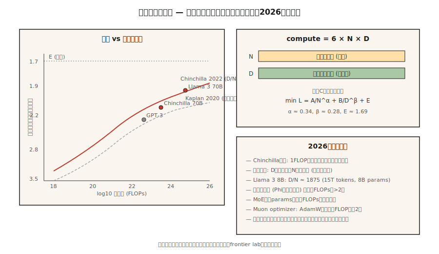

# 标度律

> 2020年卡普兰论文称：更大的模型，更低的损失。2022年霍夫曼论文称：你训练不足。计算分为两个桶--参数和令牌--而且分裂并不明显。

** 类型：** 学习
** 语言：** Python
** 先决条件：** 7 · 05期（全Transformer）、7 · 07期（GPT）
** 时间：** ~45分钟

## 问题

当您有训练计算的C FLOP并且想要最好的模型时，您面临两个问题：

1. ** 有多少个参数（N）？**型号更大，容量更高。
2. ** 多少个训练代币（D）？**更多数据，更好地利用容量。

FLOP的规模大约为“6 x N x D”。您可以向上推N并向下推D，或者向上推D并向下推N。哪个更好？

2022年之前，答案是“用力推N。“GPT-3（2020）是在约300 B个代币上训练的175 B参数。每个参数的比例约为1.7个代币。卡普兰缩放定律支持了这一点。

Hoffmann等人（2022）训练了一个名为Chinchilla的模型小家族，发现了一些不同的情况：最佳比例更接近 **20个令牌 **。GPT-3训练不足10倍。Chinchilla（70 B参数，1.4T代币）在每个基准测试上都击败了GPT-3（175 B、300 B代币），推理成本降低了2.5倍。

2026 这是龙奇拉的世界--但有一个重要的转折。Llama 3 8 B在15万亿个代币上训练，每个参数的比例为1，875个代币。超过龙猫最佳成绩九十四倍。对于将大规模使用的模型来说，推理成本比训练成本更重要，因此为了更小的可部署足迹而过度训练（过去龙奇拉）是2026年的默认情况。

## 概念



### 霍夫曼定律

根据Chinchilla的论文，损失如下：

```
L(N, D) = A / N^α + B / D^β + E
```

- ' N '=参数（非嵌入）。
- ' D '=训练代币。
- ' a Ÿ 0.34 '、'、'（大致对称）。
- ' E Ÿ 1.69 '，不可降低的损失上限。
- ' A ð406 '、' B ð411 '。

随着您的扩展，两个术语相互交易。取导wr.t.固定计算（C = 6 ND）时的“N”并求解：

```
N_opt ≈ 0.6 × (C/6)^0.5
D_opt ≈ 0.6 × (C/6)^0.5
D_opt / N_opt ≈ 20
```

计算最佳：每个参数20个令牌。

### 为什么要过度训练

龙猫优化最大限度地减少每次训练FLOP的训练损失。但你支付了一次培训成本;永远的推理成本。

对于每月提供一万亿个代币的聊天机器人来说，推理主导了总成本。Lama的方法：火车更小、更长。8B 15 T代币经过深度推理优化：

- 适合消费者图形处理器。
- 延迟仅为70 B龙猫最佳延迟的一小部分。
- 质量对于大多数任务来说足够接近。

DeepMind 2024年的论文（“过度训练是新的最佳选择”）正式阐述了这一点。对于推理主导的工作负载，正确的比例接近于每个参数100-500个令牌，具体取决于服务量。

### 出现与流畅性

主张：某些能力（算术、多步推理、思维链跟踪）以某种规模突然“出现”。

Schaeffer等人（2023）认为这是一个测量产物：紧急指标使用不连续评分（精确匹配、阈值准确性），隐藏了基础逻辑的平稳改进。连续指标（交叉熵）显示平滑的曲线。

2026年的共识是：通过持续损失进行的预测是可靠的。基准跳跃通常是得分手的产物。根据连续指标规划预算。

### 2026年的照片

缩放定律仍然有效，但是：

| 因子 | 怎么变 |
|--------|-------------|
| 数据质量 | 策展“好”代币（Phi风格）将曲线移动>2倍有效计算 |
| MoE | 总参数与活动FLOP脱钩;每个活动的缩放定律-FLOP |
| 培训后 | 某些能力（指令遵循、代码）随着SFT+ WLHF的变化而变化比预训练更大 |
| 多模态 | 图像+文本标记一起缩放;每个模式都有独立的曲线 |
| 合成数据 | 模型生成训练数据;有效的计算可以复合 |

Muon优化器（Kimi Moonlight，2024）在匹配数据时显示出比AdamW高出约2倍的有效计算收益。2026年的一些训练运行默认使用Muon。改变缩放定律中的绝对常数，而不是其形状。

## 建设党

请参阅' code/main.py '。我们实现龙猫损失方程，并在多个计算预算中的每一个下求解计算最优“（N，D）”。

### 第1步：龙猫丢失

```python
def chinchilla_loss(N, D, A=406.4, B=410.7, alpha=0.34, beta=0.28, E=1.69):
    return A / N ** alpha + B / D ** beta + E
```

将“L”绘制为固定“C = 6 ND”处“（N，D）”上的轮廓。找到最小值。

### 第2步：计算最优边界

对于从`1 e17`到`1 e25` FLOP的计算预算，找到`（N，D）`，使损失最小化，服从`6 ND = C`。验证比率“D/N = 20”。

### 3.过度培训成本

计算训练10倍较小模型（最优N的1/10，最优D的10倍）所需的额外损失。报告推断FLOP节省（与N成比例）作为交换。

### 第4步：与真实模型进行比较

GPT-3、龙猫、美洲驼3 8B、DeepSeek-V3（活动参数）的已知“（N，D）”对下降，并比较预测损失与报告损失。

## 使用它

您不太可能自己训练前沿模型。但缩放定律告诉你：

1. ** 您的微调是否有足够的数据。**如果您的任务特定数据低于基本模型的每个参数20个代币，则预计会在某个损失下限饱和。
2. ** 是否选择更大的基础模型。**如果你把所有的预算都花在推理上，那么更喜欢一个更小、训练时间更长的模型。
3. ** 回报减少的地方。**超过1000倍龙猫最优值时，对数损失变化就会变成噪音。

** 2026年研究轨迹：**

- ** 数据限制制度。**网络拥有有限数量的高质量代币（过滤后约5-10万亿英语）。前沿预训练正在接近这个上限。合成数据、多语言、多模式和RLHF规模的微调是下一个杠杆。
- ** 计算乘数技巧。**μ子优化器、MoE、更好的数据管理-每个都移动绝对常数，而不是渐进线。
- ** RL的缩放定律。**开放性问题。早期证据表明RL样本中存在乘势定律，但指数与预训练截然不同。

## 把它运

请参阅“输出/skill-training-budget-estimator.md”。在给定计算预算、部署限制和目标损失的情况下，技能为新的培训运行选择“（N、D、小时、图形处理器）”。

## 演习

1. ** 简单。**运行'代码/main.py '。打印龙猫最佳“（N，D）”以用于计算预算“1 e20”、“1 e22”、“1 e24”。与真实模型表进行比较。
2. ** 中等。**实现霍夫曼损失作为计算函数曲线。计算最佳边界的地块损失与“log 10（C）”。确定何时定律预测我们需要“> 10 ' 28 ' FLOP才能在下一次减少0.1的交叉信息。
3. ** 很难。**在同一数据集训练的5个微型模型（100 K至10 M个参数）上适应您自己的缩放定律。估计“a”和“E”。您的指数与已发布的指数的匹配程度如何？

## 关键术语

| Term | 别人怎么说 | 它实际上意味着什么 |
|------|-----------------|-----------------------|
| 参数（N） | “型号尺寸” | 非嵌入权重计数;确定容量。 |
| 代币（D） | “训练数据” | 看到的训练令牌数量;确定参数的使用情况。 |
| 计算（C） | “失败已花” | 对于标准Transformer，大约为“6 x N x D”。 |
| 龙猫最佳 | “D/N 20” | 最大限度地减少预训练每FLOP的损失的比率。 |
| 过度训练 | “过去的龙猫” | 花费额外的训练FLOP以保存推理FLOP; D/N >> 20。 |
| 无法减少的损失 | “地板” | 缩放定律中的“E”项;数据本身的熵。 |
| 应急能力 | “突然规模跃升” | 通常是得分手文物;连续的损失是顺利的。 |
| 有效计算 | “培训效率乘数” | 更好的数据/优化器/架构使FLOP的运行范围成倍增加。 |

## 进一步阅读

- [卡普兰等人（2020）。神经语言模型的缩放定律]（https：//arxiv.org/ab/2001.08361）-第一篇缩放定律论文;训练不足。
- [霍夫曼等人（2022）。训练计算最优大型语言模型]（https：//arxiv.org/ab/2203.15556）- Chinchilla。
- [Schaeffer等人（2023）。大型语言模型的紧急能力是海市蜃楼吗？]（https：//arxiv.org/abs/2304.15004）-作为测量文物出现。
- [Sardana，Frankle（2024）。超越龙猫-最佳：语言模型缩放定律中的推理解释]（https：//arxiv.org/ab/2401.00448）-为什么Llama的过度训练适合其工作量。
- [Jordan等人（2024）。Muon：神经网络中隐藏层的优化器]（https：//kellerjordan.github.io/posts/muon/）- 2 x计算乘数。
