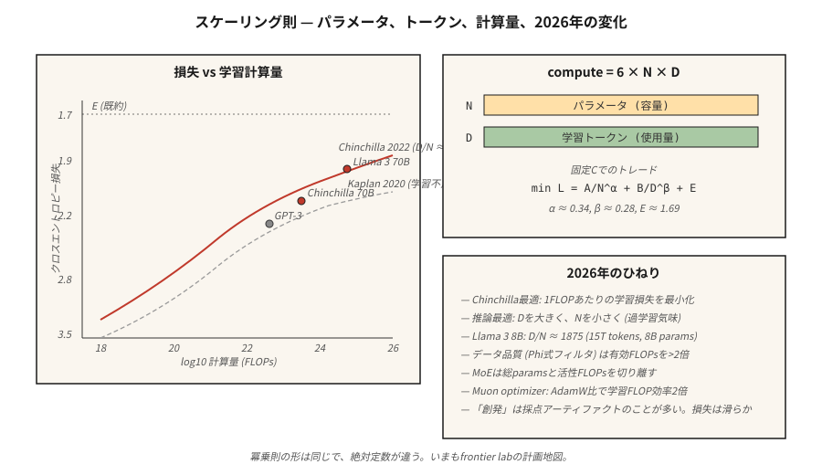

# Scaling Laws

> 2020 年的 Kaplan 论文说：更大的模型，更低的损失。2022 年的 Hoffmann 论文说：你训练不足。计算被分配到两个桶——参数和 token——而分配方式并不明显。

**Type:** Learn
**Languages:** Python
**Prerequisites:** Phase 7 · 05 (Full Transformer), Phase 7 · 07 (GPT)
**Time:** ~45 分钟

## 问题

当你拥有 C FLOPs 的训练计算量并想要最好的模型时，你面临两个旋钮：

1. **多少个参数（N）？** 更大的模型，更高的容量。
2. **多少个训练 token（D）？** 更多的数据，更好地利用容量。

FLOPs 大致按 `6 × N × D` 扩展。你可以增加 N 并减少 D，或增加 D 并减少 N。哪个更好？

2022 年之前，答案是"大力推 N"。GPT-3（2020）是 175B 参数，训练了约 300B token。大约 1.7 个 token 每参数的比例。Kaplan 扩展定律支持了这一点。

Hoffmann 等人（2022）训练了一个名为 Chinchilla 的小型模型族，发现了不同之处：最优比例接近 **20 个 token 每参数**。GPT-3 的训练量是 10 倍不足。Chinchilla（70B 参数，1.4T token）在推理成本低 2.5 倍的情况下，在每个基准上都击败了 GPT-3（175B，300B token）。

2026 年是 Chinchilla 的世界——但有一个重要的转折。Llama 3 8B 在 15 万亿个 token 上训练，比例为 1,875 个 token 每参数。超出 Chinchilla 最优 94 倍。对于将被大规模使用的模型，推理成本比训练成本更重要，因此过度训练（超越 Chinchilla）以获得更小的可部署足迹是 2026 年的默认做法。

## 概念



### Hoffmann 定律

从 Chinchilla 论文，损失遵循：

```
L(N, D) = A / N^α + B / D^β + E
```

- `N` = 参数（非嵌入）。
- `D` = 训练 token。
- `α ≈ 0.34`，`β ≈ 0.28`（大致对称）。
- `E ≈ 1.69`，不可减少的损失上限。
- `A ≈ 406`，`B ≈ 411`。

两个项在你扩展时相互权衡。在固定计算量（C = 6ND）下对 `N` 求导并求解：

```
N_opt ≈ 0.6 × (C/6)^0.5
D_opt ≈ 0.6 × (C/6)^0.5
D_opt / N_opt ≈ 20
```

计算最优：20 个 token 每参数。

### 为什么要过度训练

Chinchilla 最优最小化每训练 FLOP 的训练损失。但你只支付一次训练成本；推理成本永远支付。

对于一个每月服务一万亿 token 的聊天机器人，推理主导总成本。Llama 的方法：训练更小、更久。8B 在 15T token 上是深度推理优化的：

- 适合消费级 GPU。
- 延迟是 70B Chinchilla 最优模型的一小部分。
- 质量在大多数任务上足够接近。

DeepMind 2024 年的论文（"Over-training is the new optimal"）形式化了这一点。对于推理主导的工作负载，根据服务量的不同，正确的比例接近 100–500 个 token 每参数。

### 涌现 vs 平滑性

声称：某些能力（算术、多步推理、思维链遵循）在某个规模上突然"涌现"。

Schaeffer 等人（2023）认为这是测量伪影：涌现指标使用不连续的评分（精确匹配、阈值准确率），掩盖了底层 logits 的平滑改进。连续指标（交叉熵）显示平滑曲线。

2026 年的共识是：通过连续损失的预测是可靠的。基准跳跃通常是评分器伪影。根据连续指标制定预算。

### 2026 年的图景

扩展定律仍然有效，但：

| 因素 | 如何改变 |
|--------|-------------|
| 数据质量 | 策划"好"的 token（Phi 风格）将曲线移动超过 2× 有效计算 |
| MoE | 总参数与激活 FLOPs 解耦；每激活 FLOP 的扩展定律 |
| 后训练 | 某些能力（指令遵循、代码）随 SFT+RLHF 的转变大于预训练 |
| 多模态 | 图像 + 文本 token 一起扩展；每种模态的独立曲线 |
| 合成数据 | 模型生成训练数据；有效计算可以复合 |

Muon 优化器（Kimi Moonlight, 2024）在匹配数据下显示出约 2× 的有效计算增益，优于 AdamW。一些 2026 年的训练运行默认使用 Muon。它改变了扩展定律中的绝对常数，而非其形状。

## 动手构建

参见 `code/main.py`。我们实现 Chinchilla 损失方程，并为几个计算预算求解计算最优的 `(N, D)`。

### 步骤 1：Chinchilla 损失

```python
def chinchilla_loss(N, D, A=406.4, B=410.7, alpha=0.34, beta=0.28, E=1.69):
    return A / N ** alpha + B / D ** beta + E
```

在固定 `C = 6ND` 下，绘制 `L` 作为 `(N, D)` 的等高线。找到最小值。

### 步骤 2：计算最优前沿

对于从 `1e17` 到 `1e25` FLOPs 的计算预算，找到在 `6ND = C` 约束下最小化损失的 `(N, D)`。验证比率 `D/N ≈ 20`。

### 步骤 3：过度训练成本

计算训练 10× 更小的模型（最优 N 的 1/10，最优 D 的 10×）所支付的额外损失。报告推理 FLOPs 节省（与 N 成正比）作为交换。

### 步骤 4：与真实模型比较

输入已知的 `(N, D)` 对——GPT-3、Chinchilla、Llama 3 8B、DeepSeek-V3（激活参数）——并比较预测与报告的损失。

## 实际应用

你不太可能自己训练一个前沿模型。但扩展定律告诉你：

1. **你的微调是否有足够的数据。** 如果你的任务特定数据低于基础模型每参数 20 个 token，预计会在某个损失下限饱和。
2. **是否选择一个更大的基础模型。** 如果你把所有预算花在推理上，更倾向于一个更小、训练更久的模型。
3. **收益递减点在何处。** 超过 Chinchilla 最优的 1000×，对数损失变化变为噪声。

**2026 年的研究方向：**

- **数据受限的制度。** 网络上有有限数量的高质量 token（过滤后的英语约 5–10 万亿）。前沿预训练正在接近这个上限。合成数据、多语言、多模态和 RLHF 规模的微调是下一个杠杆。
- **计算乘数技巧。** Muon 优化器、MoE、更好的数据整理——每个都改变了绝对常数，而非渐近线。
- **RL 的扩展定律。** 开放问题。早期证据表明 RL 样本中呈幂律分布，但指数与预训练非常不同。

## 交付

参见 `outputs/skill-training-budget-estimator.md`。该 skill 根据计算预算、部署约束和目标损失，为新的训练运行选择 `(N, D, hours, GPU)`。

## 练习

1. **简单。** 运行 `code/main.py`。打印计算预算 `1e20`、`1e22`、`1e24` 的 Chinchilla 最优 `(N, D)`。与真实模型表比较。
2. **中等。** 实现 Hoffmann 的损失作为计算量函数的曲线。绘制计算最优前沿的损失 vs `log10(C)`。识别定律何时预测我们需要 `>10^28` FLOPs 才能实现交叉熵的下一个 0.1 减少。
3. **困难。** 在相同数据集上训练的 5 个微型模型（100K 到 10M 参数）上拟合你自己的扩展定律。估计 `α` 和 `E`。你的指数与已发布的匹配度如何？

## 关键术语

| 术语 | 人们说的 | 实际含义 |
|------|-----------------|-----------------------|
| Parameters (N) | "模型大小" | 非嵌入权重计数；决定容量。 |
| Tokens (D) | "训练数据" | 所见训练 token 数；决定参数利用程度。 |
| Compute (C) | "花费的 FLOPs" | 标准 transformer 约等于 `6 × N × D`。 |
| Chinchilla-optimal | "D/N ≈ 20" | 最小化每 FLOP 预训练损失的比率。 |
| Over-training | "超越 Chinchilla" | 花费额外训练 FLOPs 以节省推理 FLOPs；D/N >> 20。 |
| Irreducible loss | "下限" | 扩展定律中的 `E` 项；数据本身的熵。 |
| Emergent capability | "规模上的突然跳跃" | 通常是评分器伪影；连续损失是平滑的。 |
| Effective compute | "训练效率乘数" | 更好的数据 / 优化器 / 架构乘以一个 FLOP 能走多远。 |

## 延伸阅读

- [Kaplan et al. (2020). Scaling Laws for Neural Language Models](https://arxiv.org/abs/2001.08361) — 第一个扩展定律论文；训练不足。
- [Hoffmann et al. (2022). Training Compute-Optimal Large Language Models](https://arxiv.org/abs/2203.15556) — Chinchilla。
- [Schaeffer et al. (2023). Are Emergent Abilities of Large Language Models a Mirage?](https://arxiv.org/abs/2304.15004) — 涌现作为测量伪影。
- [Sardana, Frankle (2024). Beyond Chinchilla-Optimal: Accounting for Inference in Language Model Scaling Laws](https://arxiv.org/abs/2401.00448) — 为什么 Llama 的过度训练对其工作负载是正确的。
- [Jordan et al. (2024). Muon: An optimizer for hidden layers in neural networks](https://kellerjordan.github.io/posts/muon/) — 2× 计算乘数。
