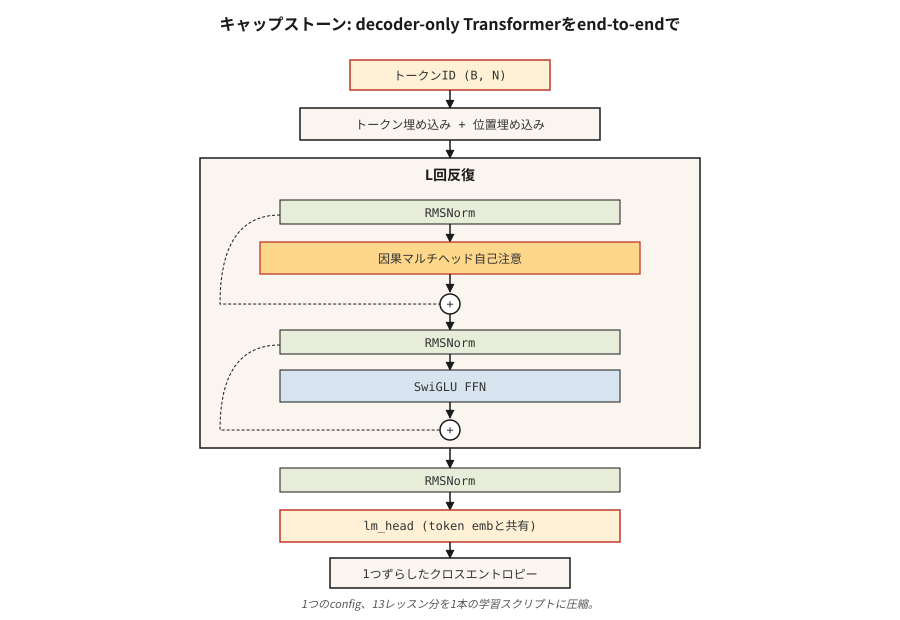

# Sıfırdan bir Transformer oluşturun — Bitirme Taşı

> On üç ders. Bir model. Kısayol yok.

**Tür:** Yapım
**Diller:** Python
**Önkoşullar:** Aşama 7 · 01'den 13'e kadar. Atlamayın.
**Süre:** ~120 dakika

## Sorun

Her gazeteyi okudun. Dikkat, çok kafalı bölmeler, konumsal kodlamalar, kodlayıcı ve kod çözücü blokları, BERT ve GPT kayıpları, MoE, KV önbelleği uyguladınız. Şimdi onların gerçek bir görev üzerinde birlikte çalışmalarını sağlayın.

Özet: karakter düzeyinde bir dil modelleme görevinde yalnızca küçük bir kod çözücü transformer'yu uçtan uca eğitin. Shakespeare'i okuyor. Yeni Shakespeare'i yaratır. Bir dizüstü bilgisayarda 10 dakikadan kısa sürede antrenman yapılabilecek kadar küçüktür. Daha büyük bir dataset ve daha uzun bir eğitime geçmenin size gerçek bir LM kazandıracağı yeterince doğrudur.

Bu kursun "nanoGPT'sidir. Orijinal değil — Karpathy'nin 2023 nanoGPT eğitimi, her öğrencinin en az bir kez yazdığı referans uygulamasıdır. Şekli kaldırıyoruz ve ele aldığımız şeyin etrafında yeniden şekillendiriyoruz.

## Konsept



Açıklamalı mimari:

```
input tokens (B, N)
   │
   ▼
token embedding + positional embedding  ◀── Lesson 04 (RoPE option)
   │
   ▼
┌──── block × L ────────────────────┐
│  RMSNorm                          │  ◀── Lesson 05
│  MultiHeadAttention (causal)      │  ◀── Lesson 03 + 07 (causal mask)
│  residual                         │
│  RMSNorm                          │
│  SwiGLU FFN                       │  ◀── Lesson 05
│  residual                         │
└────────────────────────────────── ┘
   │
   ▼
final RMSNorm
   │
   ▼
lm_head (tied to token embedding)
   │
   ▼
logits (B, N, V)
   │
   ▼
shift-by-one cross-entropy            ◀── Lesson 07
```

### Ne gönderiyoruz

- `GPTConfig` — tüm hiperparametreleri yapılandırmak için tek yer.
- `MultiHeadAttention` — nedensel, toplu, isteğe bağlı Flash tarzı yolla (PyTorch'un `scaled_dot_product_attention`).
- `SwiGLUFFN` — modern FFN.
- `Block` — norm öncesi, artıklarla sarılmış dikkat + FFN.
- `GPT` — embedding'ler, yığılmış bloklar, LM kafası, created().
- AdamW, kosinüs LR, gradient kırpma ile eğitim döngüsü.
- Shakespeare metninde Karakter düzeyi tokenizer.

### Neyi göndermiyoruz

- RoPE — Ders 04'te kavramsal olarak uygulandı. Burada basitlik açısından öğrenilmiş konumsal embedding'ları kullanıyoruz. Alıştırmalar sizden RoPE'yi değiştirmenizi istiyor.
- Oluşturma sırasında KV önbelleği — her oluşturma adımı, dikkati tam önek üzerinden yeniden hesaplar. Daha yavaş ama daha basit. Alıştırmalar sizden bir KV önbelleği eklemenizi istiyor.
- Flash Attention — PyTorch 2.0+, girişler eşleşirse otomatik olarak gönderir; `F.scaled_dot_product_attention` kullanıyoruz.
- MoE — blok başına tek FFN. MoE'yi Ders 11'de gördünüz.

### Hedef metrikler

Bir Mac M2 dizüstü bilgisayarda, 4 katmanlı, 4 kafalı, d_model=128 GPT, `tinyshakespeare.txt` üzerinde 2.000 adım için eğitilmiştir:

- Antrenman kaybı yaklaşık 6 dakikada ~4,2'den (rastgele) ~1,5'e yaklaşır.
- Örneklenen çıktı Shakespeare şeklinde görünüyor: eski kelimeler, satır sonları, "ROMEO:" gibi özel isimler ortaya çıkıyor.
- Val kaybı (metnin uzatılmış son %10'u) eğitim kaybını yakından takip eder; bu boyuta/bütçeye aşırı uyum yok.

## Build It — Kendin Oluştur

Bu ders PyTorch'u kullanıyor. `torch` yükleyin (CPU yapısı iyi). Bkz. `code/main.py`. Komut dosyası şunları yönetir:

- Eksikse `tinyshakespeare.txt` indiriliyor (veya yerel bir kopya okunuyor).
- Bayt düzeyindeki karakter tokenizer.
- Tren/val ayrımı 90/10'da.
- Desteklenen donanımda bf16 otomatik yayını ile eğitim döngüsü.
- Eğitim tamamlandıktan sonra numune alma.

### Adım 1: veriler

```python
text = open("tinyshakespeare.txt").read()
chars = sorted(set(text))
stoi = {c: i for i, c in enumerate(chars)}
itos = {i: c for c, i in stoi.items()}
encode = lambda s: [stoi[c] for c in s]
decode = lambda xs: "".join(itos[x] for x in xs)
```

65 benzersiz karakter. Küçük kelime dağarcığı. 4 baytlık bir vocab_size'ye uyar. BPE yok, tokenizer drama yok.

### Adım 2: model

Bkz. `code/main.py`. Blok, Ders 05'in ders kitabıdır — ön norm, RMSNorm, SwiGLU, nedensel MHA. 4/4/128 için parametre sayısı: ~800K.

### Adım 3: eğitim döngüsü

Uzunluğu 256 token olan pencerelerden oluşan rastgele bir grup elde edin. İleri. Birer birer çapraz entropi kayması. Geriye. AdamW adımı. Kayıt. Tekrarlamak.

```python
for step in range(max_steps):
    x, y = get_batch("train")
    logits = model(x)
    loss = F.cross_entropy(logits.view(-1, vocab_size), y.view(-1))
    loss.backward()
    torch.nn.utils.clip_grad_norm_(model.parameters(), 1.0)
    opt.step()
    opt.zero_grad()
```

### Adım 4: örnek

Bir prompt verildiğinde, tekrar tekrar iletin, üstteki logitlerden örnek alın, ekleyin ve devam edin. 500 tokens sonra dur.

### Adım 5: çıktıyı okuyun

2.000 adımdan sonra:

```
ROMEO:
Away and mild will not thy friend, that thou shalt wit:
The chief that well shame and hath been his friends,
...
```

Shakespeare değil. Ama Shakespeare şeklinde. ~800.000 parametre ve dizüstü bilgisayarda 6 dakika boyunca net bir kazanç.

## Use It — Uygula

Bu kapak taşı bir referans mimarisidir. Onu gerçek bir şeye göndermek için üç uzantı:

1. **tokenizer'ı değiştirin.** BPE (e.g. `tiktoken.get_encoding("cl100k_base")`) kullanın. Kelime sayısı 65'ten ~50.000'e çıktı. Bunu telafi etmek için model kapasitesinin artırılması gerekiyor.
2. **Daha büyük bir külliyat üzerinde eğitim alın.** `OpenWebText` veya `fineweb-edu` (SarılmaYüzü) kullanın. Tek bir A100'de 10B tokens, 125M parametreli GPT için ~24 saat sürer.
3. **RoPE + KV önbellek + Flash Attention ekleyin.** Aşağıdaki alıştırmalar her birinde size yol gösterecektir.

Bu, akıcı İngilizce üreten 125M parametreli bir GPT ile sonuçlanır. Bir sınır modeli değil. Ancak Karpathy, EleutherAI ve Allen Enstitüsü'nün 2026'da araştırma kontrol noktalarını eğitmek için kullandığı aynı kod yolu - biraz daha büyük -.

## Ship It — Kullanıma Sun

Bkz. `outputs/skill-transformer-review.md`. Beceri, önceki 13 dersin tamamında doğruluk açısından transformersıfırdan bir uygulamayı inceler.

## Egzersizler

1. **Kolay.** `code/main.py` komutunu çalıştırın. Eğitilen modelinizin son adım doğrulama kaybının 2,0'ın altında olduğunu doğrulayın. `max_steps`'yi 2.000'den 5.000'e değiştirin; değer kaybı artmaya devam ediyor mu?
2. **Orta.** Öğrenilen konumsal embedding'leri RoPE ile değiştirin. Döndürmeyi `MultiHeadAttention` içindeki Q ve K'ye uygulayın. Val kaybının en az bu kadar düşük olduğunu eğitin ve doğrulayın.
3. **Orta.** Örnekleme döngüsüne bir KV önbelleği uygulayın. Önbellekli ve önbelleksiz 500 token oluşturun. Bir dizüstü bilgisayarda duvar saati 5–20 kat artmalıdır.
4. **Zor.** Sonraki artı bir token (MTP — DeepSeek-V3'ten Çoklu-Token Tahmini) tahmin eden modele ikinci bir kafa ekleyin. Ortak eğitim alın. Yardımcı oluyor mu?
5. **Zor.** Blok başına tek FFN'yi 4 uzmandan oluşan bir MoE ile değiştirin. Yönlendirici + ilk 2 yönlendirme. Eşleşen aktif parametrelerde değer kaybının nasıl değiştiğini görün.

## Anahtar Terimler

| Terim | Yaygın ifade | Gerçek anlamı |
|------|-----------------|-----------------------|
| nanoGPT | "Karpathy'nin eğitim deposu" | Minimum yalnızca kod çözücü transformer eğitim kodu, ~300 LOC; kanonik referans. |
| minikshakespeare | "Standart oyuncak külliyatı" | ~1,1 MB metin; 2015'ten bu yana her karakter-LM öğreticisi bunu kullanıyor. |
| Berabere embeddings | "Giriş/çıkış matrisini paylaş" | LM kafa ağırlığı = token embedding matrisinin devriği; parametreleri kaydeder, kaliteyi artırır. |
| bf16 otomatik yayın | "Eğitim hassasiyeti numarası" | Bf16'da ileri/geri çalıştırın, optimize edici durumunu FP32'de tutun; 2021'den beri standart. |
| Gradient kırpma | "Ani yükselişleri durdurur" | Küresel derece normunu 1,0 olarak sınırlayın; antrenman patlamalarını önler. |
| Kosinüs LR programı | "2020+ varsayılanı" | LR doğrusal olarak yükselir (ısınma), ardından kosinüs şeklinde tepe noktasının %10'una kadar azalır. |
| MFU | "FLOP Kullanımı Modeli" | Ulaşılan FLOP'lar / teorik zirve; 2026'da %40 yoğun, %30 MoE güçlü. |
| Val kaybı | "Uzatılan kayıp" | Modelin hiç görmediği verilerdeki çapraz entropi; aşırı uyum dedektörü |

## Daha Fazla Okuma

- [Annotated Transformer (Harvard NLP)](https://nlp.seas.harvard.edu/annotated-transformer/) — klasik açıklamalı uygulama.
