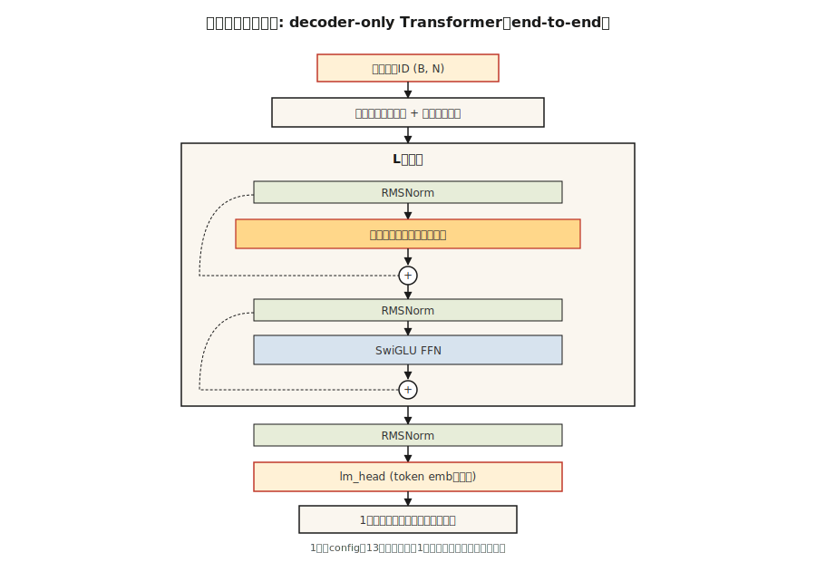

# 从零搭建 Transformer —— 阶段总作业（Build a Transformer from Scratch — The Capstone）

> 译注：本文译自同目录 [`en.md`](./en.md)。术语遵循仓根 [TRANSLATION_GUIDE.md](../../../../TRANSLATION_GUIDE.md)。

> 十三课，一个模型，没有捷径。

**Type:** Build
**Languages:** Python
**Prerequisites:** Phase 7 · 01 through 13. Don't skip.
**Time:** ~120 minutes

## 问题（The Problem）

你已经读完了所有论文。你已经实现过 attention（注意力）、multi-head（多头）拆分、位置编码、encoder 和 decoder 块、BERT 与 GPT 的损失、MoE（混合专家）、KV cache。现在该让它们在一个真实任务上协同工作了。

总作业：端到端训练一个小型的 decoder-only transformer，做字符级语言建模任务。它读莎士比亚，生成新的莎士比亚。它小到可以在笔记本上 10 分钟内训完，又正确到——只要换更大的数据集、训练更长时间——就能得到一个真正的 LM（语言模型）。

这是本课程的「nanoGPT」。它并不原创——Karpathy 在 2023 年的 nanoGPT 教程，是每个学生都会至少手写一次的参考实现。我们沿用它的骨架，并围绕本课程已经讲过的内容做改装。

## 概念（The Concept）



带注释的架构：

```
input tokens (B, N)
   │
   ▼
token embedding + positional embedding  ◀── Lesson 04 (RoPE option)
   │
   ▼
┌──── block × L ────────────────────┐
│  RMSNorm                          │  ◀── Lesson 05
│  MultiHeadAttention (causal)      │  ◀── Lesson 03 + 07 (causal mask)
│  residual                         │
│  RMSNorm                          │
│  SwiGLU FFN                       │  ◀── Lesson 05
│  residual                         │
└────────────────────────────────── ┘
   │
   ▼
final RMSNorm
   │
   ▼
lm_head (tied to token embedding)
   │
   ▼
logits (B, N, V)
   │
   ▼
shift-by-one cross-entropy            ◀── Lesson 07
```

### 我们交付什么（What we ship）

- `GPTConfig` —— 所有超参数集中配置的入口。
- `MultiHeadAttention` —— causal（因果）、批量化，支持可选的 Flash 风格路径（PyTorch 的 `scaled_dot_product_attention`）。
- `SwiGLUFFN` —— 现代化的 FFN。
- `Block` —— pre-norm 结构，attention + FFN 都包了 residual（残差）。
- `GPT` —— embedding、堆叠的 block、LM head、`generate()`。
- 训练循环：AdamW、cosine 学习率、梯度裁剪。
- 莎士比亚文本上的字符级 tokenizer。

### 我们不交付什么（What we don't ship）

- RoPE —— 在 Lesson 04 中已从概念上实现过。这里为了简化，使用学习到的位置 embedding。练习里要求你换成 RoPE。
- 生成时的 KV cache —— 每一步生成都会重新对完整前缀做 attention。更慢，但更简单。练习里要求你加上 KV cache。
- Flash Attention —— PyTorch 2.0+ 在输入匹配时会自动派发；我们用的是 `F.scaled_dot_product_attention`。
- MoE —— 每个 block 只有一个 FFN。MoE 你已经在 Lesson 11 见过了。

### 目标指标（Target metrics）

在 Mac M2 笔记本上，一个 4 层、4 头、`d_model=128` 的 GPT，在 `tinyshakespeare.txt` 上训练 2,000 步：

- 训练 loss（损失）从约 4.2（随机初始化）收敛到约 1.5，大约 6 分钟。
- 采样输出看起来「很莎士比亚」：古旧词汇、换行、像 "ROMEO:" 这样的角色名都浮现出来。
- 验证 loss（保留最后 10% 文本作为 held-out 集）紧贴训练 loss；在这种规模与预算下不会过拟合。

## 动手实现（Build It）

本课使用 PyTorch。装上 `torch`（CPU 版即可）。参见 `code/main.py`。脚本负责：

- 如果本地没有 `tinyshakespeare.txt` 就下载（或读取本地副本）。
- byte 级字符 tokenizer。
- 90/10 切分训练/验证集。
- 在支持的硬件上以 bf16 autocast 跑训练循环。
- 训练完成后采样。

### 第 1 步：数据（Step 1: data）

```python
text = open("tinyshakespeare.txt").read()
chars = sorted(set(text))
stoi = {c: i for i, c in enumerate(chars)}
itos = {i: c for c, i in stoi.items()}
encode = lambda s: [stoi[c] for c in s]
decode = lambda xs: "".join(itos[x] for x in xs)
```

65 个独立字符。词表极小，4 字节 `vocab_size` 都装得下。无 BPE，无 tokenizer 烦恼。

### 第 2 步：模型（Step 2: model）

参见 `code/main.py`。block 完全照搬 Lesson 05 的教科书写法 —— pre-norm、RMSNorm、SwiGLU、causal MHA（多头 attention）。在 4/4/128 配置下，参数量约 800K。

### 第 3 步：训练循环（Step 3: training loop）

随机取一个长度为 256 的 token 窗口 batch。前向。shift-by-one 的 cross-entropy。反向。AdamW 一步。打日志。重复。

```python
for step in range(max_steps):
    x, y = get_batch("train")
    logits = model(x)
    loss = F.cross_entropy(logits.view(-1, vocab_size), y.view(-1))
    loss.backward()
    torch.nn.utils.clip_grad_norm_(model.parameters(), 1.0)
    opt.step()
    opt.zero_grad()
```

### 第 4 步：采样（Step 4: sample）

给定一个 prompt，反复前向、从 top-p logits 中采样、追加、继续。500 个 token 后停止。

### 第 5 步：读输出（Step 5: read the output）

训练 2,000 步后：

```
ROMEO:
Away and mild will not thy friend, that thou shalt wit:
The chief that well shame and hath been his friends,
...
```

不是莎士比亚，但「形似」莎士比亚。对一个约 800K 参数、笔记本上跑 6 分钟的模型，已经是明确的胜利。

## 用起来（Use It）

这个总作业是一份参考架构。三种扩展方向，可以让它跑去做点真东西：

1. **换 tokenizer。** 用 BPE（例如 `tiktoken.get_encoding("cl100k_base")`）。词表大小从 65 涨到约 50,000。模型容量也得跟着上来才能匹配。
2. **换更大的语料训练。** 用 `OpenWebText` 或 `fineweb-edu`（HuggingFace）。一张 A100 上训一个 125M 参数的 GPT，10B token 大约需要 24 小时。
3. **加上 RoPE + KV cache + Flash Attention。** 下面的练习会一项一项带你走。

最后你会得到一个 125M 参数的 GPT，能生成流畅的英语。不是前沿模型，但同一条代码路径——只是放大了——正是 Karpathy、EleutherAI 以及 Allen Institute 在 2026 年用来训练研究 checkpoint 的那条路径。

## 上线部署（Ship It）

参见 `outputs/skill-transformer-review.md`。该 skill 用于审阅一个「从零搭建 transformer」的实现，覆盖前 13 课的所有正确性要点。

## 练习（Exercises）

1. **简单。** 跑 `code/main.py`。验证你训出来的模型最终一步的验证 loss 在 2.0 以下。把 `max_steps` 从 2,000 改成 5,000 —— 验证 loss 还会继续降吗？
2. **中等。** 把学习到的位置 embedding 替换成 RoPE。在 `MultiHeadAttention` 内部对 Q 和 K 施加旋转。训练并验证 val loss 至少持平。
3. **中等。** 在采样循环里实现 KV cache。生成 500 个 token，对比有/无 cache 的耗时。笔记本上 wall-clock（实际用时）应能提升 5–20 倍。
4. **困难。** 给模型再加一个 head，预测「下一个再下一个」token（MTP —— Multi-Token Prediction，来自 DeepSeek-V3）。联合训练。有用吗？
5. **困难。** 把每个 block 中的单个 FFN 换成 4 专家的 MoE。带 router、top-2 路由。观察在「激活参数量相同」的对照下，val loss 如何变化。

## 关键术语（Key Terms）

| 术语 | 大家怎么说 | 它实际是什么 |
|------|-----------------|-----------------------|
| nanoGPT | 「Karpathy 的教程仓库」 | 极简的 decoder-only transformer 训练代码，约 300 行；事实上的标准参考。 |
| tinyshakespeare | 「标准玩具语料」 | 约 1.1 MB 文本；自 2015 年以来每个字符级 LM 教程都在用。 |
| Tied embeddings | 「共享输入/输出矩阵」 | LM head 的权重 = token embedding 矩阵的转置；省参数，提质量。 |
| bf16 autocast | 「训练精度小技巧」 | 前向/反向用 bf16 跑，optimizer 状态保留 fp32；2021 年以来的标准做法。 |
| Gradient clipping | 「压住尖峰」 | 把全局梯度范数限制在 1.0；防止训练炸掉。 |
| Cosine LR schedule | 「2020+ 的默认配方」 | 学习率先线性 ramp up（warmup），再按 cosine 形状衰减到峰值的 10%。 |
| MFU | 「Model FLOP Utilization」 | 实际达到的 FLOPs / 理论峰值；2026 年，dense 模型 40%、MoE 30% 都算强。 |
| Val loss | 「Held-out 损失」 | 模型从未见过的数据上的 cross-entropy；过拟合探测器。 |

## 延伸阅读（Further Reading）

- [The Annotated Transformer (Harvard NLP)](https://nlp.seas.harvard.edu/annotated-transformer/) —— 经典的带注释实现。
