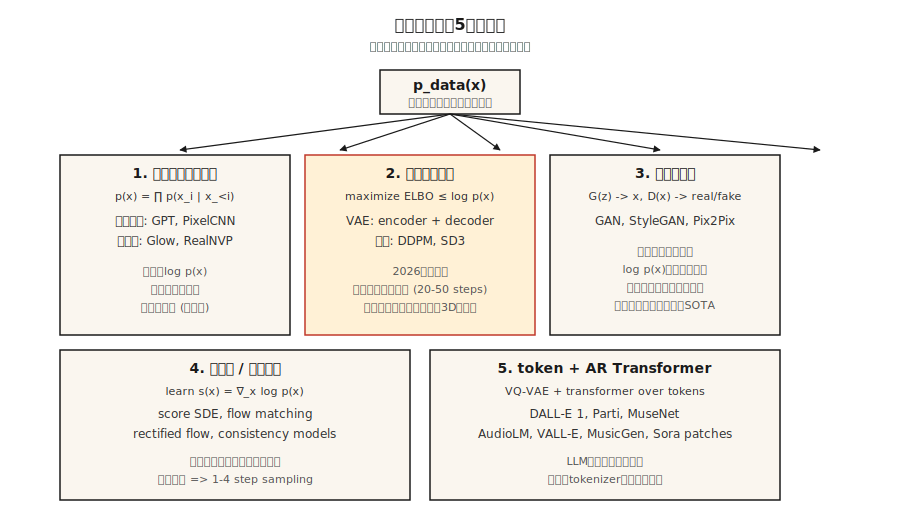

# 生成モデル — 分類と歴史

> 画像モデル、テキストモデル、動画モデル、3Dモデルは、すべて5つの箱のどれかに入る。箱を間違えると、数週間にわたって数式と格闘することになる。正しい箱を選べば、この分野の過去12年の進歩が頭の中で自然に積み上がる。

**種別:** 学習
**言語:** Python
**前提条件:** Phase 2 (ML Fundamentals), Phase 3 (Deep Learning Core), Phase 7 · 14 (Transformers)
**所要時間:** 約45分

## 問題

生成モデルの仕事は1つだけだ。未知の分布 `p_data(x)` から引かれた訓練サンプルを与えられたとき、同じ分布から来たように見える新しいサンプルを出力する。顔、文、MIDIファイル、タンパク質構造。少し引いて見れば、すべて同じ問題である。

厄介なのは、`p_data` が何百万次元もの空間に住んでいることだ（512x512 RGB画像は約786k次元）。サンプルはその空間の中の薄い多様体上にあり、手元にはせいぜい10M個の例しかない。密度を力ずくで求めるのは絶望的だ。すべての生成モデルは、難しい問題を少しだけましな別の難問に交換する妥協である。

この12年を生き残ったファミリーは5つある。それぞれがどんな妥協をしているかを知ると、なぜあるタスクでは勝ち、別のタスクでは崩れるのかが見える。

## コンセプト



**1. 明示的密度、計算可能。** `log p(x)` を実際に評価できる和として書く。Autoregressive models（PixelCNN、WaveNet、GPT）は `p(x) = ∏ p(x_i | x_<i)` と因数分解する。Normalizing flows（RealNVP、Glow）は、単純な基底分布の可逆変換として `p(x)` を作る。利点: 正確な likelihood ときれいな training loss。欠点: autoregressive inference は逐次的で長い系列では遅く、flows は可逆なアーキテクチャを必要とするため設計の制約が強い。

**2. 明示的密度、近似。** `log p(x)` を下から押さえる境界（ELBO）を作り、その境界を最適化する。VAEs（Kingma 2013）は variational posterior を持つ encoder-decoder を使う。Diffusion models（DDPM、Ho 2020）は、重み付き ELBO を暗黙に最適化する denoiser を学習する。2026年時点で diffusion は画像、動画、3Dの主要なバックボーンである。

**3. 暗黙的密度。** 密度を完全に飛ばし、サンプルを生成する generator `G(z)` と、本物か偽物かを判定する discriminator `D(x)` を学習する。GANs（Goodfellow 2014）。推論は速い（1回の forward pass）が、学習は悪名高いほど不安定である。StyleGAN 1/2/3 は、2026年でも固定ドメインのフォトリアリズム（顔、寝室）では state of the art のままだ。

**4. Score-based / continuous-time。** log-density の勾配 `∇_x log p(x)`（score）を直接学習する。Song & Ermon（2019）は、score matching が diffusion を SDE に一般化することを示した。Flow matching（Lipman 2023）は2024-2026年の主役だ。シミュレーション不要の学習、よりまっすぐな経路、DDPMより4-10倍速いサンプリング。Stable Diffusion 3、Flux、AudioCraft 2 はすべて flow matching を使う。

**5. 離散コード上の token-based autoregressive。** VQ-VAE または residual quantizer で高次元データを短い離散 token 列に圧縮し、その token 列を Transformer でモデル化する。Parti、MuseNet、AudioLM、VALL-E、Sora の patch tokenizer はすべてこれを使う。これは bucket 1 に learned tokenizer を足したものだ。

## 短い歴史

| 年 | モデル | 重要だった理由 |
|------|-------|-----------------|
| 2013 | VAE (Kingma) | 使える training loss を持つ最初の深層生成モデル。 |
| 2014 | GAN (Goodfellow) | 暗黙的密度、likelihood なし。それでも驚くほどシャープなサンプル。 |
| 2015 | DRAW, PixelCNN | 逐次的な画像生成。 |
| 2017 | Glow, RealNVP | 可逆 flows。深さを持つ正確な likelihood。 |
| 2017 | Progressive GAN | 最初のメガピクセル級の顔。 |
| 2019 | StyleGAN / StyleGAN2 | その1ドメインでは、今でも倒すのが難しいフォトリアルな顔。 |
| 2020 | DDPM (Ho) | Diffusion が実用的になる。 |
| 2021 | CLIP, DALL-E 1, VQGAN | Text-to-image が主流になる。 |
| 2022 | Imagen, Stable Diffusion 1, DALL-E 2 | Latent diffusion + text conditioning = コモディティ化。 |
| 2022 | ControlNet, LoRA | 事前学習済み diffusion に対する細かな制御。 |
| 2023 | SDXL, Midjourney v5, Flow matching | スケールとよりよい training dynamics。 |
| 2024 | Sora, Stable Diffusion 3, Flux.1 | 動画 diffusion。flow matching が勝つ。 |
| 2025 | Veo 2, Kling 1.5, Runway Gen-3, Nano Banana | 本番品質の動画。 |
| 2026 | Consistency + Rectified Flow | diffusion バックボーンからの one-step sampling。 |

## 5問のトリアージ

新しい生成モデルの論文が出たら、method section を読む前に次の5問に答える。

1. **何をモデル化しているか。** Pixels、latents、discrete tokens、3D Gaussians、meshes、waveforms のどれか。
2. **密度は明示的か暗黙的か。** `log p(x)` を書き下しているか。
3. **サンプリングは one-shot か iterative か。** Iterative なら推論は遅い。one-shot はたいてい adversarial か distilled である。
4. **条件付けは何か。unconditional、class、text、image、pose か。** これが loss と architecture scaffolding を決める。
5. **評価は何か。FID、CLIP score、IS、human preference、task accuracy か。** それぞれ既知の失敗モードがある（Lesson 14 を参照）。

この phase のすべての lesson で、この5問に答え直す。終わるころには反射的にできるようになる。

## 実装

この lesson のコードは軽量な可視化である。サンプルから1次元の Gaussian mixture を、3つのおもちゃ手法（kernel density、discrete histogram、nearest-sample の「GAN-ish」generator）でフィットし、1画面に収まる問題で explicit density と implicit density の違いを見る。

`code/main.py` を実行する。2モードの Gaussian mixture から2000個のサンプルを引き、次を出力する。

```
explicit density (histogram): p(x in [-0.5, 0.5]) ≈ 0.38
approximate density (KDE):     p(x in [-0.5, 0.5]) ≈ 0.41
implicit (nearest-sample gen): 20 new samples printed, no p(x)
```

注目点: 最初の2つでは「この点はどれくらいありそうか」と聞ける。3つ目では聞けない。これが、今後すべての lesson で重要になる *explicit vs implicit* の違いである。

## Use It

2026年に、どのタスクへどのファミリーを使うか。

| タスク | 最適なファミリー | 理由 |
|------|-------------|-----|
| フォトリアルな顔、狭いドメイン | StyleGAN 2/3 | 今でも最もシャープで、推論も最速。 |
| 一般的な text-to-image | Latent diffusion + flow matching | SD3、Flux.1、DALL-E 3。 |
| 高速な text-to-image | Rectified flow + distillation | SDXL-Turbo、SD3-Turbo、LCM。 |
| Text-to-video | Diffusion Transformer + flow matching | Sora、Veo 2、Kling。 |
| 音声 + 音楽 | Token-based AR（AudioLM、VALL-E、MusicGen）または flow matching（AudioCraft 2） | 離散 token は安くスケールする。 |
| 3Dシーン | Gaussian Splatting fit、diffusion prior | 再構成には 3D-GS、新規視点には diffusion。 |
| Density estimation（sampling なし） | Flows | 正確な `log p(x)` を持つ唯一のファミリー。 |
| シミュレーション / 物理 | Flow matching、score SDE | 直線的な経路となめらかな vector field。 |

## Ship It

`outputs/skill-model-chooser.md` として保存する。

この skill はタスク説明を受け取り、(1) どのファミリーを使うか、(2) open な選択肢3つと hosted な選択肢3つのランキング、(3) 注意すべき失敗モード、(4) 計算 / 時間予算を出力する。

## 演習

1. **Easy.** 次の5つの製品について、ファミリーとバックボーンを特定する: ChatGPT image、Midjourney v7、Sora、Runway Gen-3、ElevenLabs。根拠は公開 technical report から取ること。
2. **Medium.** 明日読む予定の論文が、diffusion より 100x 速い sampling を主張している。その高速化が conditioning と高解像度でも残るか確認するための質問を3つ書く。
3. **Hard.** 自分が関心のあるドメインを1つ選ぶ（例: protein structure、CAD、molecules、trajectories）。そのドメインの現在の SOTA モデルについて5問のトリアージに答え、より良いモデルなら何を変えるかをスケッチする。

## 重要用語

| 用語 | よく言われること | 実際の意味 |
|------|-----------------|-----------------------|
| Generative model | "It makes new stuff" | `p_data(x)` の sampler を学習し、任意で `log p(x)` も公開する。 |
| Explicit density | "You can evaluate it" | モデルが closed-form または tractable な `log p(x)` を提供する。 |
| Implicit density | "GAN-style" | sampler だけ。与えられた点の `p(x)` を評価する方法はない。 |
| ELBO | "Evidence lower bound" | `log p(x)` の tractable な下界。VAEs と diffusion はこれを最適化する。 |
| Score | "Gradient of log-density" | `∇_x log p(x)`。diffusion と SDE models はこの場を学習する。 |
| Manifold hypothesis | "Data lives on a surface" | 高次元データは低次元多様体に集中する。次元削減が効く理由。 |
| Autoregressive | "Predict the next piece" | 結合分布を条件付き分布の積に因数分解する。 |
| Latent | "Compressed code" | decoder が入力を再構成できる低次元表現。 |

## 本番メモ: 5つのファミリー、5つの推論形状

各ファミリーは、推論サーバのコスト曲線に別々の形で対応する。production-inference の文献では LLM 推論を prefill + decode として捉える。同じ分解はここにも当てはまる。

- **Autoregressive（bucket 1 と 5）。** 逐次 decode がレイテンシを支配する。KV-cache、continuous batching、speculative decoding はすべて直接使える。
- **VAE / diffusion / flow-matching（bucket 2 と 4）。** LLM の意味での decode はない。コスト = `num_steps × step_cost` で、`step_cost` は full latent resolution での transformer または U-Net forward である。本番のつまみは step count（DDIM / DPM-Solver / distillation）、batch size、precision（bf16 / fp8 / int4）。
- **GAN（bucket 3）。** 1回の forward pass。schedule なし、KV-cache なし。TTFT ≈ total latency。だから StyleGAN は今でも narrow-domain UX で勝つ。

論文の abstract で "faster than diffusion" を見たら、「より少ない steps × 同じ step cost」または「同じ steps × より安い step cost」と翻訳する。それ以外は marketing である。

## 参考文献

- [Goodfellow et al. (2014). Generative Adversarial Nets](https://arxiv.org/abs/1406.2661) — GAN 論文。
- [Kingma & Welling (2013). Auto-Encoding Variational Bayes](https://arxiv.org/abs/1312.6114) — VAE 論文。
- [Ho, Jain, Abbeel (2020). Denoising Diffusion Probabilistic Models](https://arxiv.org/abs/2006.11239) — DDPM 論文。
- [Song et al. (2021). Score-Based Generative Modeling through SDEs](https://arxiv.org/abs/2011.13456) — SDE としての diffusion。
- [Lipman et al. (2023). Flow Matching for Generative Modeling](https://arxiv.org/abs/2210.02747) — flow matching 論文。
- [Esser et al. (2024). Scaling Rectified Flow Transformers for High-Resolution Image Synthesis](https://arxiv.org/abs/2403.03206) — Stable Diffusion 3。
