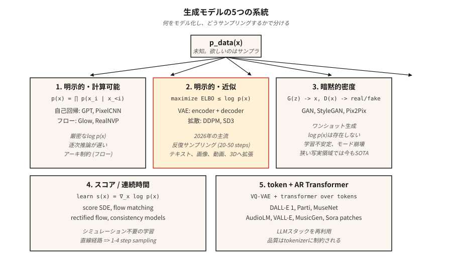

# 生成式模型 — 分类体系与历史

> 每个图像模型、文本模型、视频模型和 3D 模型都归属于五大类别之一。选错类别，你会与数学抗争数周；选对类别，该领域过去十二年的进展会在你脑海中清晰堆叠。

**类型：** 学习
**语言：** Python
**前置知识：** 阶段 2（机器学习基础）、阶段 3（深度学习核心）、阶段 7 · 14（Transformer）
**时间：** ~45 分钟

## 问题

生成式模型完成一项任务：给定从某个未知分布 `p_data(x)` 抽取的训练样本，输出看起来来自同一分布的新样本。人脸、句子、MIDI 文件、蛋白质结构——若你粗略一看，都是同样的问题。

难点在于 `p_data` 存在于一个具有数百万维度的空间中（一张 512x512 RGB 图像约有 786k 维度），样本位于该空间内的一个薄流形上，而你只有大约 1000 万个样本。暴力求解密度是不可能的。每种生成式模型都是一种折中，将一个问题换成另一个稍微不那么难的问题。

过去十二年中，五个家族存活了下来。了解每个家族所做的折中，就能明白为什么它在某些任务上获胜而在另一些任务上失败。

## 概念



**1. 显式密度，可计算。** 将 `log p(x)` 写成一个你可以实际求和的表达式。自回归模型（PixelCNN、WaveNet、GPT）将 `p(x)` 分解为 `p(x) = ∏ p(x_i | x_<i)`。归一化流（RealNVP、Glow）将 `p(x)` 构建为一个简单基分布的可逆变换。优点：精确似然，干净的训练损失。缺点：自回归推理是顺序的（长序列慢），流需要可逆架构（架构受限）。

**2. 显式密度，近似。** 从下界（ELBO）约束 `log p(x)` 并优化该界。VAE（Kingma 2013）使用带有变分后验的编码器-解码器。扩散模型（DDPM、Ho 2020）训练一个去噪器，隐式地优化加权 ELBO。扩散是 2026 年图像、视频和 3D 领域的主导骨干。

**3. 隐式密度。** 完全跳过密度；学习一个生成器 `G(z)` 产生样本，以及一个判别器 `D(x)` 区分真假。GAN（Goodfellow 2014）。推理速度快（一次前向传播），但训练过程中臭名昭著地不稳定。即使到 2026 年，StyleGAN 1/2/3 在固定域的照片级真实感（人脸、卧室）方面仍处于最先进水平。

**4. 基于分数的 / 连续时间。** 直接学习对数密度 `∇_x log p(x)` 的梯度（分数）。Song & Ermon（2019）表明分数匹配将扩散推广到 SDE。流匹配（Lipman 2023）是 2024-2026 年的热点：免模拟训练、更直的路径、比 DDPM 快 4-10 倍的采样速度。Stable Diffusion 3、Flux、AudioCraft 2 都使用流匹配。

**5. 基于离散编码的令牌自回归。** 使用 VQ-VAE 或残差量化器将高维数据压缩为短序列的离散令牌，然后使用 Transformer 对令牌序列建模。Parti、MuseNet、AudioLM、VALL-E、Sora 的补丁令牌化器都使用这种方法。这是类别 1 加上一个学习的令牌化器。

## 简要历史

| 年份 | 模型 | 为何重要 |
|------|-------|-----------------|
| 2013 | VAE (Kingma) | 第一个具有可用训练损失的深度生成式模型。 |
| 2014 | GAN (Goodfellow) | 隐式密度，无似然——样本惊人地清晰。 |
| 2015 | DRAW, PixelCNN | 顺序图像生成。 |
| 2017 | Glow, RealNVP | 可逆流；带深度的精确似然。 |
| 2017 | Progressive GAN | 首个百万像素人脸。 |
| 2019 | StyleGAN / StyleGAN2 | 照片级真实感人脸，在该单一领域仍然难以超越。 |
| 2020 | DDPM (Ho) | 扩散变得实用。 |
| 2021 | CLIP, DALL-E 1, VQGAN | 文生图走向主流。 |
| 2022 | Imagen, Stable Diffusion 1, DALL-E 2 | 潜在扩散 + 文本条件 = 商品化。 |
| 2022 | ControlNet, LoRA | 对预训练扩散的精细控制。 |
| 2023 | SDXL, Midjourney v5, Flow matching | 规模 + 更好的训练动态。 |
| 2024 | Sora, Stable Diffusion 3, Flux.1 | 视频扩散；流匹配胜出。 |
| 2025 | Veo 2, Kling 1.5, Runway Gen-3, Nano Banana | 生产级视频。 |
| 2026 | Consistency + Rectified Flow | 来自扩散骨干的单步采样。 |

## 五问筛选法

当一篇新的生成式模型论文出现时，在阅读方法部分之前，先回答这五个问题。

1. **建模的是什么？** 像素、潜在表示、离散令牌、3D 高斯、网格、波形？
2. **密度是显式还是隐式？** 他们是否写出了 `log p(x)`？
3. **采样：一次完成还是迭代进行？** 迭代意味着推理更慢；一次完成通常意味着对抗式或蒸馏。
4. **条件：无条件、类别、文本、图像、姿态？** 这决定了损失函数和架构框架。
5. **评估：FID、CLIP 分数、IS、人类偏好、任务准确率？** 每种都有已知的失败模式（见第 14 课）。

你将在本阶段的每一课中重新回答这五个问题。到结束时，它们将成为条件反射。

## 动手实现

本课的代码是一个轻量级可视化：使用三种玩具方法（核密度估计、离散直方图和最近邻样本的"GAN 式"生成器）从样本中拟合一维高斯混合模型，让你在一个屏幕可打印的问题上看到显式密度与隐式密度的区别。

运行 `code/main.py`。它从双峰高斯混合中抽取 2000 个样本，然后输出：

```
explicit density (histogram): p(x in [-0.5, 0.5]) ≈ 0.38
approximate density (KDE):     p(x in [-0.5, 0.5]) ≈ 0.41
implicit (nearest-sample gen): 20 new samples printed, no p(x)
```

注意：前两个让你可以问"这个点的可能性有多大？"第三个做不到。这就是*显式 vs 隐式*的区别，将对未来的每一课都很重要。

## 应用

2026 年，哪个家族用于哪个任务？

| 任务 | 最佳家族 | 原因 |
|------|-------------|-----|
| 照片级真实感人脸，窄领域 | StyleGAN 2/3 | 仍然最清晰，推理最快。 |
| 通用文生图 | 潜在扩散 + 流匹配 | SD3、Flux.1、DALL-E 3。 |
| 快速文生图 | Rectified flow + distillation | SDXL-Turbo、SD3-Turbo、LCM。 |
| 文生视频 | Diffusion Transformer + flow matching | Sora、Veo 2、Kling。 |
| 语音 + 音乐 | 基于令牌的 AR（AudioLM、VALL-E、MusicGen）或流匹配（AudioCraft 2） | 离散令牌扩展成本低。 |
| 3D 场景 | 高斯溅射拟合、扩散先验 | 3D-GS 用于重建，扩散用于新视角。 |
| 密度估计（无需采样） | 流 | 唯一能精确计算 `log p(x)` 的家族。 |
| 模拟 / 物理 | 流匹配、分数 SDE | 直线路径、平滑向量场。 |

## 交付

保存为 `outputs/skill-model-chooser.md`。

该技能接受一个任务描述，输出：（1）使用哪个家族，（2）三个开源和三个托管选项的排名列表，（3）你应该注意的可能失败模式，以及（4）计算/时间预算。

## 练习

1. **简单。** 针对以下五个产品，识别其家族和骨干：ChatGPT image、Midjourney v7、Sora、Runway Gen-3、ElevenLabs。证据应来自公开技术报告。
2. **中等。** 你明天要读的一篇论文声称比扩散快 100 倍。写出三个问题来检查这个加速是否能在条件和高分辨率下保持。
3. **困难。** 选择一个你关心的领域（例如蛋白质结构、CAD、分子、轨迹）。针对该领域当前的 SOTA 模型回答五问筛选法，并勾勒出更好的模型会改变什么。

## 关键术语

| 术语 | 人们说的 | 实际含义 |
|------|-----------------|-----------------------|
| Generative model | "它生成新东西" | 学习 `p_data(x)` 的采样器，也可选择性地暴露 `log p(x)`。 |
| Explicit density | "你可以计算它" | 模型提供闭式或可计算的 `log p(x)`。 |
| Implicit density | "GAN 风格" | 只有采样器——无法计算给定点的 `p(x)`。 |
| ELBO | "证据下界" | `log p(x)` 的一个可计算下界；VAE 和扩散模型优化它。 |
| Score | "对数密度的梯度" | `∇_x log p(x)`；扩散和 SDE 模型学习这个场。 |
| Manifold hypothesis | "数据存在于一个表面上" | 高维数据集中在低维流形上；这就是降维有效的原因。 |
| Autoregressive | "预测下一个" | 将联合分布分解为条件分布的乘积。 |
| Latent | "压缩编码" | 低维表示，解码器可以从该表示重建输入。 |

## 生产说明：五个家族，五种推理形态

每个家族对应不同的推理服务器成本曲线。生产级推理文献将 LLM 推理分为预填充 + 解码，同样的分解在此适用：

- **自回归（类别 1 和 5）。** 顺序解码主导延迟；KV-cache、连续批处理和推测解码都直接适用。
- **VAE / 扩散 / 流匹配（类别 2 和 4）。** 没有 LLM 意义上的解码。成本 = `num_steps × step_cost`，而 `step_cost` 是在完整潜在分辨率下的 Transformer 或 U-Net 前向传播。生产级的调控旋钮包括步数（DDIM / DPM-Solver / 蒸馏）、批大小和精度（bf16 / fp8 / int4）。
- **GAN（类别 3）。** 一次前向传播。没有调度，没有 KV-cache。TTFT ≈ 总延迟。这就是 StyleGAN 在窄领域用户体验上仍然胜出的原因。

当你在论文摘要中看到"比扩散更快"时，将其翻译为"更少的步骤 × 相同的步骤成本"或"相同的步骤 × 更便宜的步骤成本"。其他都是营销话术。

## 延伸阅读

- [Goodfellow et al. (2014). Generative Adversarial Nets](https://arxiv.org/abs/1406.2661) — GAN 论文。
- [Kingma & Welling (2013). Auto-Encoding Variational Bayes](https://arxiv.org/abs/1312.6114) — VAE 论文。
- [Ho, Jain, Abbeel (2020). Denoising Diffusion Probabilistic Models](https://arxiv.org/abs/2006.11239) — DDPM 论文。
- [Song et al. (2021). Score-Based Generative Modeling through SDEs](https://arxiv.org/abs/2011.13456) — 作为 SDE 的扩散。
- [Lipman et al. (2023). Flow Matching for Generative Modeling](https://arxiv.org/abs/2210.02747) — 流匹配论文。
- [Esser et al. (2024). Scaling Rectified Flow Transformers for High-Resolution Image Synthesis](https://arxiv.org/abs/2403.03206) — Stable Diffusion 3。
